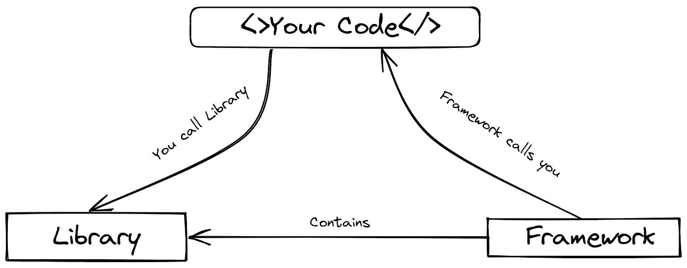
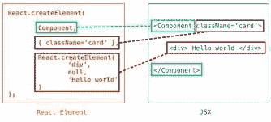
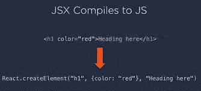
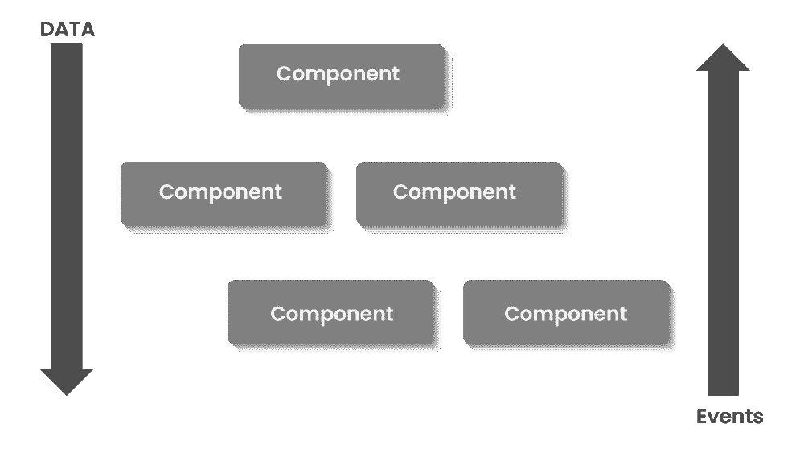
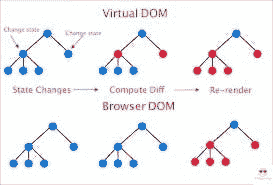
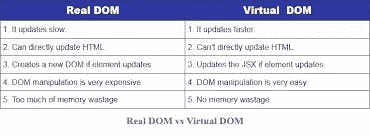
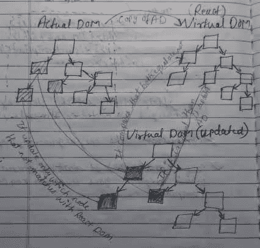
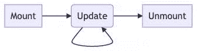
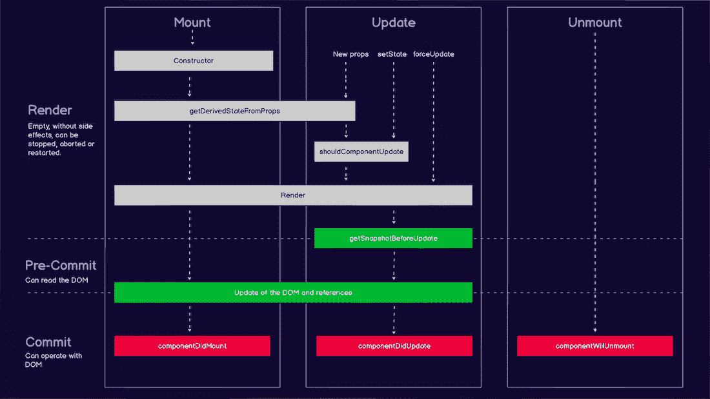
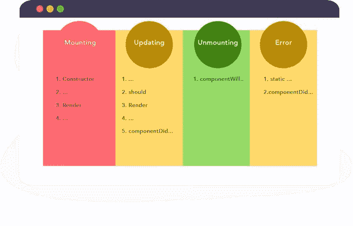

# 为什么你应该学习反应

> 原文：<https://javascript.plainenglish.io/why-you-should-learn-reactjs-1d8d48e0c698?source=collection_archive---------8----------------------->

## React 是一个 JavaScript 库，用于构建优秀的用户界面。


Photo by [Nikita Kachanovsky](https://unsplash.com/@nkachanovskyyy?utm_source=unsplash&utm_medium=referral&utm_content=creditCopyText) on [Unsplash](https://unsplash.com/collections/335434/coding?utm_source=unsplash&utm_medium=referral&utm_content=creditCopyText)

# 介绍

**什么是 React？这是第一个想到的。**

[React](https://reactjs.org/) 是一个 javascript 库，用于构建优秀的用户界面。

它是开源的，由脸书维护和开发。

React 是基于组件的，这意味着你可以将整个 web app 分解成小组件，这给了我们快速的开发和更少的 bug 应用。

**很多人把 React 叫做框架而不是库。**

**但是库和框架有什么区别呢？**



# 什么是前端开发？

让我们把它想象成一个可交互的屏幕，根据你的活动产生某种事件。

例如点击按钮、填写表格、滚动和动画。

> ***也叫客户端开发。我们在网站上看到的所有东西都是由 HTML、CSS 和 JAVASCRIPT 构成的。***

# 为什么 React 比 Angular 和 Vue 更出名？

**快速** — React 使用虚拟 Dom 来呈现数据。它将完整的信息与先前的状态进行比较；如果有些东西改变了，只有那些会重新渲染。使得反应如此之快。

模块化——我们可以将代码分成更小的可重用部分，而不是编写大型代码。可伸缩性——React 在显示大量数据变化的大型程序中表现最佳。

**灵活**——众所周知，react 的工作方式不同；它在构建用户界面时将组件分成不同的部分。这在大型应用程序中是有效的。

**著名的** —它很流行，因为它实现了一个虚拟 DOM 和 JSX。

服务器端渲染和 SEO 友好——我们知道在谷歌排名有多重要。这就是 react 为我们做的。React 也有一个更加 SEO 友好的 NextJs 框架。

UI 组件(UI components)—它快速改进了开发和调试过程，与其他框架相比，构建应用程序花费的时间更少。

社区(Community)—React 拥有大量开源社区，并得到了脸书的支持。它有许多工具和扩展，使反应更加舒适和流畅。React 生态系统是如此之大，一旦你掌握了这个库，就会有很多机会出现在你的面前。因此，它是 web 应用程序开发的一个很好的工具。

> 这些是 React 在软件开发中受到如此多开发者喜爱的一些主要原因。

# 为什么现在才反应过来？

在这个快速发展的世界中，需要一个可伸缩和可维护的 web 应用程序来获得一致的性能，以改善现实世界中的问题。

正如我们所知，React 是如此可执行、灵活、快速和易于调试。

在现代世界中，每一毫秒都有大量数据从一个地方流向另一个地方。

React 为我们做了这项工作。它可以无缝处理大量数据。

反应日益有大量的机会。

> 如果你掌握了反应，你将永远不会失去在高科技领域的机会。

# 反应的未来

> ***一级支持承诺和异步/等待***

*   在服务器组件中引入了对异步/等待的支持。通过将组件定义为异步函数，使用标准 JavaScript await 语法编写服务器组件。
*   介绍钩子的使用。像 await 一样，use 打开承诺的值，但是它可以在普通的组件和钩子内部使用，包括在客户机上。

官方 [**文档**](https://github.com/acdlite/rfcs/blob/first-class-promises/text/0000-first-class-support-for-promises.md#summary) 包含更多细节。

# 为什么 ReactJS 更适合 Web 开发？

*   与 Angular 或任何其他框架相比，React 更容易学习
*   React 拥有大量的社区支持
*   React 提供了可重用的组件
*   虚拟 DOM 比实际 DOM 快
*   JSX 增强了 ReactJS 的功能、效率和可读性
*   单向数据流的高效调试和错误检查
*   Redux，Zustand 保持所有组件的数据一致性
*   反应钩

# 如何学习 React？

> ***在跳到 React 或其他任何 JavaScript 框架之前，你应该先把语言基础掌握好。***

**关于 JavaScript 你应该具备的知识是:**

*   ES6，箭头功能
*   JavaScript 内部工作
*   映射过滤器减少排序
*   数组和对象析构
*   传播和休息运算符
*   异步/等待
*   承诺
*   回收
*   “这个”关键字
*   班级

> ***学习完以上概念，就可以开始学习 React 了。最好的学习方法是做或创建一些小项目。***

**可以参考官方文档**[**react . docs**](https://reactjs.org/)

> 如果你在寻找路线图，我有一个去年写的帖子 [**点击这里**](/if-i-were-to-restart-javascript-again-from-scratch-then-i-will-follow-this-roadmap-c96c452a957e)

# 反应特征

*   **JSX (JavaScript 语法扩展)** : JSX 允许我们编写类似 Html 的代码，其中包含 JavaScript，但在幕后，它将 HTML 外观的代码转换为 JSX。让我们看看它是怎么做的。



*   **单向数据流**:react . js 的设计方式是只支持单向从上往下的数据。如果我们需要让数据流向其他方向，那么我们需要使用一些状态管理工具，比如 Context-API、Redux 和 Zustand。



*   **虚拟文档对象模型(VDOM)** :在 React 中，虚拟 DOM 是从浏览器 DOM 复制过来的。当任何状态数据改变时。React 不会改变整个 dom。首先，它将复制的 DOM(VDOM)与(浏览器 DOM)进行比较。然后 VDOM 只更新 VDOM 中的那个节点(对象或状态{Div})，而不是更新整个 DOM。这使得网络运行和渲染速度更快。这就是 React 在大型应用程序或复杂应用程序中快速呈现的能力。



*   **扩展** : React 为应用架构提供了各种工具。这使得 React 更加可用。
*   调试:调试 React 应用程序很容易，因为有大量的社区支持和可用的工具。甚至脸书也提供了一个小的浏览器扩展，使得 React 调试更加容易和快速。

**我们已经明白 React 现在为我们提供了什么。让我们来学习一些 React 的基本概念。**

# React 的构建模块:—组件、状态、道具、键和钩子。

# 1.反应堆组件

计算机返回一组应该出现在屏幕上的反应元素称为组件。组件将你的用户界面分割成独立的、可重用的部分。每个组件都有其状态 API 的结构和风格。当我们定义组件时，它的名字应该以大写字母开头。在 React 中，有两种类型的组件，即**功能类**和**类**。

*   **功能组件(无状态):** -

它是使用 JavaScript 函数语法编写的，并且只返回元素。他们不管理，没有自己的状态。也可以写在 ES6 箭头函数中。该组件从其他组件派生数据作为属性(props)。功能组件没有它们的生命周期方法。这可以通过使用效果挂钩来实现。

*功能组件的示例如下所示:*

```
//normal funtion
function Greet(props) {  
  return <p>Welcome to the , {props.name}</p>;  
}//Arrow functionconst Greet = (props) => {
    return <p>Welcome to the , {props.name}</p>
}
```

*   **类组件(有状态)** : -

类组件是使用 ES6 类编写的。它比功能组件更复杂。他们有自己的国家要管理。我们可以将数据从一个类传递到另一个类。它们有不同的渲染方法。它也有生命周期方法。

*表示类组件的例子如下:*

```
class StateFull extends Component {
    constructor(props){
        super(props);
        this.state = {[]}
    }
  render() {
    return <p>Hello {this.props.name}</p>;
  }
}root.render(<StateFull name="Taylor" />);
```

# 2.反应状态

状态是我们存储数据的 JavaScript 对象或信息。它是私有的，完全由组件控制。状态应该在构造函数中声明。它们可以作为道具传递给子组件。当某个用户响应 UI 或与 UI 交互时，比如单击按钮和填写表单，就会发生状态变化。

组件行为取决于状态变化以及它们将如何呈现。

```
class HelloWorld extends Component {
  constructor(props) {
    super(props);
    this.state = {
    name: "World"
  };
  updateTheName() {
    this.setState({ name: "React" });
  }
  render() {
      return(
          <div>
              {this.state.name}
          </div>
      )
  }
}
// and it can store multiple properties.
```

# 3.反应道具

Props 允许您将数据从父组件传递到子组件。道具是只读组件。无论您将组件声明为函数还是类，它都不能修改其属性，并且对于相同的输入总是给出相同的输出。道具是不可变的。

考虑这个求和函数:

```
function minus(a, b) {
  return a - b;
}
```

# 4.反应键

它帮助 React 识别哪些项目已经更改、添加或删除。

```
const num = [5, 6, 7, 8, 9];
const keynum = num.map((number) =>
  <li key={number.toString()}>
    {number}
  </li>
);
```

# 5.对事件做出反应

在 React 中处理事件与在 JavaScript 中处理事件是一样的。但是它们之间有一点语法差异。

*   与 JavaScript 相比，React 使用 CamelCase 来命名事件。
*   将函数作为事件处理程序传递。

例如:

```
//the HTML:<button onclick="helloworld()">
 Hello World
</button>//is slightly different in React:<button onClick={HelloWorld}>
Hello World
</button>
```

# 6.反应钩

React 挂钩使您能够使用状态和其他 React 类函数特性，而不必编写类组件。我们可以使用钩子添加生命周期方法。

```
import React, { useState } from 'react';function Example() {
  // Declare a new state variable, which we'll call "count"
  const [count, setCount] = useState(0);return (
    <div>
      <p>You clicked {count} times</p>
      <button onClick={() => setCount(count + 1)}>
        Click me
      </button>
    </div>
  );
}
```

# 反应组件生命周期

什么是 **React 生命周期方法**？想象这是一个由[组成的“生活”。在](http://components.in/)生活中，一些事件发生在每个人身上。那就是出生、成长和死亡。同样的事情也适用于 React 组件。理解生命周期对于掌握这个库至关重要。它让你思考 React 是如何工作的。

> ***创建= >挂载= >更新= >卸载***



*   **Render** —这是组件必须具备的唯一方法。它的工作是在 DOM 中安装组件并返回 React 元素。
*   **更新** —我们可以使用**getSnapShotBeforeUpdate**生命周期方法从 DOM 中读取。这对于在更新 DOM 之前获取数据非常有用。它将先前的状态和属性与新接收的状态和属性进行比较，并作为参数传递给 **componentDidUpdate** 。
*   **提交**——获得新数据后，React 更新 DOM。我们可以看到使用 **componentDidUpdate** 或者 **useEffect** 钩子。



> *永远不要和一门语言或框架结婚，成为一个可以学习任何东西并能够应用它的全能开发者。让你的基本面变强，你就势不可挡。*

# 结论

> ***JavaScript+React 最好的起步时间是 5 年前。***
> 
> ***启动 JavaScript + React 的次佳时间是一年前，2021 年。***
> 
> ***今天也是入手 JavaScript + React 的最佳时机。***

史上最热的科技市场。

我请人们用一条推特来帮助一个 React 初学者，收到了 500 多条很棒的建议。

今天就到这里&感谢阅读。

我写了一本关于开发人员职业发展的书，分享了我 12 年以上的经验。

现在只需 5 美元就可以获得这本书[最佳指南](https://gumroad.com/l/nextgendev)


加入已经读过这本书的 100 名开发人员的行列，促进他们的职业发展。

*原载于*[*https://theankurtyagi.com*](https://theankurtyagi.com/why-you-should-learn-reactjs/)*。*

*更多内容看* [***说白了就是***](https://plainenglish.io/) *。报名参加我们的**[***免费每周简讯***](http://newsletter.plainenglish.io/) *。关注我们关于* [***推特***](https://twitter.com/inPlainEngHQ) ，[***LinkedIn***](https://www.linkedin.com/company/inplainenglish/)*，*[***YouTube***](https://www.youtube.com/channel/UCtipWUghju290NWcn8jhyAw)*，* [***不和***](https://discord.gg/GtDtUAvyhW) *。对增长黑客感兴趣？检查出* [***电路***](https://circuit.ooo/) *。**