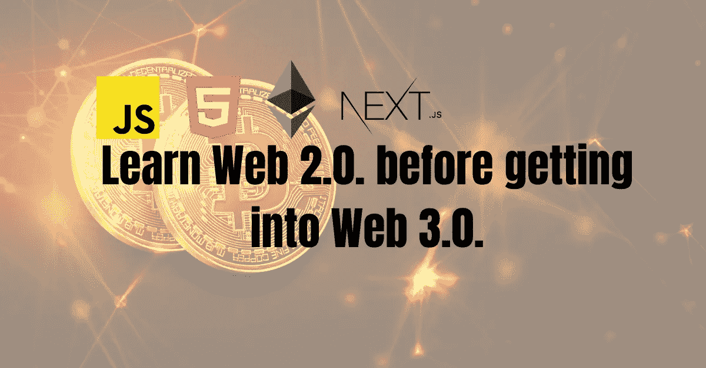

# 为什么在进入 Web 3.0 之前应该学习 Web 2.0

> 原文：<https://javascript.plainenglish.io/why-you-should-learn-web-2-0-before-getting-into-web-3-0-d251625990db?source=collection_archive---------6----------------------->

## Web3.0 已经席卷全球，越来越多的人正在加入其中。了解它是如何基于 Web 2.0 构建的，以及如何实现它。

Web 3.0，一个新的流行词汇，已经席卷了全世界。从开发者到技术合伙人和风投，所有人都在赞美它。创业公司正在招聘 Web 3.0 开发者，薪酬更高。越来越多的开发者正在进入下一代网络，其中很多人已经把它作为他们的第一个技术栈。所有人都欣喜若狂。

支撑 Web 3.0 的技术包括前端和后端，是建立在 Web 2.0 之上的。虽然人们可以直接学习 Web 3.0，但重要的是要提到，首先要在 Web 2.0 中建立坚实的基础。

# 用什么 Web2.0 技术栈来构建 Web 3.0？

## 前端

HTML、CSS、JS、React 和 Next.js 是 NFT 市场前端、Dapps 等的主要构件。这些技术属于早期版本，不存在排除它们的 Web3.0 前端。

## 消费区块链和智能合约

Ether.js 和 Web3.js 将面向客户的 UI 与智能合约连接起来。没有丝毫的 JS 知识，这两个是超出范围的。

## 构建智能合同

可靠实际上是创建智能合同的编程语言。它是一种遵循 OOPs 概念的静态类型编程语言。Rust 也是如此，它现在也越来越流行。有了使用 Java 的经验，TypeScript 在这里就派上了用场。

上面的讨论表明，对 Web 2.0 技术有很强的了解是进入 neo web 的先决条件。如果一个新手在不了解 js 的情况下就开始使用 web3.js，这个人注定会坚持问题。类似地，使用 Solidity 或其他东西来创建智能契约需要 OOP 和静态类型知识。

现在，问题来了，一个对编程漠不关心的人如何才能进入 Web3.0。下面，我分享了一个可行的计划。

# 新手进入 Web 3.0 的路线图

## 1.学习 web 开发的基础知识

开始学习 HTML、CSS、JavaScript 和 OOP。在这些方面有一个强大的背景将使你不仅能够创建美丽的前端，而且还能与智能合同。

## 2.接触 Web 3.0 概念

智能合约、区块链、概念证明、以太坊、令牌和其他基础概念也应该掌握。

[https://www . coin base . com/learn/crypto-basics/what ' s-proof-of-work-or-proof-of-stake](https://www.coinbase.com/learn/crypto-basics/what-is-proof-of-work-or-proof-of-stake)

 [## 智能合同简介| ethereum.org

### 智能合约概述，重点介绍其独特的特征和局限性。

ethereum.org](https://ethereum.org/en/developers/docs/smart-contracts/)  [## dapps | ethereum.org 简介

### 以太坊是一个全球性的、分散的资金和新型应用平台。在以太坊上，你可以写代码…

ethereum.org](https://ethereum.org/en/developers/docs/dapps/) 

## 3.建立 dapps 的前端，市场，等等。

React 和 Next.js 是广泛用于开发现代快速前端的技术。这也是一个致命的组合。学习这个堆栈也将有助于构建 Web 2.0 web 应用程序。

## 4.使用 web3.js 和 ether.js

web3.js 是一个库集合，允许您使用 HTTP、IPC 或 WebSocket 与本地或远程以太坊节点进行交互。同样，ethers.js 库旨在成为一个完整而紧凑的库，用于与以太坊区块链及其生态系统进行交互。

 [## 入门指南

### Ethers 的各种类和函数可以从@ethersproject 下的子包中手动导入…

docs.ethers.io](https://docs.ethers.io/v5/getting-started/)  [## 入门- web3.js 1.0.0 文档

### web3.js 库是包含以太坊生态系统功能的模块集合。

web3js.readthedocs.io](https://web3js.readthedocs.io/en/v1.7.4/getting-started.html) 

## 5.构建智能合同

Solidity 是一种受 C++、Python 和 JavaScript 启发的高级面向对象编程语言，被广泛用于创建智能合同。在这里，拥有静态类型编程语言的经验是有益的。

 [## 坚固性-坚固性 0.8.15 文件

### 部署合同时，您应该使用最新发布的 Solidity 版本。除了特殊情况，只有…

docs.soliditylang.org](https://docs.soliditylang.org/en/v0.8.15/index.html) 

## 6.熟悉生态系统

一个 Web3.0 开发者应该对 Remix IDE、Truffle、MetaMask 和相关的生态系统有第一手的经验。

总而言之，可以说先学习 Web 2.0，然后再进入 Web 3.0 是恰当的。这将有助于获得 web 开发实际工作方式的第一手经验，以及这些版本的 web 之间的差异。

感谢阅读。关注更多精彩内容。

让我们在 [LinkedIn](https://www.linkedin.com/in/thealiraza/) 和 [Twitter](https://twitter.com/nowaliraza) 上连线。

*更多内容请看*[***plain English . io***](https://plainenglish.io/)*。报名参加我们的* [***免费周报***](http://newsletter.plainenglish.io/) *。关注我们关于*[***Twitter***](https://twitter.com/inPlainEngHQ)**和*[***LinkedIn***](https://www.linkedin.com/company/inplainenglish/)*。查看我们的* [***社区不和谐***](https://discord.gg/GtDtUAvyhW) *加入我们的* [***人才集体***](https://inplainenglish.pallet.com/talent/welcome) *。**