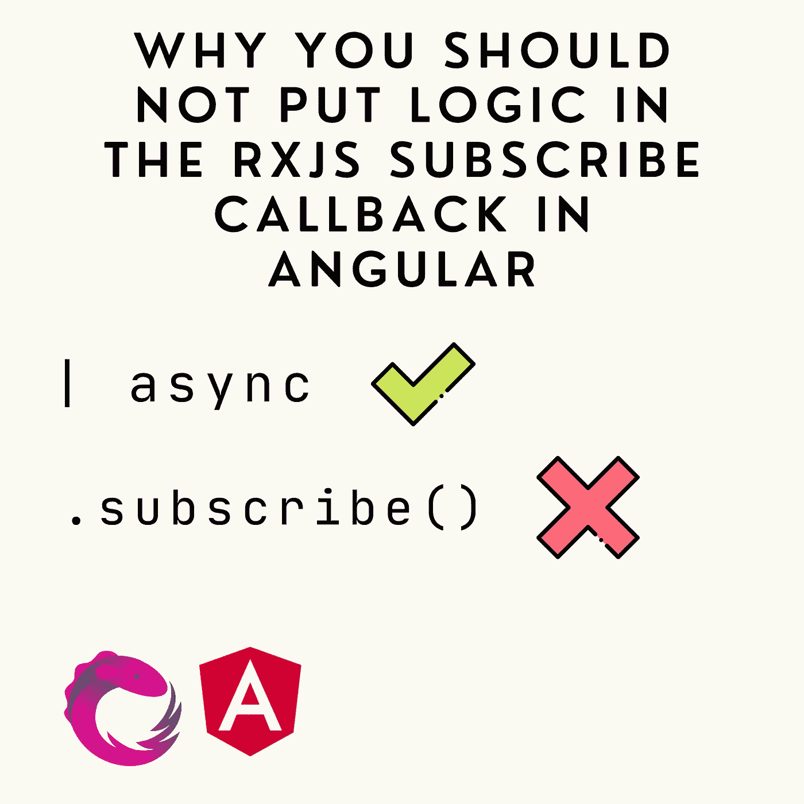
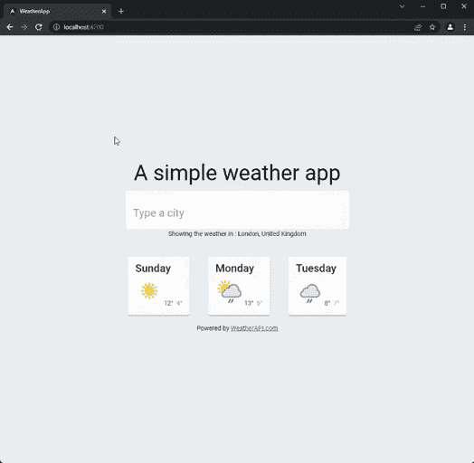
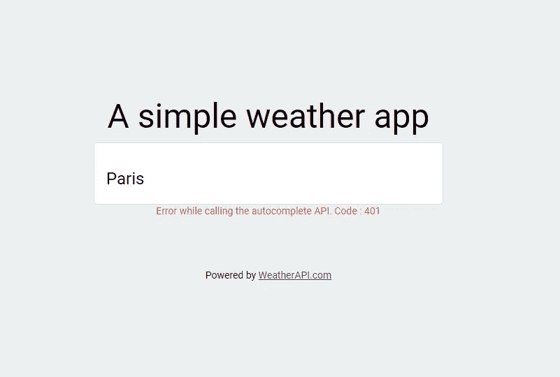

# 为什么不应该在 Angular 的 RxJS 订阅回调中放入任何逻辑

> 原文：<https://javascript.plainenglish.io/why-you-should-not-put-any-logic-in-the-rxjs-subscribe-callback-in-angular-df1ba4a12f13?source=collection_archive---------1----------------------->

## RxJS & Angular 最佳实践及示例

作为一名自由开发人员，我倾向于从一个角度项目跳到另一个角度项目。我曾与不同规模和经验水平的团队一起工作过。

我经常在一个`subscribe`回调中遇到一大块命令性代码。我一直认为这是一种不好的做法。Angular 拥抱 RxJS 和反应式编程范例。作为 Angular 开发者，我们真的应该做同样的事情。这篇文章会很固执己见，所以欢迎评论或提问。

# Angular 中的订阅回调是什么？

Observable 是 RxJS 库提供的主要工具，其 Angular 用途广泛。与常规的 JavaScript 承诺一样，Observable 的目标是处理异步事件。

可观察到的和承诺的关键区别在于可观察到的是懒惰的。您可以声明一旦收到数据应该如何处理，但是您需要显式地`subscribe`来触发异步调用。换句话说，发出调用和处理结果是分开的操作。而对于一个承诺，当你调用`then`函数时，你实际上是在同时做这两个操作。它触发调用并处理结果。

回到文章的主题，如果你在`subscribe`回调中写了很多逻辑，你使用了一个可观察的，好像它是一个承诺。因此，您没有充分利用 RxJS 或角度特征。

# 命令式与反应式

正如我通常对这些文章所做的那样，我使用两种不同的方法构建了一个基本的应用程序。这是一个简单的天气应用程序。你只需输入一个城市的名字，然后就可以得到该城市未来几天的天气情况。这是它的样子:

我使用了[天气 API](https://www.weatherapi.com/) 来获取天气数据。代码可以在我的 GitHub 上找到，有命令式和反应式分支，所以你可以比较一下。

# 原因 1:您没有尽可能多地使用 RxJS 操作符

为了说明第一个原因，让我们看看我在应用程序的两个版本中处理 API 调用的方式。

对于应用程序的命令式版本，我简单地订阅了两个端点，将数据处理并存储到组件属性中，然后显示在页面上。每当模板上的输入发生变化时，一切都会被触发。

对于反应式版本，从一个可观察的方法开始这个过程比从一个回调方法开始要好。出于这个原因，我使用了`ViewChild`装饰器从 HTML 元素中获取可观察对象。然后我做了和以前一样的处理，但是这一次，所有的东西都存储在可观察对象中，而不是一个对象。

在我看来，在这里使用反应式方法而不是命令式方法有一些优势。

## 它增加了**可读性**。

一系列操作符非常容易阅读和理解(假设您知道最常见的 RxJS 操作符)。一组命令式代码总是要求你深入其中，试图理解该组代码的目标是什么。此外，您必须添加一些代码来将订阅推送到一个列表，以便以后取消订阅，这使得代码变得更重。嵌套订阅也增加了复杂性。看看这个，试着想象一下，如果有三个嵌套的订阅，每个订阅都有一个特定的错误管理块，会是什么样子。

## 它使得**测试**和**调试**更加容易。

对于命令式方法，您必须使用组件属性。在这个例子中，我只在函数中使用那些变量。但是有时，一旦创建了这个变量，您可能会想在组件的其他地方使用它。与反应式方法相比，从开发人员的角度来看，这非常方便。但这是有代价的。每当你在一个函数中使用组件属性时，这个函数就不再是纯粹的了，你正在产生一个副作用。副作用会导致更复杂的调试，因为您永远不知道更改发生在哪里。一般来说，纯函数更容易测试。

## 它具有内置的高级功能。

去抖、[缓存](https://medium.com/@AurelienLeloup/cache-http-requests-with-rxjs-for-angular-eb9bee93824d)等等。RxJS 库中已经构建了很多。仅仅因为你决定不声明一个可观察的，就试图手工重新实现其中的一些特性，这实在是一种耻辱。

# 原因 2:您不能使用异步管道

对于命令式方法，我们使用组件变量在模板上显示数据。

对于反应式方法，我们直接使用模板上的`async` 管道来观察。

`async`管道是 Angular 提供的一个特性，用于处理 Angular 模板中的异步数据。与直接通过组件属性发送数据相比，它有两个主要优点。

## 它将为您处理退订。

每当您订阅可观察网站时，您都需要取消订阅。你永远不应该忘记这样做。否则，您的代码会泄漏，导致意外行为。遵守这条规则并不困难。然而，这需要一些特定的代码来完成。

## 它与 OnPush 变更检测一起工作得很好。

`async`管道将在发出新值时触发变化检测，即使启用了 OnPush 策略。当您使用 subscribe 时，必须手动执行此操作。OnPush 策略对于 Angular 应用程序的性能非常好。仅仅是它的使用就足以成为一个论点，永远要考虑`async`导管的使用。

# 关于错误管理

评论中的一些人正确地指出了一个事实，如果我用这两种方法处理可能的错误，我的例子会更现实。

以下是如果我的 API 密钥错误的结果:

下面是带有命令式方法的代码:

对于被动方法，代码变得更加复杂:

在对这两种方法进行评论和比较之前，让我们解释一下我是如何在这两种情况下实现错误管理的。

对于命令式方法，它非常简单。我们可以简单地在之前的`next`回调之后使用`error`回调。代码变得更密集了，但除此之外，没有什么太复杂的东西值得一提。

对于被动的方法，它更为棘手。首先，我们需要设置第三个观察值来显示错误。然后，我们使用`catchError`来捕捉错误并允许我们处理它们。需要注意的是，该运算符就在 HTTP 请求之后链接。这使得主要的可观察物能够存活。因此，如果用户键入其他内容，错误就会消失，请求可以再次尝试。

的确，用命令式方法处理错误的简单性对它有利。然而，让我们注意到，使用一个专用的“handleError”函数可以使被动方法的错误管理更加清晰。

# 最后评论

对于这类文章，重复两种方法都有效，这一点很重要。就我的例子而言，没有一种方法明显优于其他方法。虽然 Angular 确实包含了 RxJS 和反应范式，但该框架有一条陡峭的学习曲线。所以，如果您觉得使用 subscribe 编写您的第一个应用程序更舒服，因为这类似于使用诺言，那很好。在阅读了本文之后，也许您会认识到反应式编程的一些好处，并在某个时候尝试一下。

相关文章:

 [## 非常常见的角度问题的最终答案:subscribe() vs | async Pipe

### 大多数流行的 Angular 状态管理库(如 NgRx)以一系列的形式公开了应用程序状态…

medium.com](https://medium.com/angular-in-depth/angular-question-rxjs-subscribe-vs-async-pipe-in-component-templates-c956c8c0c794) 

我的 GitHub 上的完整项目:

 [## GitHub-aurel ien-le loup/weather-app:一个简单的天气应用程序，用于演示命令与…

### 一个简单的天气应用程序，演示了命令式和反应式方法。使用分支导航…

github.com](https://github.com/aurelien-leloup/weather-app) 

*更多内容请看*[***plain English . io***](https://plainenglish.io/)*。报名参加我们的* [***免费周报***](http://newsletter.plainenglish.io/) *。关注我们关于*[***Twitter***](https://twitter.com/inPlainEngHQ)*和*[***LinkedIn***](https://www.linkedin.com/company/inplainenglish/)*。加入我们的* [***社区不和谐***](https://discord.gg/GtDtUAvyhW) *。*