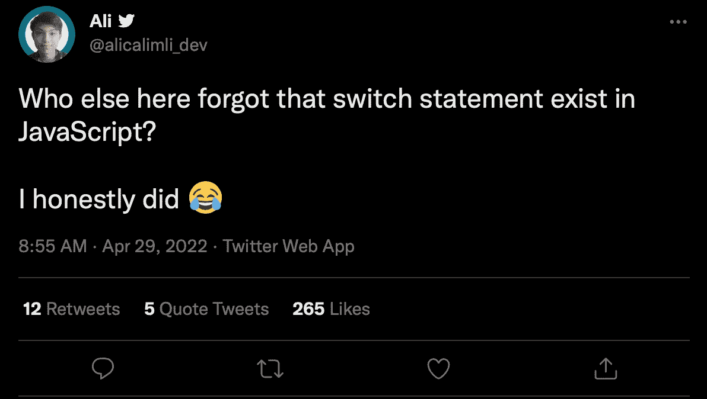

# 为什么不应该忘记 JavaScript 的“switch”语句

> 原文：<https://javascript.plainenglish.io/why-you-should-not-to-forget-about-the-javascript-switch-statement-466f4c6a1cb1?source=collection_archive---------11----------------------->

## 通过使用“switch”语句，而不是使用带有多个“else-if”块的“if”语句，使您的代码更整洁。



Source: [https://twitter.com/alicalimli_dev/status/1519948397024845824](https://twitter.com/alicalimli_dev/status/1519948397024845824)

今天我看到了这条推特:

*这里还有谁忘记了 switch 语句存在于 JavaScript 中？我老老实实做了*
🐦推文: [alicalimli_dev](https://twitter.com/alicalimli_dev/status/1519948397024845824)

我立刻觉得我能理解。我经常发现自己在应该使用`switch`语句的地方使用`if`语句，所以我想我应该写一篇简短的帖子来解释为什么你应该考虑使用`switch`语句。

# 1.清楚

通常在编写代码时，我们可能有一个变量，它有多个状态需要您处理。一种编写方式是使用如下所示的`if/else if`语句。

```
if (food === 'cake') {
    console.log('I love cake')
} else if (food === 'toast') {
    console.log('I like toast')
} else if (food === 'mushrooms') {
    console.log('I hate mushrooms')
}
```

如果我们把这写成一个`switch`声明，它看起来会干净得多:

```
switch(*food*) {
  case 'cake':
console.log('I love cake')    break;
  case 'toast':
console.log('I like toast')    break;
  case 'mushrooms':
console.log('I hate mushrooms')    break;
}
```

虽然多占用了几行代码，但这可以更容易阅读，因为它删除了多余的代码。这也意味着如果你以后想更新被比较变量的名字，有一个地方可以这样做。

# 2.表演

您应该考虑使用`switch`语句而不是`if`语句的第二个原因是性能问题。

如果你考虑前面的 If 语句，你会发现如果`food`的值等于`mushrooms`，那么必须进行三次单独的比较。

```
if (food === 'cake') {
    console.log('I love cake')
} else if (food === 'toast') {
    console.log('I like toast')
} else if (food === 'mushrooms') {
    console.log('I hate mushrooms')
}
```

如果我们将此与`switch`语句进行比较，JavaScript 引擎的 just in time 编译器能够构建一个跳转表，这意味着它只需执行一次评估。

```
switch(*food*) {
  case 'cake':
console.log('I love cake')    break;
  case 'toast':
console.log('I like toast')    break;
  case 'mushrooms':
console.log('I hate mushrooms')    break;
}
```

在这些例子中，评估是对两个字符串进行非常简单的比较，但是当有更复杂的比较或更多选项来比较时，`if`语句和`switch`语句之间的性能差异会变得更加明显。

值得注意的是，在大多数情况下，switch 语句的性能优势并不总是显而易见的。这是因为在你有足够复杂的比较或者足够多的选项来更快地使用`switch`语句之前，你可能会重构你的代码来避免这个问题，以使它更具可读性。

# 奖金(打字稿)-使用枚举

作为一个特别的奖励，我想我会在打字稿中特别提到枚举。

枚举允许您定义一组命名的常量，目的是记录意图或定义不同的情况。它们可用于数值和字符串值，是 Switch 语句的完美用例。

在下面的例子中，我使用了一个带有方向的枚举，然后我使用了`switch`语句来处理不同的代码路径。

```
enum Directions {
  Up = "UP",
  Down = "DOWN",
  Left = "LEFT",
  Right = "RIGHT",
}const direction = String(Directions.Up);switch(direction) {
  case Directions.Up:
    console.log('Lets go up')
    break;
  case Directions.Down:
    console.log('Lets go down')
    break;
  case Directions.Left:
    console.log('Lets go left')
    break;
  case Directions.Right:
    console.log('Lets go right')
    break;
}
```

# 概括起来

虽然你可能会经常看到`if`语句继续出现在你的代码中，但是肯定有很多用例你应该考虑使用`switch`语句来代替。

我希望这篇文章能帮助你思考这个问题，并且当你将来开始写带有多个`else if`条件的`if`语句时，你会考虑使用`switch`语句来代替。

最后，我要感谢阿里，他的推文启发了这篇文章，我同意人们很容易忘记它们，所以我想谈谈为什么它们真的很有用。

*更多内容看* [***说白了就是 io***](https://plainenglish.io/) *。报名参加我们的* [***免费周报***](http://newsletter.plainenglish.io/) *。关注我们关于*[***Twitter***](https://twitter.com/inPlainEngHQ)*和*[***LinkedIn***](https://www.linkedin.com/company/inplainenglish/)*。加入我们的* [***社区***](https://discord.gg/GtDtUAvyhW) *。*