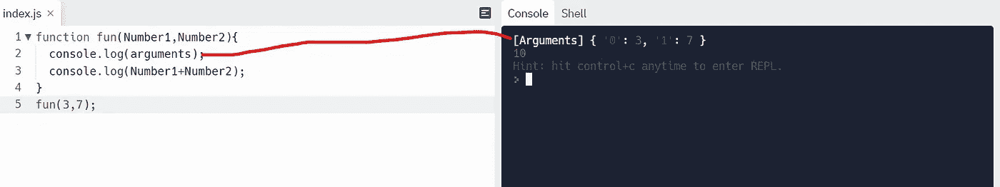

# 为什么不应该在 JavaScript 中使用参数

> 原文：<https://javascript.plainenglish.io/why-you-should-not-use-arguments-in-javascript-here-is-why-1524692e3c87?source=collection_archive---------12----------------------->

函数允许你定义一个代码块，给它一个名字，然后你想执行多少次就执行多少次，没有函数程序什么都不会做。

photo by [**Artem sapegin**](https://unsplash.com/@sapegin)from [**unsplash**](https://unsplash.com/)

JavaScript 中的函数类型:用 JavaScript 写函数有三种方法:

> 一函数表达式
> 
> 双函数声明
> 
> 三箭头功能

F 定义函数不会在调用堆栈中创建执行上下文。每次我们调用一个函数时，都会为该函数创建一个执行上下文，它包括**【this】**和**【arguments】**，这与全局执行上下文不同，全局执行上下文给出了"**全局对象"**和" **this "。**

正如我提到的，JavaScript 引擎将为每个函数调用创建一个执行上下文，其中包括**“this”**和**“argument”**对象。使用参数不是一个好的习惯，但是为什么呢？

Arguments 看起来像是**数组**，但不是**数组**，你可以用 arguments 关键字做很多事情来降低 JavaScript 引擎的优化程度。

在这个例子中，传递给函数的参数的值戏剧性地变成了 1，你可以自己运行看看。

> 我是一名自由职业的全栈 web 开发人员和技术作家，请随时联系我🤓

在 LinkedIn 上关注我

 [## 阿里·穆斯塔法-网络开发者-自由职业者| LinkedIn

### 查看阿里穆斯塔法在全球最大的职业社区 LinkedIn 上的个人资料。阿里有 4 个工作列在他们的…

www.linkedin.com](https://www.linkedin.com/in/ali-mustafa-195a321a0/) 

在 GitHub 上关注我

 [## Ali11Mustafa -概述

### 热情，自我驱动，注重细节，有强烈的野心和动力按时开发软件解决方案

github.com](https://github.com/Ali11Mustafa) 

*更多内容请看*[***plain English . io***](https://plainenglish.io/)*。报名参加我们的* [***免费周报***](http://newsletter.plainenglish.io/) *。关注我们关于*[***Twitter***](https://twitter.com/inPlainEngHQ)[***LinkedIn***](https://www.linkedin.com/company/inplainenglish/)*[***YouTube***](https://www.youtube.com/channel/UCtipWUghju290NWcn8jhyAw)*[***不和***](https://discord.gg/GtDtUAvyhW) ***。*****

*****对缩放您的软件启动感兴趣*** *？检查* [***电路***](https://circuit.ooo/?utm=publication-post-cta) *。***