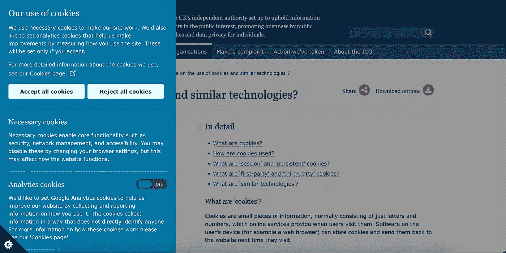
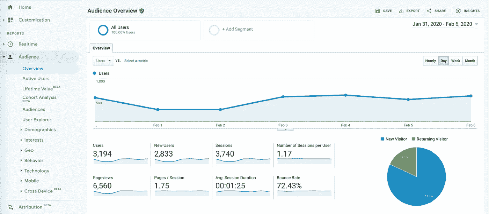

# 为什么你应该在 2022 年停止使用谷歌分析

> 原文：<https://javascript.plainenglish.io/why-you-should-stop-using-google-analytics-in-2022-4b29a4c2ab92?source=collection_archive---------5----------------------->

## 再看看谷歌提供的分析服务。

Photo by [Mick Haupt](https://unsplash.com/@rocinante_11?utm_source=medium&utm_medium=referral) on [Unsplash](https://unsplash.com?utm_source=medium&utm_medium=referral)

多年来，我在网站上集成的第一个第三方服务是谷歌分析(Google Analytics)。

我从来没有想过第二次。这是我从 2016 年开始创建网站时就知道的。这就是我被教导的，它很有效，虽然我发现它有时令人生畏，但后来更是如此。

6 年后，在十几个网站之后，我开始质疑谷歌分析，因为我更深入分析领域，也因为消费者对披露和隐私的意识增强。

现在我正在使用[似是而非的分析](https://plausible.io/),我不认为我会使用谷歌分析，至少短期内不会。

但是这篇博客文章不是关于为什么似是而非更好，而是关于 GA 的一些方面迫使我去寻找另一个提供商。

*这篇博客是根据我的个人经历写的，可能包括你可能从未遇到过的用例。*

尽管我鼓励人们研究他们正在使用的服务，并重新审视许多常见的产品。

让我们来看看为什么谷歌分析可能不是你的项目的正确选择:

## 1.大小

这是非常明显的，这也是为什么我想先从这一点开始，这样我们可以在以后关注其他不太为人所知的问题。

Google Tag Manager 将 Google Analytics 整合到网站中的方式增加了 45.7 KB 的总脚本大小。

即使是[小型精简版 GA 包](https://github.com/jehna/ga-lite)也将近 10kb，而你可以在这里 & [这里](https://www.npmjs.com/package/analytics)查看流行包[的大小。](https://www.npmjs.com/package/@analytics/google-analytics)

较大的包意味着较慢的 JS 初始化和较长的下载时间。

大多数[性能指标](https://calibreapp.com/blog/bundle-size-optimization#which-performance-metrics-are-affected-by-bundle-size)受到捆绑包大小的影响，这意味着对 SEO 排名的负面影响。

此外，这种大尺寸甚至可能不值得在下一点讨论。

## 2.不准确

谷歌分析被广泛使用的主要原因之一是因为价格；它是一个免费的产品。

而每当产品免费的时候，你就是产品。在这种情况下，这意味着谷歌正在使用你的访问者的数据。

因此，许多人使用广告拦截器拦截这些脚本。此外，使用谷歌分析跟踪你的火狐和勇敢的浏览器用户是一场噩梦。

这无疑让我怀疑，如果最终它会被阻止，那么这个大捆绑包是否值得包含在内。

此外，还有许多推荐攻击，倾向于显示一个虚假的推荐 URL，因此您会感到好奇并点击它，最终访问他们的网站。

## 3.广泛且用户友好的隐私政策

Cookie Consent Prompt.

有相当多的方法来跟踪独特的访问者，GA 更喜欢通过 cookies 来跟踪用户。

这样做是为了维护一个会话和不同的重复用户从第一次，独特的访问者。

然而，这也意味着你必须得到用户的同意。你必须制定一个用户友好的、广泛的隐私政策，并确保你的用户一进入你的页面就同意这个政策。

不是我，而是 [PECR](https://ico.org.uk/for-organisations/guide-to-pecr/guidance-on-the-use-of-cookies-and-similar-technologies/what-are-cookies-and-similar-technologies/) 让它成为一个要求。

此外，你必须公开 cookies 将如何被使用，这是一个[要求](https://marketingplatform.google.com/about/analytics/terms/us/)使用 GA。

## 4.杂乱的数据和用户界面

GA User interface. [Source](https://analytics.google.com/analytics/web/#/).

GA 是一款成熟的分析软件，为您提供开箱即用的全面功能。

然而，对于包括我在内的大多数用户来说，这似乎有点难以承受。

2020 年，我和几个客户一起工作，他们努力在 UI 中导航，以获得关于他们网站性能的基本指标，如流量来源和基本的人口统计数据。

GA 中充满了许多只有经常使用的用户才熟悉的术语。

GA 涵盖了广泛的跟踪，毫无疑问，但跟踪你的用户这么多的数据，你可能甚至不会访问一次甚至值得吗？

我看不出让我的用户接受如此广泛的跟踪有什么意义，除非这些数据成为关键需求。

## 5.应用程序接口

正如我在前面提到的，一些客户希望在应用程序中看到一个管理面板，只显示他们的关键指标。

此外，在一个应用程序中，向各种用户显示这些统计数据是一个功能。

这意味着我必须以某种方式在站点和表面上加载或嵌入统计数据，使用 GA API 似乎是理想而简单的方式。

虽然我不知道 API 在 2022 年的状态，但我在 2020 年 8 月实现了它，使用起来很麻烦。

对于初学者来说，他们的文档并不合理，而且似乎有很多关于 API 版本 3 和版本 4 的混淆。

许多过滤器和查询都出现了错误，当时，我必须彻底检查错误并挖掘 StackOverflow 才能实现它。

尽管如此，我必须说，这些天来，文档和可用的资料似乎有了很大的改进，也更加可靠了。

## 最后的想法

谷歌分析是一个全面的分析工具，没有成本。

然而，值得再看一看，并质疑它是否是你的用户的正确选择。

我不打算阻止任何人使用谷歌分析。

然而，我强烈认为，随着网络应用和用户数据开发的兴起，创始人和创造者必须比以往任何时候都更加小心，不要让他们的用户受制于以此类事情闻名的公司。

如果您对 GA 感到满意，并且完全理解和同意 GA 规范，那么无论如何都没有真正的理由放弃 GA，但是您也应该谨慎地向您的用户公开它，因为最终出售和使用的是他们的数据。

有许多 GA 的替代品，一个简单的搜索就能给你提供很多有竞争力的选择，有免费的也有付费的。

如果你喜欢读这篇文章，一定要看看我的博客，看看你可以在 2022 年尝试的独特 API:

 [## 为您的下一个项目提供 6 个独特的 API 和想法

### 免费和不同的 API 来构建有趣的应用程序。

javascript.plainenglish.io](/6-unique-apis-for-your-next-project-along-with-ideas-ea87a3175288) 

如果你想阅读更多这样的文章，可以考虑使用[我的推荐链接](https://medium.com/@anuragkanoria/membership)，这样你就可以通过点击[这里](https://medium.com/@anuragkanoria/membership)无限制地访问我的博客以及其他作者的博客。

*更多内容看* [***说白了就是***](https://plainenglish.io/) *。报名参加我们的* [***免费周报***](http://newsletter.plainenglish.io/) *。关注我们关于*[***Twitter***](https://twitter.com/inPlainEngHQ)*和*[***LinkedIn***](https://www.linkedin.com/company/inplainenglish/)*。加入我们的* [***社区***](https://discord.gg/GtDtUAvyhW) *。*