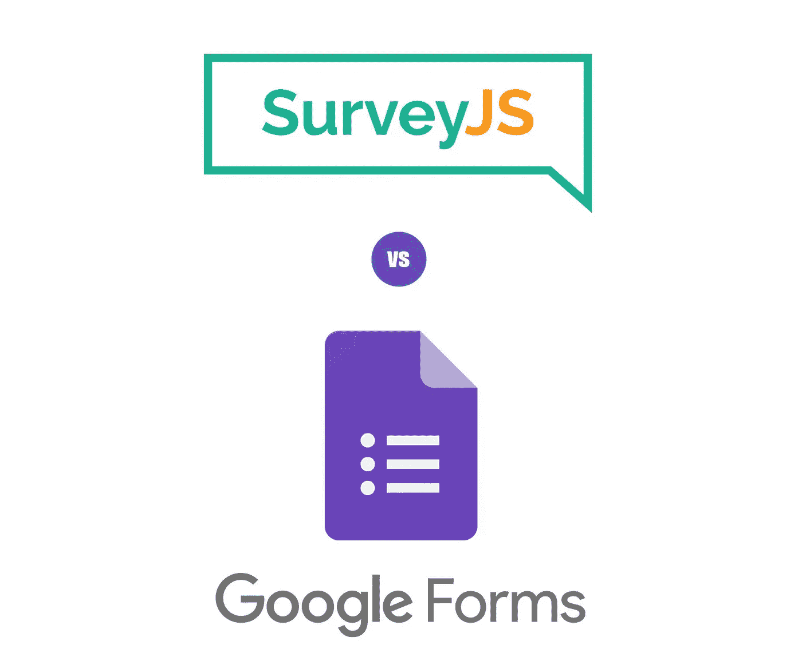
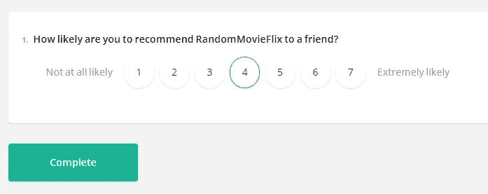

# 为什么应该使用 SurveyJS 而不是 Google Forms

> 原文：<https://javascript.plainenglish.io/why-you-should-use-surveyjs-instead-of-google-forms-c2761d68bd78?source=collection_archive---------4----------------------->

## SurveyJS 在一个免费的开源包中提供了速度、定制和可伸缩性。



# 谷歌表单 vs SurveyJS

从服务器端 PHP 时代到用于呈现表单和处理提交的客户端 AJAX 时代，我们已经走过了漫长的道路。有趣的是，*我们对待建筑形式的方式并没有完全改变，只是变得*更容易了*。我们现在有几个容易获得的在线工具来创建表格和调查…但并不是所有的工具都是平等的。*

**等等，什么？我就不能用谷歌表单吗？**

*当然可以！它是免费的、可靠的，如果你想快速完成基本的表格和调查，它是最好的选择……但这就是它的全部。它最适合于**静态**数据，在一次性**临时**表单上，具有最小的可视化定制需求，并且只有当 FOSS ( [**自由和开源软件**](https://en.wikipedia.org/wiki/Free_and_open-source_software) )和数据所有权对你来说不是症结所在的时候。*

*但对于现实世界中，使用 React 或 Angular 的全栈应用，可能是在现有的组织结构内？要回答这个问题，我们先来看看 [**SurveyJS**](https://bit.ly/3ajTjar) 。*

# *什么和为什么*

*SurveyJS 是一个高性能、可扩展、自托管的 FOSS JavaScript 库(在 MIT 许可下),可以用来创建表单*和*调查。它集成了 React、Angular 和 Vue，同时仍然完全兼容 jQuery。*

*它最独特的特性之一是一种数据驱动的方法——表单/调查是动态的，被定义为数据模型(“模式”)，带有 UI 元素的模板。结合其过多的问题类型/输入字段、使用**跳过逻辑**和**分支**的能力、完全自由的**可视化定制**、 **webhooks** 以及许多其他功能，SurveyJS 变得异常强大。*

*简而言之，如果你的需求符合它所围绕的三个理念，SurveyJS 可能是你的最佳选择:**多功能性**，**可扩展性**，以及**自由/开源软件的重要性。***

*SurveyJS 还提供了一个基于 GUI 的表单/调查构建器[/T1【这里是](https://bit.ly/3RjYNlQ) ，它可以免费使用，不需要注册或登录，与 Google Forms 一样易于使用。请注意，这个功能**需要付费的开发者许可才能在你自己的应用/网站**中作为可嵌入的小工具使用。但是，您仍然可以从 SurveyJS 网站上导出 JSON 模式。*

# *测量的好处:多功能性*

## *1.性能和多样性*

*SurveyJS 即使有数百个问题也能保持高性能，同时提供 20 种不同类型的输入字段。您已经有了基本的单行和多行输入字段、复选框、下拉列表、布尔值和单选按钮组，还有矩阵问卷、 [**Likert scales**](https://en.wikipedia.org/wiki/Likert_scale) 、文件上传、HTML 嵌入等等。*

*每个字段都支持输入验证(静态和异步)和表达式评估(例如，根据受访者的出生日期输入评估他们的年龄)。*

## *2.动态表单*

*除了时间限制(尤其是没有适当的 CI/CD 管道)，表格/调查的传统**静态方法**并不理想，原因有二:*

*   *无论是谁负责进行变更，都必须精通如何深入主要企业应用程序的代码库，并将变更推向代码审查。对于需要在没有开发人员在场的情况下快速更改和添加的用例来说，绝对*不理想*。*
*   *技术约束会随着时间而变化，但是您仍然会与所使用的技术紧密结合；JavaScript，Python 等。没有变通的余地。*

*SurveyJS 使用行业标准的 JSON 作为公共基础，用一种动态的、数据驱动的方法解决了这个问题:你的整个表单被定义为一个用 JSON 编写的数据模型(一个“模式”)，表单 UI 是使用该模型从模板自动构建的。*

*因此，任何时候需要修改时，您所要做的就是编辑 JSON 文件(即使对于非技术背景的人来说，这就像编辑文本文件一样),如下所示:*

```
*{
      "elements": [
       {
        "type": "rating",
        "name": "question1",
        "title": "How likely are you to recommend RandomMovieFlix to a friend?",
        "rateMax": 7,
        "minRateDescription": "Not at all likely",
        "maxRateDescription": "Extremely likely"
       }
      ]
  }*
```

**

## *3.完全可视化定制*

*使用 SurveyJS 优于 Google Forms 的一个立竿见影的好处是能够自由定制 CSS，使表单看起来尽可能地与众不同，融入你的品牌身份和设计语言。*

*如果您不想编写自己的 CSS，SurveyJS 提供了一些现成的动画和现代主题，确保快速完成流畅、响应迅速、专业外观的表单和调查。*

## *4.条件逻辑和分支*

*您可以使用条件门控为您的调查实现**跳过逻辑**和**分支**。根据对当前问题的回答，下面的一个或其他人可能隐藏或显示…或者直接控制跳转到另一个问题。*

*这使您能够完全掌控调查流程，确保您的受访者总能获得最相关的问题并更快地完成调查。*

## *5.多语言调查*

*SurveyJS 通过 GUI Creator 中的语言选项提供了**自动本地化**和多语言环境调查，以及使用库时的语言环境属性——这可以在运行时根据用户的系统进行更改。*

*目前，该社区支持 30 多种语言，您可以添加自己翻译的字符串，或者根据自己的喜好覆盖现有的字符串。*

## *6.Webhooks*

*Webhooks 是带有数据负载的自动化消息，每当特定的事件被触发时就会发送。希望表单数据在提交后立即保存到组织的数据库中？每当有独特的回答者参加您的调查时，向您的团队发送电子邮件/时差通知如何？*

*可能性是无止境的，webhooks 已经覆盖了你。SurveyJS 通过 onComplete trigger 作为回调函数来提供开箱即用的支持，你可以在这里阅读关于[](https://bit.ly/3P8nWya)**。***

```
***function App() {
  // create survey from JSON schema
  const survey = new Model(surveySchema);
  // onComplete trigger
  survey.onComplete.add((sender) => {
     // form submission data is in sender.data
    const results = JSON.stringify(sender.data);
    // add to database
    addToDatabase(results);
  });
  // render JSX
  return (
    <div>
      <Survey model={survey} />;
    </div>
  );
}async function addToDatabase(results) {
  const options = {
    method: "POST",
    headers: { "Content-Type": "application/json" },
    body: results,
  };
  // your internal API here
  fetch("http://localhost:3000/api", options).then((response) =>
    //TODO: use response for notification
    response.json()
  );
}***
```

# ***调查的好处:可扩展性***

****很酷的想法，但它可扩展吗？*无论是构建 UI/UX、后端还是整个应用程序，你都会看到这个问题被抛来抛去。这到底意味着什么？***

***让我们考虑一个简单的调查，并提出一些问题。***

***如果出现以下情况，您还能轻松地构建、测试和部署吗:***

*   ***你必须支持一百个问题/领域，而不是十个？***
*   ***你让一万人而不是一百人参加你的调查？***
*   ***您希望将它托管在您的服务器上，而无需担心技术和开发限制会随着时间的推移而改变？***

***随着应用程序的增长，小问题可能会变成维护的噩梦。SurveyJS 通过充当构建块的客户端 JavaScript 库实现了**适度增长**——**基于模式的**表单，这些表单可通过第三方 Javascript 组件[**【easy autocomplete】**](http://easyautocomplete.com/)[**bootstrap date picker**](https://bootstrap-datepicker.readthedocs.io/en/latest/)等**扩展**。，可单独与任何套件进行测试，同时仍然保持与任何浏览器或服务器+数据库组合的兼容性。***

***此外，由于 SurveyJS 是作为客户端库分发的，传统的基础设施问题，如为新用户会话分配服务器，以及管理缓存、负载管理、延迟等。永远不要出现。***

***组织不想彻底改变他们现有的设置*只是*来集成第三方解决方案，所以在“构建模块”理念上加倍努力，SurveyJS 已经集成了[](https://www.npmjs.com/package/survey-react-ui)**[](https://www.npmjs.com/package/survey-angular)**[**vue . js**](https://www.npmjs.com/package/survey-vue-ui)(甚至还有 [**淘汰**](https://bit.ly/3aktQ0m) )同时完全保留**【T38)*********

# *******调查的好处:自由和开放源码软件的重要性*******

*******开源是真正的创新发生的地方。分散开发是游戏的名称，全世界的开发人员投入时间和精力来编码、维护和记录真正免费供每个人学习和构建的软件。*******

## *******1.免版税*******

*******SurveyJS Javascript 库在 [**MIT**](https://opensource.org/licenses/MIT) 许可下是免费和开源的，这是非常宽松的，并且只有以下要求:*******

1.  *****在你的应用程序或产品中的某处或旁边承认原作者的版权。*****
2.  *****如果原作者的代码破坏了你的代码或数据库，不要起诉原作者要求赔偿。*****
3.  *****否则，修改，建立，甚至把它合并到你自己的 SaaS 是完全可以的，也是免版税的。*****

## *****2.安全性和数据所有权*****

*****使用谷歌表单，你被锁在一个你无法控制的生态系统中。注册和登录您的帐户是强制性的；这是一个黑盒 SaaS 平台，有自己的服务条款。您不知道数据跨越了多少边界，是如何处理的，也不知道您的受访者提交的数据中是否添加了任何标记来收集个人身份信息。*****

*****通常，您的组织需要包括存储和完全控制您的数据的法律责任，并且能够在需要时提供这些数据。这样的安全级别只能通过在您自己的服务器上**自托管**的解决方案来实现，您可以完全控制这些服务器。SurveyJS 库正是这样一个解决方案。*****

# *****SurveyJS 不仅仅是一个调查构建者*****

*****Google Forms 可能是最广为人知和最直接可用的选项，但是它只适合最简单的用例。内部的 HTML 和 JavaScript 表单更好，但显然，这种方法不可扩展，因为它需要为一切定制解决方案，以及支持和维护它们的资源。*****

*****SurveyJS 简化了*所有这些，同时仍然确保高性能。加上条件逻辑、完全可视化定制和开箱即用的主题、输入验证、多语言支持、webhooks 以及可伸缩、可扩展、基于组件的表单构建方法，SurveyJS 中就有了一个**健壮的通用表单库**，而不仅仅是一个调查创建者和运行者。******

*****SurveyJS 由四个独立的产品组成，选择一个最适合您需求的产品:*****

*   *****[**SurveyJS 库**](https://bit.ly/3bXXV6g)—使您能够在您的网站上编码和运行表格/调查。(免费，开源，在麻省理工学院许可下)。*****
*   *****[**survey js Creator**](https://bit.ly/3bXuRf7)—一个基于 GUI 的嵌入式表单/调查构建器。(免费使用 [**此处**](https://bit.ly/3RjYNlQ) ，但商业使用需要付费开发者许可)。*****
*   *****[**SurveyJS 分析包**](https://bit.ly/3aliPvV)—将调查结果可视化为仪表板中的图表/表格。(需要商业开发人员许可证)。*****
*   *****[**调查导出为 PDF**](https://bit.ly/3nRTzjL)—将调查响应导出为 PDF 文件。(需要商业开发人员许可证)。*****

******更多内容请看*[***plain English . io***](https://plainenglish.io/)*。报名参加我们的* [***免费周报***](http://newsletter.plainenglish.io/) *。关注我们关于*[***Twitter***](https://twitter.com/inPlainEngHQ)*和*[***LinkedIn***](https://www.linkedin.com/company/inplainenglish/)*。查看我们的* [***社区不和谐***](https://discord.gg/GtDtUAvyhW) *加入我们的* [***人才集体***](https://inplainenglish.pallet.com/talent/welcome) *。******