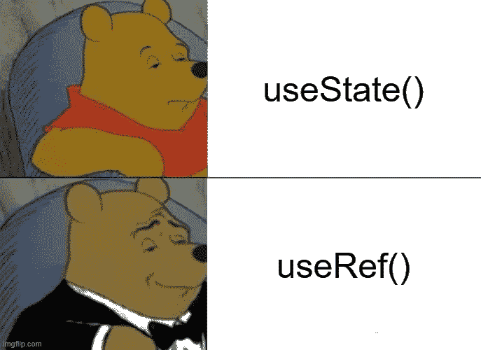
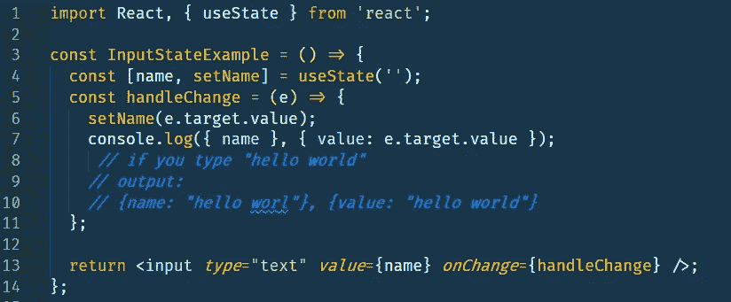
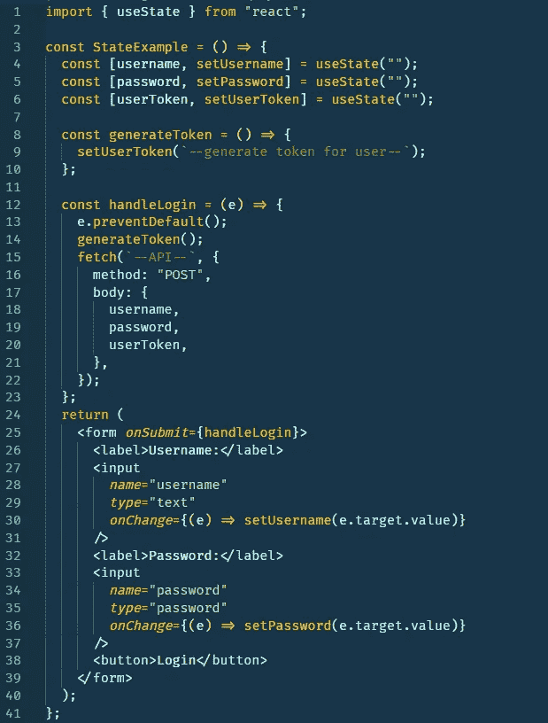
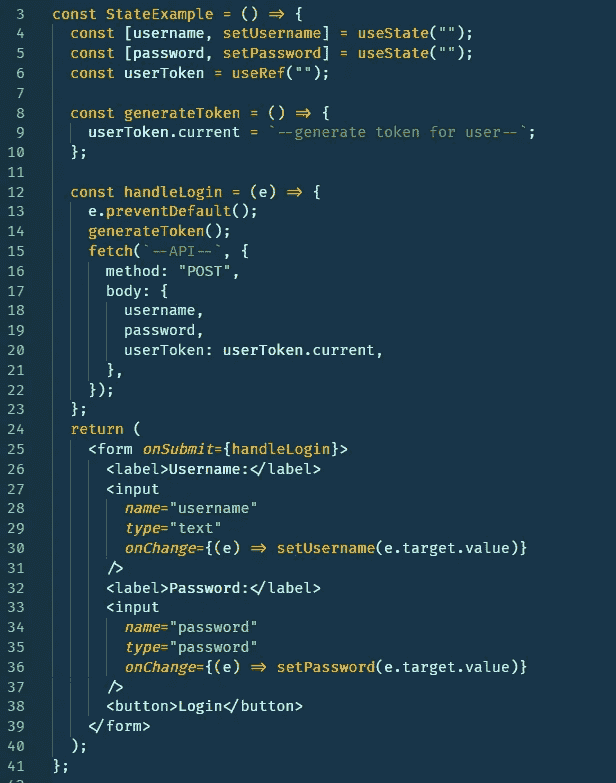
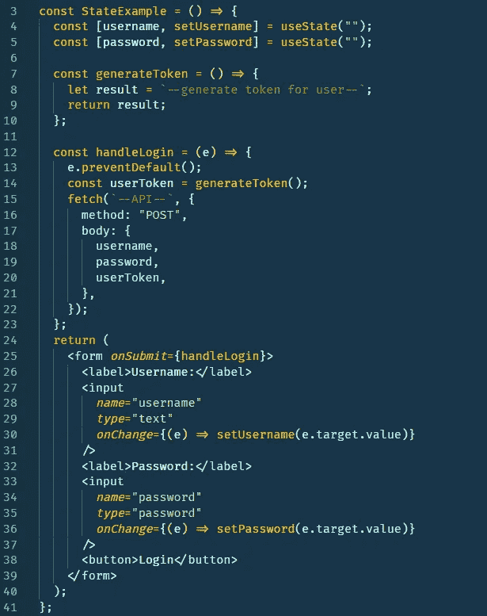
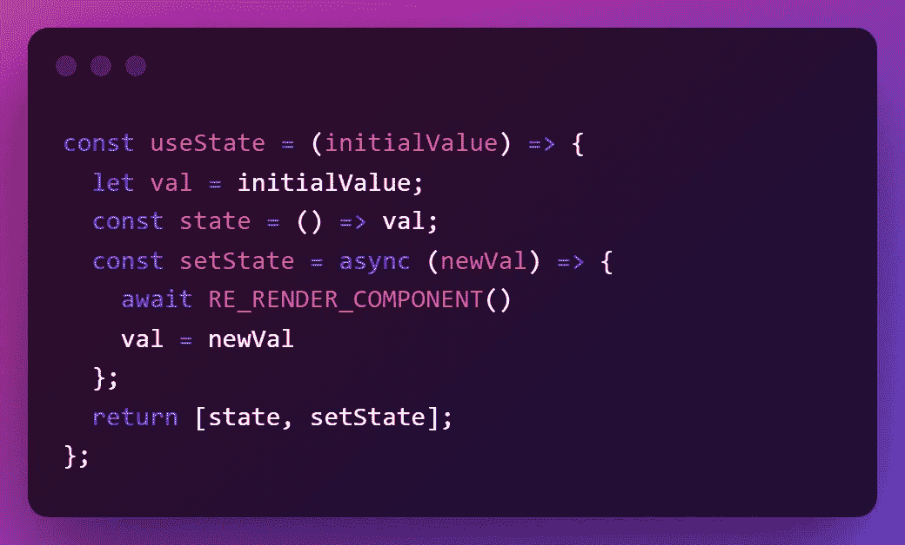

# 为什么不应该总是使用“使用状态”

> 原文：<https://javascript.plainenglish.io/why-you-shouldnt-always-use-usestate-658994693018?source=collection_archive---------0----------------------->

你好，我是一名前端开发人员，我想分享一下我对为什么不应该总是使用`useState`的看法。

> TL；DR: `useState`是一个异步钩子，它不会立即改变状态，它必须等待组件重新呈现。
> 
> `useRef`是一个同步挂钩，它可以立即更新状态，并在组件的生命周期中保持其值，但不会触发重新渲染。

最近，我和一位同事结对编程，他正与一个“奇怪的 bug”作斗争。

**编辑:不是 bug，只是误用了 useState。*

为了便于理解，我举了这个例子。

我那位热心的朋友很困惑，为什么他的表单没有像预期的那样正确提交输入。

我建议他使用“正常变量”而不是“使用状态”,但他看不起我，好像我只是一个白痴(他怎么知道的？😅)并开玩笑说:“你显然不知道你在说什么。”

令他自己惊讶的是，这个变量派上了用场。

# 我为什么喜欢 useRef？

好的，我只是想声明你不应该总是依赖于`useRef`或一个“正常变量”来处理所有情况，但是我只是想分享为什么有时候我更喜欢它们而不是`useState`。

编辑:我确实收到了读者的反馈，他们认为我的例子不正确，因此我更新了他们的反馈来说明我的观点。

## 1-使用状态

看看下面的例子。

你知道会发生什么吗？

`useState`是一个异步钩子，它会等待组件完成它的循环，重新渲染，然后它会更新状态。因此，`userToken`第 20 行仍然是一个空字符串。

## 2-用户参考

当我需要立即做一些事情，并且我的代码流需要它时，我会瞄准`useRef`…为什么？因为它有着和`useState`一样的坚持的力量。

它通过组件的生命周期来维持价值，但最酷的是它是同步的！

让我们重新编写上面的示例，这次让它生效！

最酷的是，它将在组件的整个生命周期中保持不变，无论组件重新渲染多少次都不会被初始化为 false。

`useRef`仅用于保持状态并同步更新，但不会触发重新渲染。所以，不要到处用`useRef`代替`useState`。

## 3-正常变量

在我的例子中，我不需要维持`userToken`的值，因为我只会使用它一次，因此我可以用一个普通变量替换`useRef`。

# 使用状态如何工作

我做了一个插图代码来解释`useState`钩子是如何在引擎盖下工作的。

如果您听说过闭包，那么这看起来会很熟悉。

> 根据定义,“闭包”意味着一个函数可以访问它最初创建的作用域，即使它是在作用域之外执行的。

在这种情况下，`state`和`setState`是在它们的作用域之外执行的函数，但是它们仍然可以访问最初在其中声明它们的作用域。

如您所见，`setState`是异步的，它必须排队等待组件重新呈现的订单，等待订单完成，然后它将更新状态。

它如何在组件重新渲染的过程中保持状态值不变？关闭，我的朋友。

闭包使您能够创建具有持久“记忆”的函数，这意味着您再次执行该函数时，它将引用上一次的执行…让我解释一下:

为什么不在控制台中试试这段代码呢？

猜猜这里发生了什么？

确切地说，闭包保留了函数作用域的“缓存”或“内存”,即使函数在外部执行也可以访问。

# 结论

不要瞧不起别人，告诉他们“你显然不知道你在说什么。”或者那个人会在媒体上写一篇文章。😆

感谢阅读。

*更多内容看* [***说白了就是***](https://plainenglish.io/) *。报名参加我们的* [***免费周报***](http://newsletter.plainenglish.io/) *。关注我们关于*[***Twitter***](https://twitter.com/inPlainEngHQ)*和*[***LinkedIn***](https://www.linkedin.com/company/inplainenglish/)*。加入我们的* [***社区***](https://discord.gg/GtDtUAvyhW) *。*