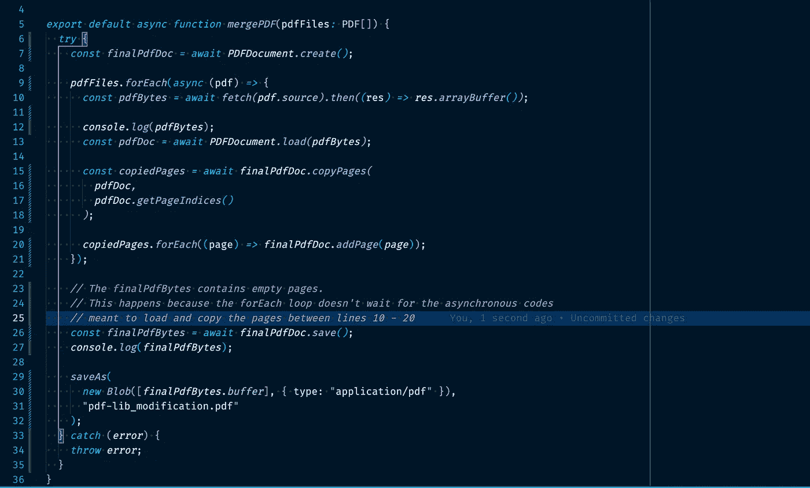
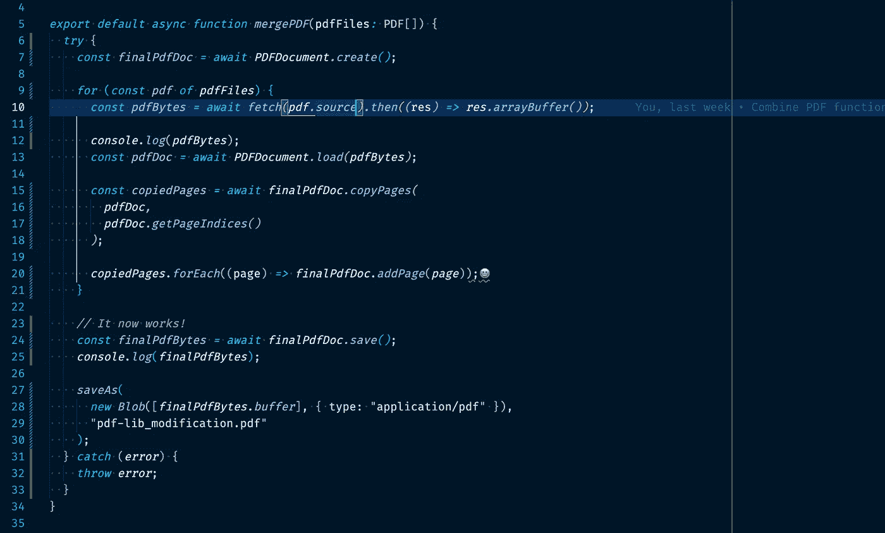
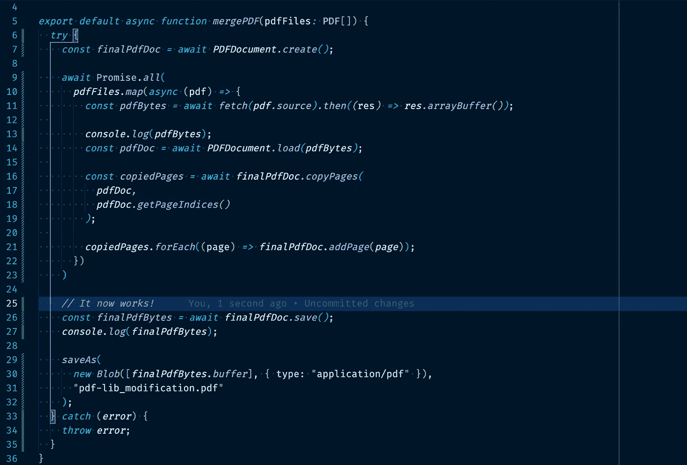

# 为什么不应该将 forEach()与 async/await 一起使用！

> 原文：<https://javascript.plainenglish.io/why-you-shouldnt-use-foreach-with-async-await-bece7bdc44b7?source=collection_archive---------8----------------------->

## Array.prototype.forEach()函数是否只需要一个同步函数？



The code snippet that triggered the observation!

查看下面的代码:

```
async function displayScores() {
  const scores = [1, 2, 3, 4, 5]; console.log("Starting to display scores"); scores.forEach((score) => {
    console.log('The current score is ', score);
  }); console.log("Finished displaying scores. This should execute last!");
}displayScores();
```

该代码将给出以下输出:

```
Starting to display scores
The current score is 1
The current score is 2
The current score is 3
The current score is 4
The current score is 5
Finished displaying scores. This should execute last!
```

然而，通过使用一些异步函数来修改代码:

```
function myFunction(value) {
  return new Promise((resolve) => {
    console.log("My extra function is running");
    resolve();
  });
}async function displayScores() {
  const scores = [1, 2, 3, 4, 5];
  console.log("Starting to display scores");
  scores.forEach(async (score) => {
    console.log('Before the async function:');
    await myFunction()
    console.log('The current score is ', score);
  });
  console.log("Finished displaying scores. This should execute last!");
}
displayScores();
```

你应该期望**显示完分数。这应该最后执行！**仍然最后打印，因为 forEach 是同步的。

实际上，这是输出结果:🤯

```
Starting to display scores
Before the async function:
My extra function is running
Before the async function:
My extra function is running
Before the async function:
My extra function is running
Before the async function:
My extra function is running
Before the async function:
My extra function is running
Finished displaying scores. This should execute last!
The current score is  1
The current score is  2
The current score is  3
The current score is  4
The current score is  5
```

当这导致我正在开发的一个 web 应用程序出现错误时，我发现了这一点。

我意识到对 forEach 使用 async/await 会导致意想不到的行为。虽然 await 关键字似乎已经完成了它的工作，但是 forEach 循环在进入下一个循环时不会等待承诺。

我对这种意外行为的理解可能不够清楚，请**评论**您对这种行为的看法。

不管怎样，我发现这个解决方案是可行的。

求助于使用基本的 for 循环，for(；；；)和 for…of loop 完美地工作着。



For of loop worked fine.

另一个可行的解决方案是将 Array.map 与 Promise.all()一起使用，如下所示:

```
await Promise.all(
    scores.map(async (score) => {
        console.log('Before the async function:');
        await myFunction()
        console.log('The current score is ', score);
    })
);// This works perfectly.OUTPUT:
Starting to display scores
Before the async function:
My extra function is running
Before the async function:
My extra function is running
Before the async function:
My extra function is running
Before the async function:
My extra function is running
Before the async function:
My extra function is running
The current score is  1
The current score is  2
The current score is  3
The current score is  4
The current score is  5
Finished displaying scores. This should execute last!
```



Surrounding Array.map with Promise.all()

在评论区分享你的想法和经验。

谢谢！👍

*更多内容看* [***说白了就是***](https://plainenglish.io/) *。报名参加我们的* [***免费周报***](http://newsletter.plainenglish.io/) *。关注我们关于*[***Twitter***](https://twitter.com/inPlainEngHQ)*和*[***LinkedIn***](https://www.linkedin.com/company/inplainenglish/)*。查看我们的* [***社区不和谐***](https://discord.gg/GtDtUAvyhW) *加入我们的* [***人才集体***](https://inplainenglish.pallet.com/talent/welcome) *。*