# ChatGPT 会改变软件开发吗？

> 原文：<https://javascript.plainenglish.io/will-chatgpt-change-software-development-fc94f8096f5b?source=collection_archive---------0----------------------->

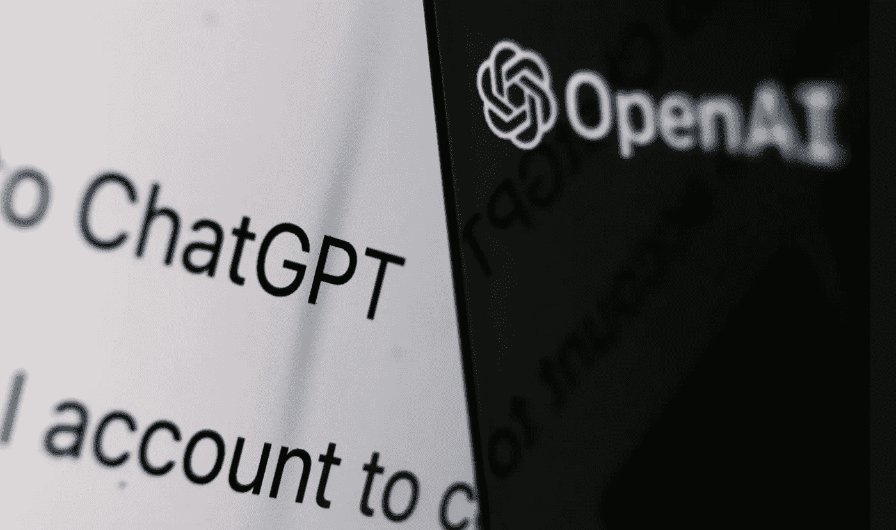

Photo by Jakub Porzycki/NurPhoto via Getty Images

如果您还没有听说过 ChatGPT，那么您很可能就要听说了。在过去的一周里，它已经传遍了整个万维网，这是有充分理由的。简而言之，ChatGPT 令人兴奋不已！

过去一周我开始看到很多关于 ChatGPT 的帖子和评论！首先，我认为人们在夸大其词，我的意思是，拜托，能有多神奇？我决定创建一个开放的人工智能帐户，并给自己一个去看看所有的模糊是怎么回事！

我不得不承认，它很快让我大吃一惊！ChatGPT 真的是不可思议的东西，它提供了未来软件工程的一瞥！在本文的后面，我将举例说明我的意思。

# 什么是聊天 GPT

> GPT-3 是由 OpenAI 开发的最先进的语言模型。它能够生成类似人类的文本，并可用于各种自然语言处理任务，包括在类似聊天的环境中生成响应。GPT-3 代表“生成式预训练变压器 3”，指的是它是一种机器学习模型，事实上它是 GPT 系列的第三次迭代。这是一个非常大的模型，有 1750 亿个参数，这使它能够生成高质量的文本。

以上不是我的话，但是，这是我问聊天 GPT 它到底是什么时得到的回答。

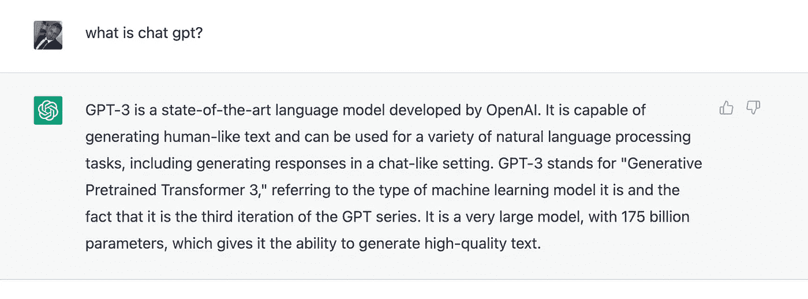

简而言之，你可以提出你的问题，让它写文章，想出关于你如何构建东西的代码示例等等。人工智能(AI)和机器学习无疑将对我们未来如何进行软件开发产生巨大影响！不仅仅局限于软件开发，未来还会对我们的世界和日常生活产生巨大的影响。人工智能不断发展，越来越多地被应用于消除工作场所中单调乏味和重复的任务。

我们已经看到人工智能在 Github Co-Pilot 中的应用，我敢打赌，在很短的时间内，我们将会看到来自聊天 GPT 的技术被直接应用到你的 IDE 中来帮助你！这项技术和潜力是如此巨大，可以应用于许多不同的行业，优化工作方式，让人们在工作中变得更加高效和有效！

# ChatGPT 和软件开发

当然，我很好奇它如何帮助开发人员！我从一些简单的 Javascript 问题开始，看看它如何响应以及输出会是什么！

它不仅可以为我提供深入的答案，而且还提供了代码示例和代码本身的解释。下面是我得到的一些答案。

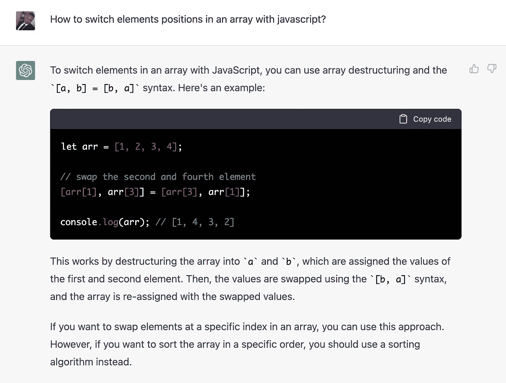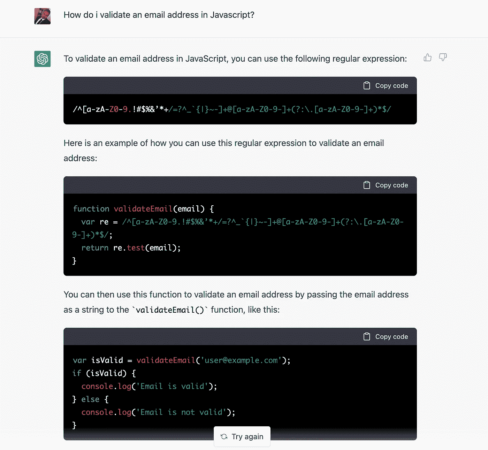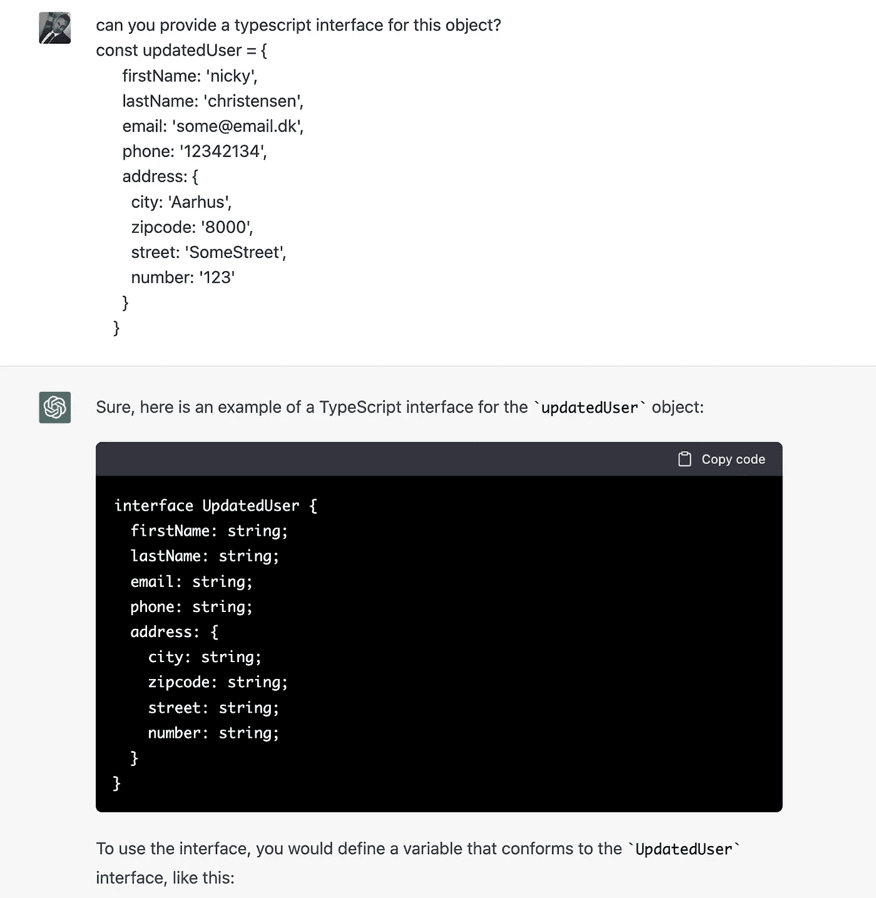

我得到的输出实际上是相当可观的，至少从我的预期来看是如此！我在询问后几秒钟内就得到上面的回复，这可能比我自己写代码还要快！

对于我的下一次尝试，我想用一种不同的方式。我目前正在与 Vue 和 Firebase 合作一个兼职项目，我需要做一个基于订阅的支付应用程序。我问了一个问题
“如何用 Vue、Firebase 和 Stripe 构建订阅应用？”。
我得到的最初回答并没有那么好，于是我继续和 ChatGPT 的对话(见本文底部的完整聊天)。

令我惊讶的是，它实际上可以为我的问题提供很好的答案和上下文(这是我没有想到的)，最重要的是，它为我完成了一些基本的繁琐任务。

1.  它给了我一个如何着手这个项目的想法
2.  关于我的应用程序的基本架构的建议。
3.  为我的应用程序提供了样板代码。
4.  对数据库结构的建议。

它返回的响应代码并不令人兴奋，我并不期望它如此，也不期望它提供 100%清晰的最先进的应用程序。它给我的回报是一些我可以自己轻松完成的事情，然而，它确实给了我一些真正有价值的东西！这给了我时间，我认为这是聊天 GPT 的主要收获之一！这会节省你的时间，而且是大量的时间！ChatGPT 提供的响应让我可以轻松地开始构建我的应用程序，而不需要我花费大量时间去研究如何实现最佳方法。

我试着用一堆其他问题来测试它，这里是我问的一些问题的列表(请随意尝试):

*   可以写一篇关于 javascript 和类的文章吗？
*   如何使用 Vue、Firebase 和 Stripe API 创建支付的示例？
*   如何用 Javascript 从一个 id 构造一个 youtube URL？
*   你能给我提供如何在 Javascript 中检查对象为空的例子吗？
*   如何用 Vue3 和 Firebase 创建一个基础应用？
*   你能设计一个包含 3 篇文章的网站吗？
*   如何使用 javascript 从 API 中获取膳食营养信息？
*   使用 Tailwind CSS 构建带有背景图像、徽标和文本的页眉布局
*   能否提供一个如何构建一个坚实干净的 javascript 架构的例子？
*   可以用 Vue Native 构建一个简单的待办应用吗？
*   获得了如何在 Vue 中构建运动跟踪器的示例？
*   如何在 javascript 中检查密码是否有效？

它设法为所有问题提供了有用的答案！

现在我只接触了聊天 GTP 的皮毛，花了一个小时，但是在我们在一起的时间里，我真的被深深打动了！

# 聊天 GPT 会取代软件工程师吗？

不不不。它更有可能改变我们进行软件开发的方式！今天，开发人员在遇到问题或需要开始一个项目时，会使用 Stack Overflow、Google 等工具，但是对他们的项目方法有疑问！

聊天 GPT 可以帮助解决软件开发中繁琐和重复的任务，为开发人员节省时间。虽然它不太可能取代软件工程师，但它有可能改变软件开发的方式以及开发人员如何最好地利用他们的时间！

我个人认为聊天 GPT 将是帮助开发人员的一个很好的补充，但我不认为它会取代开发人员，至少现在和未来许多年不会！it 要了解和构建完整的应用程序，并在头脑中有上下文、设计和业务策略，还有很长的路要走！

所以我的结论是，它是一个超级酷和令人敬畏的工具，它肯定会颠覆很多行业。我认为它会帮助人们节省大量的时间，不仅是开发者，还有文案、站长，以及更多的行业。总之，我认为人们使用像聊天 GPT 这样的工具和技术会变得更有效率，为此，我认为这是一个巨大的成功，因为时间是我们最少的东西！

你对 ChatGPT 有什么看法？你认为未来会是什么样子，你认为 ChatGPT 会改变你的工作方式吗？

# 与 ChatGPT 的整个聊天

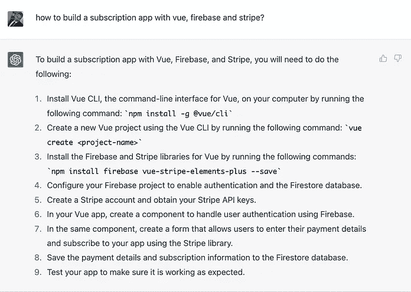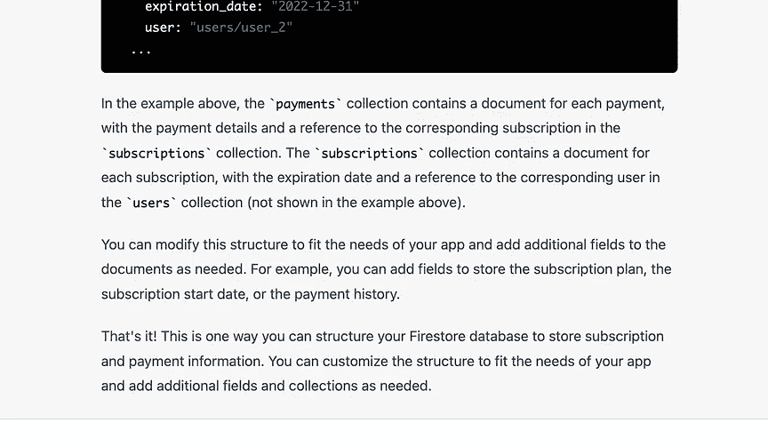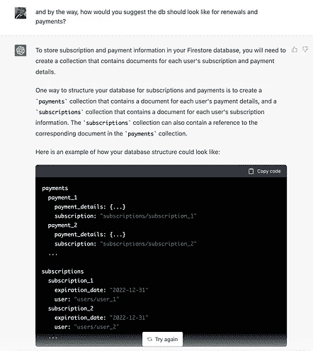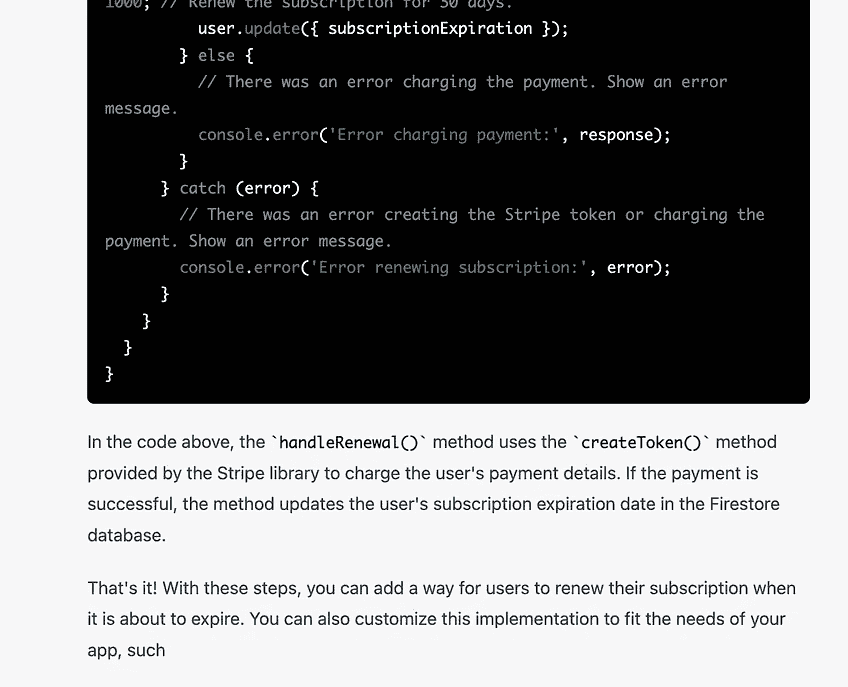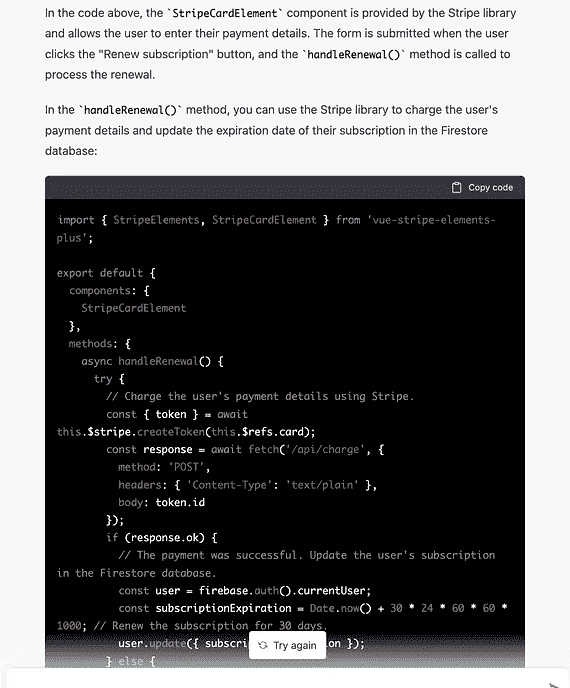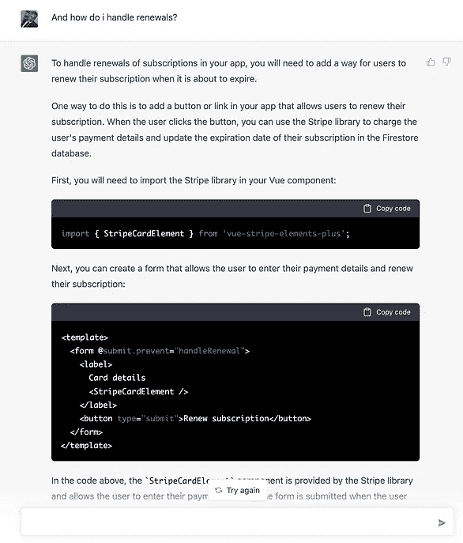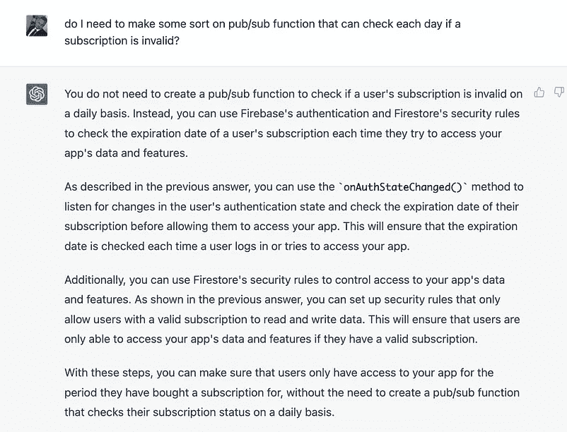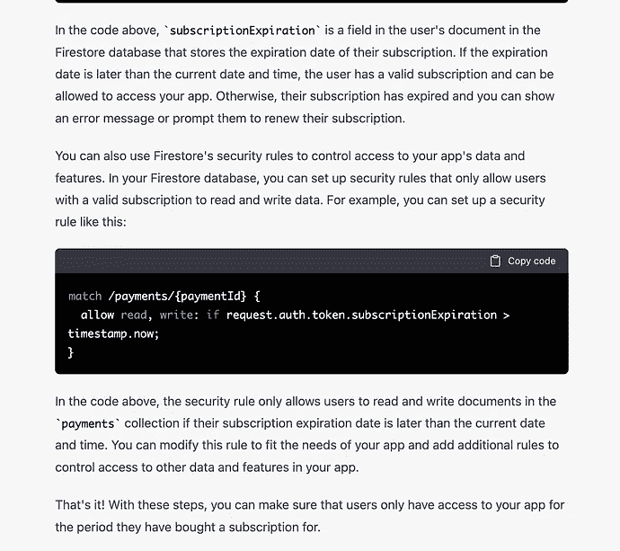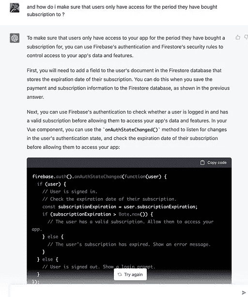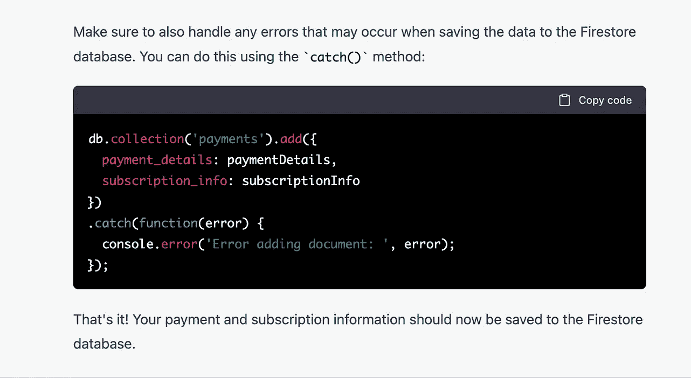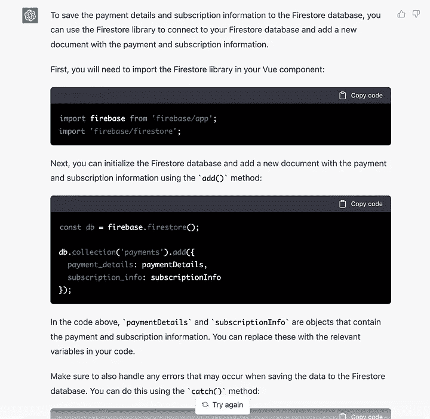

感谢你花时间阅读这篇文章，我希望你喜欢它！如果是这样，请点击那个按钮来支持我。

附注:首先，你应该收到我的邮件。 [***做到这里*** *！*](https://nickychristensen.medium.com/subscribe)

*其次，如果你自己喜欢体验媒介，可以考虑通过报名成为会员* *来支持我和其他成千上万的作家* [***。***](https://nickychristensen.medium.com/membership) *每月只需花费***5 美元，它极大地支持了我们这些作家，你也有机会用你的作品赚钱，并通过你的作品接触到 1000 多人。通过这个链接* [***报名***](https://nickychristensen.medium.com/membership) *，你就直接用你的一部分费用支持我，不会多花你多少钱。如果你这样做了，万分感谢。**

## *进一步阅读*

 *[## 如何使用最小特权原则自动化 AWS IAM 最佳实践

### 云是一项神奇的技术，可用于构建可扩展的应用程序，轻松提供对弹性计算的访问…

简明英语. io](https://plainenglish.io/blog/how-to-automate-aws-iam-best-practices-using-the-principle-of-least-privilege)* * [## Pinia，Vue 新的(更好的)状态管理系统

### 如果你还没有听说过 Pinia 或者正在考虑从 Vuex 转到 Pinia，这篇文章可能会对你有所帮助。

medium.com](https://medium.com/js-dojo/pinia-the-new-and-better-state-management-system-for-vue-8b6f8a64f2e2)  [## Pinia，Vue 新的(更好的)状态管理系统

### 如果你还没有听说过 Pinia 或者正在考虑从 Vuex 转到 Pinia，这篇文章可能会对你有所帮助。

medium.com](https://medium.com/js-dojo/pinia-the-new-and-better-state-management-system-for-vue-8b6f8a64f2e2)  [## Vue 3 提示和技巧

### 使用这些提示和技巧，成为更好、更高效的 Vue 开发人员

medium.com](https://medium.com/js-dojo/vue-3-tips-tricks-d820b04f452f) 

*如果你想找时间和我聊聊，请关注我的*[*Twitter*](https://twitter.com/nickycdk)*|*[*LinkedIn*](https://www.linkedin.com/in/dknickychristensen/)，*或者直接访问我的* [*网站*](https://nickychristensen.dk/) *。*

## 更多内容请访问 [PlainEnglish.io](https://plainenglish.io/) 。

报名参加我们的 [**免费每周简讯**](http://newsletter.plainenglish.io/) 。关注我们 [**推特**](https://twitter.com/inPlainEngHQ) ，[**LinkedIn**](https://www.linkedin.com/company/inplainenglish/)**，**[**YouTube**](https://www.youtube.com/channel/UCtipWUghju290NWcn8jhyAw)**，** [**不和谐**](https://discord.gg/GtDtUAvyhW) **。**

## 想用内容来扩展你的科技创业吗？检查[电路](https://circuit.ooo/?utm=publication-post-cta)。

我们提供免费的专家建议和定制解决方案，帮助您建立对您的技术产品或服务的认知和采用。*