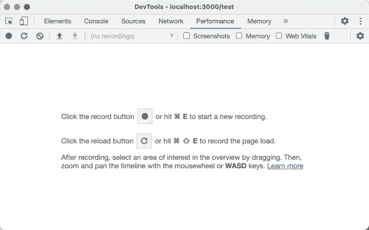
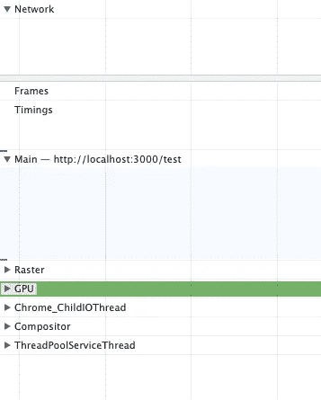
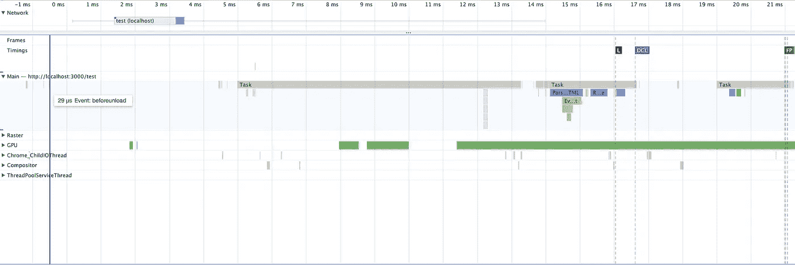
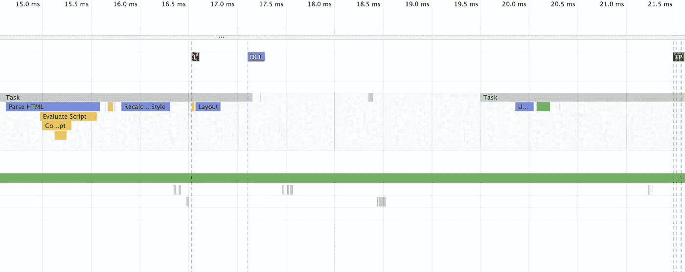
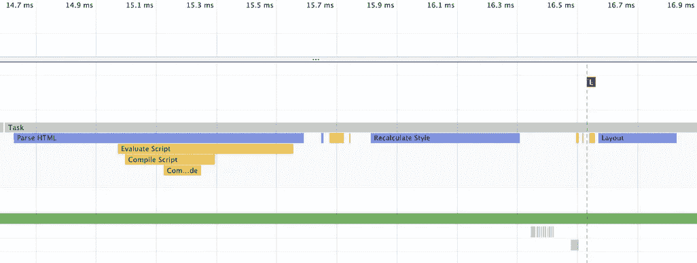
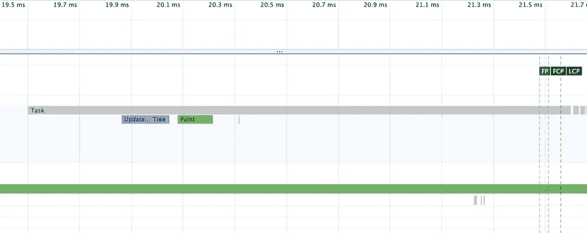
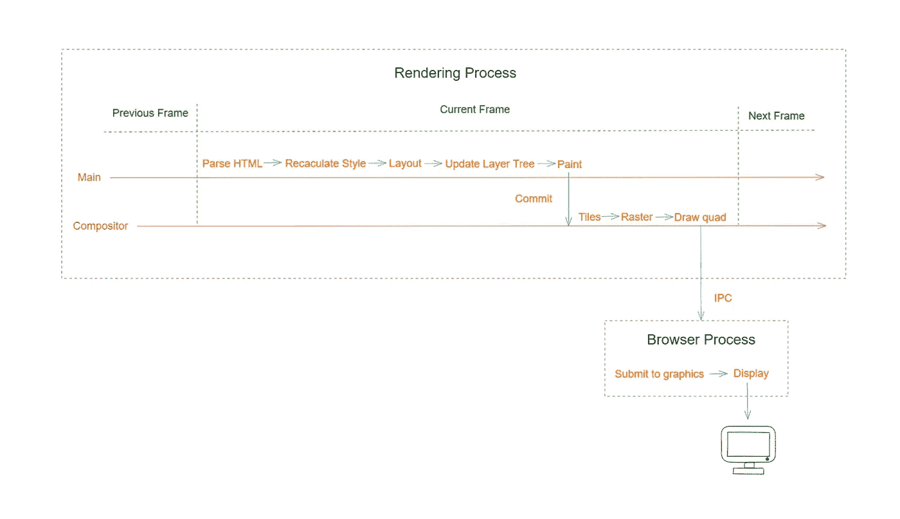
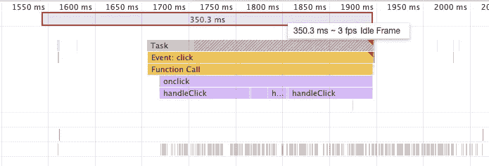
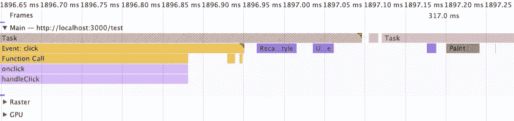

# 在浏览器中运行 JavaScript 会阻碍渲染吗？

> 原文：<https://javascript.plainenglish.io/will-running-javascript-in-the-browser-block-rendering-3e963bb1d2dd?source=collection_archive---------12----------------------->

## 浏览器里这个确定吗？

Photo by [Keith Johnston](https://unsplash.com/@acfb5071?utm_source=medium&utm_medium=referral) on [Unsplash](https://unsplash.com?utm_source=medium&utm_medium=referral)

在浏览器中运行 JavaScript 一定会阻碍网页的渲染吗？

你大概知道答案，但这篇文章会从根源上给你解释。

我们打开 Chrome DevTools 的性能面板来记录:

我们先看左边:

网络:记录网络请求相关内容

帧:显示特定帧的 FPS

Main: **记录渲染过程主线程的任务**

光栅:记录光栅化器线程池任务

GPU:记录 GPU 复合位图的任务

Chrome_ChildIOThread:记录对应的 IO 线程任务记录。例如联网、用户输入、与设备相关的任务等。

合成器:记录合成线程的任务执行情况

这里我们重点分析主要的:

这些灰色块中的每一个都是独立的任务。然后缩小范围，将 HTML 解析为 First Paint(FP):

让我简单解释一下:

解析 HTML:将 HTML 文本转换成内存中的 DOM 树。解析到脚本后，就会执行，也就是评估脚本。这大大延长了解析 HTML 的时间。在这里，我们可以将 async 或 defer 添加到脚本标签中进行优化。

重算样式:分析解析样式，输出为[文档.样式表](https://developer.mozilla.org/en-US/docs/Web/API/Document/styleSheets)

布局:根据样式计算每个节点的布局位置，去掉那些没有显示的节点(`display: none`)

更新层树:根据浏览器的堆叠规则形成层

画图:生成画图指令传递给**合成线程**

合成线程收到画图指令后，将负责后续的画图工作。生成的图像将显示在我们的屏幕上。

这里我们可以看到最终的画图交给了合成线程，而不是负责 JavaScript 执行的主线程。那么是否可以得出 JavaScript 的执行不影响网页渲染的结论呢？

不会。因为合成线程只有在收到绘制命令时才会工作。绘图指令由主线程中的 Paint 任务生成。所以一旦 JavaScript 执行时间过长，那么画图任务就会延迟。

当显示器的刷新率为 60FPS 时，相当于每 16.6ms 生成一个新画面，这也叫帧。如果在一帧内没有及时执行绘画任务，将不会生成新的图片，因此用户看到的是前一帧的图片。如果多帧丢失，用户将会遇到口吃。

下面是一个简单的例子，你可以切换复选框来直观地感受页面的口吃:

我在本地记录了较短的目标值`1_000_0`。可以看出，JavaScript 的执行占用了主线程很长时间，画图任务只有完成后才能执行。

所以执行 JavaScript 会阻塞网页的呈现，因为它们都是在主线程上处理的。同样，一旦 JavaScript 的执行时间过长，渲染相关的任务也无法及时执行。还会有掉帧，用户会有卡顿感。

*今天就到这里。我是 Zachary，我将继续输出与 web 开发相关的故事。如果你喜欢这样的故事，想支持我，请考虑成为* [*中等会员*](https://medium.com/@islizeqiang/membership) *。每月 5 美元，你可以无限制地访问媒体内容。如果你通过* [*我的链接*](https://medium.com/@islizeqiang/membership) *报名，我会得到一点佣金。*

你的支持对我来说非常重要——谢谢。

*更多内容看* [***说白了就是***](https://plainenglish.io/) *。报名参加我们的* [***免费每周简讯***](http://newsletter.plainenglish.io/) *。关注我们* [***推特***](https://twitter.com/inPlainEngHQ) *和*[***LinkedIn***](https://www.linkedin.com/company/inplainenglish/)*。加入我们的* [***社区不和谐***](https://discord.gg/GtDtUAvyhW) *。*