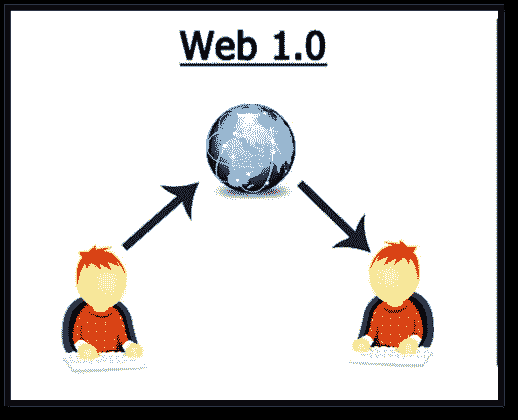
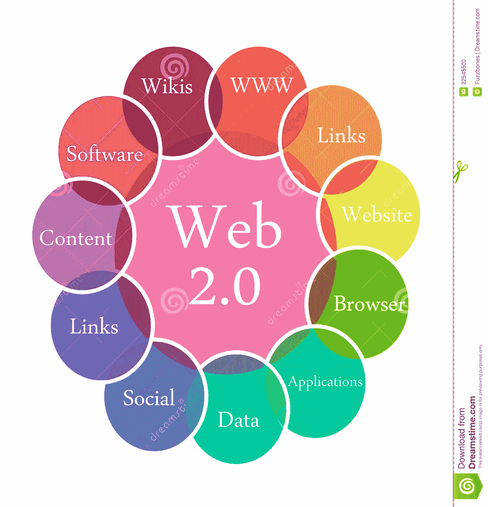
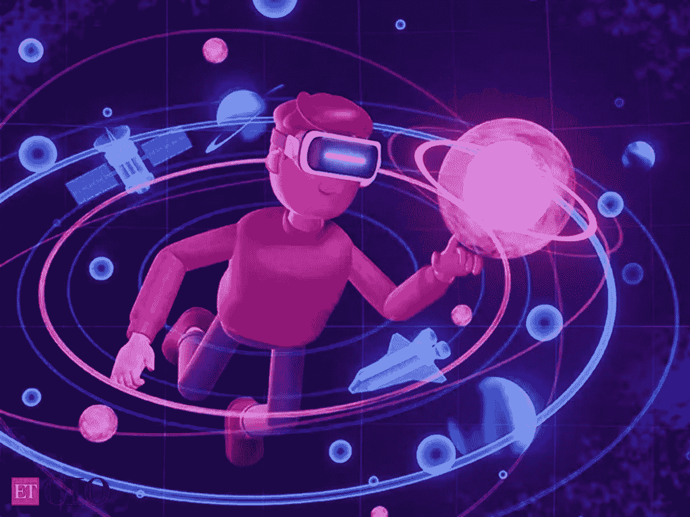
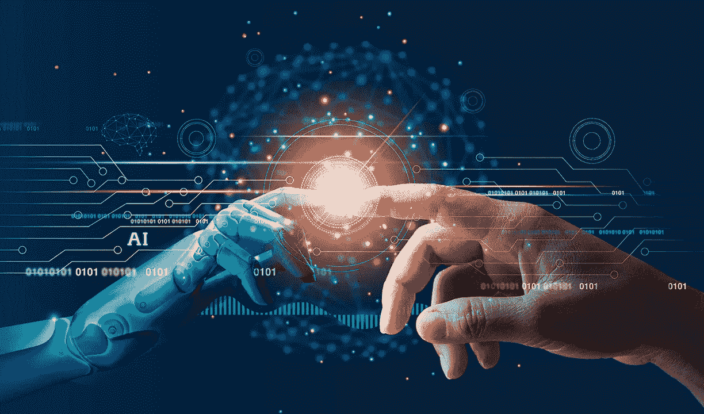

# Web 4.0 是下一件大事吗？

> 原文：<https://javascript.plainenglish.io/will-web-4-0-be-the-next-big-thing-8332bc1165e?source=collection_archive---------3----------------------->

## 让我们看看 Web 4.0 可能会是什么样子。

Photo by [Domenico Loia](https://unsplash.com/@domenicoloia?utm_source=medium&utm_medium=referral) on [Unsplash](https://unsplash.com?utm_source=medium&utm_medium=referral)

# 介绍

在互联网出现之前，通信在距离和数据量方面都非常有限。基本的想法是能够在不同的网络之间进行通信。在那之前，最常用的模型是大型计算机，但它不能在局域网之外进行交换。

但是网关的数量仍然有限，下一步是开发一个超级网络框架。它需要独立于每个网络的物理实现。互联网协议诞生了。

[https://www.datumcorp.com/2015/what-are-the-types-of-websites-and-their-benefits/](https://www.datumcorp.com/2015/what-are-the-types-of-websites-and-their-benefits/)

# 什么是 www？

万维网是通过在浏览器上显示网页来访问互联网介质上的信息的一种方式，信息通过包含文本、图形、音频和视频的超链接来连接。

# Web 1.0 到 Web 4.0 概述

## Web 1.0

> Web 1.0 是 Web 的第**代**，也被称为信息 web。用户只能通过网页阅读和分享信息。

## Web 2.0

> Web 2.0 是 Web 的**第二代**，Web2.0 是读写联网平台，用户可以在这里读、写，并可以相互交流。

## Web 3.0

> Web 3.0 是第三代 Web，可以定义为语义 web。web 3.0 是计算机而不是人类产生和思考新信息的地方。

## Web 4.0

> Web 4.0 也可以被称为“共生”网络。共生网络的理念是，一旦元数据被组织起来，人类和机器就可以(彼此)共生互动。

# Web 1.0

Web 1.0 (1997 年到 2003 年)。这是网络的起源，由蒂姆·伯纳斯·李发明，是一个只读的网络，其中有少量的生产者创建网页(互连)，大量的消费者通过互联网上的浏览器访问这些网页。在这里**用户只能阅读信息**，用户不能与页面内容互动(如评论、回答等)。Web1.0 不支持双向通信，它纯粹基于客户端拉模型。在互联网发展的这个阶段，网站上的广告是被禁止的。

[https://images.hive.blog/web%201.0.png](https://images.hive.blog/DQmV2cc7UcsTSjkxYKUt7mhj8aCkDkfgbP5Sf5wBiqdYUBh/web%201.0.png)

## **Web 1.0 的一些特性:**

*   只读网站
*   静态网页
*   单向出版媒体
*   页面超链接和书签
*   从服务器文件系统提供的内容
*   只能书写和发送文本邮件——不能附加图片

# Web 2.0

Web 2.0(2004 年至今)被称为**读写** web。在 web 2.0 中，web 用户不仅可以阅读内容，还可以在线编写、修改和更新内容。它支持协作，有助于收集集体智慧，而不是 web1.0。它涉及从基本的静态网页到日益动态的用户生成内容的页面的演变。

它也是基于网络的应用程序之父。

Web 2.0 网站的例子包括维基百科、脸书、推特和各种博客。

[https://www.dreamstime.com/stock-photo-web-2-0-illustration-image22545500](https://www.dreamstime.com/stock-photo-web-2-0-illustration-image22545500)

## Web 2.0 的一些特性:

*   信息的自由分类，允许用户对信息进行集体检索和分类。
*   响应用户输入的动态内容。
*   使用评估和在线评论在网站所有者和网站用户之间传递信息。
*   开发的 API 允许自我使用，例如由软件应用程序使用。
*   从传统的互联网用户群到更广泛的用户群，网络访问引起了不同的关注。

# Web 3.0

Web 3.0 于 2014 年首次推出。Web 3.0 非常强调分散化的应用程序，并广泛使用基于区块链的技术。Web 3.0 还将利用**机器学习和人工智能(AI)** 来帮助实现更加智能和适应性更强的应用。

目的是让机器可读，而不仅仅是人类可读。

用户可以使用单个个性化账户在互联网上从一个平台移动到另一个平台，而不必为每个公司和平台登录多个不同的账户。

Web3 可能是通向**的途径，将中间人从互联网**、数据和信息交换本身中剔除。互联网可以成为一个由集体管理的地方，使用数字代币作为其货币。

Web 3.0 的特点是数据不属于特定的组织或个人，而是由用户共享。互联网发展的这个阶段也被称为**语义网**。

Web3 可以理解为互联网的**“读/写/拥有”**阶段。

[https://forkast.news/what-is-web3-how-shape-crypto-future/](https://forkast.news/what-is-web3-how-shape-crypto-future/)

## Web 3.0 的一些特性:

*   分散化:应用程序和服务将以分布式的方式启用，这里没有中央权威。
*   基于区块链:区块链可以实现不可变的交易和活动分类账，有助于在去中心化的世界中提供可验证的真实性。
*   支持加密货币:加密货币的使用是 Web 3.0 服务的一个关键特性，在很大程度上取代了法定货币的使用。
*   自主和人工智能:总体上更多的自动化是 Web 3.0 的一个关键特征，人工智能将在很大程度上推动这种自动化。

# Web 4.0

WEB 4.0 (2014 年到？？？).现在谈论 Web 4.0 还为时过早，它仍然是一个正在发展的地下想法。它还没有一个合适的定义。计算机专家建议一些类似人工智能的名称，Web 4.0 也可以命名为**“共生”Web，**其想法是，一旦元数据被组织起来(Web3.0)，人类和机器就可以共生互动。它将能够**“思考并做出决定”**。

[https://www.artechdigital.net/web-4-internet/](https://www.artechdigital.net/web-4-internet/)

读写执行并发 web 将是 Web 4.0。它达到了在线网络参与的临界质量，为工业、政治、社会等重要社区提供了全球透明度、治理、分配、参与和合作。

Web 4.0 提供了一种最全面、最个性化的用户交互新模式，不仅仅局限于显示信息，而是像一面智能镜子一样为用户的需求提供具体的解决方案。

Web 4.0 改变了我们周围的一切:基础设施、商业、物流、医药等。在这个发展阶段，互联网是由消费者控制的，并赋予他对自己的行为和数据的完全控制权。Web 4.0 正在从根本上改变人们的日常生活。通过提供人和机器之间的连接，Web 4.0 丰富了与互联网相关的任何活动领域的可能性。

[https://news.ifood.com.br/o-futuro-da-internet-esta-entre-nos-descubra-o-que-e-web-30/](https://news.ifood.com.br/o-futuro-da-internet-esta-entre-nos-descubra-o-que-e-web-30/)

## Web 4.0 的一些特性:

*   Web 4.0 是人机共生的互动。人和机器之间的界限模糊了。
*   互联网是一个网络操作系统。信息可以从世界各地传播。
*   互联网在工作中积极使用人工智能，提高了所提供机会的质量。
*   互联网与用户交流的方式与人们相互交流的方式相同。
*   互联网是透明的；所有的行为都是可追踪的。
*   互联网在这个发展阶段提供了比以往更高的速度和可靠性。

# 最后的想法

互联网发展迅速，新的技术和发展不断涌现，影响着人类的发展。这一点不容忽视。从 Web 1.0 到 Web 4.0，互联网已经走过了漫长的道路，在其存在的 50 多年中，发生了很多变化。

新的互联网将提供更加个性化和定制化的浏览体验，更加智能和人性化的搜索助手，以及其他分散化的好处，希望这些好处将有助于建立一个更加公平的网络。

> 我希望这篇文章对你来说是有益的和有趣的。这是我最近的一些文章。(如果你喜欢我的文章，我希望有一个像你一样的读者，这有助于鼓励我做出像这样的精彩文章。所以请随时关注我，这样您就可以随时了解我的最新文章。以下是我的网站链接**)**

* [## JAVA 死了吗？(撕😢JAVA)

### JAVA 会被 KOTLIN 取代吗？

medium.com](https://medium.com/codex/is-java-dead-rip-java-2d91aa663ddd)  [## PYTHON 是未来吗？🤖

### python 是未来的 9 个理由

medium.com](https://medium.com/codex/why-python-is-so-overpowered-2dc747cf28dc)  [## 谷歌还是最好的公司吗？🤷‍♂️

### 现在是为谷歌工作的最佳时机

medium.com](https://medium.com/codex/is-google-still-the-best-company-%EF%B8%8F-40fa74a9873f) 

*更多内容请看*[***plain English . io***](https://plainenglish.io/)*。报名参加我们的* [***免费周报***](http://newsletter.plainenglish.io/) *。关注我们关于*[***Twitter***](https://twitter.com/inPlainEngHQ)*和*[***LinkedIn***](https://www.linkedin.com/company/inplainenglish/)*。查看我们的* [***社区不和谐***](https://discord.gg/GtDtUAvyhW) *加入我们的* [***人才集体***](https://inplainenglish.pallet.com/talent/welcome) *。**