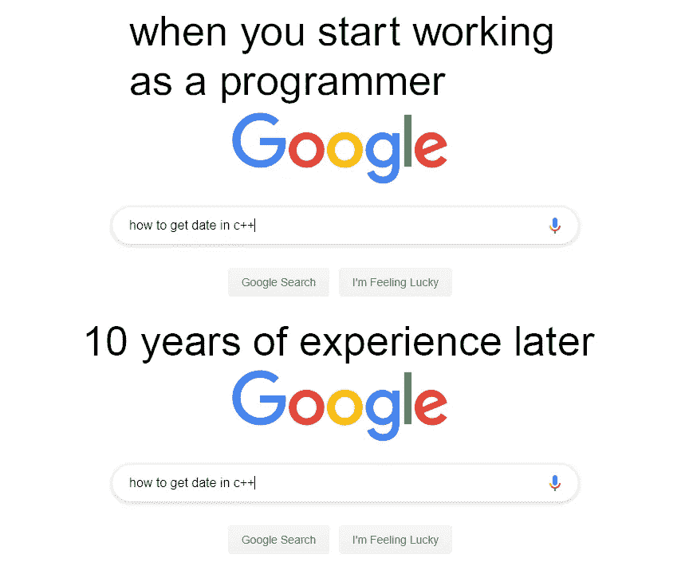
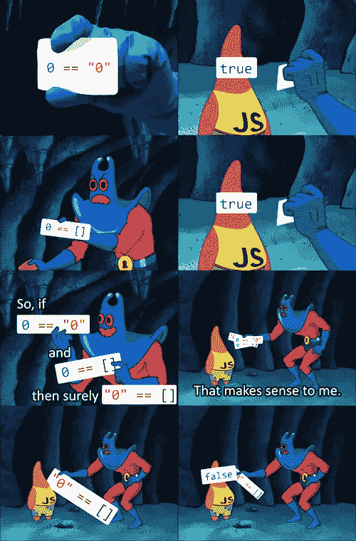
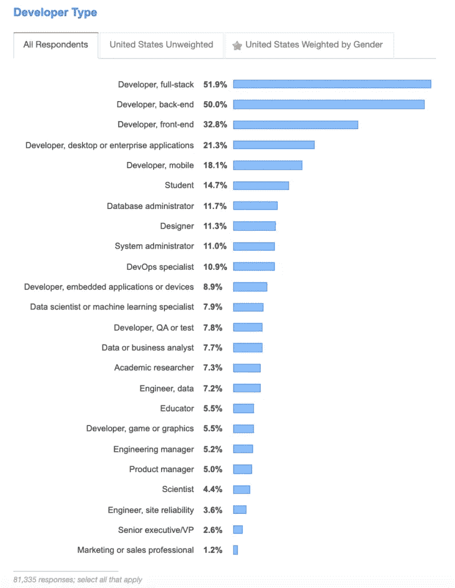
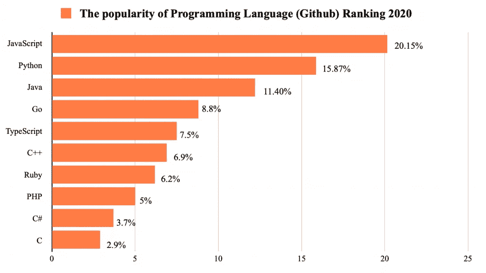
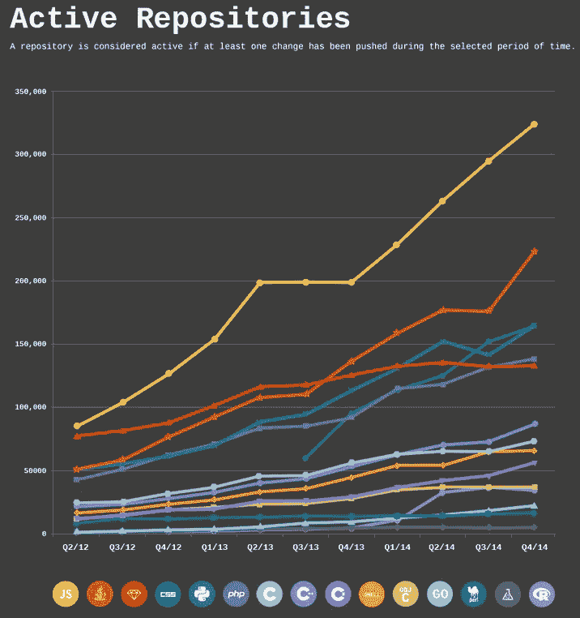
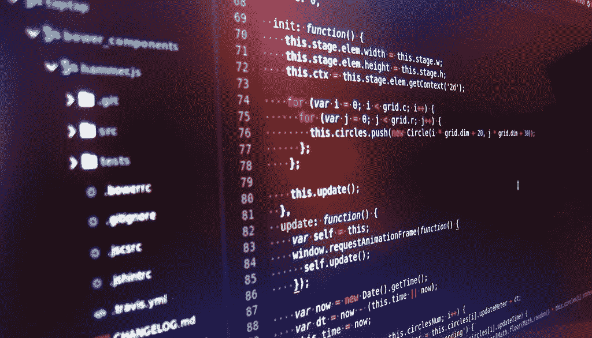
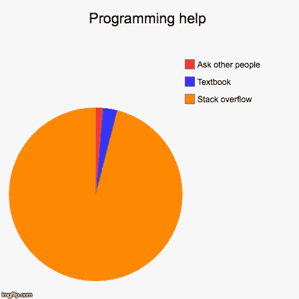
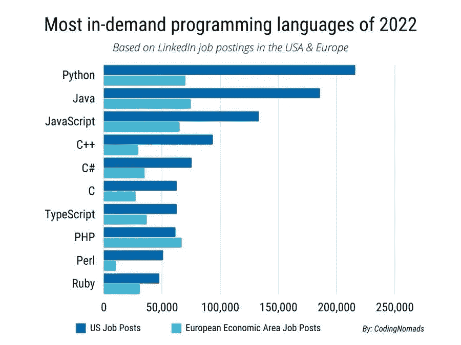

# 2022 年学习这种编程语言

> 原文：<https://javascript.plainenglish.io/wondering-which-programming-language-to-learn-first-in-2022-47d5cfa59c14?source=collection_archive---------8----------------------->

## 如果你是编程新手，找出哪种编程语言是最好的编程语言。

如果您是编程新手，您脑海中闪现的第一个问题可能是:

*“我应该先学哪种编程语言？”*

或者

*“哪种编程语言最好？”*

首先，我想说我真的讨厌这两个问题(尤其是第二个)。我认为这是不该问的问题。任何有一点编程经验的人都会知道，你首先选择什么语言远不如理解编程的底层 ***逻辑*** 重要，这在所有语言中都或多或少是相同的。

何时使用 for 循环，如何使用变量，何时使用递归..作为一名程序员，这些是你必须理解的概念类型——不管是哪种语言！如果你用一种语言理解它们，知道如何在另一种语言中使用它们就变成了寻找正确语法的小事。

尤其是如果你有我们强大的朋友 google.com 在你的支配下…

admit it, you’re like this too

# 但话虽如此……..

好吧，好吧，不像大多数人，**我不会给你一个逃避的答案**比如“没关系”或“看情况”，或者列出 5 种顶级语言，它们都有各自的“优点和缺点”，真的*“你应该选择你想要的，没有正确的答案什么的”*

别担心，我不会那么做的。(尽管他们是对的，但仍然)

因为尽管我认为学习和坚持某种语言比花时间思考哪种语言最好要好，但从一种语言开始比从另一种语言开始有利弊，毕竟，即使学习语言 A 只比语言 B 有用 1%，在这种情况下，你 ***还不如*** 从语言 A 开始。

所以，不管我是如何开始这篇文章的，事实上我确实认为问*‘学哪种语言’****这个问题是*** 事实上是合理的。

的确，有些语言比其他语言更受欢迎，比其他语言更容易构建，而且可能对你们大多数人来说最重要的是，**比其他语言有更多的需求。**

我最后要声明的是，你选择的语言将取决于你的目标。

*   要学习计算机科学基础，你可能应该选择像 C 这样的低级语言(事实上，如果你正在攻读 CS 学位，这个选择无论如何都会为你做出，所以这个问题是多余的)
*   对于机器学习和数据科学的东西，你可能应该用 Python，因为它是行业标准
*   我对游戏开发一无所知，但我听说他们大多使用 C++

然而，如果你像大多数人一样，你可能想学习编程，因为你只是想尽快找到一份工作，或者你只是第一次涉足科技领域，除了“学习编程”之外没有任何具体目标。

对于这些人来说，我确实认为有一种语言实际上是开始学习的“最佳”语言

那么你问的神奇语言是什么？…(鼓声…)

# 为什么您应该从 JavaScript 开始

对于所有滚动到这里只是为了寻找答案的人，感谢你的阅读，祝你有美好的一天！

现在，对于那些对我如何敢于做出如此大胆的声明，建议您从所有语言中开始使用 JavaScript 感兴趣的人来说，这种语言确实有许多不直观的，甚至我敢说是令人讨厌的特性。甚至有一个完整的 [Github 页面](https://github.com/denysdovhan/wtfjs)列出了许多有趣的怪癖。

good ol’ JavaScript

我甚至承认，我有时讨厌 JavaScript。但是尽管如此，我还是要给**四个理由，为什么你仍然相信它是你第一次尝试编程的地方。**

# 1.不管怎样，你可能都得学它

面对现实吧，大部分初学程序员(比如我自己)都是从 web 开发开始的。这不仅是最容易和最容易进入的开发领域，而且也是需求所在。因此，对于那些想尽快找到工作的人来说，web dev(可能)是一个不错的选择。

full-stack, back-end, and front-end are all areas of web development

为什么这是一个支持 JavaScript 的论点？好吧，如果你做网站开发，无论如何你都必须学习 JavaScript，因为它是前端的主导语言。从这个意义上来说， **JavaScript 是 web 开发者独一无二的主导语言。**

有了 Nodejs 这样的框架，您现在甚至可以使用 Javascript 作为后端，这样您将一举两得！

当我开始时，我用 Python 做后端(用 Django ),用 JavaScript 做前端，但是当我了解到我可以用 JavaScript 实现这两个目标时，我意识到一开始只关注 JavaScript 可能会更有效，这样不会分散我的注意力。

# 2.它最适合建筑工程

当你开始的时候，尤其是像我这样自学成才的人，最关心的是为你的投资组合建立令人印象深刻的项目。JavaScript 在这方面大放异彩，因为 JavaScript 可以在任何带有浏览器的设备上运行。

要了解 JavaScript 对于构建项目有多棒，一个很好的代理就是看看 Github repos 中语言的相对受欢迎程度:

JavaScript is the most popular language on Github

正如我们所见，JavaScript 至高无上。Loggly 还发布了这张非常有趣的[信息图](https://www.loggly.com/blog/the-most-popular-programming-languages-in-to-github-since-2012/)，它展示了编程语言随着时间的推移而变得相对流行的情况:

因此，JavaScript 不仅是当今最流行的语言，而且它的相对受欢迎程度也在不断提高。

此外，您还可以访问一组丰富的流行框架，如 Angular 或 React(我唯一的真爱)。JavaScript 也可以在后端使用这一事实意味着，使用同一种语言，您可以同时接触前端和后端，让您体验构建前端和后端，而不必学习单独的语言！(就像我学习 Python 一样)

# 3.这很容易学

正如我们所建立的，我知道 JavaScript 有时很难学，但毫无疑问，与许多其他语言相比，JavaScript 相对容易学。

你不需要像用 C 语言那样担心复杂的东西，比如内存分配，不需要担心静态类型(这显然也会导致问题)，而且从各方面考虑，语法非常容易理解，可以很好地翻译成其他语言。

现在，我知道我在[这篇](https://medium.com/@tuomas.kivioja/coding-is-hard-the-truth-about-learning-to-code-31713e06d088)文章中说过，如果某样东西很难，那可能正是你应该学习它的原因，但我不认为这适用于个别编程语言的环境。正如我们将在下面发现的，尽管 JavaScript 是最简单的语言之一，但从开发人员的角度来看，它仍然是最有利的供求关系之一。

如果所有这些还不足以说服你选择 JavaScript 作为你的第一个编码项目，那么它如此受欢迎的事实意味着你在网上获得的支持和文档将会比其他语言更好。

作为一个或多或少经常发现自己在 StackOverflow 中寻找答案的人，我可以肯定这种特权非常有用…

# 4.需求

好吧，这大概就是单单 will 说服很多人的原因吧。对 JavaScript 职位的需求非常强劲，更好的是，**没有足够的 JavaScript 开发人员**来满足这一需求。

你可以看我以前的一篇文章，一步一步地解释为什么对你的技能的低供给和高需求是如此之好，但本质是非常直观的:公司需要 JavaScript 开发人员，但他们找不到足够多的好的，所以找一份 JavaScript 开发人员的工作必然相对更容易，并且/或者工资会相对更高。

这就是为什么大多数编码训练营以及像 freeCodeCamp 和 Odin 项目这样的在线材料主要关注 JavaScript 的原因。

根据工作数据，JavaScript 不一定是明显的赢家，但它仍然是最大的赢家之一，当你将这一点与所有其他点结合起来时，尤其是为了有一个好的机会获得一份工作，你可能首先需要一些项目的事实(让我们回到第二点和第三点)，JavaScript 在我的书中是很有道理的。

(不过，这显然会因地区而异，所以要有个概念，搜索你所在地区每种语言的招聘信息)

# 结论

所以你有它。我认为 JavaScript 应该*可能*成为*大多数*人首选的编程语言的四个原因(注意重点是*可能*和*大多数*)。为避免疑问，这是**而不是**与所有*完全相同*和*与所有*。

所以如果你是一个初学者，并且我成功地说服你加入了# teamjavaacript，你的下一个问题可能会是…我应该在哪里学习 JavaScript？我的建议是从 Odin 项目开始，在你完成基础之后自然地走上 JavaScript 之路。但是 TOP 实际上不仅仅是一门 JavaScript 课程——它是一个完全免费的网络开发训练营，你可以在线学习。我正在对 Odin 项目做一个全面的回顾，所以点击关注按钮，订阅我的故事的电子邮件通知，这样我一写完就能收到通知！

顺便说一句，如果你不同意，我欢迎你分享你认为人们应该在 2022 年内开始使用哪种编程语言。我并不自称无所不知，这些只是我根据我能找到的研究和数据得出的观点。

我博客的目的是记录我自学计算机科学的旅程以及我作为一名自学软件工程师的生活。如果你感兴趣，点击下面的按钮！

更多关于我的信息，请查看我的 Youtube 频道，[互联网编码器](https://www.youtube.com/c/InternetMadeCoder)。我的频道记录了我作为一名自学成才的软件工程师的生活，以及我自学计算机科学编程的旅程。

*更多内容请看*[***plain English . io***](https://plainenglish.io/)*。报名参加我们的* [***免费周报***](http://newsletter.plainenglish.io/) *。关注我们关于*[***Twitter***](https://twitter.com/inPlainEngHQ)*和*[***LinkedIn***](https://www.linkedin.com/company/inplainenglish/)*。加入我们的* [***社区不和谐***](https://discord.gg/GtDtUAvyhW) *。*