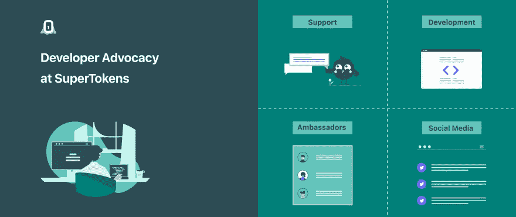

# 在 SuperTokens 做开发者代言人

> 原文：<https://javascript.plainenglish.io/working-at-supertokens-as-a-developer-advocate-8ccc41de1bf9?source=collection_archive---------20----------------------->

我记得自己刚开始在 SuperTokens 做四分之一时间的开发商代言人，就好像是昨天一样。当你热爱你所做的事情时，时间过得真快！

因此，我想在本文中讨论一下我是如何得到这份工作的，以及作为一名开发人员倡导者是什么感觉。

# 为什么我要告诉你我的故事？

这篇文章将告诉你我是如何进入开发者关系的。这篇文章将作为我旅行的记录。

> 首先，我通过在网上和社交网络上发布我的工作得到了这个职位。

我想展示一下社交媒体的力量，许多人都询问我作为开发者代言人的经历。所以我想告诉他们我的故事。

以下是我对过去几个月的简要回顾。这绝对是一种祝福，我无法相信到目前为止发生了这么多事情，这段旅程是如此的不可思议。超出了我最大的期望！

**这是官方发布的推文。** ⬇

# Twitter 如何帮助我得到这份工作

# 什么是开发者拥护者？

> 开发者倡导者(也称为“开发者传道者”或“开发者关系”个体)是具有扎实沟通技巧的技术人员。

这是一份令人兴奋的多样化工作，包括从在会议和聚会上公开演讲到开发演示和写博客文章、文章和书籍，到创建视听产品(播客、采访、演示)到维护宣传网站等等。

他们创建并展示面对面的研讨会和讲座式的讲座。

> 作为一名开发者倡导者，你有能力影响开发者正在创造的软件解决方案的变化。

我强烈建议你阅读瓦西姆·切格姆的博客文章。

[**成为开发者拥护者的微妙艺术。**](https://dev.to/wassimchegham/the-subtle-art-of-being-a-developer-advocate-gdg)

# 我作为开发者倡导者的经历和角色

> 我之前在 DevRel 没有任何经验，但我确实有一群写作能力很好的读者，所以雇佣我对 [*超级代言人*](https://supertokens.com/) *来说是一场风险与回报的赌博。*

# 我目前的职责包括以下内容

*   超级学生大使项目管理
*   为超级用户写技术博客。
*   推特空间系列。
*   为官方推特账号写稿。
*   参与开源社区并收集反馈
*   教育用户如何使用超级令牌以及从哪里获得帮助。
*   获取产品反馈，并将其传递给团队中合适的人
*   参与内部产品反馈讨论，例如文档

> 在超级油轮工作是一个千载难逢的机会。由于文化、特性和人的不同，每一天都不一样。

我也花时间在开源社区，与有兴趣第一次尝试的人交谈。这使我能够收集有价值的数据，例如可以解决的反馈和棘手问题。

> ***我们听取社区和大使的意见，并根据他们的反馈采取行动，因为社区对公司来说是一种宝贵的关系。***

# 我最近几个月的工作重点

最近几个月我做的最好的事情之一是启动并建立了超级代言人大使项目。

> 对任何组织来说，源源不断渴望代表你的创业公司的大使都是无价之宝。

正如你在下面的发布推文中看到的，我们在一个月内增加了 20 多名热爱开源的技术社区的牛人。

启动大使计划是一个很好的方式，可以为您的成员提供他们需要的工具和培训，以有效地用同一个声音讲述您的故事，从而提高您的品牌。

如果你想了解更多关于超级油轮的知识，我推荐你阅读我到目前为止写的博文。

1- [关于超级令牌的一切——Auth 0、Firebase Auth 和 AWS Cognito 的开源替代方案。](https://theankurtyagi.hashnode.dev/everything-about-super-tokens-an-open-source-alternative-to-auth0-firebase-auth-and-aws-cognito)

2- [如何在 React 应用中使用超级令牌添加认证&安全 Harper db API](https://theankurtyagi.hashnode.dev/how-to-add-authentication-and-secure-harperdb-apis-using-supertokens-in-your-react-app)

# 第二天，在一个 Twitter 空间之后，我看到了 Josh 的这条可爱的推文。

[Josh](https://twitter.com/joshcolter) 在 devRel 的一个 Twitter 空间做笔记，我真的很喜欢这个。

# 开发者社区认为我是 2021 年的顶级作者之一

# 一些推文吸引了社区的大量关注

# 你有可能成为一名开发者拥护者吗？

> *简答- >当然可以*

# 我为什么加入超级油轮和我的幸福清单

以下是我的必备品清单，排名不分先后

*   我在寻找一个不同领域的新挑战。
*   该公司开发开发者工具的方法很吸引人。
*   与用户和客户互动，见证我的工作的影响。
*   很有幽默感的优秀同事。
*   因为我已经成为一个数字流浪者，我可以在家或者在世界上任何地方工作。

最重要的是，结识社区中的新成员并向他们学习。

我喜欢我们的大使项目在一个月内得到回应的方式。

社区成员不想被束缚住。他们不想被局限在自己的任务中。他们根本不是任务兔。

社区成员希望利用他们的想象力来改进一个项目。他们想表达自己的想法，讨论哪些有腿，哪些没有。

# 作为开发人员的时间管理倡导者

2021 年 11 月，当我加入 SuperTokens 时，我从 SDET/前端开发人员的角色转变为开发人员关系。这很有趣，但是没有人提醒你有多少事情要做。

在任何时候，我都可能是以下任何一种人。

*   为技术受众创建博客文章。
*   在 Twitter、Discord、Reddit、LinkedIn 等社交媒体平台上回答问题。
*   发展和改善超级油轮大使计划。
*   与其他公司/开发者倡导者在内容方面进行合作。
*   参加 YouTube 或 Twitter Spaces 的采访。
*   与内部团队成员协作。
*   与各种利益相关者的几次会议。

这可能会让人迷失方向！如果没有完善的系统，没有老板的支持，不停地工作是不费力的&这可能会让人不知所措。

但是，正如我以前说过的，你的生活中需要导师，Advait 帮助我在做我的事情的时候管理所有的任务。

我相信[山姆](https://twitter.com/samjulien)关于[作为一名开发者倡导者管理时间的博客文章](https://dev.to/samjulien/managing-time-as-a-developer-advocate-without-losing-your-mind-5aie)是相关的。，这极大地帮助了我计划我的一天和优先事项。如果你在 devRel 工作，这是必读书。

# 过去四个月的经验教训

> 在 SuperTokens 的前四个月，我学习了在我的岗位上取得成功所需的技能，了解了 SuperTokens，并找出了我作为一名开发者倡导者的独特视角。

以下是我学到的一些东西:

1-你作为开发者拥护者的个人品牌和声誉与你的工作紧密相连。

2-我学到的最重要的一课是做你自己是至关重要的。

3-把事情写下来是必不可少的，良好的写作技巧对于一个开发者倡导者来说是必需的。

4-把它们写下来是一个好的开始，但是行动和结果更好。你可以有出色的想法，但除非它们能产生出色的内容，否则毫无意义。

5-如果你不喜欢你正在做的事情，这将在最终结果中表现出来，所以发挥你的优势。

> 我不确定未来几年我的职业生涯会是怎样的，但我相信开发者权益是我实现自己目标的第一步。

# 结论

这是我去超级油轮的路。因为我在网上的存在，我能够在一家很酷的公司找到一份很棒的工作！

> *我加入了 SuperTokens，一群追求相同目标的志趣相投的人，我正在勾选所有的方框，做我喜欢的事情，过得很开心。*

如果你对我的旅程或工作有任何问题，请在评论区留言！

**在 Twitter 上关注** [**超级粉丝**](https://twitter.com/supertokensio) **获取最新信息。**

作为一名开发人员倡导者，我的工作是为开发人员服务，在公共场合和他们一起教和学。

**在 Twitter 上用**[**TheAnkurTyagi**](https://twitter.com/TheAnkurTyagi)**与我联系。**

*原载于【https://theankurtyagi.com】**。***

**更多内容请看*[***plain English . io***](https://plainenglish.io/)*。报名参加我们的* [***免费每周简讯***](http://newsletter.plainenglish.io/) *。关注我们*[***Twitter***](https://twitter.com/inPlainEngHQ)*和*[***LinkedIn***](https://www.linkedin.com/company/inplainenglish/)*。加入我们的* [***社区不和谐***](https://discord.gg/GtDtUAvyhW) *。**