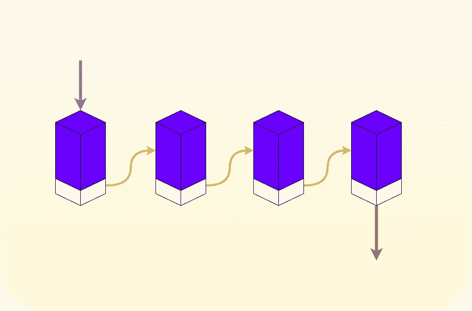
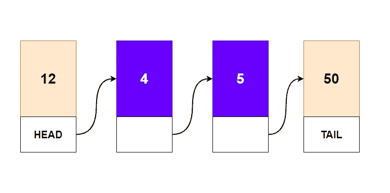
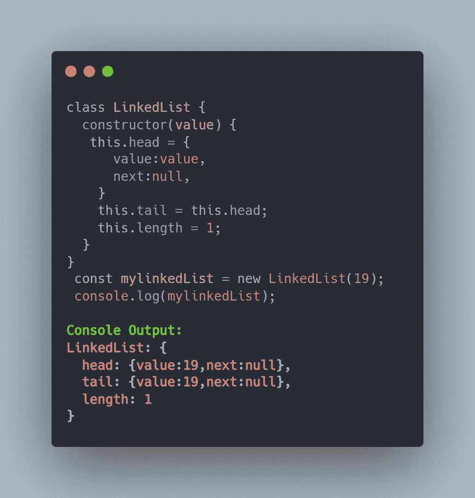
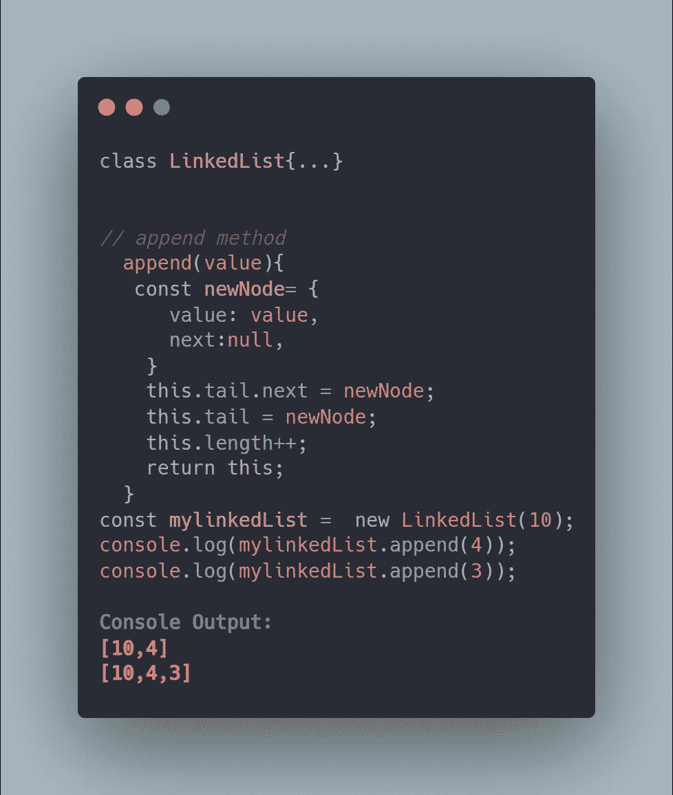
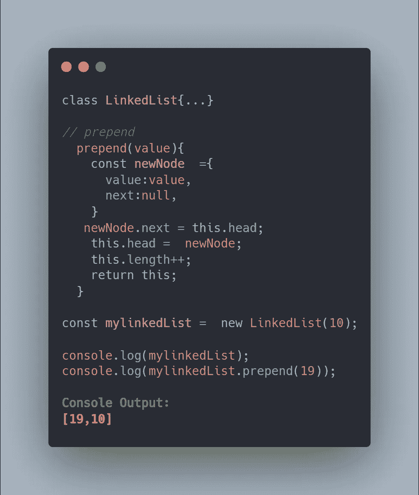
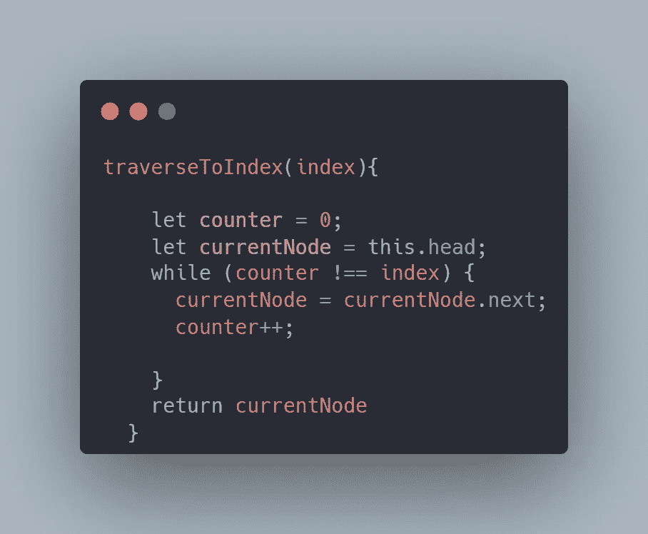
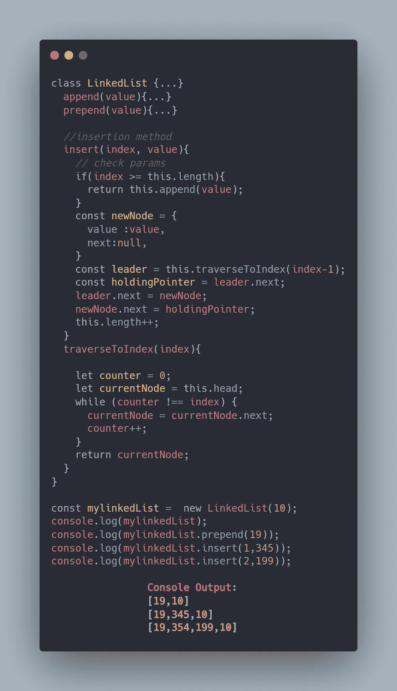
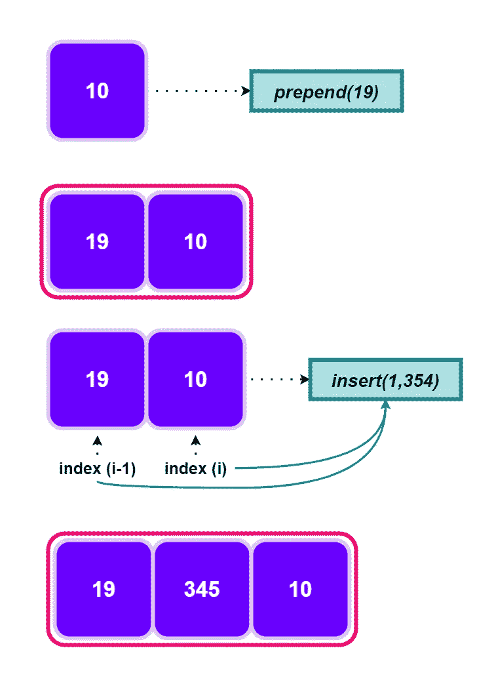

# 在 JavaScript 中使用链表

> 原文：<https://javascript.plainenglish.io/working-with-linked-lists-in-javascript-99b0278e85f2?source=collection_archive---------2----------------------->

## 关于 JavaScript 中的链表，您只需要知道

谈到数据结构，链表可不是闹着玩的，它是一种复杂的数据结构，比**数组**和**散列表**有很多优势。在 JavaScript 中，没有像在其他语言中那样内置的快捷方式来构建链表，但是，我们可以使用提供给我们的对象来创建一个链表。您还将学习如何使用更少的代码行实现一个链表，在这里您可以轻松地**追加** **前置** & **插入**项，而无需过多的代码行。

# 链接列表

业内最常用的数据结构之一，由于其优于*时间* & *空间*复杂性，它提供了一种在需要时立即存储数据和配置的极好方法。在我们开始实现部分之前，你应该知道链表是什么样子的。

***例如:***

*   你可以想象一张地铁站地图，上面每个站都有自己的名字&一个指向下一站的指针。链表非常相似，我们有一个指针来指示下一个要存储的项和值。
*   还有，起点叫做**头**，终点叫做**尾**。

# JavaScript 中的链表

JavaScript 没有内置的链表，为了建立一个链表，你必须很好地了解 JavaScript 中的**对象**和**类**如何工作。我们将使用类来构建我们的链表。此外，请注意，这可能需要一些时间来建立，但随着您的实践，它会成为第二天性。

> 为了更清楚的理解，我们将构建一个简单的有头有尾的链表。

> 注意，在我们开始之前，你必须对 *JavaScript* 中的**这个**关键字有很好的了解。

*   为了构建一个链表，我们使用一个名为 **LinkedList** 的类，它接受一个**值**，该值存储在我们的 Linked List 中。
*   另外，请注意，我们在类中使用了构造函数。
*   为了构建 Head & Tail，我们需要处理两个属性，它们将负责我们如何连接链表。这两个属性将是**value**&**next**，其中 value 是我们要存储的数据，next 是指向列表中下一个项目的指针。
*   在这个例子中，我们的链表只包含一个条目，这就是为什么头尾是相同的。
*   如您所见，属性*值*被设置为将由我们提供的值&下一个被设置为 ***null*** ，因为我们的链表在此阶段包含的条目不超过 1 个。
*   此外，我们设置了 **this.tail = this.head** ，因为在只有一项的链表中，它们是相同的。
*   在最后一步，我们必须定义链表的长度，它会随着我们添加更多的条目而不断增加。

**A Simple Linked List**

*   因此，您可以观察到，当我们输入值 **19** 时，我们能够构建一个值为 **19** 的链表，该链表具有**头** & **尾**。

## 在链接列表中追加项目

在这个阶段，我们能够建立一个链表，其中一个条目的头尾相同。下一个任务是将项目添加到链表中。注意追加条目意味着我们要在链表的尾部添加条目。

*   如果您清楚地了解事情是如何进行的，那么实现这个特性将是一件容易的事情。当追加项目时，我们的链表的尾部需要改变，我们必须改变它所保存的值和指向下一个项目的指针，如果它存在的话。

**Linked List with Append Method**

*   既然我们知道了需要改变什么，我们就可以很容易地理解 append 方法。
*   我们的 append 方法接受一个需要添加的**值**。
*   在这个阶段，我们必须构建一个新的节点来连接我们的链表，我们将一个 *const* 命名为 **newNode** ，它包含所有的初始值( **value & next** )。
*   当我们创建完一个新节点后，就该用我们新创建的 **newNode** 来更新我们的 Tail 了。
*   为了做到这一点，我们使用了 **this.tail.next** 来访问我们的 Tail &中的属性 **next** ，将其设置为等于我们的 ***newNode*** 。同样，我们需要设置 **this.tail** 到 *newNode* 作为最后一步。
*   最后，我们使用 **this.length++来增加链表的长度。**

> ***注意:*** *控制台输出以不同的方式显示，使事情看起来更容易，实际上我们在输出中仍然得到相同的对象。这个例子中显示的数组是用来显示在链表末尾插入的条目的。*

## 在链接列表中前置项目

如果你能理解上面的 append 方法，prepend 就不是一件很难理解的事情。通过一些改变，我们可以在链表中预先放置项目。

*   为了预先计划项目，我们只需与头部一起工作。在这种情况下，头部将连接到我们添加的项目。
*   当我们从前面添加项目时，新添加的项目成为**头**，我们之前的头需要相应地配置。

**Linked List With Prepend Method**

*   如您所见，我们只需对 append 方法做一些更改。 **newNode** 现在是从前面连接，这就是我们使用 **newNode.next = this.head** 的原因。使用这个，我们将我们的 ***newNode*** 连接到 ***Head*** 。
*   当 newNode 被连接时，我们必须将 Head 改为我们的 newNode，为此我们使用了 **this.head = newNode** 。
*   同样，我们使用 **this.length++增加长度。**

## 在链表中插入项目

最复杂的操作，但是如果你熟悉链表中的条目是如何添加的，这对你来说将是一个快速的任务。为了在链表中的某个位置添加条目，我们需要索引来添加条目。

> 注意，我们必须在两个项目之间添加我们的项目，为了做到这一点，我们必须选择两个索引。

*   **索引(i)** ，在这里我们要添加我们的物品。
*   **索引(i-1)** ，它将出现在索引 **i** 之前。
*   使用这种方法，我们能够保存两个索引。而且在你开始实施 ***插入*** 的方法之前，确保你能够在引擎盖下可视化这个过程，让事情变得更顺利。
*   可以看到我们的 **insert** 方法需要两个输入(***index****&****value***)才能工作。
*   在我们开始向索引添加条目之前，我们必须确保我们的参数是有效的，为此，我们使用了一个简单的 ***if 条件*** ，如果索引大于或等于链表的长度，我们将返回 ***append*** 方法。
*   与其他方法类似，我们必须创建一个带有属性的 **newNode** (值**&**下一个**)。**
*   **在这个阶段，事情很简单，很有意义，但现在我们必须看得更深一点。为了在某个索引处添加项目，我们必须从头遍历到指定的索引，这样我们就可以选择索引 **(i)** 和它之前的索引 **(i-1)** 。使用这两个索引，我们可以很容易地决定把我们的新项目放在链表中的什么位置。**
*   **在我们继续之前，看一下 **traverseToIndex** 函数，它负责挑选我们需要的索引。**

****

*   **该函数将索引作为 ***输入*** ，并在指定索引处遍历链表。此外，我们采用了 **counter = 0** ，它用于遍历&定义的 **currentNode = this.head** ，因为我们需要一个新的节点。此后，使用一个 ***while 循环*** 并保持运行，直到**计数器**等于**索引。****
*   **另外， **currentNode** 变得等于 **currentNode.next** ，我们继续递增计数器。**
*   **现在到了棘手的部分，在**索引(i)** 之前选择 ***索引*** ，这可以通过使用**this . traversetoindex(index-1)**轻松完成。**
*   **此外，我们需要选择索引 **i** ，为此，我们可以使用 **leader。接下来，**使用这种方法，我们使用一个指针，这个指针需要在我们的方法**中使用。****

****

****Insertion of Item at Index i****

*   **既然我们已经有了可以在索引上获取的指针，我们就可以轻松地添加条目了。为此，我们必须将 **leader.next** 分配给我们的**new node**&**new node . next**分配给我们的 **holdingPointer** &在最后一步增加长度。**
*   **正如你在控制台中看到的，当我们在 **1** 的索引处添加 **345** 时，它工作并且类似于 **199** 在 **2** 的索引处。**

****

> *****为了更好的理解，可以看看下面给出的可视化过程。*****

** [## 你需要知道的 6 个很棒的 JavaScript 一行程序

### 以前所未有的速度编写 JavaScript

javascript.plainenglish.io](/6-awesome-javascript-one-liners-you-need-to-know-f0e0d2694fae)  [## 作为高级开发人员，你必须知道的 3 个高级 JavaScript 概念

### 引用类型、上下文和实例化

javascript.plainenglish.io](/3-advanced-javascript-concepts-you-must-know-as-a-senior-developer-b1f4e8379305)  [## Ultra 4 分钟指南:一个新的 React Web 框架

### 解开网络捆绑

javascript.plainenglish.io](/4-minute-guide-to-ultra-a-new-react-web-framework-7f12a853f58) 

*更多内容请看*[***plain English . io***](https://plainenglish.io/)*。报名参加我们的* [***免费周报***](http://newsletter.plainenglish.io/) *。关注我们关于*[***Twitter***](https://twitter.com/inPlainEngHQ)[***LinkedIn***](https://www.linkedin.com/company/inplainenglish/)*[***YouTube***](https://www.youtube.com/channel/UCtipWUghju290NWcn8jhyAw)*[***不和***](https://discord.gg/GtDtUAvyhW) *。对增长黑客感兴趣？检查* [***电路***](https://circuit.ooo/) *。*****