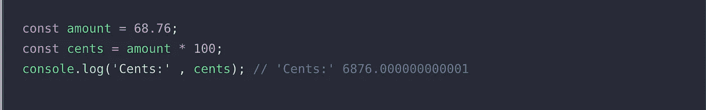
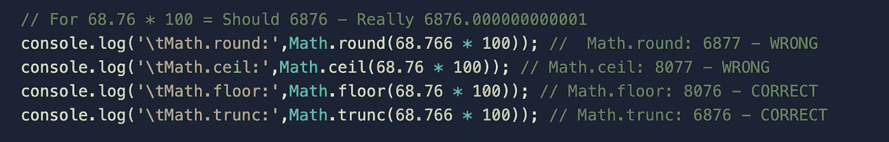
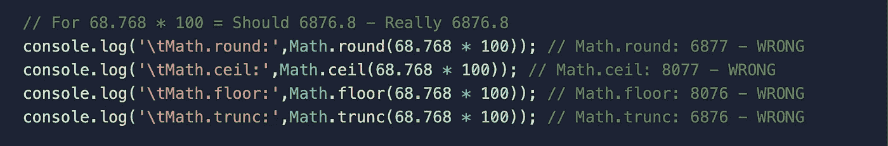
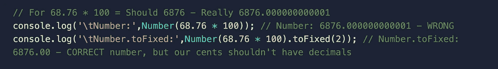
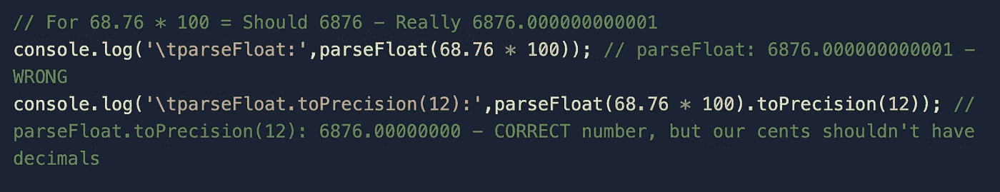
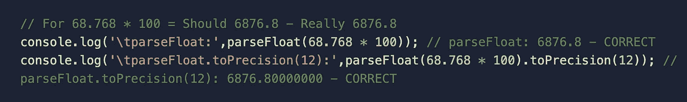
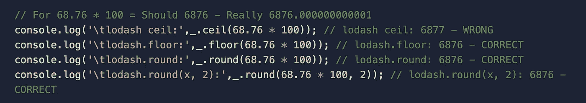
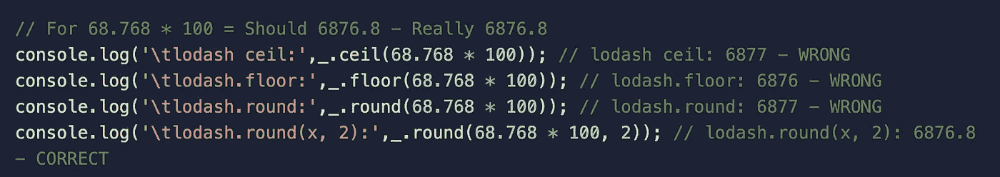
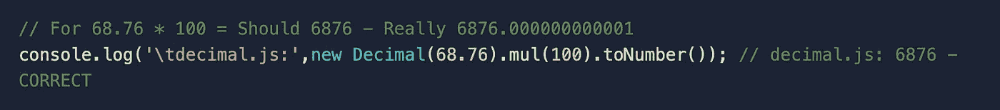
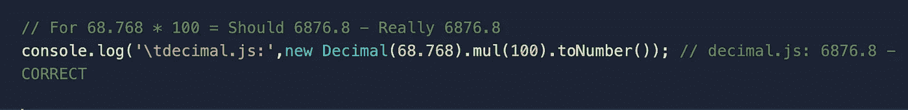

# 在 JavaScript 中使用数字

> 原文：<https://javascript.plainenglish.io/working-with-numbers-in-javascript-c8b2960bf8bb?source=collection_archive---------6----------------------->

## JavaScript 在执行计算时的问题及解决方案。

Photo by [Antoine Dautry](https://unsplash.com/@antoine1003?utm_source=medium&utm_medium=referral) on [Unsplash](https://unsplash.com?utm_source=medium&utm_medium=referral)

JavaScript 很容易学习，Node.js 是创建后端应用程序的绝佳语言。但是，容易不代表简单。正如我一直向年轻人建议的那样，学习这门语言的基础知识，了解它的优缺点，对于避免应用错误非常重要。今天，我们将看到它的一个“众所周知”的优势(或缺陷)，JavaScript，以及它执行计算的问题。

假设您有一个处理金额的应用程序(在本例中为€),对于某些操作，您希望将金额改为美分(1€ = 100 美分),因此可以想象，您唯一需要做的事情就是“金额* 100 ”,这样就可以很好地工作了。可悲的是，对我们来说，这并不简单。让我们看一个例子:

我们应该期望得到 6876，但是，我们得到的结果是 6876.00000000001。为什么会出现这种情况？。这是因为众所周知的“浮点数的陷阱”，这里[这里](https://www.codemag.com/article/1811041/JavaScript-Corner-Math-and-the-Pitfalls-of-Floating-Point-Numbers)你可以读到解释(你可以在那里搜索并找到其他解释)。

那么，我们能做些什么来避免这个错误呢？

对于不同的示例情况，我们将使用数字 68.76(代表之前评论的美分示例)和 68.768 用于其他场景。

你们中的一些人可以用“数学”对象和方法来寻找解决方案，如“[圆](https://developer.mozilla.org/es/docs/Web/JavaScript/Reference/Global_Objects/Math/round)”、“[天花板](https://developer.mozilla.org/es/docs/Web/JavaScript/Reference/Global_Objects/Math/ceil)”、“[地板](https://developer.mozilla.org/es/docs/Web/JavaScript/Reference/Global_Objects/Math/floor)”或“ [trunc](https://developer.mozilla.org/es/docs/Web/JavaScript/Reference/Global_Objects/Math/trunc) ”，但这些解决方案对一些情况有效，对另一些情况无效。让我们看几个例子:

那么使用“数字”函数呢，让我们看看:

通常不建议对基本类型使用包装对象。

如果我们使用“parseFloat”:

我们的另一个选择是在著名的库" [lodash](https://lodash.com/docs/4.17.15) "中寻找数学实用方法。让我们也来看一些例子:

正如我们所看到的，这些选项没有一个适合所有情况。幸运的是，我们可以使用几个库，它们将避免为处理这些情况而创建复杂代码的需要。一些很好的例子是 [big.js](https://mikemcl.github.io/big.js/) 和 [decimal.js](https://github.com/MikeMcl/decimal.js/) (这是我的选择)。

就我而言，当我需要进行数学运算时，我会选择 [decimal.js](https://github.com/MikeMcl/decimal.js/) 。正如你在项目的自述文件中看到的，你需要的每个数学运算都有很多不同的方法。它遵循了[流畅的接口](https://en.wikipedia.org/wiki/Fluent_interface)，所以你可以用一种实用的方式连接操作。

让我们看看前面使用 [decimal.js](https://github.com/MikeMcl/decimal.js/) 的例子，并检查它们现在都是正确的

如果你想检查这些例子，它们被保存在[这里](https://replit.com/@amcereijo/JavascriptCalculations#index.js)。

我强烈建议您深入研究一下这个库，并在每次需要用 JavaScript 执行计算时使用它。

希望这对你有帮助。您是否使用了其他库或技术来避免这一缺陷？请在评论中与我们分享。

*更多内容看* [***说白了。报名参加我们的***](http://plainenglish.io/) **[***免费周报***](http://newsletter.plainenglish.io/) *。在我们的* [***社区不和谐***](https://discord.gg/GtDtUAvyhW) *获得独家获取写作机会和建议。***