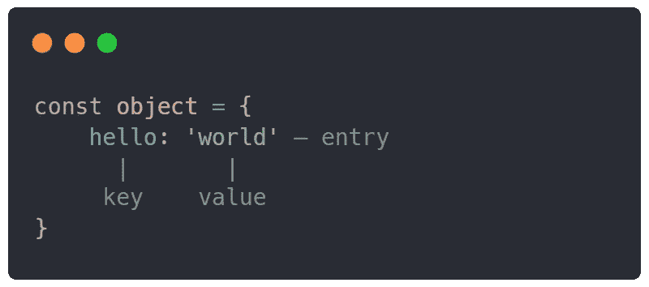

# 在 JavaScript 中使用对象

> 原文：<https://javascript.plainenglish.io/working-with-objects-in-javascript-dc969e5a8529?source=collection_archive---------6----------------------->

## Java Script 语言

## 如何在 JavaScript 中使用对象



JavaScript 对象用于在一个集合中存储更复杂的数据，而不是存储在单个数据类型的变量中。对象也可以被称为字典或数据散列表。

# 1.初始化对象

对象中的每个条目都使用键值对语法。一个对象可以在一个集合中存储多个条目。集合可以用任何减速关键字来声明(`const`、`var`、`let`)。

```
const **obj** = {
    **first_name**: 'John',
    **last_name**: 'Doe'
};
```

如果我们想给一个变量值设置一个键名，我们可以用下面的方法:

```
const **name** = 'first_name';
const **obj** = {
    [**name**]: 'John',
    **last_name**: 'Doe'
};
```

# 2.访问数据

访问 JavaScript 对象中的数据非常简单，有两种方法可以从特定的条目中检索数据。

## 可变方法

我们可以通过变量访问数据集合中的一个条目，或者用更简单的话来说，就是一个条目中存在的特定键。

```
const **obj** = { **age**: 20 };
const **age** = obj.**age**;
```

## 阵列方法

条目数据也可以通过类似数组的语法来检索。我们将使用这些括号`[]`并将我们想要访问的密钥放入其中。

```
const **age** = obj['**age**'];
```

# 3.设置数据

设置数据，类似于访问它们，以同样的两种方式完成。通过变量和数组方法。以下是两者的例子:

```
const **obj** = { **location**: 'USA' };// variable
obj.**location** = 'Mexico';// array
obj['**location**'] = 'Mexico';
```

# 4.对象方法

我已经写了一篇关于最常用和最有用的对象方法的文章，所以您可以在这里查看:

[](/4-useful-object-methods-in-javascript-57e4e95a29ac) [## JavaScript 中 4+个有用的对象方法

### 4 和更多可以在 JavaScript 中使用的有用的对象方法

javascript.plainenglish.io](/4-useful-object-methods-in-javascript-57e4e95a29ac) 

# 5.检查条目

我们可以用两种不同的方法来检查数据的对象集合是否有特定的条目。也就是在内联检查中使用对象方法。

## 内嵌检查

在内联检查中，我们使用了`in`语法，该语法返回一个布尔值，表明带有特定键的条目是否存在。

```
const **obj** = { **job**: 'Retail' };
const **hasJob** = 'job' **in** obj; // true
```

## 对象方法

我们可以使用已经实现的对象方法`.hasOwn()`,它可以确定键是否存在。这个方法有两个参数:`target`作为目标对象和`property`。

```
const **hasJob** = Object.**hasOwn**(obj, 'job'); // true
```

# 6.删除条目

对于删除条目，JavaScript 有一个保留关键字`delete`。在`delete`关键字之后，你可以放一个你想要删除的特定条目。

```
const **obj** = { **name**: 'John Doe' };
**delete** obj.name;
```

# 结论

正如我前面说过的，知道如何在 JavaScript 中使用对象是一项至关重要的知识。物品在世界范围内广泛使用，不应该被遗忘。我希望这篇文章能帮助你弄清楚 JavaScript 对象。

*更多内容请看*[***plain English . io***](https://plainenglish.io/)*。报名参加我们的* [***免费周报***](http://newsletter.plainenglish.io/) *。关注我们关于*[***Twitter***](https://twitter.com/inPlainEngHQ)*和*[***LinkedIn***](https://www.linkedin.com/company/inplainenglish/)*。查看我们的* [***社区不和谐***](https://discord.gg/GtDtUAvyhW) *加入我们的* [***人才集体***](https://inplainenglish.pallet.com/talent/welcome) *。*