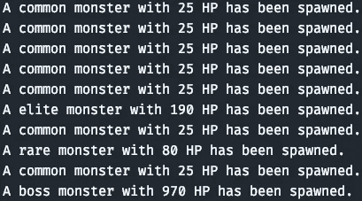

# JavaScript 的模式:由 Tower Defense Spawner 演示的工厂方法

> 原文：<https://javascript.plainenglish.io/world-of-javascript-factory-method-explained-by-tower-defense-spawner-402c69426650?source=collection_archive---------8----------------------->

## 用塔防的基础知识解释工厂的方法


Image made by the [Author](http://www.arnoldcode.com) via Canva.com

***工厂方法*** 允许你根据代码(客户端)任何其他部分的指令创建对象。客户端可能不总是能够决定实例化几个候选对象中的哪一个。

你可以将模式分为三类:创造型、结构型和行为型。这种模式被归类为创造性的。你会明白为什么。

工厂方法允许客户端委托对象创建，同时保持对实例化对象类型的控制。通过调用与`new`操作符一起使用的构造函数来创建对象。

# 何时&为什么使用工厂方法

可扩展性是工厂方法的关键。

应用程序开发人员使用工厂方法来管理、维护或操作具有许多共同点的不同对象的集合(例如，方法和属性)。设想一个包含 XML 文档、Pdf 文档和 RTF 文档的文档集合。它们可以被打开、保存、重命名、删除等等。

***因此你可以把他们的创造抽象成一种通用的方法。***

你会发现一个游戏化的例子，具有更简单的公共属性。我选择了一个怪物产卵器的例子，但稍后会有更多的例子。

# 模式概述


为了匹配模式，你需要 *3 个编码对象*:

*   ***制单人:*** 示例中编码:工厂。创建新的`monster (products)`的`factory`对象。它需要实现一个返回新创建的`monster (product)`的`FactoryMethod`。
*   ***abstract product:***由于 JavaScript 没有抽象的工作方式，所以你无法在 JavaScript 中创建抽象对象。在任何其他语言中，它会为产品声明一个接口。使用 TypesScript 启用接口。
*   ***产品:`Monster`下例中的*** 和正在创建的产品。这种模式使所有产品都支持相同的接口(属性和方法)。

# 示例 1:怪物工厂(4 种类型)


Image made by the [Author](http://www.arnoldcode.com) via Canva.com

本例使用`MonsterFactory`创建 4 种类型的`monsters`。

```
const MonsterFactory = function () {
   // ---snip---
};
```

每种怪物都有不同的生命值。*工厂*对象的`createMonster()`方法就是*工厂方法*。

```
const MonsterFactory = function () {
    this.createMonster = function (type) {
        let monster;

        switch (type) {
            case 'common':
                monster = new common();
                break;
            case 'rare':
                monster = new rare();
                break;
            case 'elite':
                monster = new elite();
                break;
            case 'boss':
                monster = new boss();
                break;
        }
        // ---snip---

        return monster;
    }
};
```

必须定义 4 种怪物类型，以便稍后以不同的方式调用它们，并单独编辑它们(当需要更改时):

```
const common = function () {
    this.hitPoints = "25";
};

const rare = function () {
    this.hitPoints = "80";
};

const elite = function () {
    this.hitPoints = "190";
};

const boss = function () {
    this.hitPoints = "970";
};
```

客户端通过向工厂方法传递一个类型参数来告诉工厂方法要创建什么类型的怪物。

```
jafactory.createMonster("common")
```

记住 Javascript 不支持抽象的类或接口。*因此 AbstractProduct(来自上图)没有实现。*

我们必须确保所有的怪物都有相同的属性和方法。

总共将创建四种不同类型的怪物，它们都存储在一个数组中。

您现在已经可以调用它并将它们打印到控制台:

```
function run() {

    var monsters = [];
    var factory = new MonsterFactory();

    monsters.push(factory.createMonster("common"));
    monsters.push(factory.createMonster("rare"));
    monsters.push(factory.createMonster("elite"));
    monsters.push(factory.createMonster("boss"));

    console.log(monsters);
}

run();
```


Console Output Example 1 Part 1

但是如果我们让他们自己说，那会更酷。您可以通过添加调整`MonsterFactory`来实现这一点:

```
const MonsterFactory = function () {
    this.createMonster = function (type) {
        let monster;

        switch (type) {
            case 'common':
                monster = new common();
                break;
            case 'rare':
                monster = new rare();
                break;
            case 'elite':
                monster = new elite();
                break;
            case 'boss':
                monster = new boss();
                break;
        }

        // add here
        monster.type = type;

        monster.info = function () {
            console.log(`Hi I am a ${this.type} monster.`);
            console.log(`I have ${this.hitPoints} hitpoints.`);
        }
        // until here

        return monster;
    }
};
```

以及`run()`功能:

```
function run() {

    var monsters = [];
    var factory = new MonsterFactory();

    monsters.push(factory.createMonster("common"));
    monsters.push(factory.createMonster("rare"));
    monsters.push(factory.createMonster("elite"));
    monsters.push(factory.createMonster("boss"));

    // add here
    for (var i = 0, len = monsters.length; i < len; i++) {
        monsters[i].info();
    }
    // until here
}
```

这将是你的输出:


Console Output Example 1 Part 2

整个示例的代码:

```
const MonsterFactory = function () {
    this.createMonster = function (type) {
        let monster;

        switch (type) {
            case 'common':
                monster = new common();
                break;
            case 'rare':
                monster = new rare();
                break;
            case 'elite':
                monster = new elite();
                break;
            case 'boss':
                monster = new boss();
                break;
        }

        monster.type = type;

        monster.info = function () {
            console.log(`Hi I am a ${this.type} monster.`);
            console.log(`I have ${this.hitPoints} hitpoints.`);
        }

        return monster;
    }
};

const common = function () {
    this.hitPoints = "25";
};

const rare = function () {
    this.hitPoints = "80";
};

const elite = function () {
    this.hitPoints = "190";
};

const boss = function () {
    this.hitPoints = "970";
};

function run() {

    var monsters = [];
    var factory = new MonsterFactory();

    monsters.push(factory.createMonster("common"));
    monsters.push(factory.createMonster("rare"));
    monsters.push(factory.createMonster("elite"));
    monsters.push(factory.createMonster("boss"));

    for (var i = 0, len = monsters.length; i < len; i++) {
        monsters[i].info();
    }
}

run();
```

# 例子 2:塔防的怪物工厂


> **塔防简单来说:**用弹丸对敌人射击。一个关卡有一条行走路线，敌人从 A 走到 b。你可以在这条路线附近放置射击塔，让行走中的敌人的生命值为零，这样他们就会死亡。然而，如果他们达到 B，你失去生命，直到你没有更多，游戏结束。敌人蜂拥而至。

现在您将看到这种模式使开发变得多么容易:

*   用几行代码产生多个敌人
*   快速修改您的代码以产生不同的结果
*   甚至更容易添加新的敌人类型到你的公鸡
*   很容易创建多个产卵行为，并在不同级别之间切换

这个例子的目标是每秒产生一个怪物，最多 10 个怪物作为一个单独的波:

*   7 常见
*   1 精英(怪物#6)
*   1 罕见(怪物#8)
*   1 个老板(怪物 10 号)

> 产卵算法是坏的，是出于教育目的:)

除了这里和那里的一些变化外，代码几乎是一样的。我将它们标记为:

```
// begin of change
changes
changes
changes
// end of change
```

## 怪物工厂

我没有用`monster.info()`，而是用了`monster.spawn()`，每个怪物都会说出自己的类型和生命值。

对于一个真正的应用程序，你可以在这里建立一些初始化例程，或者，对于一些独特的怪物，一些初始化动作。

```
const MonsterFactory = function () {
    this.createMonster = function (type) {
        let monster;

        switch (type) {
            case 'common':
                monster = new common();
                break;
            case 'rare':
                monster = new rare();
                break;
            case 'elite':
                monster = new elite();
                break;
            case 'boss':
                monster = new boss();
                break;
        }

        monster.type = type;

        // begin of change
        monster.spawn = function () {
            console.log(`A ${this.type} monster with ${this.hitPoints} HP has been spawned.`);
        }
        // end of change

        return monster;
    }
};
```

## 产品，又名怪物(不变)

```
const common = function () {
    this.hitPoints = "25";
};

const rare = function () {
    this.hitPoints = "80";
};

const elite = function () {
    this.hitPoints = "190";
};

const boss = function () {
    this.hitPoints = "970";
};
```

## 客户

客户端需要一些必要的更新来产生 10 个怪物。

您使用一个间隔持续时间为 1000 毫秒的`masterInterval`。将它保存到一个变量中可以让你稍后`clearInterval()`。否则，它将永远运行下去。

```
function run() {
    var factory = new MonsterFactory();

    // begin of change
    let counter = 0;
    const masterInterval = setInterval(() => {

        if (counter === 9) {
            factory.createMonster("boss").spawn();
        }
        else if (counter === 7) {
            factory.createMonster("rare").spawn()
        }
        else if (counter === 5) {
            factory.createMonster("elite").spawn()
        }
        else if (counter >= 0) {
            factory.createMonster("common").spawn()
        }
        counter++;
    }, 1000)

    setTimeout(() => {
        clearInterval(masterInterval)
    }, 11000)
    // end of change
}

run();
```

在 11000 毫秒的`setTimeout()`中，你可以确保产生 10 个怪物(7 个普通，1 个精英，1 个稀有，1 个 boss)。在超时内，你清除间隔，所以产卵停止，你的波发出。



Console Output of Example 2.

每秒都会出现一条新的`console.log()`语句，通知您已经生成了什么。

[***节省自己大量的时间，专注于非常重要的主题。***](https://arnoldcodeacademy.ck.page/26-web-dev-cheat-sheets)

*更多内容看* [***说白了就是 io***](https://plainenglish.io/) *。报名参加我们的* [***免费周报***](http://newsletter.plainenglish.io/) *。关注我们关于* [***推特***](https://twitter.com/inPlainEngHQ) ， [***领英***](https://www.linkedin.com/company/inplainenglish/) *，*[***YouTube***](https://www.youtube.com/channel/UCtipWUghju290NWcn8jhyAw)*[***不和***](https://discord.gg/GtDtUAvyhW) *。对增长黑客感兴趣？检查* [***电路***](https://circuit.ooo/) *。**