# 用 Stylify 写原子 CSS 像脸书

> 原文：<https://javascript.plainenglish.io/write-atomic-css-like-facebook-with-stylify-72a0fecdc5fa?source=collection_archive---------10----------------------->

## 像素完美的网页设计，原子 CSS，错位的选择器，极简输出？是🤩！

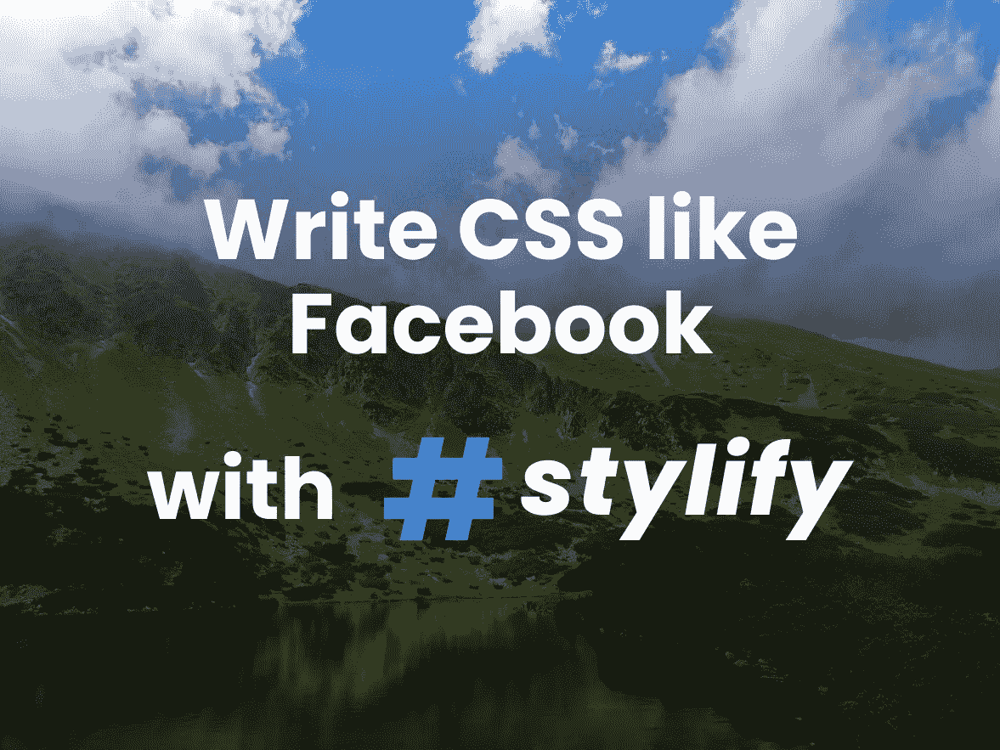

前一段时间在☕喝咖啡休息时，我一直在挖掘 Facebook 的 CSS。我检查了多个页面，从它们那里下载了 CSS，并想到了一个可以简化我编写 CSS 的方法的工具。

懒惰是一件伟大的事情。它让人们简化他们的工作，所以最终，他们什么也不用做。这也让我创造了[Stylifycss.com](https://stylifycss.com)💎。

当我一直在挖掘脸书代码时，我发现了以下内容。

HTML:

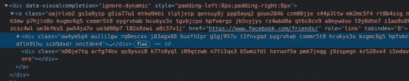

CSS:

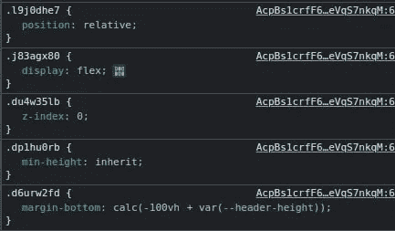

如果你仔细观察，你会发现他们使用的是原子 CSS，他们破坏了选择器。

我还找到了一篇来自脸书的文章[为新的 Facebook.com](https://engineering.fb.com/2020/05/08/web/facebook-redesign/)重建我们的技术体系，文章解释了他们为新的脸书版本做了哪些改变。这篇文章还说，在切换到原子 CSS 之前，他们一直在加载超过 400 kB 的压缩 CSS。

从我的经验来看，手动编写 CSS 只是速度慢而且耗时。组件框架很棒，直到你开始转换每个组件。Tailwind 的 JIT 已经足够接近了，但是我不喜欢当我必须记住或者搜索我想要使用的选择器的时候。我还需要更小的块，并将它们集成到现有的项目中，而不增加它们的大小。

所以目标很明确。创建一个工具，它将能够:

*   根据内容分别生成 CSS
*   轧花机选择器
*   按需生成 CSS
*   默认使用原生 CSS `properties:values`作为选择器
*   独立工作，无需捆绑器、框架和后/预处理程序

# 带有风格化的原子 CSS

Stylify 附带了[原生预置](https://stylifycss.com/docs/stylify/native-preset)，其中选择器与 CSS `property:value`相同。由于这一点，它没有必要记住或搜索选择器。本机预设是可选的，您可以定义自己的选择器。Stylify 还提供以下功能(未全部列出):

*   **小块**:可以分别为每个文件、组件、布局生成 CSS
*   **没有预生成的 CSS** :只有在内容中找到组件或选择器时，才会生成 CSS
*   尽可能在内部组合和重用选择器，以保持 CSS 较小
*   **宏**:可用于定义自定义选择器，如页边距的`m:20px`
*   **屏幕的逻辑操作数**:如`&&`和`||`屏幕组合的操作数:`sm&&tolg:font-size:24px`
*   **选择器抓取**:从长`font-weight:bold`到短`_ab`
*   不需要预处理器、后处理器或捆绑器
*   **按需生成的 CSS**:CSS 可以按需捆绑，例如在请求期间
*   因为它可以单独生成 CSS，默认情况下不会带来任何 CSS，所以它**可以很容易地集成到现有的项目中，而不会在全局范围内增加它的大小**

# 写 HTML。获取 CSS。撕裂选择器。全自动的。

以下示例及其所有代码可在[堆栈](https://stackblitz.com/edit/expressjs-bvexzl?file=index.html)中找到并编辑。

在下面的示例中，有一个简单图库图像的代码:

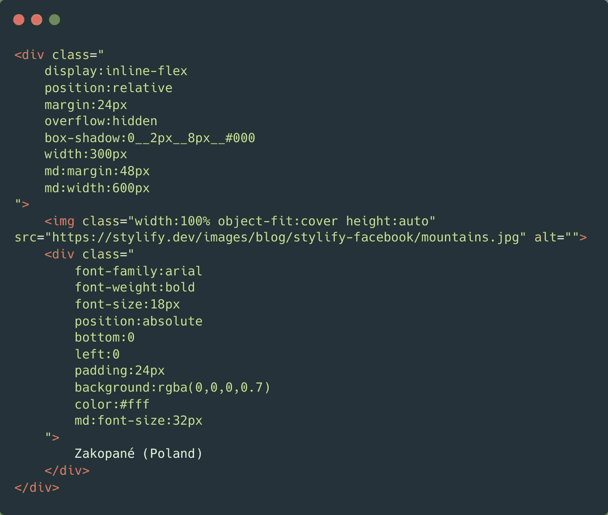

上面代码的结果将如下所示:

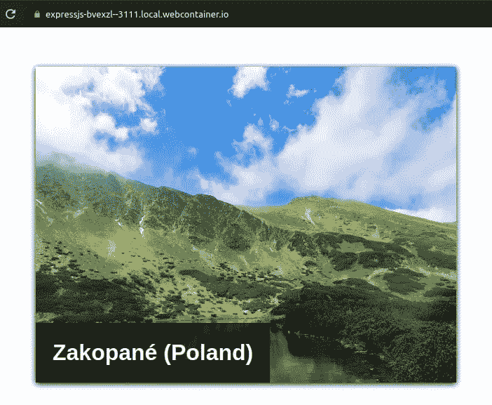

如果用纯 CSS 编写，上面的代码看起来几乎是一样的。只有`box-shadow`使用了`__`(两个下划线)而不是空格。

由于可维护性和上述代码可以在多个地方使用的事实，有必要使其更具可重用性。所以让我们定义一些组件、宏和变量！

# 清理和配置

对于上面的例子，我使用了下面的初始化，它可以在[的 StackBlitz](https://stackblitz.com/edit/expressjs-bvexzl?file=index.html) 上找到(它在 index.js 中，为了在那个环境中工作，稍微做了一些修改):

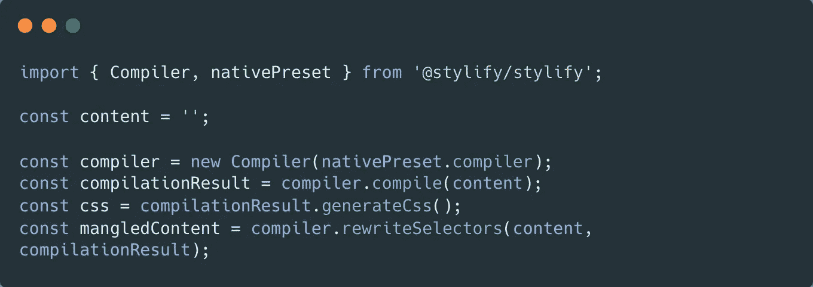

让我们首先将影子变量添加到编译器配置中:

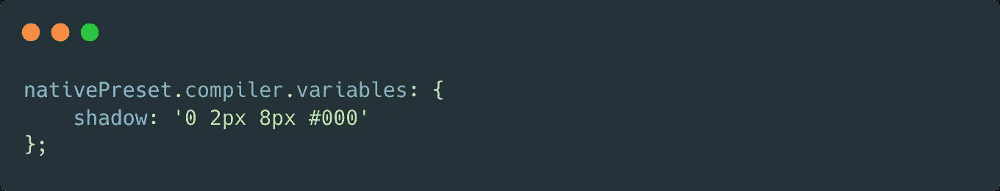

当变量被定义后，我们可以这样使用:`box-shadow:$shadow`。

不需要本机预设。您可以定义自己的选择器。例如，对于边距，它看起来像这样:

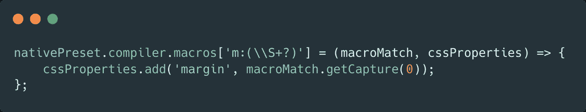

当宏被定义时，它可以与自定义值一起使用，如`m:24px`和`md:m:48px`。

如果应该在多个地方使用多个相同的选择器，那么为它们定义一个组件来简化可维护性和可读性是一个很好的做法:

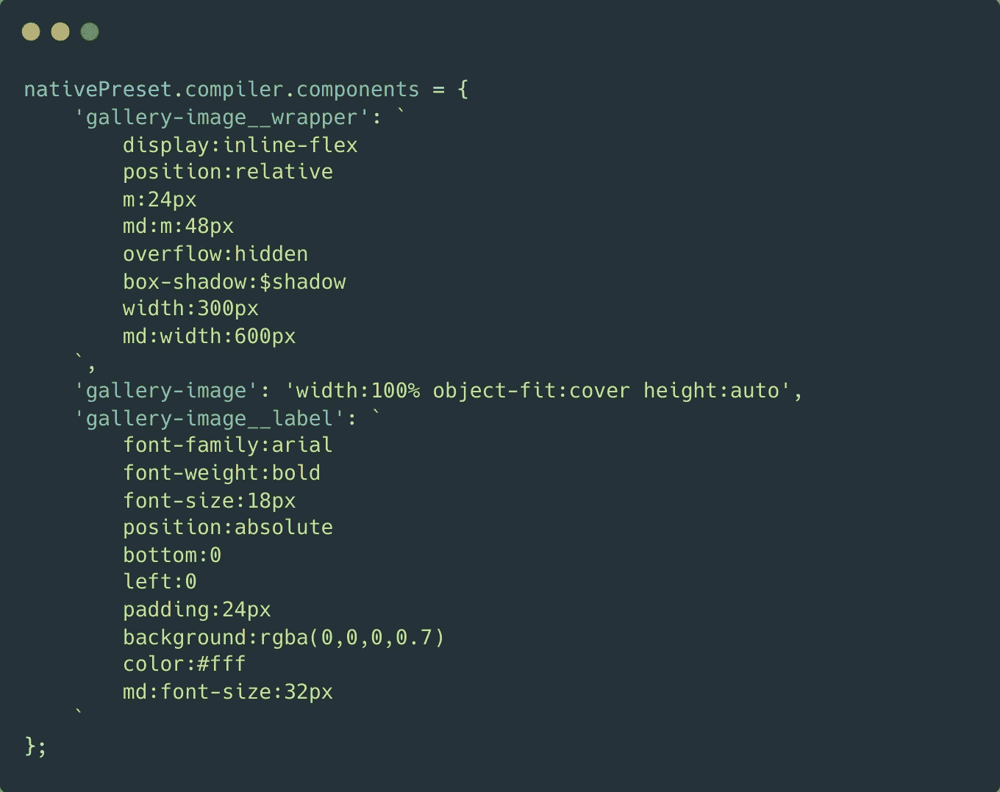

添加`box-sizing:border-box`也是一个很好的做法，以防止将来某个地方出现 wtf 时刻:

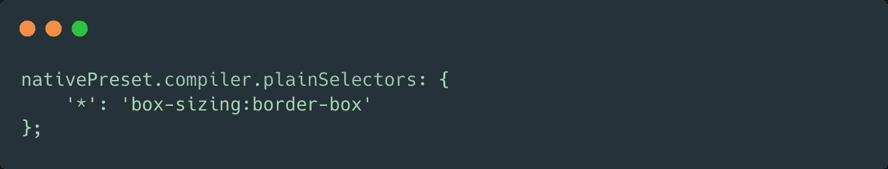

有了以上所有的改进，最终的代码要小得多:

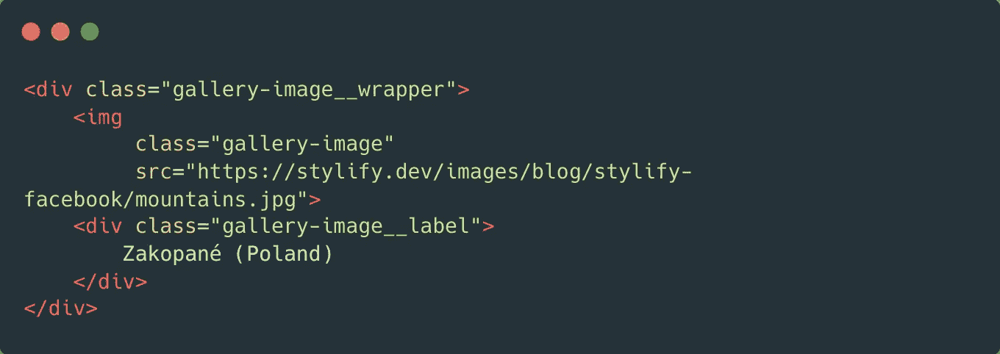

# 缩小和优化

在幕后，Stylify 以下列方式优化 CSS:

1.  只有在内容中找到选择器和组件时，才会生成它们
2.  它试图尽可能多地重用选择器
3.  它将像`font-weight:bold`这样的长选择器转换成短选择器`_ab12`

下面是 StackBlitz 经过处理和优化的输出图像。CSS(没有新的行和空格)只有 **0.78kb** :

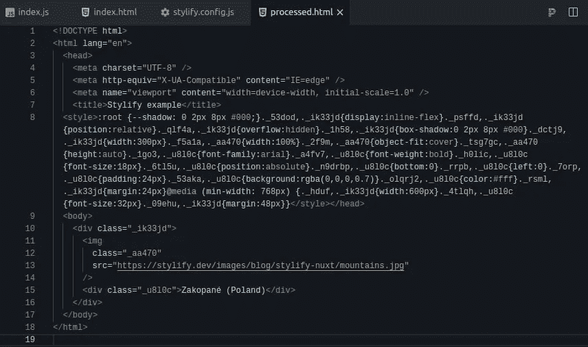

# 让我知道你的想法！

Stylify 花了一年时间开发，一个月前发布了第一个版本。
我将非常乐意接受任何反馈、问题或想法！😊。

保持联系:
👉[8 machy](https://twitter.com/8machy)👉[dev.to/machy8](https://dev.to/machy8)👉[medium.com/@8machy](https://medium.com/@8machy)

*更多内容看* [***说白了就是***](http://plainenglish.io/) *。报名参加我们的* [***免费周报***](http://newsletter.plainenglish.io/) *。在我们的* [***社区不和谐***](https://discord.gg/GtDtUAvyhW) *获得独家获取写作机会和建议。*