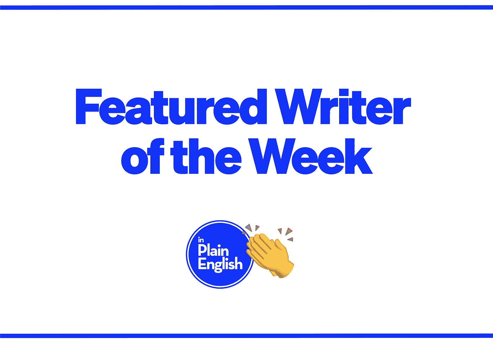

# 本周作家:卡兰·亚戈塔

> 原文：<https://javascript.plainenglish.io/writer-of-the-week-karan-jagota-96df785b9e34?source=collection_archive---------27----------------------->

*在这里的* [***说白了就是***](https://plainenglish.io) *，我们想利用尽可能多的方式来为我们敬爱的作家创作的优秀内容增加知名度。我们特别想奖励那些最近向我们的任何出版物提交了大量文章的作家。每周，我们都会选出一位作家来曝光。*

## 我们的本周作家是:[卡兰·贾戈塔](https://karanjagota.medium.com/)🎉

以下是他们上周的一些作品:

 [## 帮助开发者节省大量时间的 7 个谷歌项目

### 谷歌如何帮助开发人员创建令人惊叹的应用程序。

javascript.plainenglish.io](/7-google-projects-that-have-helped-developers-save-tons-of-time-fa8a72d9044c)  [## 你可以从有经验的多语言开发者那里学到的 3 件事

### 一位通晓多种语言的人给了我三条建议，帮助我用一种新的编程语言开发一个系统。

javascript.plainenglish.io](/3-things-you-can-learn-from-experienced-polyglot-developers-fba6fabd54c)  [## 每个开发人员现在都应该知道的 7 种高级 JavaScript 技术(包括代码)

### 用这篇文章测试你的 JavaScript 知识。

javascript.plainenglish.io](/7-advanced-javascript-techniques-every-developer-should-know-by-now-including-code-4572d5d7a060)  [## 帮助开发人员节省大量时间的 7 个元项目

### Meta 如何帮助网络和移动应用开发者。

javascript.plainenglish.io](/7-meta-projects-that-have-helped-developers-save-tons-of-time-5a5d25d2ce09)  [## 让没有经验的自学成才的开发人员成为最佳的 3 个奇怪标志

### 这些标志说明了它们的优秀。

javascript.plainenglish.io](/3-weird-signs-that-make-inexperienced-self-taught-developers-the-best-17bf0cea3d91)  [## 像专家一样为你的 JavaScript 项目创建一个配置文件

### 为什么我们需要一个配置文件，如何创建它？

javascript.plainenglish.io](/create-a-config-file-for-your-javascript-project-like-a-pro-42d098a43179) 

要想有机会在下周被特别报道，你所要做的就是向我们的四个出版物中的任何一个提交内容。你提交的内容越多，你就越有可能被关注。

有兴趣加入我们的写作团队吗？在这里了解更多**:**

* [## 如何用简单的英语写作

### 你对 JavaScript、Web 开发、软件开发、Python、AWS 或人工智能有热情吗？

javascript.plainenglish.io](/https-medium-com-javascript-in-plain-english-join-our-team-b0854ead7d14)*