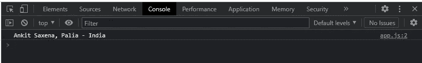

# 如何在 JavaScript 中为 call()、apply()和 bind()方法编写 polyfills

> 原文：<https://javascript.plainenglish.io/writing-polyfills-for-call-apply-and-bind-methods-in-javascript-13b4ba313273?source=collection_archive---------0----------------------->


Photo by [Kevin Ku](https://unsplash.com/@ikukevk?utm_source=medium&utm_medium=referral) on [Unsplash](https://unsplash.com?utm_source=medium&utm_medium=referral)

在 JavaScript 中，`call()`、`apply()`和`bind()`方法用于函数借用。这意味着通过使用它们，我们可以在不同的对象上使用一个对象的方法，而不必复制那个方法并在两个不同的地方维护它。

假设我们有一个带有属性**名字** & **姓氏**的对象**我的名字**和一个打印名字和姓氏的函数`**printName()**`，如下所示:

我们想借用`**printName()**`函数来打印 **myName** 对象的名字和姓氏属性。让我们了解一下如何使用`call()`、`apply()`和`bind()`方法来实现。

# 呼叫方法

使用`call()`，我们可以为 myName 对象借用`printName()`函数，如下所示:

```
printName.call(myName, "Palia", "India");
```

第一个参数是上下文或所有者对象(即我们例子中的 myName)。其余的值(“Palia”和“India”)是`printName()`函数接受的额外参数。

***输出:***



## call()的 Polyfill:

JavaScript 中的每个函数都可以访问这些`call()`、`apply()`和`bind()`方法。同样，JavaScript 中的每个函数都应该可以访问我们的`myCall`方法。这可以通过将 myCall 函数放在函数原型中来实现。

```
eg. Function.prototype.myCall = function(){}
```

用于`call()`的简单聚合填充:

```
Function.prototype.myCall = function(context, ...args){
    context.myFn = this;
    context.myFn(...args);
}printName.myCall(myName, "Palia", "India");
```

以上代码是`call()`方法的简单多项填充。这里**上下文**指向 **myName** 对象，而 **this** 关键字指向`**printName()**`函数。函数定义中的参数 **…arg** s 表示我们在使用`**myCall**`方法时可以传递的所有额外参数(例如城市和国家)。

我们在这里所做的就是将`**printName()**`函数作为属性( **myFn** )分配给 **myName** 对象并执行它。但这不是一个完整的解决方案。如果属性 **myFn** 已经存在于 **myName** 中怎么办？我们会改写它。所以我们需要确保我们正在使用的属性的名称是唯一的。

全填充:

在上面的代码中，我们使用`Math.random()`生成一个随机属性(以确保该属性是惟一的)。

# 运用方法

`call()`和`apply()`方法之间唯一的区别是`call()`方法单独接受参数，而`apply()`方法以数组的形式接受参数。参见下面的例子。

```
printName.apply(myName, ["Palia", "India"]);
```

## 应用的聚合填充():

如你所见，`apply()`的聚合填充与`call()`的聚合填充几乎相同。唯一的区别是我们在函数定义中没有将 **…args** 作为参数。我们只有一个 args 参数，因为它是一个数组/列表。

# 绑定方法

`bind()`方法不是直接调用`printName()`方法，而是返回一个函数，我们可以在以后调用它。


上下文和参数被保留。`bind()`函数的美妙之处在于，您甚至可以向返回的函数传递一些/更多的参数(在我们的例子中就是`result()`)。

```
const result = printName.bind(myName, "Palia");
result("India");
```

## 绑定的聚合填充():

这里，**这个**关键字指向了`**printName()**`函数。变量 **args[0]** 是传递给我们的`myBind()`方法(即 myName 对象)的第一个参数，而 **ctx** 包含传递给我们的`myBind()`方法的所有其他参数。参数**…一个**包含所有可以传递给`result2()`方法的参数。最后，我们使用`**call()**`方法调用 `**printName()**`函数，将 **myName** 对象作为上下文，并将所有参数组合在一起。

# 视频解释:

*更多内容请看*[***plain English . io***](https://plainenglish.io/)*。报名参加我们的* [***免费周报***](http://newsletter.plainenglish.io/) *。关注我们关于*[***Twitter***](https://twitter.com/inPlainEngHQ)*和*[***LinkedIn***](https://www.linkedin.com/company/inplainenglish/)*。加入我们的* [***社区不和谐***](https://discord.gg/GtDtUAvyhW) *。*