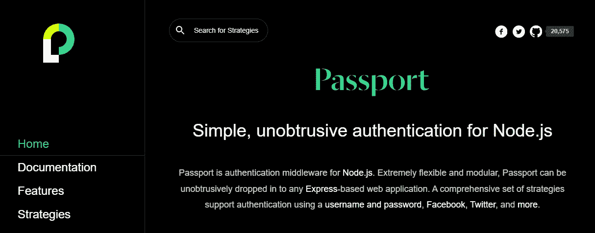

# 9 强大的 Node.js 工具在 2022 年成为更好的开发者

> 原文：<https://javascript.plainenglish.io/x-powerful-nodejs-tools-to-become-a-better-developer-in-2022-ec83ff1bb67d?source=collection_archive---------4----------------------->

## 您应该了解这些有用的 Node.js 工具，以成为一名优秀的开发人员。

Photo by [Nicole Wolf](https://unsplash.com/@joeel56?utm_source=medium&utm_medium=referral) on [Unsplash](https://unsplash.com?utm_source=medium&utm_medium=referral)

Node.js 是一个非常流行和有价值的开发运行时，你可以作为一个开发者使用。如今，数百万的网站和应用程序都在使用它，这是有原因的。

Node.js 是软件开发行业十大最流行的技术之一。这项有用的技术使用了同样用于谷歌浏览器的 V8 引擎。Node.js 的好处是它可以快速运行和处理许多同时进行的连接。

因此，这使得应用程序的可扩展性变得容易。现在 Node.js 有很多好处。它使程序非常简单，不会阻塞任何请求。除此之外，它很容易学习，因为它基于 JavaScript。因此，您可以将 JavaScript 用于应用程序的前端和后端。

在运行时使用 Node.js 的另一个好处是它有一个包管理器(NPM ),这个包管理器附带了成千上万的开源工具和模块，可以帮助您进行开发并提高您的工作效率。

因此，在本文中，我将为您提供一个强大的 Node.js 工具列表，您应该在 2022 年使用这些工具。让我们开始吧。

# 1.表达

[Express](https://expressjs.com/) 是您可以在项目中使用的最有用和最流行的 Node.js 框架之一。这个强大的框架的好处在于它的简单性。

Capture by the author from ExpressJS.

对于创建强大的移动和网络应用程序，ExpressJS 有很多有用的特性。您可以轻松集成一个数据库、多个路由、模板引擎等。

# 2.巴比伦式的城市

当使用 Node.js 时，[巴贝尔](https://babeljs.io/)会非常有用，因为它可以让您轻松地将您的 ES6+ JavaScript 代码转换成向后兼容的版本。

Capture by the author from Babel.

因此，巴贝尔是一个很好的 JavaScript 编译器，它会将您所有的现代代码编译成浏览器可以理解的另一个版本的代码。

# 3.蓝鸟

如果你想更容易地编写 Node.js 应用程序， [Bluebird](http://bluebirdjs.com/docs/getting-started.html) 是一个很好的 JavaScript 承诺库，可以帮助你。它附带了“promisify”的概念，允许异步使用其他节点模块。

Capture by the author from BlueBirdJS.

# 4.拱顶石

[Keystone](https://keystonejs.com/) 是一个非常有用的框架和开发工具，用于 API 和 Node.js 数据库驱动的 web 应用程序。它也被认为是一个 CMS，因为它为您提供了管理网站所需的所有功能，并为您的前端提供了一个理想的后端。

Capture by the author from Keystone.

Keystone 的好处在于它为您提供了所有需要的后端，让您可以专注于用户界面和前端。

# 5.Socket.io

两台设备之间的实时双向通信是 web 应用程序的重要特性之一。尤其是在聊天应用方面。

这就是 [Socket.io](https://socket.io/) 发挥作用的原因。这是一个非常棒的 Node.js 框架，用于实时和双向通信，可以在任何设备或平台上很好地工作。除此之外，这个框架对于您的应用程序来说也是非常可扩展和高性能的。

Capture by the author from Socket.io.

# 6.流星

[Meteor](https://www.meteor.com/) 是另一个流行且有用的 JavaScript 原型框架，用于跨平台编码(Android、Web、IOS)。它构建在 Node.js 之上，可以帮助您无缝地用 JavaScript 部署或构建应用程序。

Capture by the author from Meteor.

# 7.护照

[Passport](https://www.passportjs.org/) 是 Node.js 的一个中间件，简单明了，隐蔽的认证。它提供了 300 多种解决方案，比如登录，用户名和密码方法，以及更多用于认证你的应用的方法。

Capture by the author from PassportJS.

# 8.PM2

如果你想消除与在 Docker 容器中运行 Node.js 应用相关的大部分挑战和问题，那么 [MP2](https://pm2.keymetrics.io/) 是一个很好的流程管理工具，可以帮助你做到这一点。

Capture by the author from PM2.

其中，它提供了广泛的负载平衡、应用程序集群、热重装日志管理、容器集成和关键参数监控。

# 9.柴网

对于几乎所有其他类型的测试工具，您可以利用 [Chai.js](https://www.chaijs.com/) ，它是用于 TDD 和 BDD 的 Node.js 断言库。您可以借助 Chai.js 来确认异步测试的结果。

Capture by the author from Chai assertion library.

此外，Chai 可以通过 Node.js 或 web 浏览器启动，其众多插件充当断言工具。

# 结论

正如你在上面的列表中看到的，这些是一些有用的 Node.js 工具，当你作为一个开发者开发网站和网络应用时，你可以使用它们。

这些工具非常有助于使 Node.js 开发变得更加容易，并且在编码时还能提高生产率。

*感谢您阅读本文。此外，如果您发现我的内容有用，而您不是媒体会员，您可以在此处获取您的媒体会员资格***(媒体推荐链接)以获得无限制的* ***访问媒体上的所有内容*** *并支持我们作为作家。**

* [## 通过我的推荐链接加入 Medium-Mehdi Aoussiad

### 阅读 Mehdi Aoussiad(以及媒体上成千上万的其他作家)的每一个故事。您的会员费直接支持…

mehdiouss.medium.com](https://mehdiouss.medium.com/membership) 

**更多阅读:**

 [## 2022 年为每个 Web 开发者提供 10 个令人敬畏的 API

### 一个非常有用的 API 列表，您可以在下一个 web 项目中使用。

blog.devgenius.io](https://blog.devgenius.io/10-awesome-apis-for-every-web-developer-in-2022-be1a7acb73ad)  [## 2022 年你应该知道的 10 个强大的反应工具

### 牛逼的 React 开发者工具，帮你为项目写干净的代码。

javascript.plainenglish.io](/10-powerful-react-tools-that-you-should-know-in-2022-76efa7fa711d) 

*更多内容看* [***说白了。报名参加我们的***](https://plainenglish.io/) **[***免费周报***](http://newsletter.plainenglish.io/) *。关注我们关于* [***推特***](https://twitter.com/inPlainEngHQ)[***LinkedIn***](https://www.linkedin.com/company/inplainenglish/)*[***YouTube***](https://www.youtube.com/channel/UCtipWUghju290NWcn8jhyAw)*[***不和***](https://discord.gg/GtDtUAvyhW) *。******