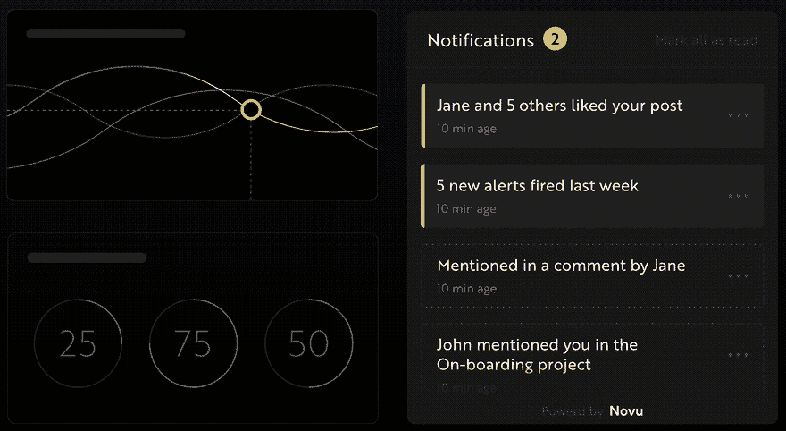
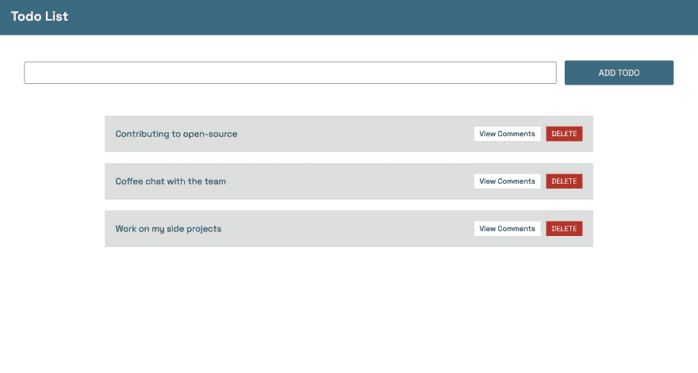
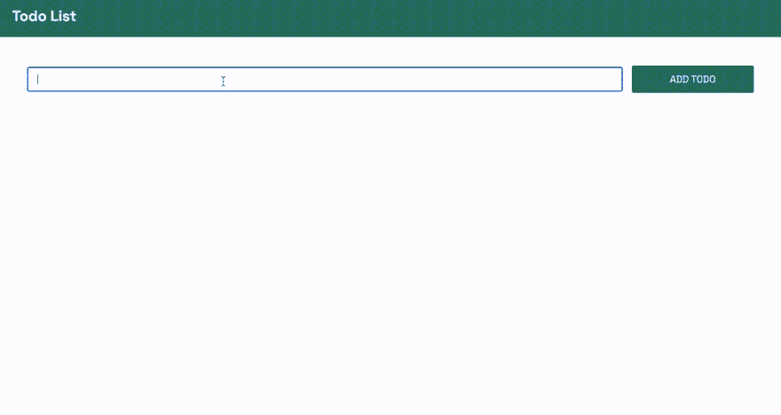
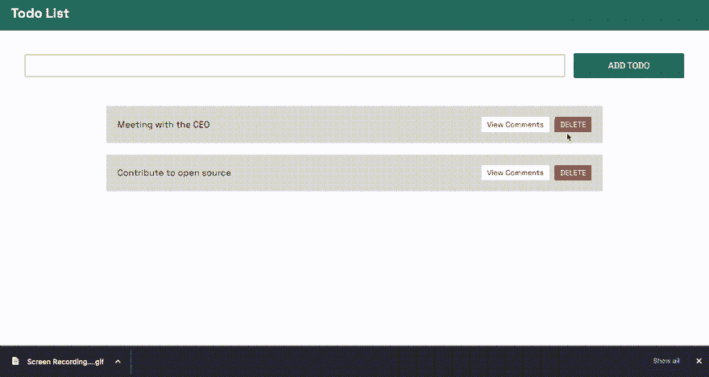
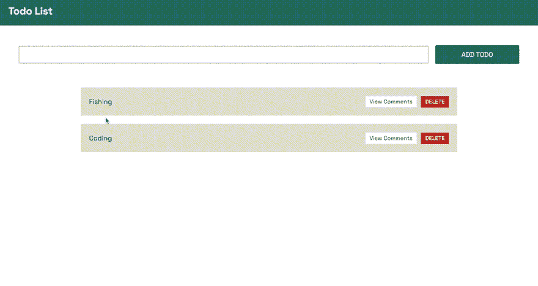
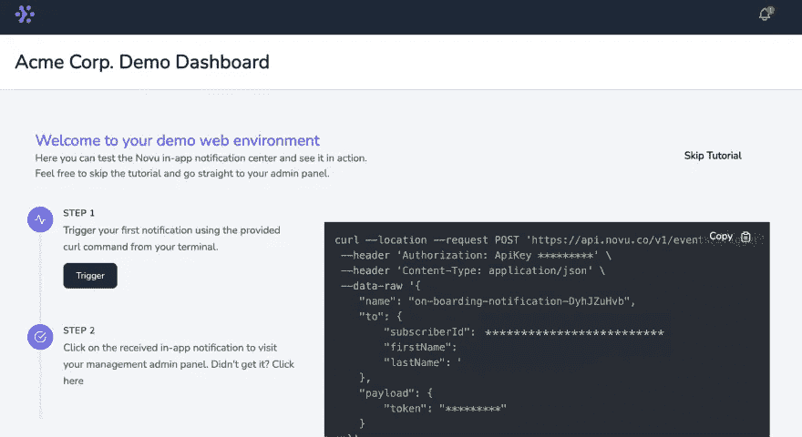
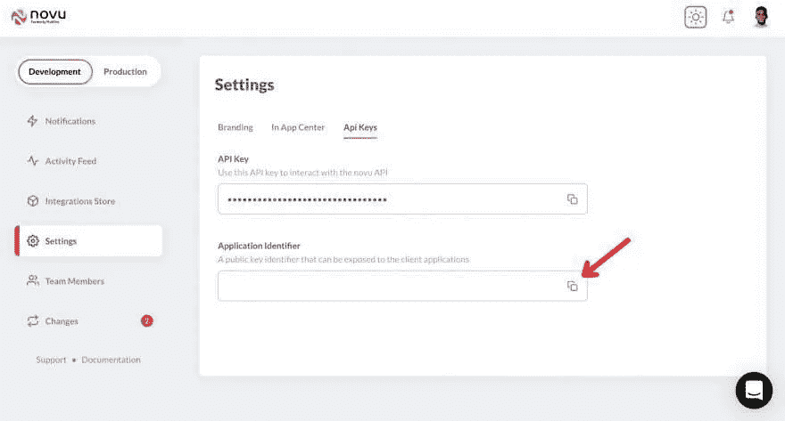
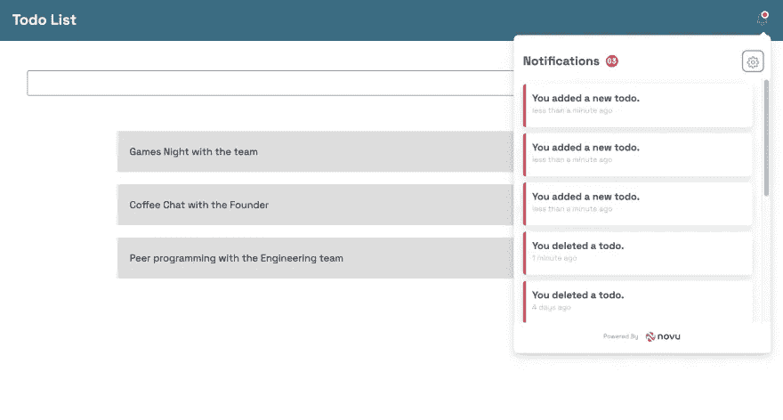

# 用 React & Websockets 构建最实用的待办事项列表

> 原文：<https://javascript.plainenglish.io/xd-4c3ddb22e2cf?source=collection_archive---------5----------------------->

## 如何用 React.js 和 Socket.io 构建团队待办事项列表创建、读取、删除待办事项并通过 Socket.io 为每个待办事项添加评论创建或删除待办事项时向应用程序添加通知。

# 这篇文章是关于什么的？

在本文中，您将了解如何使用 React.js 和 Socket.io 构建团队待办事项列表。用户可以通过 Socket.io 创建、读取和删除待办事项，并为每个待办事项添加评论。您还将了解如何在创建或删除待办事项时向应用程序添加通知。


# novu——第一个开源通知基础设施

简单介绍一下我们的背景。Novu 是第一个开源的[通知基础设施](https://novu.co/)。我们基本上帮助管理所有的产品通知。它可以是**应用内**(就像你在开发社区中看到的铃铛图标— **Websockets** )、电子邮件、短信等等。

如果你能给我们一颗星星，我会非常高兴！这将帮助我每周写更多的文章🚀
[https://github.com/novuhq/novu](https://github.com/novuhq/novu)



我们还将在 Hacktoberfest 期间送出一些精美礼品😇

# Socket.io 是什么？

[Socket.io](https://socket.io/) 是一个流行的 JavaScript 库，它允许我们在 web 浏览器和 Node.js 服务器之间创建实时的双向通信。这是一个高性能和可靠的库，旨在以最小的延迟处理大量数据。它遵循 WebSocket 协议，并提供更好的功能，例如回退到 HTTP 长轮询或自动重新连接，这使我们能够构建高效的实时应用程序。

# 如何用 React & Socket.io 创建实时连接

在这里，我们将为待办事项列表应用程序设置项目环境。您还将学习如何将 Socket.io 添加到 React 和 Node.js 应用程序中，并通过 Socket.io 连接两个开发服务器进行实时通信。

创建包含两个子文件夹`client`和`server`的项目文件夹。

```
mkdir todo-list
cd todo-list
mkdir client server
```

通过终端导航到客户端文件夹，创建一个新的 React.js 项目。

```
cd client
npx create-react-app ./
```

安装 Socket.io 客户端 API 和 React 路由器。 [React Router](https://reactrouter.com/docs/en/v6) 是一个 JavaScript 库，使我们能够在 React 应用程序的页面之间导航。

```
npm install socket.io-client react-router-dom
```

从 React app 中删除 logo、测试文件等多余文件，更新`App.js`文件，显示如下`Hello World`。

```
function App() {
    return (
        <div>
            <p>Hello World!</p>
        </div>
    );
}
export default App;
```

导航到服务器文件夹并创建一个`package.json`文件。

```
cd server & npm init -y
```

安装 Express.js、CORS、Nodemon 和 Socket.io 服务器 API。

[Express.js](https://expressjs.com/) 是一个快速、极简的框架，为在 Node.js 中构建 web 应用程序提供了几个特性。 [CORS](https://www.npmjs.com/package/cors) 是一个 Node.js 包，允许不同域之间的通信。

[Nodemon](https://www.npmjs.com/package/nodemon) 是一个 Node.js 工具，在检测到文件变化后自动重启服务器，而 [Socket.io](https://socket.io/docs/v4/server-api/) 允许我们在服务器上配置一个实时连接。

```
npm install express cors nodemon socket.io
```

创建一个`index.js`文件 web 服务器的入口点。

```
touch index.js
```

使用 Express.js 设置一个简单的 Node.js 服务器。当您在浏览器中访问`http://localhost:4000/api`时，下面的代码片段会返回一个 JSON 对象。

```
//👇🏻index.js
const express = require("express");
const app = express();
const PORT = 4000;app.use(express.urlencoded({ extended: true }));
app.use(express.json());app.get("/api", (req, res) => {
    res.json({
        message: "Hello world",
    });
});app.listen(PORT, () => {
    console.log(`Server listening on ${PORT}`);
});
```

导入 HTTP 和 CORS 库，以允许客户端和服务器域之间的数据传输。

```
const express = require("express");
const app = express();
const PORT = 4000;app.use(express.urlencoded({ extended: true }));
app.use(express.json());//👇🏻 New imports
const http = require("http").Server(app);
const cors = require("cors");app.use(cors());app.get("/api", (req, res) => {
    res.json({
        message: "Hello world",
    });
});http.listen(PORT, () => {
    console.log(`Server listening on ${PORT}`);
});
```

接下来，将 Socket.io 添加到项目中，以创建实时连接。在`app.get()`
块之前，复制下面的代码。

```
//👇🏻 New imports
.....
const socketIO = require('socket.io')(http, {
    cors: {
        origin: "http://localhost:3000"
    }
});//👇🏻 Add this before the app.get() block
socketIO.on('connection', (socket) => {
    console.log(`⚡: ${socket.id} user just connected!`); socket.on('disconnect', () => {
      socket.disconnect()
      console.log('🔥: A user disconnected');
    });
});
```

从上面的代码片段来看，`socket.io("connection")`函数与 React 应用程序建立连接，然后为每个套接字创建一个唯一的 ID，并在用户访问网页时将该 ID 记录到控制台。

当您刷新或关闭网页时，套接字触发 disconnect 事件，表明用户已从套接字断开连接。

通过将 start 命令添加到`package.json`文件中的脚本列表来配置 Nodemon。下面的代码片段使用 Nodemon 启动服务器。

```
//👇🏻 In server/package.json"scripts": {
    "test": "echo \"Error: no test specified\" && exit 1",
    "start": "nodemon index.js"
  },
```

现在，您可以使用下面的命令运行带有 Nodemon 的服务器。

```
npm start
```

# 构建用户界面

这里，我们将为待办事项列表应用程序创建用户界面。用户将能够登录，添加和删除待办事项，并为每个待办事项添加评论。

导航到`client/src`文件夹，创建一个包含`Home.js`和`Main.js`文件的组件文件夹。

```
cd client
mkdir components
cd components
touch Home.js Main.js
```

更新`App.js`文件，通过 React Router 在不同的路径上渲染新创建的组件。

```
import React from "react";
import socketIO from "socket.io-client";
import { BrowserRouter, Routes, Route } from "react-router-dom";
import Main from "./components/Main";
import Home from "./components/Home";const socket = socketIO.connect("http://localhost:4000");const App = () => {
    return (
        <BrowserRouter>
            <Routes>
                <Route path='/' element={<Home />} />
                <Route path='/app' element={<Main socket={socket} />} />
            </Routes>
        </BrowserRouter>
    );
};export default App;
```

导航到`src/index.css`文件并复制下面的代码。它包含了设计这个项目所需的所有 CSS。

```
@import url("https://fonts.googleapis.com/css2?family=Space+Grotesk:wght@300;400;500;600;700&display=swap");
* {
    box-sizing: border-box;
    margin: 0;
    padding: 0;
    font-family: "Space Grotesk", sans-serif;
}
.navbar {
    width: 100%;
    height: 10vh;
    background-color: #256d85;
    display: flex;
    align-items: center;
    justify-content: space-between;
    padding: 0 20px;
    color: #dff6ff;
}
.form {
    width: 100%;
    min-height: 20vh;
    display: flex;
    align-items: center;
    justify-content: center;
    padding: 0 30px;
}
.input {
    padding: 10px 15px;
    width: 80%;
    margin-right: 15px;
}
.form__cta,
.home__form > button {
    width: 200px;
    cursor: pointer;
    padding: 10px;
    height: 45px;
    font-size: 16px;
    background-color: #256d85;
    color: #dff6ff;
    border: none;
    outline: none;
    border-radius: 3px;
}
.todo__container {
    width: 100%;
    display: flex;
    align-items: center;
    flex-direction: column;
    min-height: 300px;
}
.todo__item {
    display: flex;
    align-items: center;
    width: 70%;
    padding: 20px;
    background-color: #ddd;
    margin: 10px 0;
    justify-content: space-between;
    color: #06283d;
}.deleteBtn {
    padding: 5px 10px;
    background-color: rgb(202, 22, 22);
    border: none;
    outline: none;
    color: #fff;
    cursor: pointer;
}
.deleteBtn:hover {
    color: rgb(202, 22, 22);
    background-color: #fff;
}
.commentsBtn {
    padding: 5px 10px;
    margin-right: 10px;
    outline: none;
    cursor: pointer;
    border: none;
    background-color: #fff;
}
.commentsBtn:hover {
    background-color: #ddd;
    border: 1px solid #000;
}
.modal {
    min-height: 100vh;
    width: 100%;
    position: fixed;
    top: 0;
    background-color: #fff;
    display: flex;
    align-items: center;
    justify-content: center;
}
.modal__container {
    width: 70%;
    background-color: #fff;
    min-height: 80vh;
    padding: 30px;
    border-radius: 3px;
    border: 1px solid #333;
}
.modal__container > h3 {
    margin-bottom: 30px;
}
.comment__form {
    display: flex;
    margin-bottom: 30px;
    align-items: center;
}
.comment__form > input {
    padding: 10px;
    border: 1px solid #256d85;
    width: 70%;
    margin-right: 20px;
}
.comment {
    margin-bottom: 5px;
}
.comment__form > button {
    padding: 15px 20px;
    cursor: pointer;
    background-color: #256d85;
    color: #fff;
    outline: none;
    border: none;
    height: 45px;
}
.home {
    width: 100%;
    min-height: 100vh;
    display: flex;
    flex-direction: column;
    align-items: center;
    justify-content: center;
}
.home__form {
    width: 100%;
    display: flex;
    flex-direction: column;
    align-items: center;
}
.home__form > * {
    margin-bottom: 10px;
}
.home > h2 {
    margin-bottom: 15px;
}
```

# 主页

在这里，应用程序接受用户名，并将其保存在本地存储中以供用户识别。将下面的代码复制到 Home 组件中。

```
import React, { useState } from "react";
import { useNavigate } from "react-router-dom";const Home = () => {
    const [username, setUsername] = useState("");
    const navigate = useNavigate(); const handleSubmit = (e) => {
        e.preventDefault();
        localStorage.setItem("_username", username);
        //👇🏻 Navigates to the application
        navigate("/app");
    };
    return (
        <div className='home'>
            <h2>Sign in to your todo-list</h2>
            <form onSubmit={handleSubmit} className='home__form'>
                <label htmlFor='username'>Your Username</label>
                <input
                    value={username}
                    required
                    onChange={(e) => setUsername(e.target.value)}
                    className='input'
                />
                <button>SIGN IN</button>
            </form>
        </div>
    );
};export default Home;
```

# 主要成分

这里，我们将为应用程序的核心部分构建用户界面。



将下面的代码片段复制到`Main.js`文件中。

```
import React, { useState } from "react";
import Nav from "./Nav";function Main({ socket }) {
    const [todo, setTodo] = useState(""); //👇🏻 Generates a random string as the todo ID
    const generateID = () => Math.random().toString(36).substring(2, 10); const handleAddTodo = (e) => {
        e.preventDefault();
    //👇🏻 Every todo has this structure - id, todo & comments.
        console.log({
            id: generateID(),
            todo,
            comments: [],
        });
        setTodo("");
    }; return (
        <div>
            <Nav />
            <form className='form' onSubmit={handleAddTodo}>
                <input
                    value={todo}
                    onChange={(e) => setTodo(e.target.value)}
                    className='input'
                    required
                />
                <button className='form__cta'>ADD TODO</button>
            </form> <div className='todo__container'>
                <div className='todo__item'>
                    <p>Contributing to open-source</p>
                    <div>
                        <button className='commentsBtn'>View Comments</button>
                        <button className='deleteBtn'>DELETE</button>
                    </div>
                </div> <div className='todo__item'>
                    <p>Coffee chat with the team</p>
                    <div>
                        <button className='commentsBtn'>View Comments</button>
                        <button className='deleteBtn'>DELETE</button>
                    </div>
                </div> <div className='todo__item'>
                    <p>Work on my side projects</p>
                    <div>
                        <button className='commentsBtn'>View Comments</button>
                        <button className='deleteBtn'>DELETE</button>
                    </div>
                </div>
            </div>
        </div>
    );
}export default Main;
```

上面的代码片段代表了一个用户界面，它使用户能够创建待办事项、查看评论和删除现有的待办事项。

`Nav`组件是应用程序的导航栏——在本教程的后面，我们将在这个组件中发送带有 Novu 的通知。

创建 Nav 组件，并将下面的代码复制到其中:

```
//👇🏻 Within /src/components/Nav.js
import React from "react";const Nav = () => {
    return (
        <nav className='navbar'>
            <h2>Todo List</h2>
        </nav>
    );
};export default Nav;
```

恭喜你！🔥我们已经为应用程序创建了用户界面。在接下来的小节中，您将学习如何使用 Socket.io 发送实时数据，使用 Novu 发送通知。

# 如何创建新的待办事项

在本节中，我将指导您创建新的待办事项，并使用 Socket.io 在 React 应用程序上显示它们。

更新`Main.js`文件中的`handleAddTodo`函数，通过 Socket.io 将新的待办事项发送给服务器

```
const handleAddTodo = (e) => {
    e.preventDefault();
    //👇🏻 Sends a event - addTodo via Socket.io
 // containing the id, todo, and the comments array
    socket.emit("addTodo", {
        id: generateID(),
        todo,
        comments: [],
    });
    setTodo("");
};
```

在服务器上创建事件的侦听器。

```
socketIO.on("connection", (socket) => {
    console.log(`⚡: ${socket.id} user just connected!`); socket.on("addTodo", (todo) => {
        //👇🏻 todo - contains the object from the React app
        console.log(todo);
    }); socket.on("disconnect", () => {
        socket.disconnect();
        console.log("🔥: A user disconnected");
    });
});
```

在后端服务器上创建一个包含所有待办事项的数组，并将新的待办事项添加到列表中。

```
//👇🏻 Array containing all the to-dos
let todoList = [];socketIO.on("connection", (socket) => {
    console.log(`⚡: ${socket.id} user just connected!`); socket.on("addTodo", (todo) => {
        //👇🏻 Adds the to-do object to the list of to-dos
        todoList.unshift(todo);
        //👇🏻 Sends all the to-dos to the React app
        socket.emit("todos", todoList);
    }); socket.on("disconnect", () => {
        socket.disconnect();
        console.log("🔥: A user disconnected");
    });
});
```

通过`useEffect`钩子为 React 应用程序上的待办事项创建一个监听器。复制下面的代码:

```
//In src/components/Main.js
useEffect(() => {
    socket.on("todos", (data) => console.log(data));
}, [socket]);
```

显示如下待办事项:

```
import React, { useState, useEffect } from "react";
import Nav from "./Nav";function Main({ socket }) {
    const [todo, setTodo] = useState("");
    const [todoList, setTodoList] = useState([]); const generateID = () => Math.random().toString(36).substring(2, 10); const handleAddTodo = (e) => {
        e.preventDefault();
        socket.emit("addTodo", {
            id: generateID(),
            todo,
            comments: [],
        });
        setTodo("");
    }; useEffect(() => {
        socket.on("todos", (data) => setTodoList(data));
    }, [socket]); return (
        <div>
            <Nav />
            <form className='form' onSubmit={handleAddTodo}>
                <input
                    value={todo}
                    onChange={(e) => setTodo(e.target.value)}
                    className='input'
                    required
                />
                <button className='form__cta'>ADD TODO</button>
            </form> <div className='todo__container'>
                {todoList.map((item) => (
                    <div className='todo__item' key={item.id}>
                        <p>{item.todo}</p>
                        <div>
                            <button className='commentsBtn'>View Comments</button> <button className='deleteBtn'>DELETE</button>
                        </div>
                    </div>
                ))}
            </div>
        </div>
    );
}export default Main;
```

到目前为止，我们只能在添加一个待办事项时查看现有的待办事项。接下来，让我们在加载页面时显示待办事项。

在服务器上创建一个返回待办事项列表的路由。

```
app.get("/api", (req, res) => {
    res.json(todoList);
});
```

更新`useEffect`钩子从服务器获取待办事项列表，并监听新的待办事项。

```
useEffect(() => {
    function fetchTodos() {
        fetch("http://localhost:4000/api")
            .then((res) => res.json())
            .then((data) => setTodoList(data))
            .catch((err) => console.error(err));
    }
    fetchTodos(); socket.on("todos", (data) => setTodoList(data));
}, [socket]);
```

恭喜，我们现在可以在待办事项列表中添加新的待办事项了。



# 如何删除现有的待办事项

向删除按钮添加一个`onClick`事件，该事件获取所选待办事项的 ID。

```
<button className='deleteBtn' onClick={() => deleteTodo(item.id)}>
    DELETE
</button>
```

创建`deleteTodo`函数，通过 Socket.io 将待办事项的 ID 发送给服务器。

```
const deleteTodo = (id) => socket.emit("deleteTodo", id);
```

为`deleteTodo`事件创建一个监听器，通过其 ID 从待办事项列表中删除待办事项。

```
//👇🏻 Array containing all the to-dos
let todoList = [];socketIO.on("connection", (socket) => {
    console.log(`⚡: ${socket.id} user just connected!`); socket.on("addTodo", (todo) => {
        todoList.unshift(todo);
        socket.emit("todos", todoList);
    }); //👇🏻 Filters the array of to-dos and
    //   sends the updated to-do to the React app.
    socket.on("deleteTodo", (id) => {
        todoList = todoList.filter((todo) => todo.id !== id);
        //👇🏻 Sends the updated to-do to the React app
        socket.emit("todos", todoList);
    }); socket.on("disconnect", () => {
        socket.disconnect();
        console.log("🔥: A user disconnected");
    });
});
```

现在，您可以通过 Socket.io 添加和删除每个待办事项。接下来，您将学习如何为每个待办事项添加和显示注释。



# 如何为每个待办事项显示和添加评论

在这一节中，我将指导您向每个待办事项添加注释，您还将学习如何在 React 中创建模态。

# 在 React.js 中创建模态

创建一个`Modal.js`文件，包含每个待办事项的注释，如下所示:

```
import React, { useState } from "react";const Modal = ({ socket }) => {
    const [comment, setComment] = useState(""); const addComment = (e) => {
        e.preventDefault();
        console.log({ comment });
        setComment("");
    }; return (
        <div className='modal'>
            <div className='modal__container'>
                <h3>Comments</h3>
                <form className='comment__form' onSubmit={addComment}>
                    <input
                        className='comment__input'
                        type='text'
                        value={comment}
                        onChange={(e) => setComment(e.target.value)}
                        required
                    />
                    <button>Add Comment</button>
                </form>
                <div className='comments__container'>
                    <div className='comment'>
                        <p>
                            <strong>Nevo - </strong> Hello guys
                        </p>
                    </div>
                </div>
            </div>
        </div>
    );
};export default Modal;
```

为了使这个组件显示为模态，我们需要在下面的`src/index.css`文件中给它一些样式，特别是位置和 z-index 属性。

```
.modal {
    min-height: 100vh;
    width: 100%;
    position: fixed;
    z-index: 10;
    top: 0;
    background-color: #fff;
    display: flex;
    align-items: center;
    justify-content: center;
}
```

接下来，让我们在点击`Main.js`文件中的 View Comment 按钮时切换`Modal.js`组件。

```
import React, { useState, useEffect } from "react";
import Nav from "./Nav";
import Modal from "./Modal";function Main({ socket }) {
    const [todo, setTodo] = useState("");
    const [todoList, setTodoList] = useState([]);
    const [showModal, setShowModal] = useState(false); const toggleModal = () => setShowModal(!showModal);
    //...other functions
    return (
        <div>
            ...
            <div className='todo__container'>
                {todoList.map((item) => (
                    <div className='todo__item' key={item.id}>
                        <p>{item.todo}</p>
                        <div>
                            {/*👇🏻 This button toggles the Modal component---*/}
                            <button className='commentsBtn' onClick={toggleModal}>
                                View Comments
                            </button>
                            <button className='deleteBtn' onClick={() => deleteTodo(item.id)}>
                                DELETE
                            </button>
                        </div>
                    </div>
                ))}
            </div>
            {/*👇🏻 The Modal replaces the Main component*/}
            {showModal ? (
                <Modal showModal={showModal} setShowModal={setShowModal} />
            ) : (
                ""
            )}
        </div>
    );
}export default Main;
```



既然我们已经能够在单击 View 按钮时显示模态，接下来，让我们在 comments 容器外单击时切换模态。

如下更新`Modal.js`文件:

```
import React, { useState, useRef } from "react";const Modal = ({ socket, showModal, setShowModal }) => {
    const [comment, setComment] = useState(""); const modalRef = useRef();
    //👇🏻 If the container (modalRef) is clicked, it closes the modal.
    const closeModal = (e) => {
        if (modalRef.current === e.target) {
            setShowModal(!showModal);
        }
    }; const addComment = (e) => {
        e.preventDefault();
        console.log({ comment });
        setComment("");
    };
    return (
        <div className='modal' onClick={closeModal} ref={modalRef}>
            ...
        </div>
    );
};
```


恭喜你！💃🏻您已经学习了如何向 React 应用程序添加模态。因此，让我们让用户能够添加和显示评论。

# 显示待办事项注释

更新`Main.js`文件中的`toggleModal`函数，将所选待办事项的 ID 发送给服务器。

```
const toggleModal = (todoId) => {
    socket.emit("viewComments", todoId);
    setShowModal(!showModal);
};
```

在服务器上创建一个侦听器，该侦听器接受待办事项 ID，获取它的详细信息，并将其发送回 React 应用程序。

```
socket.on("viewComments", (id) => {
    for (let i = 0; i < todoList.length; i++) {
        if (id === todoList[i].id) {
            //👇🏻 sends the todo details back to the React app for display
            socket.emit("commentsReceived", todoList[i]);
        }
    }
});
```

在`Modal.js`文件中为`commentsReceived`事件创建一个监听器。

```
useEffect(() => {
    socket.on("commentsReceived", (todo) => console.log(todo));
}, [socket]);
```

通过复制以下内容呈现注释:

```
import React, { useEffect, useRef, useState } from "react";const Modal = ({ showModal, setShowModal, socket }) => {
    const modalRef = useRef();
    const [comment, setComment] = useState("");
    const [comments, setComments] = useState([]); const closeModal = (e) => {
        if (modalRef.current === e.target) {
            setShowModal(!showModal);
        }
    }; const addComment = (e) => {
        e.preventDefault();
        console.log({ comment });
        setComment("");
    }; //👇🏻 Listens for the todo details from the server
    useEffect(() => {
        socket.on("commentsReceived", (todo) => setComments(todo.comments));
    }, [socket]); return (
        <div className='modal' onClick={closeModal} ref={modalRef}>
            <div className='modal__container'>
                <h3>Comments</h3>
                <form className='comment__form' onSubmit={addComment}>
                    <input
                        className='comment__input'
                        type='text'
                        value={comment}
                        onChange={(e) => setComment(e.target.value)}
                        required
                    />
                    <button>Add Comment</button>
                </form> {/*👇🏻 Displays the comments --- */}
                <div className='comments__container'>
                    {comments.length > 0 ? (
                        comments.map((item, index) => (
                            <div className='comment' key={index}>
                                <p>
                                    <strong>{item.name} - </strong> {item.text}
                                </p>
                            </div>
                        ))
                    ) : (
                        <p>No comments available yet...</p>
                    )}
                </div>
            </div>
        </div>
    );
};export default Modal;
```

# 给待办事项添加注释

在`Main.js`中创建一个状态，保存所选待办事项的 ID。将状态传递给`Modal.js`组件。

```
const toggleModal = (itemId) => {
    socket.emit("viewComments", itemId);
    //👇🏻 Pass this ID into the Modal component
    setSelectedItemID(itemId);
    setShowModal(!showModal);
};
```

更新`Modal.js`文件中的`addComment`函数，将评论细节发送给服务器。

```
const addComment = (e) => {
    e.preventDefault();
    socket.emit("updateComment", {
        todoID: selectedItemID, //The ID passed from the Main.js file
        comment,
        user: localStorage.getItem("_username"),
    });
    setComment("");
};
```

在服务器上为`addComment`事件创建一个监听器，将注释添加到待办事项的注释中。

```
socket.on("updateComment", (data) => {
    //👇🏻 Destructure the items from the object
    const { user, todoID, comment } = data; for (let i = 0; i < todoList.length; i++) {
        //👇🏻 Gets the todo
        if (todoID === todoList[i].id) {
            //👇🏻 Add the comment to the list of comments
            todoList[i].comments.push({ name: user, text: comment });
            //👇🏻 Sends an update to React app
            socket.emit("commentsReceived", todoList[i]);
        }
    }
});
```

恭喜你！我们现在可以为每个待办事项添加评论，并在 React 应用程序上显示它们。

# 额外:用 Novu 发送通知

如果您想在用户添加评论或新的待办事项时向应用程序添加通知，您可以在`Nav.js`组件中使用 Novu 轻松实现。

Novu 允许您添加各种通知类型，如电子邮件、短信和应用程序内通知。

# 如何向 React 和 Node.js 应用程序添加 Novu

要添加应用内通知，请在服务器上安装 Novu Node.js SDK，并在 React 应用中安装通知中心。

```
👇🏻 Install on the client
npm install @novu/notification-center👇🏻 Install on the server
npm install @novu/node
```

通过运行下面的代码创建一个 Novu 项目。您可以使用个性化的仪表板。

```
👇🏻 Install on the client
npx novu init
```

在创建 Novu 项目之前，您需要登录 GitHub。下面的代码片段包含运行`npx novu init`后应该遵循的步骤

```
Now let's setup your account and send your first notification
❓ What is your application name? Devto Clone
❓ Now lets setup your environment. How would you like to proceed?
   > Create a free cloud account (Recommended)
❓ Create your account with:
   > Sign-in with GitHub
❓ I accept the Terms and Condidtions (https://novu.co/terms) and have read the Privacy Policy (https://novu.co/privacy)
    > Yes
✔️ Create your account successfully.We've created a demo web page for you to see novu notifications in action.
Visit: http://localhost:57807/demo to continue
```

访问演示网页`http://localhost:57807/demo`，从该页面复制您的订户 ID，然后单击跳过教程按钮。我们将在本教程的后面使用它。



更新`components/Nav.js`文件，以包含来自[文档](https://docs.novu.co/notification-center/react-components)的 Novu 及其应用内通知所需的元素。

```
import React from "react";
import {
    NovuProvider,
    PopoverNotificationCenter,
    NotificationBell,
} from "@novu/notification-center";
import { useNavigate } from "react-router-dom";const Nav = () => {
    const navigate = useNavigate(); const onNotificationClick = (notification) =>
        navigate(notification.cta.data.url);
    return (
        <nav className='navbar'>
            <h2>Todo List</h2>
            <div>
                <NovuProvider
                    subscriberId='<YOUR_SUBSCRIBER_ID'
                    applicationIdentifier='<YOUR_APP_ID>'
                >
                    <PopoverNotificationCenter
                        onNotificationClick={onNotificationClick}
                        colorScheme='light'
                    >
                        {({ unseenCount }) => (
                            <NotificationBell unseenCount={unseenCount} />
                        )}
                    </PopoverNotificationCenter>
                </NovuProvider>
            </div>
        </nav>
    );
};export default Nav;
```

上面的代码片段将 Novu 通知铃图标添加到 Nav 组件中，使我们能够查看应用程序中的所有通知。

💡`NovuProvider`组件需要您的订户标识(之前从`http://localhost:57807/demo`复制的)和您的应用程序标识(可在[诺沃管理平台](https://web.novu.co/settings)上的 API Keys 下的设置部分找到)。



接下来，让我们为应用程序创建工作流，它描述了您想要添加到应用程序中的特性。

从“发展”边栏中选择“通知”，并创建一个通知模板。选择新创建的模板，点击工作流编辑器，确保工作流如下:


从上图中，Novu 会在发送应用内通知之前触发摘要引擎。

[Novu Digest](https://docs.novu.co/platform/digest) 允许我们控制在应用程序中发送通知的方式。它收集多个触发事件，并将其作为单个消息发送。上面的图像每 2 分钟发送一次通知，当您有很多用户并且经常更新时，它会很有效。

单击`In-App`步骤，编辑通知模板，使其包含以下内容。

```
{{userId}} added a new to-do.
```

💡 💡Novu 允许您使用[车把模板引擎](https://docs.novu.co/platform/templates#messages)向模板添加动态内容或数据。用户名变量的数据将作为请求的有效载荷插入模板。

点击`Update`按钮保存模板，返回代码编辑器。

# 向应用程序中添加 Novu

从包中导入 Novu，并在服务器上使用您的 API 密钥创建一个实例。

```
//server/index.jsconst { Novu } = require("@novu/node");
const novu = new Novu("<YOUR_API_KEY>");
```

创建一个功能，通过 Novu 向 React 应用程序发送通知。

```
const sendNotification = async (template_id) => {
    try {
        const result = await novu.trigger(template_id, {
            to: {
                subscriberId: <SUBSCRIBER_ID>,
            },
        });
        console.log(result);
    } catch (err) {
        console.error("Error >>>>", { err });
    }
};socket.on("addTodo", (todo) => {
        todoList.unshift(todo);
        socket.emit("todos", todoList); //👇🏻 Triggers the notification via Novu
        sendNotification("<TEMPLATE_ID>");
    });
```

当一个新的待办事项被添加到应用程序中时，上面的代码片段向所有用户发送了一个通知。



祝贺你，你已经完成了托多里斯大厦的建造！🎉

# 结论

到目前为止，您已经学习了如何在 React 和 Node.js 应用程序中设置 Socket.io，以及如何通过 Socket.io 在服务器和客户端之间进行通信。

这是一个演示，展示了你可以使用 Socket.io 和 reaction 构建什么。通过添加身份验证、实时数据库和当用户放弃评论时通过 Novu 的通知，您可以随意改进应用程序。
本教程的源代码可在此处找到:
[https://github . com/novuhq/blog/tree/main/todolis-with-reaction-socketIO](https://github.com/novuhq/blog/tree/main/todolist-with-react-and-socketIO)


**P.S** Novu 在黑客节上送来了令人敬畏的礼物！来参加吧！如果你能给我们一颗**星来支持我们，那就太好了！** ⭐️

[](https://github.com/novuhq/novu) [## GitHub - novuhq/novu: ⭐一个全功能的实时通知中心，为您的网络和反应…

### ⭐为您的 web 和 react 应用程序提供了一个功能齐全的实时通知中心。唯一的开源通知…

github.com](https://github.com/novuhq/novu) 

*更多内容请看*[***plain English . io***](https://plainenglish.io/)*。报名参加我们的* [***免费周报***](http://newsletter.plainenglish.io/) *。关注我们关于*[***Twitter***](https://twitter.com/inPlainEngHQ)[***LinkedIn***](https://www.linkedin.com/company/inplainenglish/)*[***YouTube***](https://www.youtube.com/channel/UCtipWUghju290NWcn8jhyAw)*[***不和***](https://discord.gg/GtDtUAvyhW) *。对增长黑客感兴趣？检查* [***电路***](https://circuit.ooo/) *。***