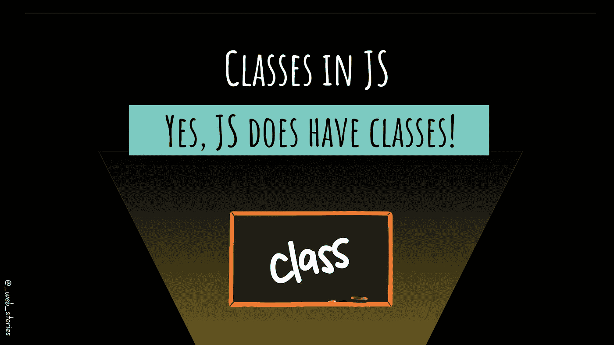

# JavaScript 中的类:是的，JS 确实有类！

> 原文：<https://javascript.plainenglish.io/yes-js-does-have-classes-82b1093d1362?source=collection_archive---------9----------------------->

## JS 中有哪些类？类是 JavaScript 对象的模板。

By FAM

## 你好👋

这次是关于课的！如果你已经熟悉 OOP 或 Java，这篇文章不会教你任何新东西。你可能想跳过它！要不，我们一起来搞定这个！

## JS 类是什么？

ECMAScript 2015 中引入了 JS 类。它们很简单:

> 类是 JS 对象的模板。

## 💻例子

**→创建一个类**

要在 JS 中创建一个对象，您需要遵守一些规则:

*   如果你的类有属性，一个`***constructor***` 是必须的。否则 JS 会自动创建一个空的，没必要显式添加。
*   Classe 构造函数有确切的名字`***constructor***`。
*   要初始化该类，请使用`**constructor**`。
*   要定义类方法，您需要将它们添加到类中。类方法只是普通的 JS 方法。

Creating Classes in JavaScript

**→使用一个类**

Using Classes in JavaScript

## 在这里找到代码。

# 💡记住

*   JS 类 ***=/=*** JS 对象。
*   JS 对象的 JS Class = **模板**。
*   创建新对象时，会自动调用构造函数方法。
*   如果没有定义构造函数，JS 将自动创建一个空的。
*   如果一个类有属性，你需要创建一个构造函数来添加它们。

今天就到这里，看阿雅🙋

如果您有任何问题或反馈，请点击评论或通过 LinkedIn 联系我— **我洗耳恭听！**

[**想请我喝杯咖啡吗？☕️**](https://www.buymeacoffee.com/fatimaamzil)

> 让我们为 2022 年打造一个更好的‘我们’！

## 了解有关 2022 年网络快车计划的更多信息:

I- [通用网络知识](https://medium.com/geekculture/2022-web-program-chapter-n-1-is-done-499fb0707220?source=your_stories_page----------------------------------------)

[II-网页框架:HTML](https://famzil.medium.com/your-html-essentials-69d9b2349355?source=your_stories_page----------------------------------------)

[III-网页样式:CSS](https://medium.com/geekculture/recap-of-the-css-chapter-ae388d51e564?source=your_stories_page----------------------------------------)

## IV- Web 交互:JavaScript

*   [异步代码](/can-the-web-live-without-asynchronous-code-7f61fe2e862e?source=your_stories_page----------------------------------------)
*   [这个](https://medium.com/geekculture/this-for-developers-5dc91d499677?source=your_stories_page----------------------------------------)
*   [变量](https://medium.com/codex/js-variables-what-you-need-to-know-fb8994ed9d0d?source=your_stories_page-------------------------------------)
*   [范围&吊装](/js-mechanism-you-should-know-12431e094103?source=your_stories_page-------------------------------------)
*   [操作员](/js-operators-3511c8545719?source=your_stories_page-------------------------------------)
*   [关闭](https://famzil.medium.com/js-closures-99666fe36a6a?source=your_stories_page-------------------------------------)
*   [高阶函数](https://famzil.medium.com/whats-hof-in-javascript-9fb68a9c3f6f?source=your_stories_page-------------------------------------)
*   [对象&方法](https://famzil.medium.com/objects-in-javascript-64fa3e82765f?source=your_stories_page-------------------------------------)
*   [数组，设置&贴图](/data-structures-in-js-9a13f7aa82b3?source=your_stories_page-------------------------------------)
*   [功能&箭头功能](https://famzil.medium.com/arrow-functions-in-js-235b5ade3958?source=your_stories_page-------------------------------------)
*   [超时&间隔](https://famzil.medium.com/timing-events-in-javascript-d44c24ed8641?source=your_stories_page-------------------------------------)
*   [破坏&蔓延](https://famzil.medium.com/destructuring-spread-syntax-in-js-d9260a725c99)
*   [回调](https://famzil.medium.com/call-me-back-later-in-javascript-9cdb74aafca3?source=your_stories_page-------------------------------------)
*   [承诺](https://famzil.medium.com/how-javascript-promises-you-e0039fe341ba?source=your_stories_page-------------------------------------)
*   [异步，等待](https://famzil.medium.com/making-async-code-looks-like-sync-code-in-js-b0f5133e14ae)
*   [模块](https://famzil.medium.com/break-your-app-into-boxes-e876937e3206?source=your_stories_page-------------------------------------)

## **类**

*   ES6+语法

 [## 2022 网络计划启动！

### 改变来自心态和习惯

medium.com](https://medium.com/geekculture/2022-web-program-is-launched-f38a3280af1a) 

与想成为 web 开发人员的人分享该程序！这将有助于保持进步，并在旅途中互相帮助。

*如果你喜欢我的文章，* [***订阅***](https://famzil.medium.com/subscribe) *获取我的最新文章。如果你自己喜欢体验媒介，可以考虑通过**[***报名会员***](https://famzil.medium.com/membership) *来支持我和其他几千个作家。它只花费***每月 5 美元，它支持我们，作家，你也有机会用你的写作* *赚钱* **。当然，你可以随时取消会员资格。通过报名 [*这个链接*](https://famzil.medium.com/membership) *，你直接用你的一部分费用来支持我，不会多花你多少钱。如果你这样做了，万分感谢！*****

**下面我们就**联系一下** [**中**](https://medium.com/@famzil/)**[**Linkedin**](https://www.linkedin.com/in/fatima-amzil-9031ba95/)**[**脸书**](https://www.facebook.com/The-Front-End-World)**[**insta gram**](https://www.instagram.com/the_frontend_world/)**[**YouTube**](https://www.youtube.com/channel/UCaxr-f9r6P1u7Y7SKFHi12g)**********

****** [## 通过我的推荐链接——FAM 加入 Medium

### 作为一个媒体会员，你的会员费的一部分会给你阅读的作家，你可以完全接触到每一个故事…

famzil.medium.com](https://famzil.medium.com/membership) 

*更多内容请看*[***plain English . io***](https://plainenglish.io/)*。报名参加我们的* [***免费周报***](http://newsletter.plainenglish.io/) *。关注我们关于*[***Twitter***](https://twitter.com/inPlainEngHQ)*和*[***LinkedIn***](https://www.linkedin.com/company/inplainenglish/)*。查看我们的* [***社区不和谐***](https://discord.gg/GtDtUAvyhW) *加入我们的* [***人才集体***](https://inplainenglish.pallet.com/talent/welcome) *。*******