# 这就是为什么您不必再编写自己的后端代码了

> 原文：<https://javascript.plainenglish.io/you-dont-have-to-code-your-own-backends-anymore-try-pocketbase-instead-70924fe45040?source=collection_archive---------1----------------------->

## 使用 Pocketbase，您可以在不到 5 分钟的时间内创建一个生产就绪的后端，而且非常容易！

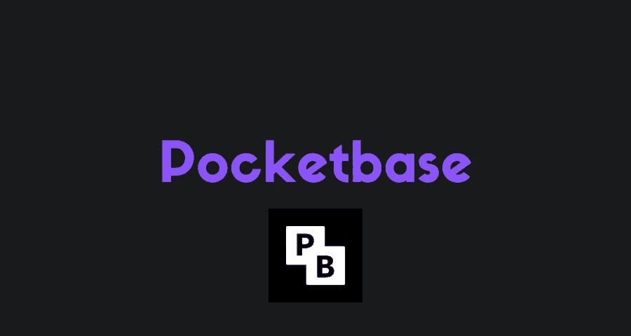

在这个故事中，你会学到什么是 Pocketbase。几天前我发现了它，它让我的生活轻松了许多。

你也将知道如何在 Pocketbase 或类似工具之间做出选择。

开始吧！

# 常见问题

## 我不用自己编写后端代码？

嗯，你看，这要看情况。

Pocketbase 或类似的工具提供了很多很棒的特性，尤其是在基于 CRUD 的操作方面。CRUD 代表创建、读取、更新和删除。

不过，有时候，对于真正复杂的用例，例如 AI 和 ML 数据或分析，您需要一个后端，这时这些基于 CRUD 的后端可能不够，您可能需要像 Neo4j 这样的图形数据库。

如果你需要一个相当普通的后端，相信我，Pocketbase 会给你很大帮助。

## Pocketbase 有什么好的？

嗯，有很多事情:

*   **单个文件**，Pocketbase 生活在单个可执行文件里面。这意味着对于一件简单的事情，你不需要完整的代码库！
*   **认证和管理访问**，Pocketbase 有一个很棒的认证和管理设置。足够让你开始了！
*   数据库和实时数据，Pocketbase 使用 SQLite 保存数据，它有许多很好的对象类型来创建集合。还支持实时数据！
*   **更多**，Pocketbase 提供的东西还有很多，这里就不一一列举了。请自行探索它们吧！

## 性能呢？

Pocketbase 是用 Go 写的，用 SQLite 保存数据。因此，它的性能通常非常好。

## 它有 SDK 和 API 吗？

当然啦！

他们目前有一个稳定的 JavaScript SDK，还有一个 Dart 正在开发中。

Pocketbase 还为您提供了 API 端点，因此您可以通过 HTTP 请求将它与任何其他语言一起使用！

# 使用 Pocketbase

如果你喜欢 Pocketbase 的想法，为什么不试试呢！

您可以在此访问 Pocketbase 网站:

 [## PocketBase -在一个文件中开源后端

### 一个文件中的开源后端，具有实时数据库、身份验证、文件存储和管理仪表板

pocketbase.io](https://pocketbase.io) 

您可以从这里开始阅读文档:

 [## PocketBase -在一个文件中开源后端

### 尽管 web API 定义被认为是稳定的，但请记住 PocketBase 仍然处于活跃状态…

pocketbase.io](https://pocketbase.io/docs/) 

## 装置

我使用的是 WSL 2，所以我将安装 Linux 可执行文件，但是您可以安装您想要的任何版本。

一旦你安装了它，只需运行`./pocketbase serve`命令来运行 Pocketbase！

这是您将看到的输出:

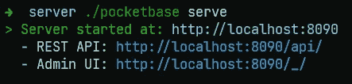

只需访问管理用户界面的 URL，并创建您的第一个管理用户:

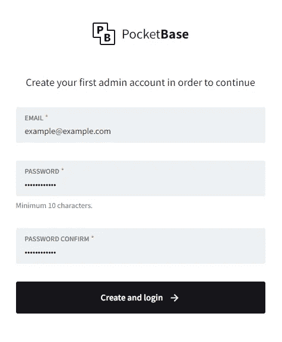

是的，就是这样。您现在已经有了 Pocketbase 并开始运行！

## 发展

但是，这并不酷，对不对？它什么也没做。

没关系。让我们用漂亮的模型创建一个样本帖子集，看看 Pocketbase 是如何工作的！

1.  **创建新收藏**

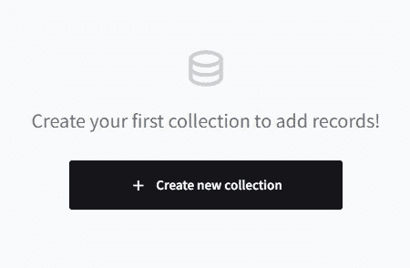

**2。给它起个名字**

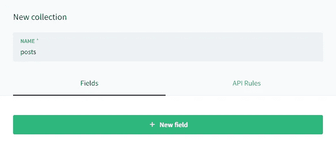

**3。添加一些你希望你的文章有**的字段

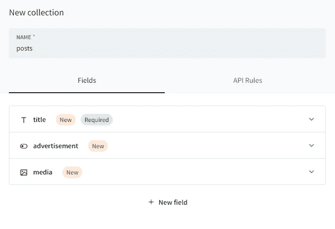

**4。创建集合**

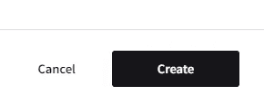

而且，就是这样！

现在，您可以使用这些特定字段创建帖子。还有更多的类型，比如 Integer、Relations、User 等等，但是我不会在这里一一介绍。

现在，让我们创建一个帖子！

**5。创建新记录**

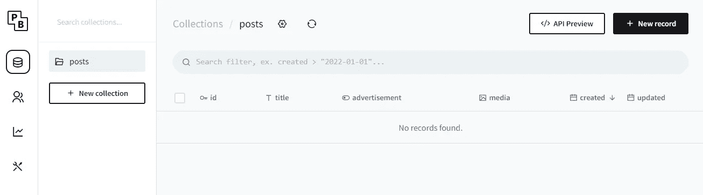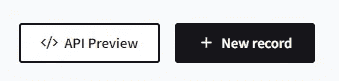

**6。输入数据**

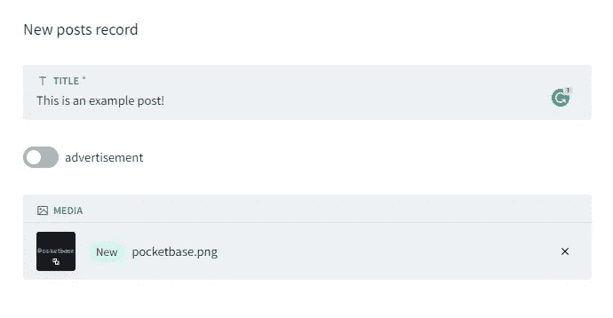

**7。完成记录的创建**

而且，就是这样！

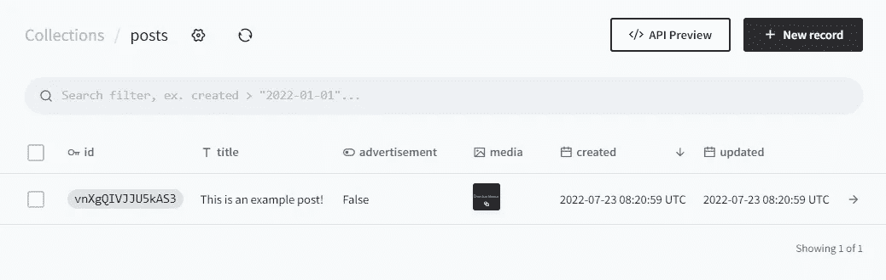

这个帖子，或者说记录，现在有了一个惟一的 ID，并且已经被创建了。您也可以在日志中看到这一点！

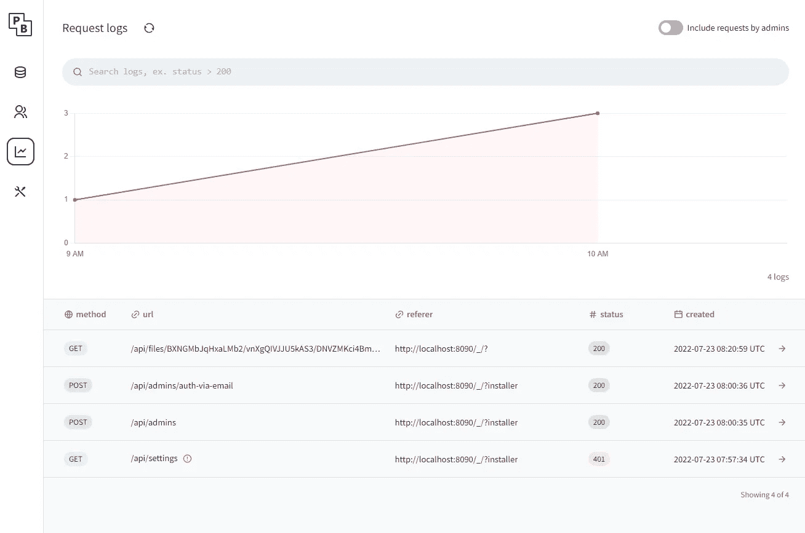

正如我说过的，你可以做的事情还有很多，我无法用一个故事来讲述。同样，请随意尝试！

## 以编程方式访问后端

要做到这一点，您有两种选择，要么使用 SDK，比如 JavaScript，要么将其与 API 端点一起使用。

您可以在此处找到 JavaScript SDK:

 [## GitHub-pocket base/js-SDK:pocket base JavaScript SDK

### 用于与 PocketBase API 交互的官方 JavaScript SDK(浏览器和节点)。或者，如果您正在使用 ES 模块:npm…

github.com](https://github.com/pocketbase/js-sdk) 

要将它与 API 端点一起使用，您可以查看文档来了解它，或者单击 API 预览按钮来获得关于如何访问您的集合的非常详细而简单的指南！

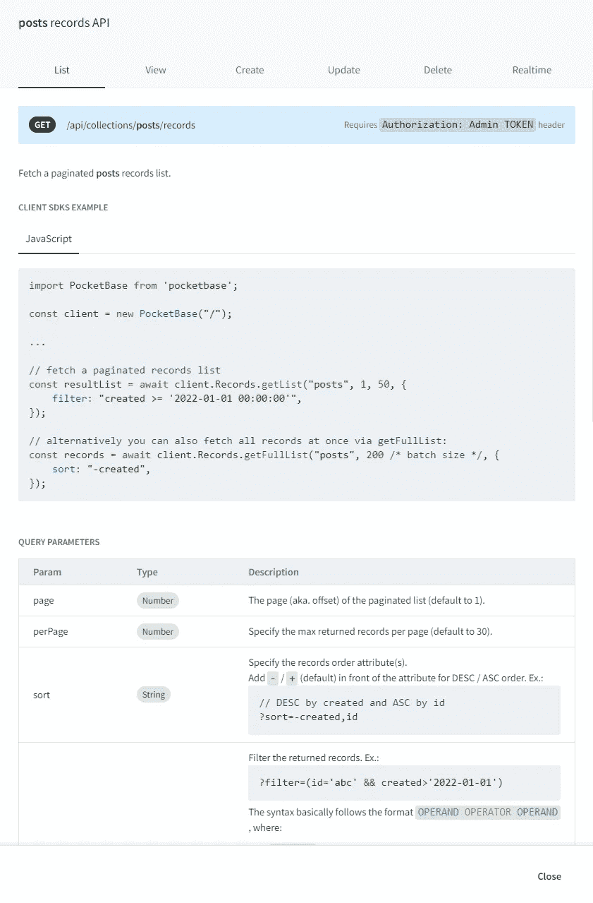

## 证明

Pocketbase 还提供简单的电子邮件和密码认证，但它非常简单但也很有用。

**用户屏幕**

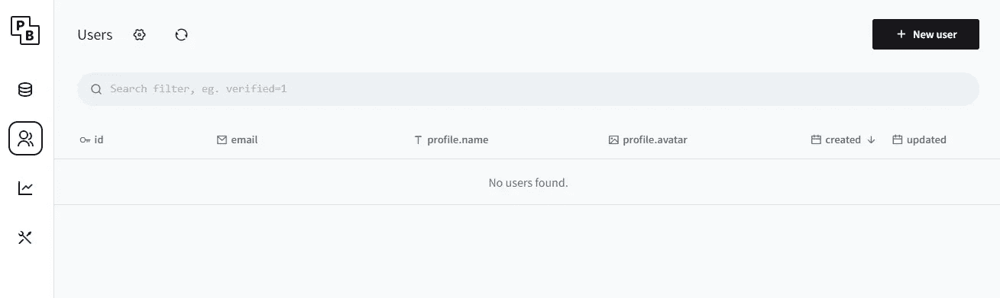

**创建新用户**

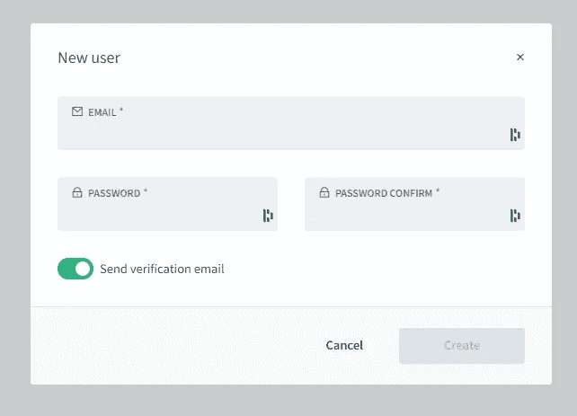

**列出用户**

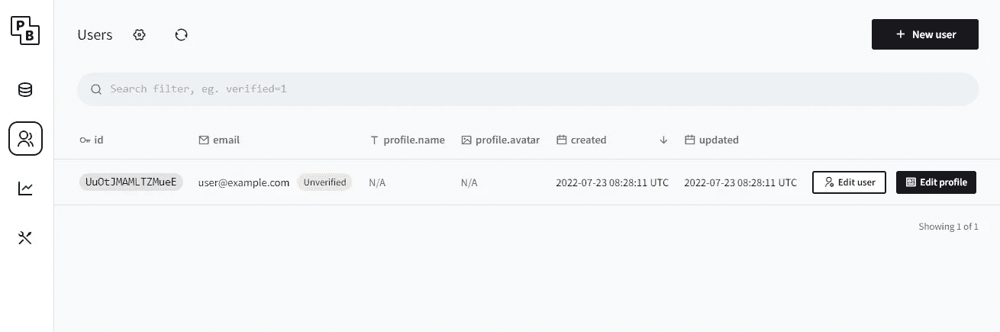

**用户简介**

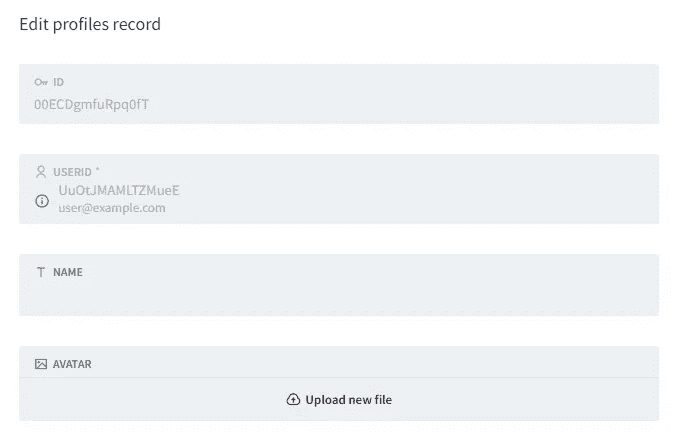

# 其他功能

正如我所说的，还有其他功能，如实时数据，但我不会在这里讨论它们。

您可以随时访问文档来了解所有特性，这并不困难:

 [## PocketBase -在一个文件中开源后端

### 尽管 web API 定义被认为是稳定的，但请记住 PocketBase 仍然处于活跃状态…

pocketbase.io](https://pocketbase.io/docs/) 

# 最后的想法

就是这样！你现在知道什么是 Pocketbase 了。

我希望你喜欢 Pocketbase，并希望它对你未来的项目有所帮助。我个人非常喜欢它，现在真的经常使用它！

# 仅此而已。感谢您阅读这个故事！

如果你喜欢这个故事，一定要为它鼓掌！你想问我什么都可以。

在 Twitter 上关注我:

 [## re _ ally 边缘

twitter.com](https://twitter.com/Re_allyedge) 

在 Patreon 上支持我:

 [## 阿里木阿尔斯兰卡亚是创造编程故事和教程。帕特里翁

### 今天就成为阿里木阿尔斯兰卡亚的赞助人:在世界上最大的…

www.patreon.com](https://www.patreon.com/allyedge) 

*更多内容请看*[***plain English . io***](https://plainenglish.io/)*。报名参加我们的* [***免费周报***](http://newsletter.plainenglish.io/) *。关注我们关于*[***Twitter***](https://twitter.com/inPlainEngHQ)*和*[***LinkedIn***](https://www.linkedin.com/company/inplainenglish/)*。查看我们的* [***社区不和谐***](https://discord.gg/GtDtUAvyhW) *加入我们的* [***人才集体***](https://inplainenglish.pallet.com/talent/welcome) *。*