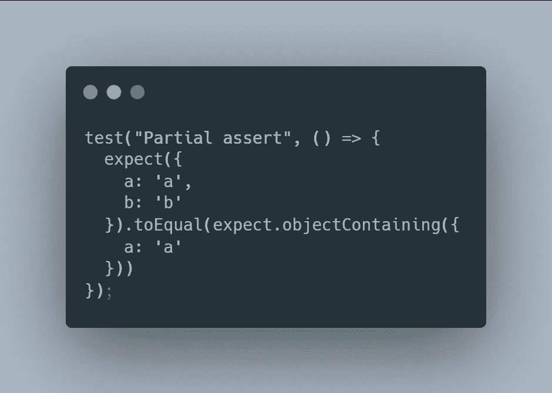
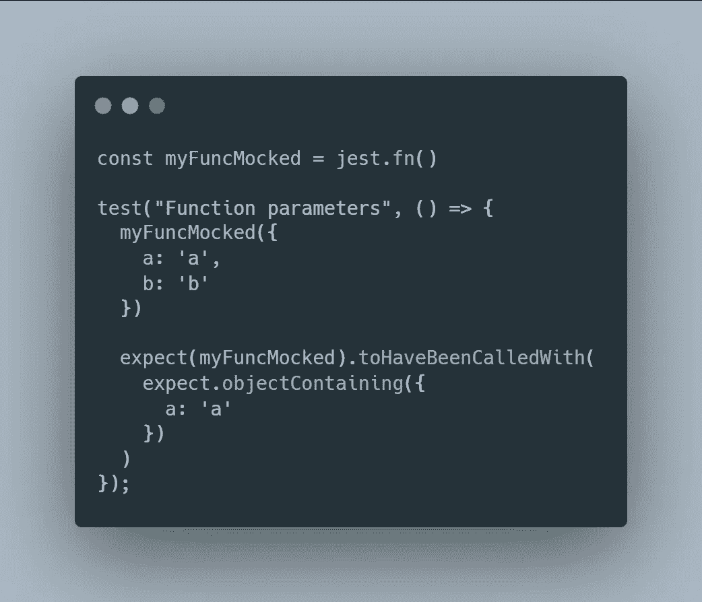

# 用 Jest 断言时，你不必给出完整的对象

> 原文：<https://javascript.plainenglish.io/you-dont-have-to-give-a-full-object-while-asserting-with-jest-18ea3ccad398?source=collection_archive---------23----------------------->

## 当您只对一个值感兴趣时，为什么要给出对象的全部内容呢？

Nothing to do with the article, but it looks nice! (Photo by [Umut Dağlı](https://www.pexels.com/@umutdagli?utm_content=attributionCopyText&utm_medium=referral&utm_source=pexels) from [Pexels](https://www.pexels.com/photo/grayscale-photo-of-birds-flying-over-the-sea-10567313/?utm_content=attributionCopyText&utm_medium=referral&utm_source=pexels))

在使用了近 3 年之后，Jest 对我来说仍然是一个谜。但是我几乎每天都会发现新的东西，这让我意识到这个工具有多强大。

今天，我正在写我平常的大量测试，这时我面临一个新的挑战:我必须使用函数`toHaveBeenCalledWith`并断言一个巨大的对象。我添加的物品和子对象越多，我就越希望 Jest 有适合我的东西。

在浏览了一部分文档后，我终于找到了我的救命恩人:`expect.objectContaining`！

## 断言一个对象

你可能对 Jest 中著名的`expect().toBe()`很熟悉。有了它，你可以断言`value a`严格等于`value b`。
但是，`toBe`和`objectContaining`就不行了。

不过不用担心，Jest 有个解决方案给你:`expect().toEqual()`

This test passes!

如您所见，我刚刚编写了一个简单的测试，将一个对象与另一个对象进行比较。
然而我只对`a`的存在和价值感兴趣。
这样使用`objectContaining`，我们只是关心`a`的值，而完全忽略了`b`！

## 断言函数调用的参数

一种最常见的测试方法是检查一个特定的函数是否被精确的参数调用。

同样，这些参数可能是大对象，或者有时是不值得嘲笑的未知值。不过谢天谢地，`objectContaining`又在救我们的命了！

在这段代码中，我使用`jest.fn()`创建一个被 Jest 监视的假函数。

然后我调用带有两个参数的函数，一个字符串和一个对象。

最后，我们使用`toHaveBeenCalledWith`来断言用于调用函数的参数。同样，我们感兴趣的只是对象中的属性`a`。因此，通过使用`objectContaining`，我们可以检查`a`的值是否符合预期！

*更多内容请看*[***plain English . io***](http://plainenglish.io/)*。报名参加我们的* [***免费周报***](http://newsletter.plainenglish.io/) *。在我们的* [***社区***](https://discord.gg/GtDtUAvyhW) *获得独家获得写作机会和建议。*