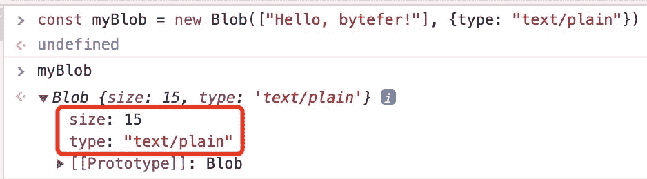
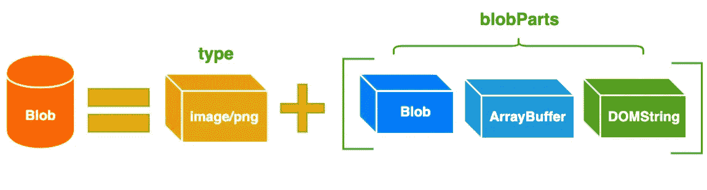
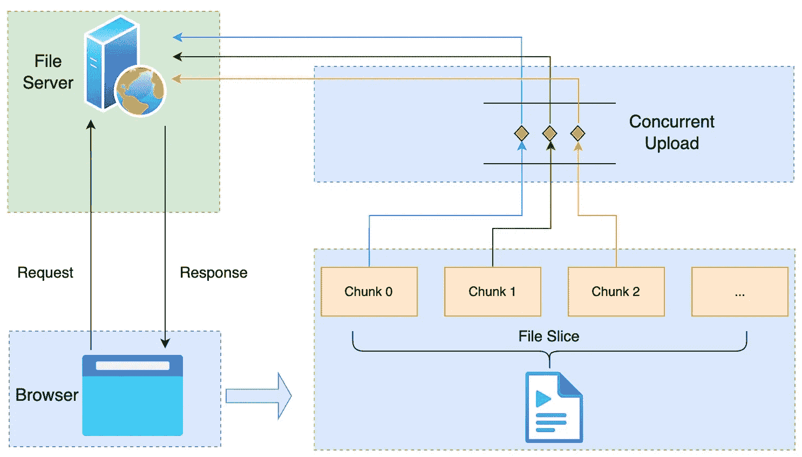

# Blob API 及其用例介绍

> 原文：<https://javascript.plainenglish.io/you-dont-know-blob-api-f2c5e9754f29?source=collection_archive---------1----------------------->

## 用例:1。分块上传，请按 2。从互联网下载数据，3。图像压缩，4。创建 Blob URL，5。Blob 到数据 URL 的转换。


Photo by [Cristi Goia](https://unsplash.com/@cg?utm_source=medium&utm_medium=referral) on [Unsplash](https://unsplash.com?utm_source=medium&utm_medium=referral)

也许你用过一些基于 Canvas 的在线图像设计器，当你编辑完图像选择下载时，你会发现它非常快。事实上， [**Blob**](https://developer.mozilla.org/en-US/docs/Web/API/Blob) API 最有可能在这个下载特性背后使用。

除了上述场景， [**Blob**](https://developer.mozilla.org/en-US/docs/Web/API/Blob) API 还可以应用于以下场景:大文件上传、大文件下载、本地图片预览、图片压缩上传。接下来，我将向您介绍 Blob API 及其常见的使用场景。

# 什么是 Blob

[**【Blob(二进制大对象)**](https://developer.mozilla.org/en-US/docs/Web/API/Blob) 代表二进制类型的大对象。在数据库管理系统中，二进制数据存储为单个实体的集合。Blobs 通常是图像、声音或多媒体文件。JavaScript 中 Blob 类型的对象表示不可变的、类似文件的原始数据。

为了更直观的理解`Blob`对象，我们先用`Blob`构造函数创建一个 **myBlob** 对象，如下图所示:



如上所示， **myBlob** 对象有两个属性:大小和类型。其中，size 属性用于表示数据的大小(以字节为单位)，type 是 MIME 类型。一个 Blob 对象由一个**可选类型**和 **blobParts** 组成:



请注意，Blobs 不一定以 JavaScript 的原生格式表示数据。例如，文件接口基于 Blob，继承了 Blob 的功能，并对其进行了扩展，以支持用户系统上的文件。

在介绍完 [**Blob**](https://developer.mozilla.org/en-US/docs/Web/API/Blob) API 之后，我将介绍 Blob API 在工作中的 5 大使用场景。

# Blob API 使用场景

## 1.分块上传



文件对象是一种特殊类型的 Blob，可以在任何 Blob 类型的上下文中使用。所以对于大文件传输的场景，我们可以使用切片的方法来切割大文件，然后分块上传。具体例子如下:

```
const file = new File(["a".repeat(1000000)], "bytefer.txt");const chunkSize = 40000;
const url = "[https://httpbin.org/post](https://httpbin.org/post)";async function chunkedUpload() {
  for (let start = 0; start < file.size; start += chunkSize) {
    const chunk = file.slice(start, start + chunkSize + 1);
    const fd = new FormData();
    fd.append("data", chunk); await fetch(url, { method: "post", body: fd })
      .then((res) => res.text());
  }
}
```

如果你想了解更多关于如何实现大文件的并发上传，你可以阅读这篇文章:

[](/implement-concurrent-upload-of-large-files-in-javascript-53519a0d2eee) [## 用 JavaScript 实现大文件的并发上传

### 用动画演示，实现基于 JavaScript 的并发控制，从而实现…的并发上传

javascript.plainenglish.io](/implement-concurrent-upload-of-large-files-in-javascript-53519a0d2eee) 

## 2.从互联网下载数据

您可以从互联网下载数据，并使用下面的`downloadBlob`函数将其存储在 Blob 对象中:

```
const downloadBlob = (url, callback) => {
  const xhr = new XMLHttpRequest()
  xhr.open('GET', url)
  xhr.responseType = 'blob'
  xhr.onload = () => {
    callback(xhr.response)
  }
  xhr.send(null)
}
```

当然，除了使用`XMLHttpRequest` API，我们还可以使用`fetch` API 来获取流中的二进制数据。在这里，我们来看看如何使用`fetch` API 获取在线图片并在本地显示。具体实现如下:

```
const myImage = document.querySelector('img');
const myRequest = new Request('flowers.jpg');fetch(myRequest)
  .then(function(response) {
    return response.blob();
  })
 .then(function(myBlob) {
   let objectURL = URL.createObjectURL(myBlob);
   myImage.src = objectURL;
});
```

当 fetch 请求成功后，我们调用 response 对象的 blob()方法，从 response 对象中读取一个 Blob 对象，然后使用`createObjectURL()`方法创建一个 objectURL，然后赋给 img 元素的 src 属性来显示这张图片。

上传文件时，可以实现并发上传。同样，在下载文件时，也可以实现并发下载。详细实现，可以参考这篇文章:

[](https://blog.bitsrc.io/implement-concurrent-download-of-large-files-in-javascript-4e94202c5373) [## 用 JavaScript 实现大文件的并发下载

### 如何用 JavaScript 从零开始一步步实现多线程下载器来提高下载…

blog.bitsrc.io](https://blog.bitsrc.io/implement-concurrent-download-of-large-files-in-javascript-4e94202c5373) 

## 3.图像压缩

在某些场合，我们希望在上传本地图像时，先将图像压缩到一定程度，再提交给服务器，从而减少传输的数据量。要在前端实现图像压缩，可以使用 Canvas 对象提供的 toDataURL()方法，该方法接收两个可选参数:`type`和`encoderOptions`。

其中 type 表示图像格式，默认为“image/png”。`encoderOptions`用于指示画面质量。当指定的图片格式为“image/jpeg”或“image/webp”时，图片的质量可以从 0 到 1 中选择。如果超出该值范围，将使用默认值 0.92，其他参数将被忽略。

对于返回的数据 URL 格式的图像数据，为了进一步减少传输的数据量，我们可以将其转换为 Blob 对象:

```
function dataUrlToBlob(base64, mimeType) {
  let bytes = window.atob(base64.split(",")[1]);
  let ab = new ArrayBuffer(bytes.length);
  let ia = new Uint8Array(ab);
  for (let i = 0; i < bytes.length; i++) {
    ia[i] = bytes.charCodeAt(i);
  }
  return new Blob([ab], { type: mimeType });
}
```

其实除了 Canvas 对象提供的`toDataURL()`方法，它还提供了一个`toBlob()`方法，其签名如下:

```
canvas.toBlob(callback, mimeType, qualityArgument)
```

与`toDataURL()`方法相比，`toBlob()`方法是异步的，所以多了一个回调参数。这个回调函数的默认第一个参数是转换后的 blob 文件信息。

## 4.创建 Blob URL

Blob URL/Object URL 是一个伪协议，它允许 Blob 和文件对象用作图像的 URL 源、下载二进制数据的链接等等。在浏览器中，我们使用`URL.createObjectURL`方法创建一个 Blob URL，它接受一个 Blob 对象，并以 Blob:<origin>/<uuid>的形式为其创建一个唯一的 URL，对应的示例如下:

```
blob:[https://example.org/40a5fb5a-d56d-4a33-b4e2-0acf6a8e5f641](https://example.org/40a5fb5a-d56d-4a33-b4e2-0acf6a8e5f641)
```

浏览器在内部为通过 URL.createObjectURL 生成的每个 URL 存储一个 URL → Blob 映射。但是 Blob 本身仍然驻留在内存中，浏览器无法释放它。当文档被卸载时，映射被自动清除，因此 Blob 对象被释放。然而，如果应用程序是长期存在的，那么这种情况不会很快发生。因此，如果我们创建一个 blob URL，即使不再需要这个 blob，它也会存在于内存中。

对于这个问题，我们可以调用`URL.revokeObjectURL`方法从内部映射中移除引用，从而移除 blob 并释放内存。接下来，让我们看一个使用 Blob URLs 下载客户端文件的例子。

**index.html**

```
<!DOCTYPE html>
<html lang="en">
  <head>
    <meta charset="UTF-8" />
    <title>Blob URL Demo</title>
  </head><body>
    <button id="downloadBtn">Download</button>
    <script src="index.js"></script>
  </body>
</html>
```

**index.js**

```
const download = (fileName, blob) => {
  const link = document.createElement("a");
  link.href = URL.createObjectURL(blob);
  link.download = fileName;
  link.click();
  link.remove();
  URL.revokeObjectURL(link.href);
};const downloadBtn = document.querySelector("#downloadBtn");
downloadBtn.addEventListener("click", (event) => {
  const fileName = "blob.txt";
  const myBlob = new Blob(["You Don’t Know Blob API"], 
   { type: "text/plain" });
  download(fileName, myBlob);
});
```

在上面的例子中，我们通过调用 Blob 的构造函数来创建一个类型为**“text/plain”**的 Blob 对象，然后通过动态创建 a 元素来下载文件。

## 5.Blob 到数据 URL 的转换

在编写 HTML 网页时，对于一些小图片，我们通常会选择将图片内容直接嵌入到网页中，从而减少不必要的网络请求，但是图片数据是二进制数据，如何嵌入呢？大多数现代浏览器都支持一种称为数据 URL 的功能，该功能允许使用 base64 编码图像或其他文件的二进制数据，并将其作为文本字符串嵌入到网页中。

数据 URL 由四部分组成:前缀(数据: )、指示数据类型的 MIME 类型、可选的 base64 标记(如果是非文本的话)以及数据本身:

```
data:[<mediatype>][;base64],<data>
```

`mediatype`是一个 MIME 类型的字符串，例如“image/jpeg”为 jpeg 图像文件。如果省略，默认为**“text/plain；charset=US-ASCII"** 。如果数据是文本类型，可以直接嵌入文本。如果是二进制数据，可以在嵌入前对数据进行 base64 编码。例如，要嵌入图像:

```

```

但是需要注意的是，如果图像比较大，图像的色彩层次比较丰富，就不适合使用这种方法，因为图像经过 base64 编码后的字符串非常大，会显著增加 HTML 页面的大小，从而影响加载速度。另外，使用 FileReader API，我们还可以方便地实现图片的本地预览功能，具体代码如下。

```
<input type="file" accept="image/*" onchange="loadFile(event)">
<script>
  const loadFile = function(event) {
    const reader = new FileReader();
    reader.onload = function(){
      const output = document.querySelector('output');
      output.src = reader.result;
    };
    reader.readAsDataURL(event.target.files[0]);
  };
</script>
```

在上面的例子中，我们为文件类型输入框绑定了`onchange`事件处理程序 loadFile。在这个函数中，我们创建一个 FileReader 对象，并为该对象绑定`onload`对应的事件处理程序，然后调用 FileReader 对象的`readAsDataURL()`方法，将本地图像对应的 File 对象转换为数据 URL。

完成本地图片预览后，我们可以直接将图片对应的数据 URL 数据提交给服务器。针对这种情况，服务器需要做一些相关的处理，才能正常保存上传的图片。这里以快递为例，具体处理代码如下:

```
const app = require('express')();app.post('/upload', function(req, res){
    let imgData = req.body.imgData;
    let base64Data = imgData.replace(/^data:image\/\w+;base64,/, "");
    let dataBuffer = Buffer.from(base64Data, 'base64');
    fs.writeFile("image.png", dataBuffer, function(err) {
        if(err){
          res.send(err);
        }else{
          res.send("Image upload successfully!");
        }
    });
});
```

对于 FileReader 对象，除了支持 Blob/File 对象到数据 URL 的转换外，还提供了将 Blob/File 对象转换为其他数据格式的`readAsArrayBuffer()`和`readAsText()`方法。这里我们来看一个使用`readAsArrayBuffer()`的例子:

```
let fileReader = new FileReader();fileReader.onload = function(event) {
  let arrayBuffer = fileReader.result;
};fileReader.readAsArrayBuffer(blob);
```

应该注意，Blob 和 ArrayBuffer 对象可以相互转换:

*   使用 FileReader 的`readAsArrayBuffer()`方法将 Blob 对象转换为 ArrayBuffer 对象；
*   使用 Blob 构造函数，如`new Blob([new Uint8Array(data)])`，将 ArrayBuffer 对象转换为 Blob 对象。

看完这篇文章，相信你已经对 [**Blob**](https://developer.mozilla.org/en-US/docs/Web/API/Blob) API 及其应用场景有了一定的了解。如果你在工作中使用 [**Blob**](https://developer.mozilla.org/en-US/docs/Web/API/Blob) API 实现其他功能，请给我留言。

如果你想学习打字，那么就不要错过**掌握打字**系列。

*   [**TypeScript 泛型中的 K、T、V 是什么？**](https://medium.com/frontend-canteen/what-are-k-t-and-v-in-typescript-generics-9fabe1d0f0f3)
*   [**使用 TypeScript 像 Pro 一样映射类型**](/using-typescript-mapped-types-like-a-pro-be10aef5511a)
*   [**使用 TypeScript 条件类型像亲**](/use-typescript-conditional-types-like-a-pro-7baea0ad05c5)
*   [**使用 TypeScript 交集类型像亲**](/using-typescript-intersection-types-like-a-pro-a55da6a6a5f7)
*   [**使用打字稿推断像亲**](https://levelup.gitconnected.com/using-typescript-infer-like-a-pro-f30ab8ab41c7)
*   [**使用 TypeScript 模板文字类型像亲**](https://medium.com/javascript-in-plain-english/how-to-use-typescript-template-literal-types-like-a-pro-2e02a7db0bac)
*   [**可视化打字稿:15 种最常用的实用类型**](/15-utility-types-that-every-typescript-developer-should-know-6cf121d4047c)
*   [**关于类型脚本类你需要知道的 10 件事**](https://levelup.gitconnected.com/10-things-you-need-to-know-about-typescript-classes-f58c57869266)
*   [](/purpose-of-declare-keyword-in-typescript-8431d9db2b10)**中‘声明’关键字的用途**
*   **[**不再混淆打字稿的“任何”和“未知”**](/no-more-confusion-about-typescripts-any-and-unknown-98c4b53f8924)**

**

[Bytefer](https://medium.com/@bytefer?source=post_page-----f2c5e9754f29--------------------------------)** 

## **掌握打字稿系列**

**[View list](https://medium.com/@bytefer/list/mastering-typescript-series-688ee7c12807?source=post_page-----f2c5e9754f29--------------------------------)****47 stories**************

**在[中](https://medium.com/@bytefer)或[推特](https://twitter.com/Tbytefer)上关注我，阅读更多关于 TS 和 JS 的内容！**

# **资源**

**[](https://blog.bitsrc.io/implement-concurrent-download-of-large-files-in-javascript-4e94202c5373) [## 用 JavaScript 实现大文件的并发下载

### 如何用 JavaScript 从零开始一步步实现多线程下载器来提高下载…

blog.bitsrc.io](https://blog.bitsrc.io/implement-concurrent-download-of-large-files-in-javascript-4e94202c5373) [](/implement-concurrent-upload-of-large-files-in-javascript-53519a0d2eee) [## 用 JavaScript 实现大文件的并发上传

### 用动画演示，实现基于 JavaScript 的并发控制，从而实现…的并发上传

javascript.plainenglish.io](/implement-concurrent-upload-of-large-files-in-javascript-53519a0d2eee) [](/how-to-implement-concurrency-control-in-javascript-df4da29f81c4) [## 如何用 JavaScript 实现并发控制？

### 以有限的并发性运行多个承诺返回&异步函数。

javascript.plainenglish.io](/how-to-implement-concurrency-control-in-javascript-df4da29f81c4) 

*更多内容请看*[***plain English . io***](https://plainenglish.io/)*。报名参加我们的* [***免费周报***](http://newsletter.plainenglish.io/) *。关注我们关于*[***Twitter***](https://twitter.com/inPlainEngHQ)[***LinkedIn***](https://www.linkedin.com/company/inplainenglish/)*[***YouTube***](https://www.youtube.com/channel/UCtipWUghju290NWcn8jhyAw)*[***不和***](https://discord.gg/GtDtUAvyhW) *。*****