# 你可能不知道，但是所有的 GitHub 项目都可以免费建立静态网站

> 原文：<https://javascript.plainenglish.io/you-may-not-know-but-all-github-projects-can-build-static-websites-for-free-39904e863af0?source=collection_archive---------10----------------------->

## 使用 GitHub Pages 免费为每个项目建立一个静态网站，无需购买服务器。


Photo by [Igor Miske](https://unsplash.com/@igormiske?utm_source=medium&utm_medium=referral) on [Unsplash](https://unsplash.com/?utm_source=medium&utm_medium=referral)

# 情况

你现在可能有一堆 markdown 文件，你需要把这些 markdown 文件做成一个网站让别人浏览阅读，但是你会发现大部分的例子都是 vite press+Github Page XXX . Github . io 博客网站，虽然这样可以满足那些自建博客网站的人的需求，但是如果我想把我的 Github 项目做成这种静态网站，可以吗？呢子？估计大部分同学的想法和我一样。这应该行不通。GitHub 只提供给我们一个免费的. github.io 机器使用。如果要为每个 GitHub 项目搭建相应的网站，需要自己购买服务器，然后部署到我们自己的服务器上确实可行，但是如果我们只想在一个服务器上部署一个静态网站，是不是一定要购买服务器才能满足我们的需求呢？

这个问题困扰了我很久，我也没有想过。直到最近，我还在接触用 VitePress 构建静态网站。我可以告诉你这个好消息。如果只需要部署静态网站，可以使用 GitHub Page 免费为每个项目搭建一个静态网站，不需要购买服务器。这里我将免费教你使用 GitHub Pages 部署一个特定项目的静态网站，你开心吗？😄

# 初始化项目

*   按顺序执行以下命令

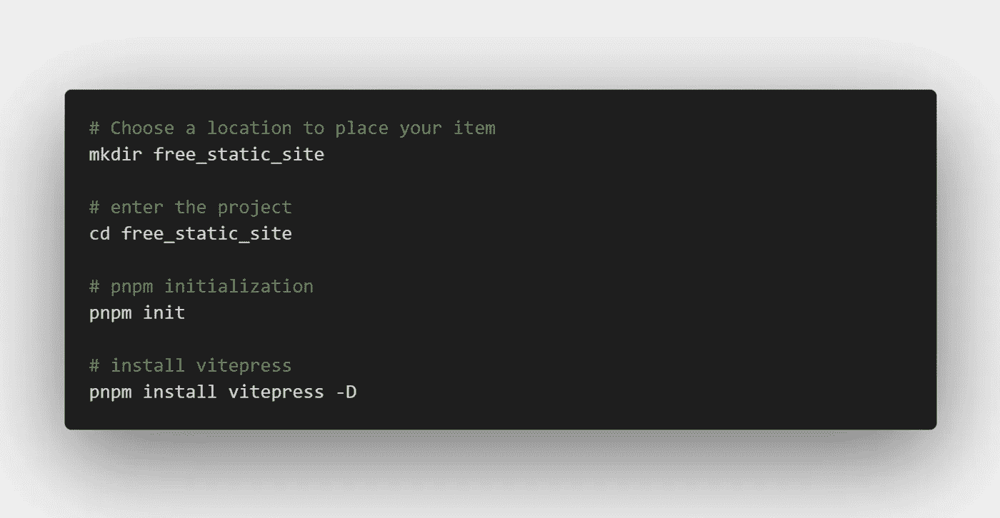

*   执行上述步骤后，目录结构如下所示

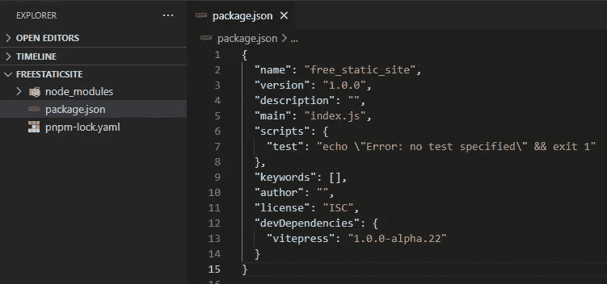

*   index.md:主页显示内容

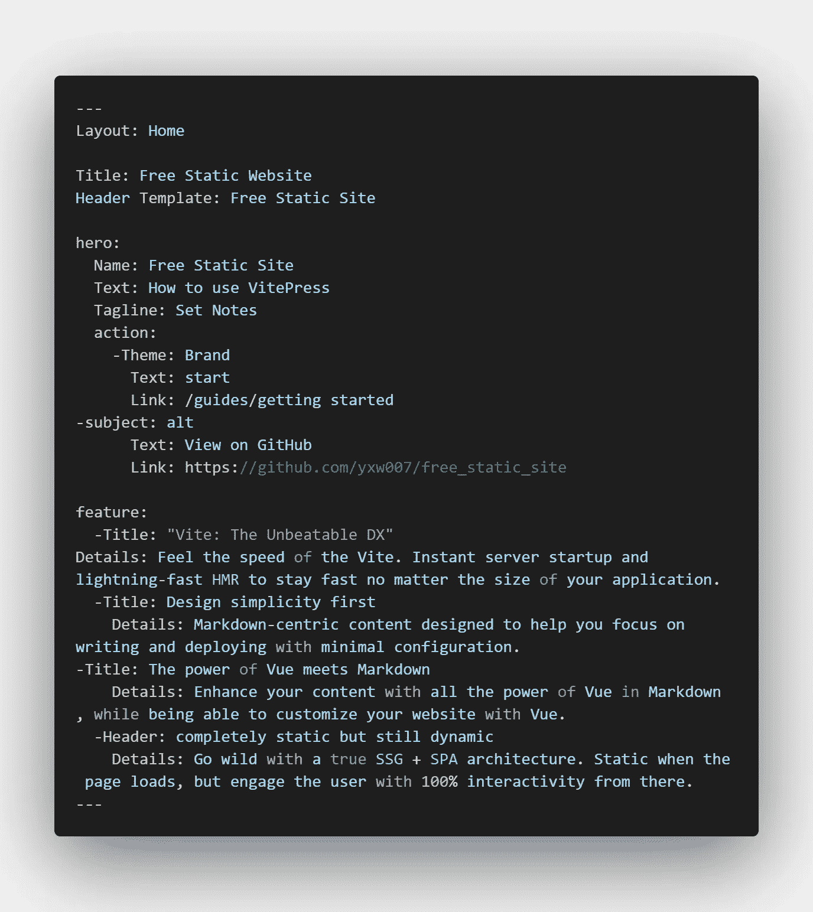

*   入门. md

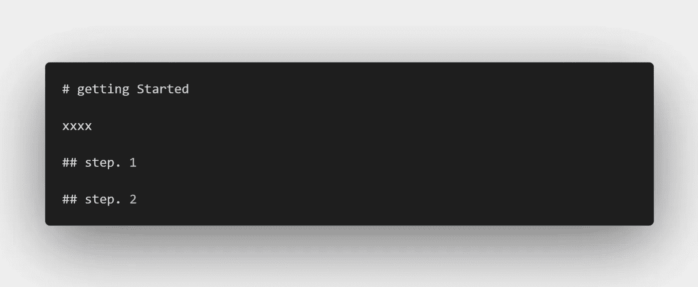

*   config.js:静态网站相关配置，如导航、主题等。

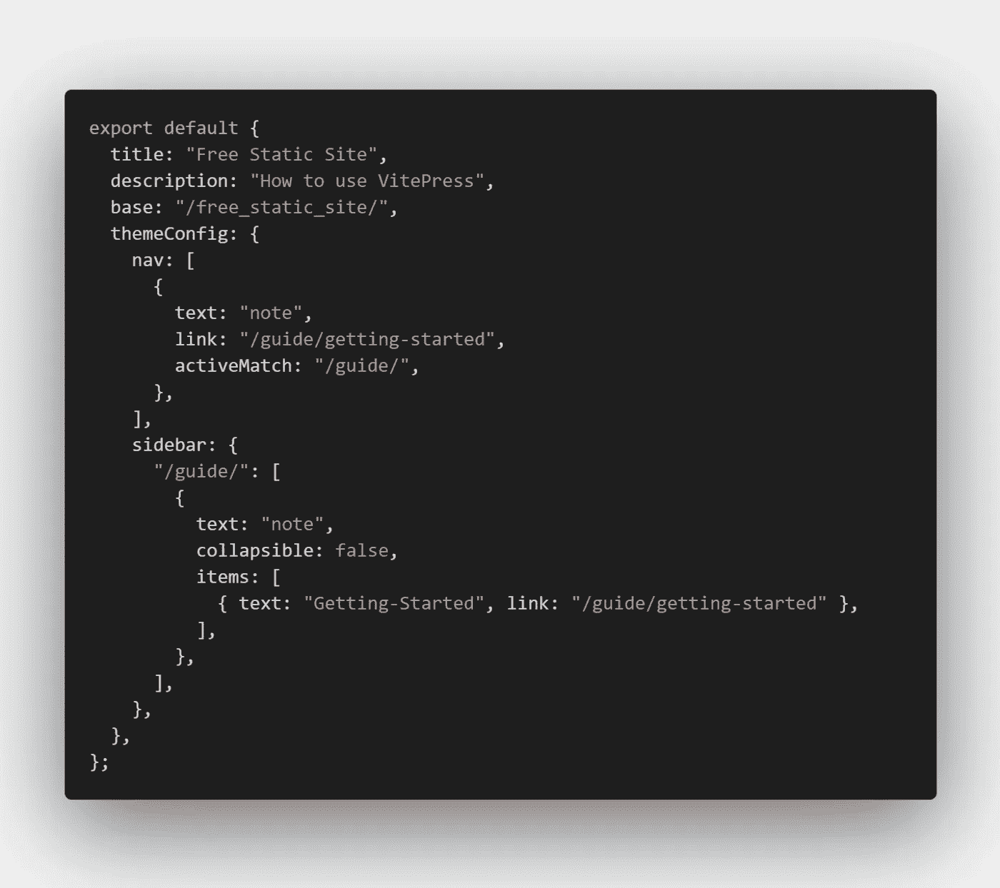

## 在本地运行测试

*   在本地运行以查看效果

```
pnpm docs:dev
```

*   效果如下

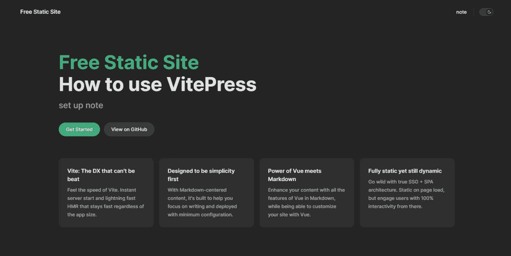

提示:表明静态网站已经就绪

## 将工作流配置添加到包中并自动部署

*   添加目录

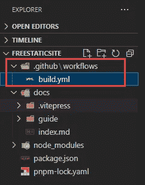

*   构建. yml

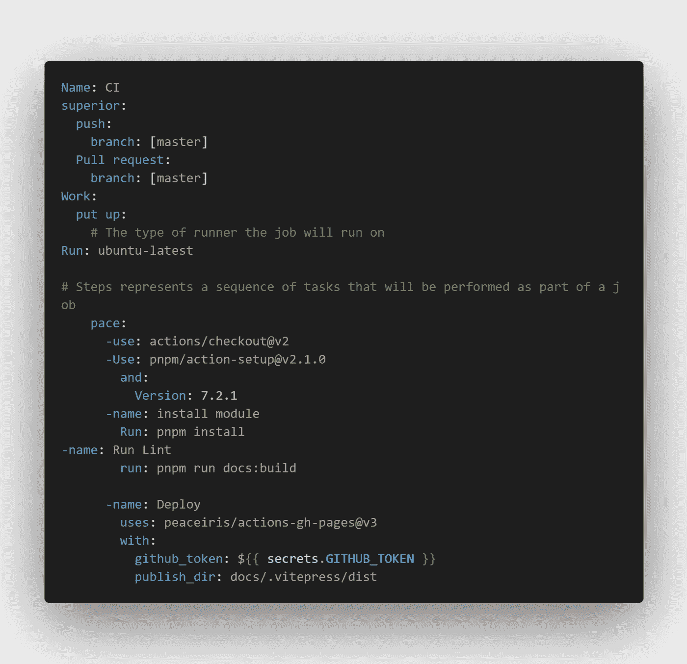

注意:pnpm docs:build 的打包结果在 docs/中。维特/迪斯特目录

## Git 初始化和提交项目

*   git 项目初始化

```
git init
```

*   忽略不必要的文件和目录。gitignore 内容如下

```
**/node_modules/**/dist/
```

*   提交代码

```
git add .git commit -m "init project"
```

*   GitHub 创建项目

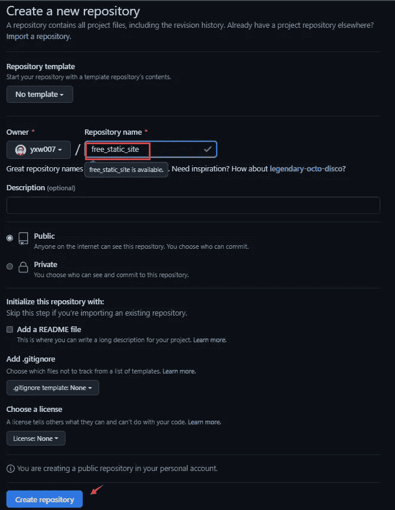

*   执行以下命令

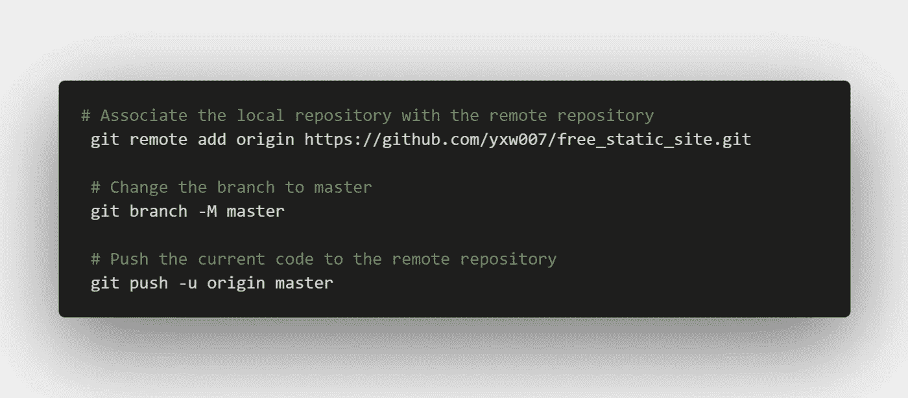

## 配置 GitHub 页面，部署打包的分支

*   配置如下图所示

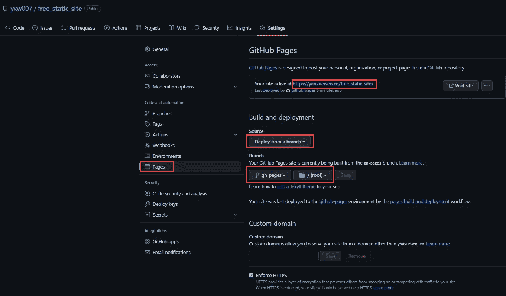

Note: After configuring, refresh the page, you can see the access connection

注意:配置完成后，刷新页面，可以看到接入连接

*   点击上面的访问地址刷新，最终效果:

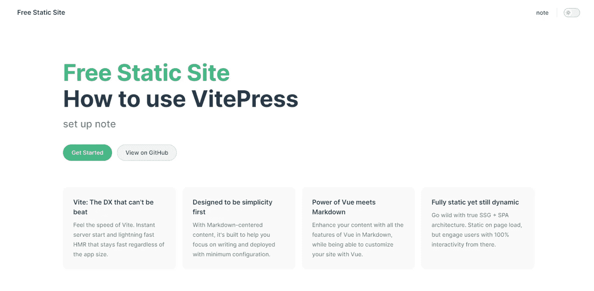

**举例项目:** [**门户**](https://github.com/yxw007/free_static_site) **。这个项目只是一个演示，如果你想看完整的项目，请参考**[**ES6 _ Functional _ Programming**](https://github.com/yxw007/ES6_Functional_Programming)*** *，请帮我点击星号🌟**

## 总结

*   如果不知道怎么做，可以参考一下现成的项目是怎么做的，或许能从中找到灵感。
*   不要怕英文，很多答案都是用英文写的，学会用全球人的智慧😊

**参考文献**

*   https://vitepress.vuejs.org/
*   [https://sino ui . github . io/sino ui-guide/docs/github-pages-introduction](https://sinoui.github.io/sinoui-guide/docs/github-pages-introduction)
*   https://github.com/peaceiris/actions-gh-pages#️-vue-and-nuxt
*   [将 Vitepress 部署到 Github 页面](https://www.codementor.io/@burhanuddinahmed/deploying-vitepress-to-github-pages-1ft7mbf6lc)

> ***感谢阅读，如果你有有趣的工具分享，请给我留言。关注我，不断获取更多内容***

*更多内容看* [***说白了。报名参加我们的***](https://plainenglish.io/) **[***免费周报***](http://newsletter.plainenglish.io/) *。关注我们关于*[***Twitter***](https://twitter.com/inPlainEngHQ)，[***LinkedIn***](https://www.linkedin.com/company/inplainenglish/)*，*[***YouTube***](https://www.youtube.com/channel/UCtipWUghju290NWcn8jhyAw)*，以及* [***不和***](https://discord.gg/GtDtUAvyhW) *。对增长黑客感兴趣？检查出* [***电路***](https://circuit.ooo/) *。***