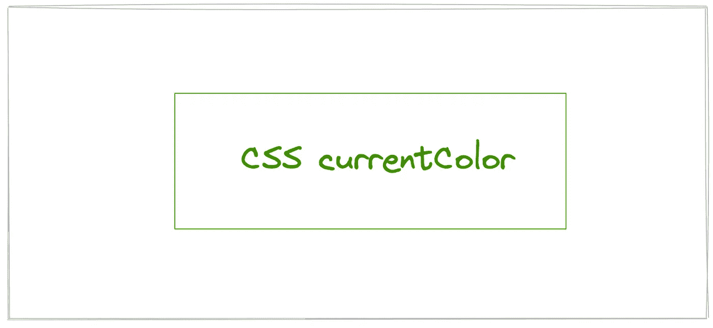
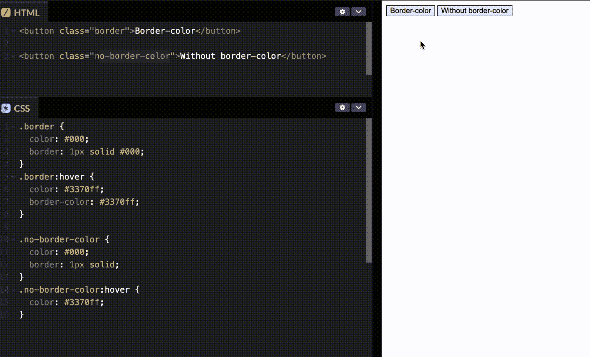

# 您可能不需要设置边框颜色

> 原文：<https://javascript.plainenglish.io/you-may-not-need-to-set-border-color-e07c255ed5b1?source=collection_archive---------9----------------------->

## 我们可以使用边框颜色的初始值“currentColor”



# 前言

当我们需要实现在元素悬停时自动改变边框颜色和文本颜色的功能时，您是否编写过这样的代码:

```
// html code
<button> Click me </button>// CSS code
button {
  color: #000;
  border: 1px solid #000;
}
button:hover {
  color: #3370ff;
  border-color: #3370ff;
}
```

这段代码工作正常，我总是在我的项目中使用它们。当我们得到问题的解决方案时，它总是被这样使用，因为我们可能不知道有更好的方法。是的，有一个更简单的方法来实现这个功能:

```
// CSS code
button {
  color: #000;
  border: 1px solid;
}
button:hover {
  color: #3370ff;
}
```

以上代码效果相同，可以在 [Codepen.io](https://codepen.io/bitbug/pen/NWMjLKB) 上测试一下:



你对这段代码感到困惑吗？在这篇文章中，我们将了解为什么我们不需要设置边框颜色。

# 边境地产

属性设置一个元素的边框。它设置了`border-width`、`border-style`和`border-color.`的值。`border`需要至少一个值，最多三个值。我们可以从[border—CSS:Cascading Style Sheets | MDN(mozilla.org)](https://developer.mozilla.org/en-US/docs/Web/CSS/border)的这些代码中了解到不同值的规律:

```
/* style */
border: solid;

/* width | style */
border: 2px dotted;

/* style | color */
border: outset #f33;

/* width | style | color */
border: medium dashed green;
```

与所有简写属性一样，任何省略的子值都将被设置为初始值。在我们的例子中，`border: 1px solid`与:

```
border-width: 1px;
border-style: solid;
border-color: currentColor;
```

`border-color`的初始值是`currentColor`，`currentColor` 是什么意思？

# 当前颜色

从[<color>—CSS:Cascading Style Sheets | MDN(mozilla.org)](https://developer.mozilla.org/en-US/docs/Web/CSS/color_value#currentcolor_keyword)中我们可以了解到`currentColor`关键字代表一个元素的`[color](https://developer.mozilla.org/en-US/docs/Web/CSS/color)`属性的值。和 CSS 变量一样，我们可以把`currentColor`看作一个变量，它的值就是`color`的值:

```
button {
  color: #000;
  background: currentColor;
}
// equal to
button {
  color: #000;
  background: #000;
}
```

回到我们的例子，如果我们不设置`border-color`，它将引用`color`。当我们改变`color`的值时，`border-color`将应用`color`的最新值。

在 CSS 中，很多属性的默认值都是`currentColor`，比如`border-color`、`outline-color`、`box-shadow`等。当这些属性的值与颜色相同时，我们不需要设置它们。

`currentColor`对于 SVG 图标也很有用。如果我们想改变 SVG 图标悬停时的颜色。我们可以使用`fill: currentColor`,这意味着 SVG 图标将使用`color`来填充路径，所以我们可以通过改变`color`属性来改变 SVG 的颜色。

# 结论

在一些需要边框颜色和字体颜色一致的场景中，我们可以在不设置边框颜色的情况下，让代码更加简洁。通过使用`currentColor`，使 SVG 图标填充与当前文本颜色相同的颜色会变得特别有用。

感谢您的阅读，希望这篇文章能帮助您写出更干净的代码。

*更多内容看* [***说白了。报名参加我们的***](https://plainenglish.io/) **[***免费周报***](http://newsletter.plainenglish.io/) *。关注我们关于*[***Twitter***](https://twitter.com/inPlainEngHQ)[***LinkedIn***](https://www.linkedin.com/company/inplainenglish/)*[***YouTube***](https://www.youtube.com/channel/UCtipWUghju290NWcn8jhyAw)*[***不和***](https://discord.gg/GtDtUAvyhW) *。对增长黑客感兴趣？检查* [***电路***](https://circuit.ooo/) *。*****