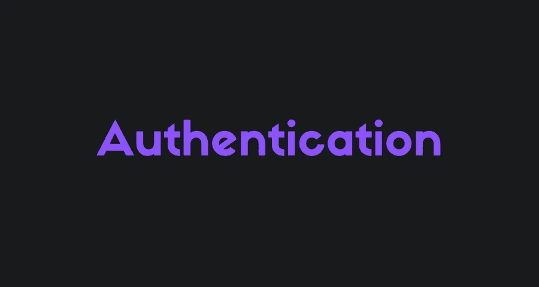

# 您必须停止编写自己的身份验证代码

> 原文：<https://javascript.plainenglish.io/you-must-stop-coding-your-own-authentication-4052f6192ec6?source=collection_archive---------12----------------------->

## 认证是艰难而严肃的，不要再自己编码了。

在这个故事中，您将了解为什么编写自己的身份验证代码在大多数情况下是不好的，以及您还有哪些其他选择。

开始吧！

## 为什么不好？

## 严重的

首先，认证不仅仅是编程。

既然给人提供了一个身份，你就要操心很多法律上的事情。尽管许多开发人员不这么做，但是如果你的产品变大了，那可能会很痛苦。

一些公司甚至雇佣专业人员来为他们做这件事。

## 乏味的

处理认证的许多部分会阻止你处理重要的事情，例如，产品本身。

我过去搞砸了这么多项目，因为我总是试图编写自己的认证代码，过了一段时间就厌倦了。

## 安全性

认证很难。

很多事情都可能出错，一个小小的错误就可能导致严重的问题。

它通常也是黑客网站的第一个目标部分，你真的不想冒任何风险。

# 我可以用什么来代替？

当然有很多选择，让我们看看都有哪些。

## 身份验证提供商

**TL；DR -免费或付费，安全且简单的认证。**

有许多提供者，如 Auth0、Firebase、AWS Cognito 和 Ory，为您提供用于身份验证的 API。

这些解决方案专注于它们所做的事情，并且它们覆盖了几乎所有的用例。

他们几乎都有免费和付费的计划，他们还为你提供 SDK 来快速简单地添加认证，并开始为你的产品开发实际功能。

如果你对你的产品很认真，建议使用提供商，除非你在认证方面经验丰富。

这些提供商也准备好了所有的法律细节，所以你通常不必担心他们。

它们还为您可能需要的任何用例提供 B2C、B2B 和更多身份验证类型。

**Auth0**

 [## Auth0:每个人的安全访问。但不是任何人。

### 阅读客户案例→从通过无缝登录改善客户体验到让 MFA 变得只需点击一下…

auth0.com](https://auth0.com/) 

**Firebase 认证**

 [## Firebase 身份验证|简单、免费的多平台登录

### Firebase Authentication 旨在简化安全身份认证系统的构建，同时改进登录和…

firebase.google.com](https://firebase.google.com/products/auth) 

**AWS 认知到**

 [## Amazon Cognito -简单安全的用户注册和登录| Amazon Web Services (AWS)

### 简单安全的用户注册、登录和访问控制 Amazon Cognito 允许您添加用户注册、登录和…

aws.amazon.com](https://aws.amazon.com/cognito/) 

**理论**

 [## ory——面向所有人的开源身份解决方案

### Ory 是一个经过认证和测试的身份解决方案，由一个大型开源社区提供支持，并受到…

www.ory.sh](https://www.ory.sh/) 

## 开源工具

**TL；DR -通常免费认证涉及更多的技术工作。**

还有开源选项如 Supabase，Keycloak，Logto。

这些工具为您提供了许多构建身份验证的有用工具，如果您自己托管它们，通常是免费的。

这里不同的是，通常没有第三方公司参与。

这就意味着法律上的事情还是要由你来处理，而不是某个专门做法律的公司。

这些工具通常包含更多的工程任务，因为您必须考虑部署和使用它们的 API 或 SDK。

这些工具通常是开发人员的最佳选择，他们需要一种简单的方法来构建具有许多优秀特性的身份验证，同时自己处理工程部分，而不需要为此付费。

**超级认证**

 [## 授权|超级数据库

### 每个认证系统都有两个部分:认证:应该允许这个人进入吗？如果是，他们是谁…

supabase.com](https://supabase.com/docs/guides/auth) 

**钥匙锁**

 [## 钥匙锁

### 用户使用 Keycloak 进行身份验证，而不是单独的应用程序。这意味着您的应用程序不必…

www.keycloak.org](https://www.keycloak.org/) 

**Logto**

 [## Logto:一个创建愉快身份体验的开源解决方案

### 一个开源解决方案，帮助您在几分钟内建立登录、身份验证和用户身份。

logto.io](https://logto.io/) 

## 框架和库

**TL；DR -更容易和免费的认证涉及大量的技术工作。**

有时，您可能仍然希望由您来控制身份验证，而不实际编码细节。

在这种情况下，有许多框架和库可能会有所帮助。

这方面的一个例子是 Authboss，它是一个 Go 库，处理认证的许多部分，同时仍然允许您使用它。

这些框架和库与开源工具非常相似，但是它们被直接集成到一个代码库中。

如果您需要一些定制特性或技术细节来进行身份验证，同时让这些框架和库来处理一般问题，我推荐您使用它们。

**Authboss**

 [## GitHub-volatile tech/auth boss:http auth 的老大。

### Authboss 是一个用于 web 的模块化认证系统。它有几个模块代表认证和…

github.com](https://github.com/volatiletech/authboss) 

# 最后的想法

就是这样！你当然可以继续编写你自己的认证代码，但是我不推荐这样做，正如我在故事中所说的。

请随时告诉我您对这个故事的想法，如果您对编写自己的身份验证代码或选择我为此列出的内容有任何其他事实或意见，请告诉我！

# 仅此而已。感谢您阅读这个故事！

如果你喜欢这个故事，一定要为它鼓掌！你想问我什么都可以。

在 Twitter 上关注我:

 [## re _ ally 边缘

twitter.com](https://twitter.com/Re_allyedge) 

在 Patreon 上支持我:

 [## 阿里木阿尔斯兰卡亚是创造编程故事和教程。帕特里翁

### 今天就成为阿里木阿尔斯兰卡亚的赞助人:在世界上最大的…

www.patreon.com](https://www.patreon.com/allyedge) 

*更多内容请看*[***plain English . io***](https://plainenglish.io/)*。报名参加我们的* [***免费周报***](http://newsletter.plainenglish.io/) *。关注我们关于*[***Twitter***](https://twitter.com/inPlainEngHQ)[***LinkedIn***](https://www.linkedin.com/company/inplainenglish/)*[***YouTube***](https://www.youtube.com/channel/UCtipWUghju290NWcn8jhyAw)*[***不和***](https://discord.gg/GtDtUAvyhW) *。***