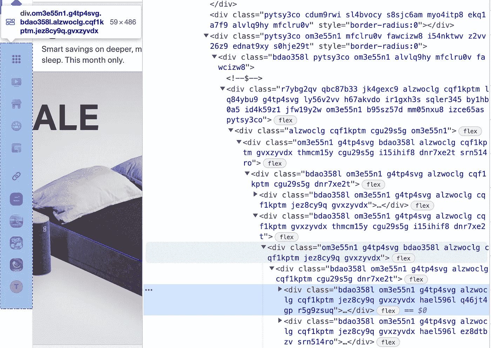
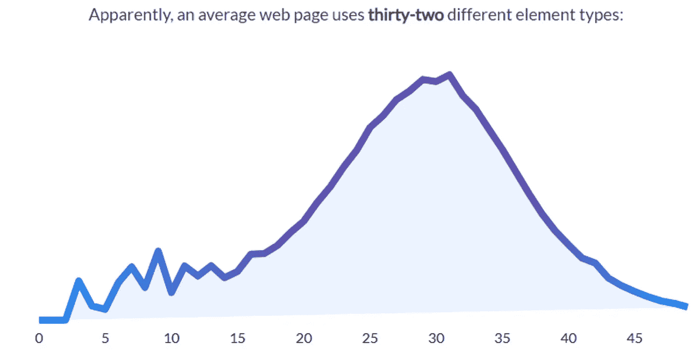

# 为什么你需要重新学习 HTML

> 原文：<https://javascript.plainenglish.io/you-need-to-relearn-html-43509084e987?source=collection_archive---------1----------------------->

## 学习 HTML 以提高您的 web 开发工作的可访问性

> 最初发表于[www.builtin.com](https://builtin.com/software-engineering-perspectives/relearn-html)

我做了将近五年的前端开发人员，这时我有了一个可怕的认识:我真的不知道如何编写 HTML。我花了大部分时间学习如何在 [JavaScript](https://builtin.com/software-engineering-perspectives/dont-learn-reactjs) 的世界中使用高级工具，但从未对基本的内容创作语言 [HTML](https://builtin.com/learn/html) 给予同样的关注。因此，我所做的大部分工作都是不合格的，尤其是在可访问性和信息层次方面。

当我在互联网上查看 HTML 的状态时，似乎很多 web 开发人员都有我的经历。这就是为什么我认为重新学习这项基础技术应该是大多数开发专业人员的任务清单。


Image Credit [Simon Barber](https://unsplash.com/@simonbarber) on [Unspash](http://www.unsplash.com)

# 什么是 HTML？

代表超文本标记语言的 HTML 是用于构建网页和在其中构建内容的标准语言。太多的开发人员不了解 HTML 的基础知识，这意味着网站不能发挥应有的作用。

# 问题有多严重？

许多世界顶级网站在 HTML 方面都没有很好地创作自己的网站。甚至像脸书这样的互联网巨头也不能正确使用语义 HTML 标签，并且文档轮廓难以理解。



Real Screenshot of the markup on www.Facebook.com

HTML 规范中有超过 110 个标签，开发者只在网络上频繁使用其中的大约 30 个标签。



The average number of element types used on 30 Million web pages in 2020\. source: [https://www.advancedwebranking.com/seo/html-study/](https://www.advancedwebranking.com/seo/html-study/)

我们来看看这种 HTML 原创性差的趋势从何而来。

# HTML 背景

在我们深入这个主题之前，理解我们将使用的背景术语是很重要的，尤其是语义和用户代理。

## HTML 语义

HTML 的目的是在你的文档内容(文本、图像、视频等)之上提供一层[语义](https://developer.mozilla.org/en-US/docs/Glossary/Semantics)(换句话说，“含义”)。).这方面的一个例子是`time`标签。当您用这个标签标记一段内容时，您就告诉了用户代理关于该内容的含义。这个标记`Sat, July 10th`显然是一个时间或日期，而文本“7 月 10 日星期六”并不清楚。这些标签对我们来说似乎不重要，因为作为人，我们隐含地理解书面日期的语义，但这些标签对于帮助非人类用户理解你网页上的信息是必不可少的。

## 用户代理

在 web 开发中，您的最终“用户”实际上并不是使用您的网站的人，而是读取您的页面内容并将其显示给用户的浏览器。这个浏览器在 web 开发中被称为“用户代理”换句话说，代表用户的技术。这个用户代理可以是浏览器，但也可以是网络爬虫、屏幕阅读器或其他类型的网站解析器。用户代理是除了人类用户之外，web 开发人员需要为浏览器编写 HTML 的系统。

# 什么是好的 HTML？

写得好的 HTML 是语义化的、特定的，可以被用户代理解析或理解，只需要最少的 [CSS](https://builtin.com/learn/css) 样式或 [JavaScript](https://builtin.com/learn/javascript) 覆盖的干预。

写得好的 HTML 的主要标志是逻辑信息层次。每一页都应该使用从最大到最小的所有标题元素来概括页面上的数据。

例如，header 元素的每一级都应该定义它上面一级的子主题，如下例所示。这是让用户代理理解你的网页上的信息是关于什么的基础。

```
[h1]The Lord of the Rings├── [h2]Contents└── [h2]Plot[edit] └──[h3]The Fellowship of the Ring[edit] ├──[h4]Prologue[edit] ├──[h4]Book I: The Ring Sets Out[edit] └──[h4]Book II: The Ring Goes South[edit]
```

其次，有效的 HTML 正确地使用可用的 HTML 标签。HTML 规范中大约有 115 个标签，但是大多数开发者只使用了其中的大约 20 个标签。你对内容的标记越具体，你的网页就越容易被用户代理理解。

写得好的 HTML 的最后一个指标是 CSS 和 JavaScript 使用的减少。HTML 规范有许多跨浏览器广泛支持的有用元素，如音频播放器元素、视频元素和许多其他元素。智能 web 开发人员利用这些规范，而不是去寻找浏览器提供的不一致的 JavaScript APIs。

# 为什么开发者会写出糟糕的 HTML？

开发人员编写糟糕的 HTML 的第一个也是最深刻的原因是 HTML 规范本身。该规范冗长、深奥，外行人很难读懂。最重要的是，规范是不一致的，甚至当涉及到像文档大纲这样极其重要的主题时也是如此，文档大纲是规范指示浏览器应该用来解释信息层次的算法。该规范坚持认为，浏览器在计算标题相关性时应该考虑文档节。然而，七年来，没有浏览器真正做到这一点。规范和现实世界之间缺乏一致性，这导致了开发社区中的许多混乱和对规范的缺乏理解。

第二个原因是许多前端框架的出现，减少了开发人员直接与 HTML 交互的需求。许多开发人员正在使用在语法上非常固执己见的前端框架，如 React.js 或 Vue.js，尽管这些工具允许功能开发非常快，但缺乏对底层技术的接触会导致开发人员不理解编写良好标记的基础。一个例子是收集用户输入的基本浏览器表单。React.js 框架覆盖了 HTML `form`元素，为开发人员在他们的网站上制作表单提供了更简单的方法。因此，许多开发人员可能会跳过学习表单元素的 API，甚至完全跳过使用这个基本的 HTML 元素。

导致糟糕的 HTML 创作的最后一个因素是 HTML5 中定义的 HTML 标记的数量和深度。HTML5 规范在 2014 年发布时发生了重大的范式转变。该规范发布了语义 HTML 标签，这是一个用像`header, main, nav`和`footer`这样的标签定义页面内容安排的框架。这些顶级标签是语义 HTML 的基础，但它们有数百个，每个都有不同的语义。这些新标签的数量导致了开发社区的缓慢采用，首先是支持规范的浏览器，然后是开发人员。

# 重新学习 HTML

由于许多现代框架中庞大的规范和远离语义 HTML 的焦点，许多开发人员可能仍然需要“重新学习”一些编写 HTML 的基本概念。

提高你作为一个 HTML 作者的技能将在 web 开发的所有领域给你带来极大的好处。HTML 文档是每个网页的基础，因此提高它的一致性和清晰度不仅会产生一个高度可访问的网页，而且还会减少维护开销，减少您的整体代码大小，并使您的代码更加浏览器友好。

> 感谢阅读。如果你喜欢我的故事，想支持我，请考虑成为[中的成员](https://tinycode.medium.com/membership)。每月 5 美元，你可以无限制地访问媒体内容。如果你通过[我的链接](https://tinycode.medium.com/membership)注册，我会得到一点佣金。
> 
> 还有，这里还有几个类似的故事，你可能会喜欢！

[](https://medium.com/weekly-webtips/send-data-across-the-network-with-the-form-element-291453f0d41f) [## 使用

### 语义 HTML 基础

medium.com](https://medium.com/weekly-webtips/send-data-across-the-network-with-the-form-element-291453f0d41f) [](https://medium.com/weekly-webtips/what-is-html5-sectioning-content-c8af98b13210) [## 什么是 HTML5「分段内容」？

### 以及理解它如何让你成为更好的 web 开发人员

medium.com](https://medium.com/weekly-webtips/what-is-html5-sectioning-content-c8af98b13210) [](https://medium.com/semantic-html/the-footer-element-8d8c3b4ab0c1) [## 使用元素向页面部分添加元数据

### 大多数网页都包含一个。它通常位于文档、章节或文章的底部。只是…

medium.com](https://medium.com/semantic-html/the-footer-element-8d8c3b4ab0c1) 

*更多内容看* [***说白了。报名参加我们的***](https://plainenglish.io/) **[***免费周报***](http://newsletter.plainenglish.io/) *。关注我们关于* [***推特***](https://twitter.com/inPlainEngHQ) ，[***LinkedIn***](https://www.linkedin.com/company/inplainenglish/)*，*[***YouTube***](https://www.youtube.com/channel/UCtipWUghju290NWcn8jhyAw)*，* [***不和***](https://discord.gg/GtDtUAvyhW) *。对增长黑客感兴趣？检查* [***电路***](https://circuit.ooo/) *。***