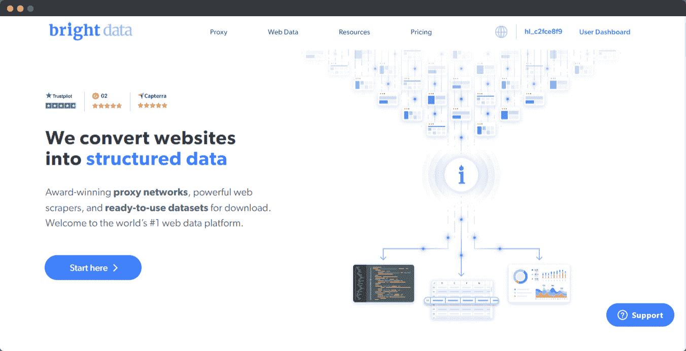
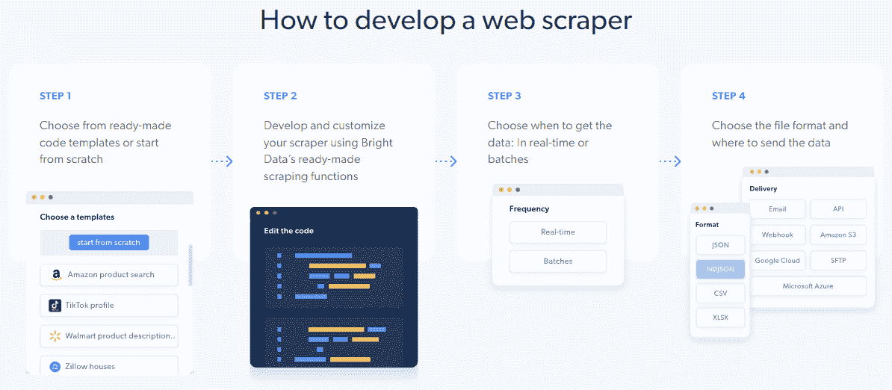
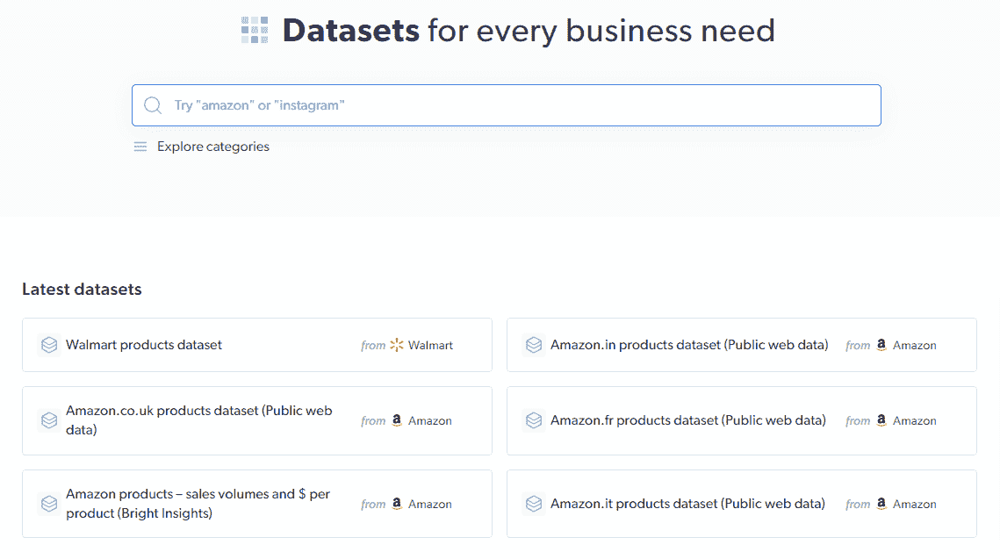
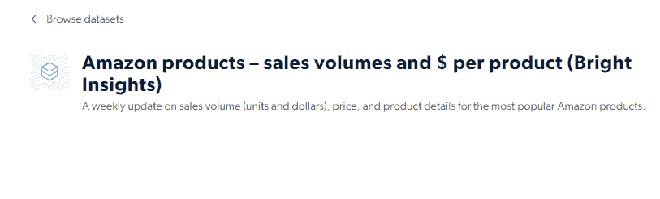
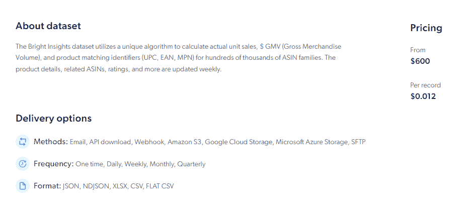
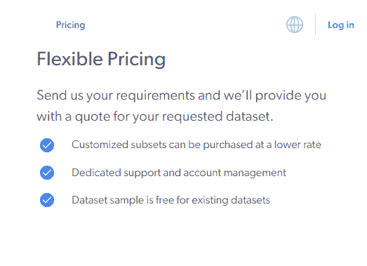

# 你的商业危机管理计划可能已经过时了

> 原文：<https://javascript.plainenglish.io/your-business-crisis-management-plan-may-be-outdated-66409eb2813e?source=collection_archive---------12----------------------->

## 仅在美国，2022 年 Q1 就有超过 13000 家公司被清算。以下是你如何避免类似的命运。

***原文由*** [***珍贵的阿德因卡***](https://medium.com/u/a3c379a6cddd?source=post_page-----66409eb2813e--------------------------------) ***写成，在此发表*******。****

**

# *介绍*

*任何企业都可能在其生命周期中面临许多逆境。据说，当风暴来临的时候，坚韧不拔地度过风暴是成功的关键。然而，这说起来容易做起来难。*

*问题是，今天的企业危机是突然发生的，并且以各种方式出现；因此，他们可能是不可预测的和具有挑战性的计划。好消息是，如果你有合适的工具和知识，你可以把它们分类。*

*在现代社会，克服危机的关键是有一个严密的危机管理计划。但是，制定一个在效率上确实无懈可击的计划需要健康地吸收数据，比如关于你的竞争对手的战略的数据，或者同行业其他组织如何处理类似危机的历史，以及成功的程度等等。因此，像 [**明亮数据**](https://brightdata.grsm.io/3k8dv4026g8z) 这样的工具将这些数据带到你的指尖，应该构成你的危机管理计划的基石。*

*我们将看看您如何利用这些工具来成功处理在您的业务生命周期中出现的前所未有的事件。但首先，让我们了解什么是危机管理/弹性规划:它需要什么，它的历史缺点是什么，以及它仍然面临的主要障碍。*然后*我们将深入探讨如何利用 **数据**为您的业务**制定安全维护的通用计划。***

# *危机管理/复原力规划及其意义概述*

*“业务弹性”是指一个组织对可能危及其运营、人员、资产、品牌或声誉的重大不可预见的变化做出快速响应和调整的能力。*

*任何公司最大的噩梦应该是清算，为了防止这种情况发生，最重大的决策最好提前计划。图表读数描绘了许多国家的黯淡景象。在 *Q1(第一季度) *2022* 在*美国*在[***13160***](https://tradingeconomics.com/united-states/bankruptcies)*(一万三千一百六十)*公司已经清算完毕。**

*自从柯维德·疫情事件以来，大多数企业都很难东山再起——最多，他们试图生存下去。从那以后，商业领袖们意识到为失败做计划和为成功做计划同样重要。*

*根据最近的事件(健康危机、极端气候等)判断。)，业务中断的风险迫在眉睫。因此，主要的目标应该是确保你的业务以一个正常的甚至更好的速度稳步发展。拥有业务弹性或危机管理计划的好处是发展对关键挑战的抵抗力，吸收它们，并在问题中茁壮成长。*

# *弹性规划的历史盲点*

*从历史上看，业务弹性只关注 IT 部门，关注网络攻击和犯罪。然而，过去几年表明，不仅仅是与技术相关的问题，还有更大的问题。有可能一项政策最终会影响你公司的业绩，或者一场全球健康危机会导致人力短缺。*

*换句话说，从考虑不周的公司政策到灾难性的全球事件，你的员工或企业资产都可能受到影响。因此，对于企业来说，扩展他们对业务弹性的理解和范围以包括这些因素是至关重要的。*

# *给企业的弹性规划带来障碍*

*世界各地的企业都面临着无数的障碍，使他们无法有效地应对危机并经受住时间的考验。下面讨论几个重要的问题。但是连接它们的一根关键的线？信息或数据的缺乏。*

## *1.获取必要技术和人才的成本*

*大多数时候，尤其是对于初创公司，获取正确的技术和/或人才来有效降低风险是很昂贵的。某些技术很昂贵，但就回报而言，并不总是正确的选择。但是，由于缺乏必要的信息和适当的经验，初创公司或中型公司很容易随波逐流，判断什么是他们业务的最佳选择，什么不是最佳选择，如果选择被证明是错误的，最终会发现自己在没有计划或支持的情况下走到了路的尽头。*

## *2.复杂的案例场景(太多可能的结果)*

*有可能前面是糟糕的日子，也有可能前面是更好的日子，这就是为什么这是一个机会的游戏。在一个复杂的系统中有太多的可能性——其中有更大的巨头在同一个行业中发挥作用——如果没有必要的信息或技能，很难说接下来会发生什么。*

## *3.缺乏与历史事件相关的高质量数据*

*通常，问题在于缺少商业智能团队可以访问的信息。因为这样的信息需要框架来访问数据、分析数据、处理数据，并以有见地的方式呈现数据。数据无处不在，但也有可能数据在逻辑上不正确、损坏、过时和不完整，这些因素完全取决于获取数据的来源。由于不正确的推测和估计，这很可能导致非常低的性能或最坏的情况，全部损失或清算。*

# *利用数据加速弹性规划，迈向未来*

*正如我们在上面看到的，缺乏数据是企业制定有效的业务弹性计划的主要障碍。如今，成功的弹性规划需要企业意识到其竞争以及他们所在行业或部门普遍面临的问题，并能够在危机规划和日常运营场景中利用这些数据。*

*手头拥有类似行业中的公司如何处理此类问题的相关数据(无论成功与否),并利用这些数据做出明智的决策将:*

*   *帮助提出一个有效和成功的业务弹性计划。*
*   *允许在危机发生时的快速适应性，这也是一个企业成功的关键指标。*

*这就是 [**亮数据**](https://brightdata.grsm.io/3k8dv4026g8z) 登场的地方。作为领先的网络数据平台，它允许您访问无限的数据和高级统计数据，以解释数据并为您的决策和规划提供信息。开始很容易，您可以即时访问众多可用工具和技术的集合，以充分利用数据集并根据您的需求定制结果—就这么简单。*

**

# *光明数据提供的关键工具*

## *1.数据收集器— Web Scraper*

*处理大量数据可能是资源密集型的，需要在基础架构、人员和维护方面进行大量投资。当你在危机或危机前的情况下运营时，这会让你陷入困境。这就是光明数据的 [**数据采集器**](https://brightdata.grsm.io/data-collector8081) 大放异彩的地方；这是一个**基于云的**工具——这意味着注册这项服务的企业不需要投资基础设施和硬件，从而为其他重要事务腾出重要的时间和资源。此外，该工具基于云的特性消除了扩展数据收集和分析操作中涉及的资源消耗因素。*

*数据分析中需要大量时间和精力的另一个因素是数据的清理。这是传统数据分析工作流程中需要的一个额外的、容易出错的步骤。尤其是在弹性计划或危机管理计划中，这个阶段保持无错误是至关重要的。在这里，数据收集器开辟了另一种方式。它让您跳过这一步，因为它分发干净的数据集准备进行分析。由于是人工智能驱动和自动化的，这个过程需要用户很少的努力和关注。*

*最重要的是，该工具符合所有相关的数据保护法律要求，包括新的欧盟数据保护监管框架、GDPR 和 2018 年加州消费者隐私法案(CCPA)，这意味着您的数据是在遵守法律的情况下获得的。当你试图为威胁你业务的不确定性做计划时，你需要担心的最后一件事是法律纠纷。*

*下图显示了 Web Scraper 的典型数据收集周期中涉及的 4 个简单步骤:*

**

*这款铲运机的功能性、定制性、可扩展性和覆盖范围使其成为您工具箱中不可或缺的一部分。数据收集器是一个值得信赖的合作伙伴，您可以在寻找数据时依靠它来支持您的危机管理计划。*

## *2.数据集*

*如果你对网页抓取不熟悉，你甚至可以购买完整的现成 [**数据集**](https://brightdata.grsm.io/datasets6589) 来满足你的需求。Bright Data 拥有丰富的数据集合，涵盖多个平台、网站和定期更新的数据点。这确保了您的数据与您当前的需求相关。*

**

*例如，如果你在亚马逊上经营一家电子商务商店，那么让自己了解最新趋势是有意义的:需求高的产品，需求低的产品，热门商品的售价等。 [**光明数据**](https://brightdata.grsm.io/3k8dv4026g8z) 有大量预建的数据集，你可以利用它们来判断亚马逊上产品的市场趋势。*

*电子商务不是一种规避危机的商业模式。因此，在这种情况下，提前计划危机也很重要。正如我们之前所建立的，相关数据的可用性对于电子商务企业在现代商业世界的不确定性和异常性中生存下来是必要的。*

**

*在亚马逊生态系统中，准确数据的可用性减少了您填充库存时的猜测需求，帮助您避免错误的投资决策，让您走上实现销售目标的正确道路，并降低遭受损失和挫折的风险。如果你投资了正确的产品，并以最优的价格出售，你将毫无障碍地达到你理想的收入数字。*

**

*如上图所示， [**亮数据**](https://brightdata.grsm.io/3k8dv4026g8z) 平台上可用的数据非常丰富，可以多种格式、多种方式获取。*

**

*当涉及到定制数据集或数据子集时，在定价和灵活性方面有透明度。*

*相关数据的可用性——不断更新以反映行业或利基市场的现状——对于跟上最新趋势至关重要。企业可以保持领先，避免陷阱，从而避免大多数危机情景。随着不确定性的增加和客户的轻浮，衡量客户情绪对于任何平台上的任何电子商务企业的生存都是至关重要的。*

*根据 Warren Buffet 的说法，为了使您的业务更加安全，您需要围绕它建立一条更宽的护城河，而在现代背景下，数据是拓宽这条众所周知的护城河的关键。*

# *可行的见解*

*俗话说，“知识就是力量。”知识不就是信息吗？但是这些信息的*应用*才是真正的力量展示。*

*在这个行业的新时代，数据引领、通知、主导甚至预测未来，在这个时代取得成功取决于您获取、分析、处理和显示这些数据的能力，以便智能地指导您的业务弹性规划流程。*

*试错的岁月一去不复返了。不需要昂贵的人才，也不需要昂贵的技术。此外，还可以访问技术文档和人工帮助。不再需要猜测或不一致；只有正确的数据和适当的访问方式。帮助您提取这些数据并以一种可访问的方式呈现出来的平台对帮助您的企业在不可预见的未来蓬勃发展大有帮助。*

## *快速链接*

*   *[**https://brightdata.com**](https://brightdata.grsm.io/3k8dv4026g8z)*

****更多内容看* [***说白了就是***](https://plainenglish.io/) *。报名参加我们的* [***免费周报***](http://newsletter.plainenglish.io/) *。关注我们关于* [***推特***](https://twitter.com/inPlainEngHQ) ， [***领英***](https://www.linkedin.com/company/inplainenglish/) ***，***[***YouTube***](https://www.youtube.com/channel/UCtipWUghju290NWcn8jhyAw)***，以及****[***不和***](https://discord.gg/GtDtUAvyhW) *对成长黑客感兴趣？检查出* [***电路***](https://circuit.ooo/) ***。*******