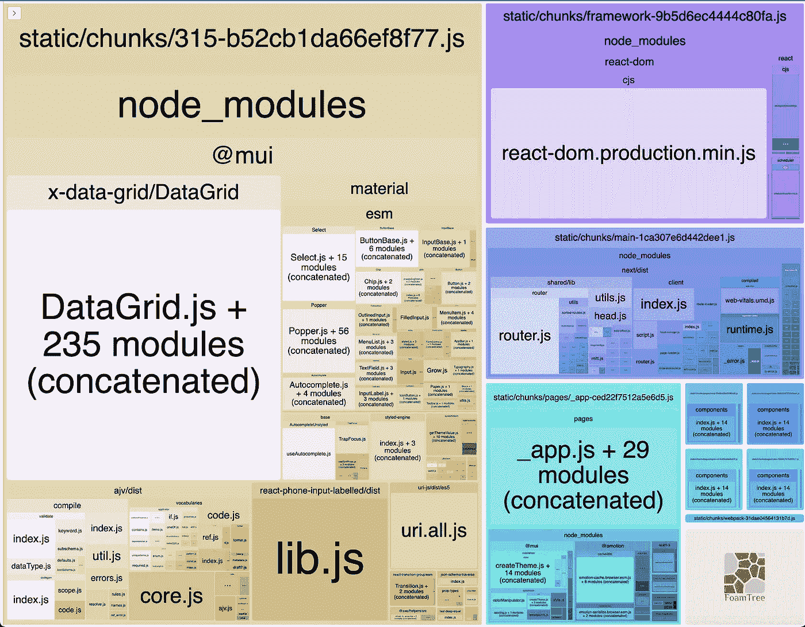

# 你的 Next.js 包会感谢你的

> 原文：<https://javascript.plainenglish.io/your-next-js-bundle-will-thank-you-89962402a5ec?source=collection_archive---------3----------------------->

## 如果您的 Next.js 应用程序遇到了非常大的包的问题，那么这篇文章可能是您的救星。

Picture by Marek Piwnicki on Unsplash

如果您的 Next.js 应用程序遇到了非常大的包的问题，那么这篇文章可能是您的救星。

# 前言

在最后一段时间，我不得不使用 Next.js 做一个项目，要求提高它的性能，因为不知道什么原因，一切似乎都非常慢。

虽然在本文中除了包的大小还有其他问题(缺少图像优化，不良的缓存策略)，但是我将专门关注包的大小所引起的问题。

# 初始检查

我做了一些检查，运行了几个 Lighthouse 报告，最终在移动和桌面上的平均性能得分为 **35 分**。实际上，他们没有错，只是存在一些问题。在快速检查报告之后，我继续进行另一种类型的测试，启动一个产品构建来检查接下来提供给我们的漂亮报告。这个结果让我**从椅子上跳了起来**。

为了说明这一点，让我们从正确的东西开始，下面是一个完全可以接受的中小型 next 应用程序的构建。(其实是我的[网站](https://renatopozzi.me))。

正如您所看到的，第一个负载 JS 在 100kB 以下，所以您漂亮的终端将以令人振奋的绿色显示。

然而，在我告诉你的情况下，输出是完全不同的。只是稍微大一点…

# 分析问题

为了更好地帮助您理解和测试，我准备了一个演示项目，其中包含的问题与我正在处理的问题类似，这样您就可以以一种实用的方式帮助您理解如何着手解决这类问题。您将看到的数据和测量值与这个演示项目相关。你可以看看所有的[源代码](https://github.com/itsrennyman/demo-bundle-analysis)，它真的很小，所以需要很短的时间。

下面是被指控的应用程序的生产版本的输出:

你不觉得很麻烦吗？个人觉得，看到这种东西我有点害怕。现在让我们分析这个输出，并找出一些恢复这个应用程序的想法。

一些快速注释可以帮助您更好地理解这里的总体问题:

## 所有文件共享的 JS

如您所见，底部显示了一个部分，其中指定了所有底层代码如何被为 API 和页面生成的每个块继承。

这是什么意思？例如，在/sign-in 页面中，第一次加载的 JS 为 303kB，但是公共部分的重量为 109kB，这意味着该页面中使用的模块的实际重量为 194kB。

## CSS 不包括在计算中

对许多人来说这可能是显而易见的，但值得指出的是，对于那些可能是新手的人来说，你在底部看到的任何 CSS 都不包括在计算中。这并不是说它没有引起可能的问题，而是与另一种类型的问题相关。

所以，让我们从一些看似显而易见的事情开始，怎么可能所有的页面**都是相同大小的**？这是非常奇怪的，看所有的网页都有不同的导入源，因此，它们应该有不同的大小，对吗？同样有趣的是， *_app* 是**相对较小的**，所以不会对这些巨大的数字产生太大的影响。

我们可以做的一件事是尝试分析我们的生产捆绑包，看看它会告诉我们什么，我们可以使用一个非常好的工具来进行捆绑包分析，称为 [Next.js Bundle Analyzer](https://www.npmjs.com/package/@next/bundle-analyzer) 它非常容易安装(所以我将跳过这一部分)，它会为您提供一个关于所有软件包大小的漂亮的交互式热图。

这是构建的依赖关系热图，如果您下载了源代码，也可以使用`ANALYZE=true npm run build`来完成:

如果你从未见过这样的图表，它可能看起来非常复杂，实际上概念很简单，最大的窗格是最重的，窗格的内容是包含在相应最大窗格中的源代码。

那么，快速浏览一下图表，你认为问题出在哪里？实际上，这里有两个主要问题，让我们一个一个地深入探讨。

**第一个问题**对于通常不做这类事情的人来说可能很难发现，但是它很快就会变得非常明显:有一大块**包含了所有的依赖关系！**

是的，我说的是左边的那块，你知道吗？这个将与所有导入**至少一个依赖项的页面共享，即使后者很小**！我认为这是一个有用的提示，关于为什么所有的页面都有相同的大小！

**第二个**相反，可能更容易发现，这个应用程序使用了一些巨大的依赖项，首先跳出来的是:

*   @ mui/x-数据网格
*   ajv
*   反应电话输入标签

在知道这些依赖项的名称后，我们可以采取的一个好的行动是快速查看我们的源代码，看看它们在哪里被使用以及使用了多少。在我们的情况下，如果您愿意，您也可以这样做，但是如果您不愿意，好消息是，我已经为您做了这项工作，结果是:

*   @mui/x-data-grid 在`random-table.js`组件中使用，而该组件仅在`table.js`页面上使用。
*   “ajv”包非常相似，它被用在了`auth-form.js`组件中，而这个组件只被用在了`signin.js`页面中。
*   最后一个在`PhoneInput`中使用，但是后面的**没有在任何页面上使用**！！！

现在，知道了是什么导致了这个问题，回头看一下前面构建的输出。WTF 正在这里发生！？

# 桶形锉的神奇疯狂

明确一下，什么是桶形锉？嗯，你知道什么时候你把所有的导出放在一个`index.js`文件中，以便有更容易的导入路径吗？这是一个桶形锉。(你知道 Node.js 创建者[后悔创建了它](https://youtu.be/M3BM9TB-8yA?t=883)吗？)

因此，我想进行试验，查看捆绑包度量，我们肯定知道`ajv`是一个严重的依赖项，因此我将打开`signin.js`页面，并对 AuthForm 组件进行注释。

太好了，我迫不及待地想重做一次，看看我减了多少体重！所以我重启了一个版本…“快乐音乐停止了”，什么都没改变。`signin.js`页**还是 303kB** ...

在一阵歇斯底里中，我决定尝试一切，所以我也评论了`Navbar`组件，会发生一些事情，不是吗？

在下一个版本**神奇的事情发生了**:

现在书页失去了所有的重量！这怎么可能呢？是不是`Navbar`组件导致了一切？试着把所有东西都装回去，这次只移除`Navbar`组件。有什么变化吗？

让我猜猜，没有吧？因此，我们确定，通过分别移除这两个组件，问题仍然存在，但是当我们去移除这两个组件时，一切都神奇地消失了。

现在我想让你知道我隐藏的一个小秘密，这样你就可以推理和理解发生了什么，我将通过做最后一个测试让你知道，让我们试着像这样改变导入:

让我们启动另一个构建，现在发生了什么？

看起来权重降低了不少，当然还是大因为让我们记住`AuthForm`使用的是重度依赖，但是和现在相比有什么实质性的区别呢？

如果您注意到 components 文件夹内部，有一个迄今为止从未提及的看似无害的文件 index.js:

想一想这个文件中发生了什么，这个文件负责导出`components`文件夹中的所有组件，使它们可以用于更简单的导入语法。我将在此粘贴两个导入版本之间的差异:

所以，是的，我们保存了一个子目录，但是结果是什么呢？从这个`index.js`中导入哪怕是一个很小的模块也足以导致页面包中所有其他组件的大量导入。

这就是为什么当我们只移除了`AuthForm`和`Navbar`之间的两个组件中的一个时，结果没有改变，因为两者都导致了相同的大规模导入效应。只有将它们都删除，文件`index.js`的引用才会丢失，因此没有组件被导入！

作为继续之前的最后一个测试，让我们替换每个页面上的所有导入，并启动另一个构建:

现在一切似乎更加一致，考虑到使用的模块，每个页面似乎都有正确的大小。

事实上，**页面变大并不奇怪，因为查看热图我们知道@mui/x-data-grid 确实很大。**

# 为什么会这样？

到目前为止，我们已经发现并解决了所有页面都有一个由未使用的依赖项组成的巨大捆绑包的问题，我们看到这是从一个`index.js`文件导入的原因，现在我想解释一下为什么这个东西会导致这个问题。

通常，在生产构建中，JavaScript 代码会经历几个操作，包括移除未使用的模块，这种特殊现象被称为**树抖动**。你可以这样想象:你的花园里有一棵树，那棵树是你的应用程序源代码，绿色健康的叶子是你的应用程序使用的模块，而棕色和几乎枯死的叶子是未使用的模块。

现在想象用你所有的力量摇动这棵树**让枯叶落到地上，只留下健康的叶子**。这就是树抖动，在我们的例子中，通常是由 Webpack 或 Rollup 这样的模块捆绑器完成的。

基本上，Next.js 的思想是，框架试图通过创建页面相关的块来应用代码分割，试图删除特定页面的所有未使用的模块，以使它们更快地加载，并且没有无用的代码要评估。

但是有些情况下，我们的 bundler(这里是 webpack，因为它被 Next 使用)不能自动删除一些模块。这只是因为 Terser(web pack 用于此操作的模块)**不能总是安全地确定是否使用模块导出**。正如 webpack 文档所说:

> Terser 试图弄清楚，但在许多情况下它并不确定。这并不意味着 terser 没有做好自己的工作，因为它想不通。在 JavaScript 这样的动态语言中，要可靠地确定它太难了。

这是否意味着桶形文件不能再使用了？**大概不是**。

# 替代解决方案

我已经听到你们的声音用这样的短语轰炸我的脑袋:

> 是的，一切都很好，但是有没有办法通过保留`index.js`来获得相同的结果？

实际上，(大部分时间)对你来说是有替代方案的。

正如你刚刚读到的，Terser 做得很好，但有时它并不完美。为了让它更好地工作，我们可以给 webpack 一个叫做`sideEffects`的好提示。这个值可以放入一个`package.json`，并接受正则表达式、字符串和布尔值作为值。**但是**到底是什么副作用呢？

官方文件可以帮助我们:

> “副作用”被定义为在导入时执行特殊行为的代码，而不是公开一个或多个导出。这方面的一个例子是聚合填充，它影响全局范围，通常不提供导出。

例如，在我们的例子中，我们不使用任何副作用，所以我们可以直接设置 false，帮助 webpack 删除未使用的模块:

现在，如果我们试图创建一个生产构建，从 barrel (index.js)文件中保留我们的旧导入，看看会发生什么:

当我们用单个文件替换桶文件中的所有导入时，我们得到了相同的结果！您还可以查看新的热图，立即发现差异。

看看现在有多少不同的块(大小不同)，我们没有更多的大块被所有页面共享！

## 一个聪明的问题

你还记得我们什么时候从`signin.js`页面中移除了`AuthForm`和`Navbar`组件吗？我们最初解决了这个问题，但是是我错了，还是仍然存在一个导入的依赖？

> 从“@mui/material”导入{ Box }；

为什么这种依赖没有继续导致其他两个问题？然而这里又一次使用了一个[桶文件](https://github.com/mui/material-ui/blob/master/packages/mui-material/src/index.js#L51)来导出所有的组件，嗯，答案还是可以在这里找到[。如果你想知道，](https://github.com/mui/material-ui/blob/master/packages/mui-material/package.json#L76) [ChakraUI](https://github.com/chakra-ui/chakra-ui/blob/main/packages/components/accordion/package.json#L27) 在所有组件上都使用了相同的技术，而 [MantineUI](https://github.com/mantinedev/mantine/blob/master/src/mantine-core/package.json#L10) 也在使用它，甚至 [Lodash](https://github.com/lodash/lodash/blob/master/package.json#L10) (在 ESM 版本中)也利用了这种技术。

# 增强树木摇晃的常见技巧

我认为有许多我们可以应用的技巧，我将在这里写下一些我现在经常使用的技巧。

## 使用树震动库

同样，这可能是老生常谈，但经常看到项目有大量不可树摇动的依赖项，你怎么知道其中一个是否可树摇动呢？使用像[捆绑恐惧症](https://bundlephobia.com/)这样的工具。

## 避免传输到公共文件

你应该配置你的捆绑器，让你所有的 ESM 保持完整，而不是把它转移到 CJS，否则，树抖动将更难从捆绑器上应用。例如，您可以使用这段代码创建 Babel:

## 避免明星进口

你应该只导入你需要的模块，避免从一个模块中导入*，否则所有的东西都将包含在你的代码块中，即使它没有被使用！

# 处理巨大的依赖性

所以，一个问题解决了，但我们又有了另一个问题。让我们考虑如何处理这些巨大的依赖性，选择其中之一，我通常会问自己一些问题:

*   这个库是必需的还是可以用其他东西代替？
*   如果我们需要这些功能，有没有更轻量级的替代品来做同样的事情？(想想 lodash 和 lodash-es)

让我们一个接一个地挑选这些依赖项，看看我们是否可以做一些替换，从最大的那个 **@mui/x-data-grid** 开始。

> 快速提醒一下，正如我之前说的，这个项目是一个例子，它不是真实的东西，它是为了教学的目的。请根据您的需求考虑这些事项！

所以，看看代码，基本上，我们显示的是一个表格，没有任何特殊的需求，它只是一个用户列表。我们不关心这个网格提供给我们的任何复杂特性。而且，在需要排序或搜索的情况下，我们肯定可以使用更轻量级的解决方案，比如更轻量级的 [react-table](https://tanstack.com/table/v8) 。

让我们继续谈论 **ajv** ，即使在这种情况下，这里的要求是验证一个简单的表单，简单到我们甚至可以手工完成。在这种情况下，没有太多要说的，如果没有障碍，选择一个与此不同的解决方案是很好的。这个库[不是树摇式的](https://bundlephobia.com/package/ajv@8.11.0)，这一事实强调了这一点。一个不同的库？超级结构可能很酷(也更轻)。

最后一个是最简单的，实际没有用到**react-phone-input-labelled**。这可以很容易地删除，因为它唯一的任务就是增加包的重量，但是为什么我要包含它呢？仅仅是因为**通常**如果代码库没有持续维护，那么在各种变更和需求变更之间**可能会有一些东西留在源代码中，甚至没有被使用**。因此，有时做一个依赖检查，然后看看是否可以删除一些东西，以节省字节和构建时间，这是很好的。

# 最后但同样重要的是！

这是一个漫长的旅程，但我希望你们都安然无恙，如果有任何问题或者你只是想停下来打个招呼，你可以在 [Twitter](https://twitter.com/imarenny) 或 [LinkedIn](https://www.linkedin.com/in/itsrennyman/) 上找到我。

另外，顺便在我的留言簿上签名，让我知道你对这篇文章的看法！

我会在下面留下一些可能对你有帮助的链接！

*   [摇树文档(Webpack)](https://webpack.js.org/guides/tree-shaking/)
*   [恐束症](https://bundlephobia.com/)
*   [vs code 的导入成本](https://marketplace.visualstudio.com/items?itemName=wix.vscode-import-cost)
*   [我的网站！](https://renatopozzi.me/)

*更多内容请看*[***plain English . io***](https://plainenglish.io/)*。报名参加我们的* [***免费周报***](http://newsletter.plainenglish.io/) *。关注我们关于*[***Twitter***](https://twitter.com/inPlainEngHQ)[***LinkedIn***](https://www.linkedin.com/company/inplainenglish/)*[***YouTube***](https://www.youtube.com/channel/UCtipWUghju290NWcn8jhyAw)*[***不和***](https://discord.gg/GtDtUAvyhW) *。对增长黑客感兴趣？检查* [***电路***](https://circuit.ooo/) *。***