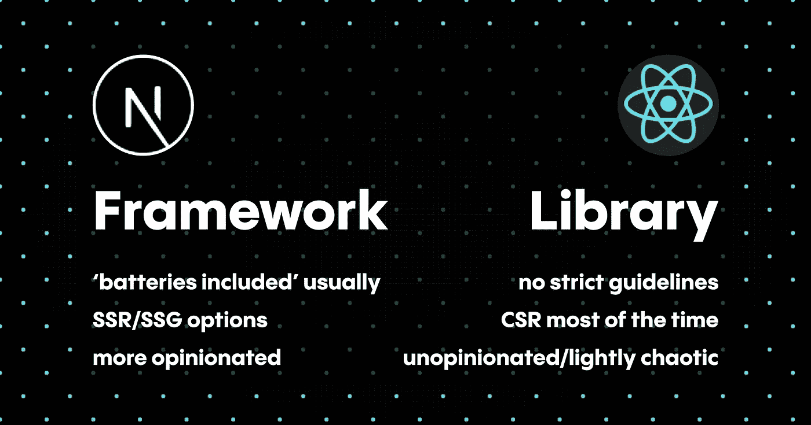
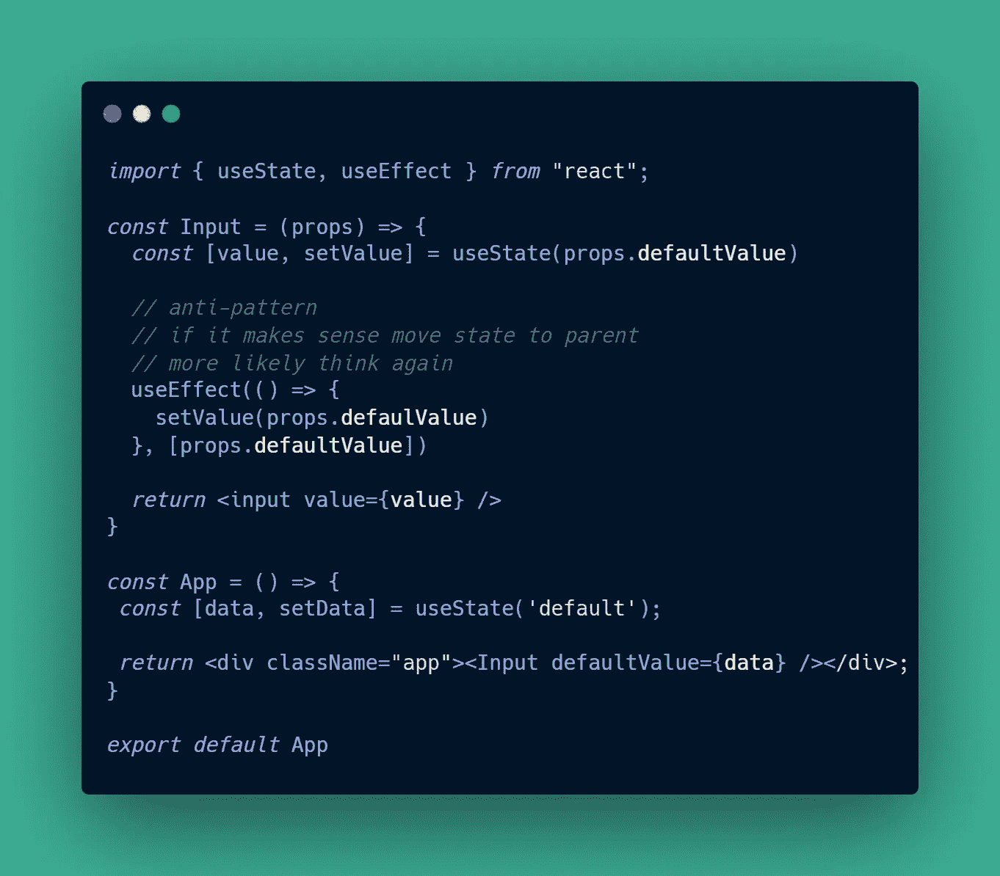
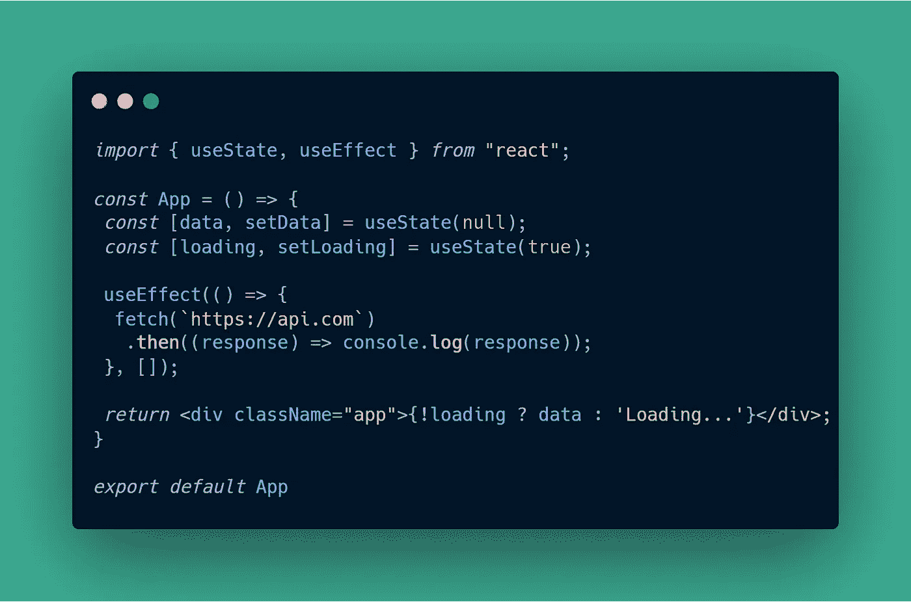
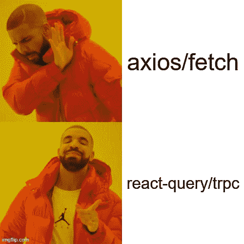

# 你的 React 代码很烂，这就是原因

> 原文：<https://javascript.plainenglish.io/your-react-code-sucks-and-this-is-why-e3ab12135beb?source=collection_archive---------8----------------------->

## TL；博士你应该用[打字稿](https://www.typescriptlang.org/)

[React](https://reactjs.org/) ，无论好坏，是 2022 年最流行的前端 JavaScript 框架，在开发者和最终用户体验之间有很大争议的平衡。撇开所有的争议不谈，如果你正在做任何前端工作，了解你的反应方式是可取的，而且如果你已经投入其中，很可能你的**代码完全糟糕**。

# React 是一个框架

代码糟糕的说法需要一些真正的推理来支持，奇怪的是没有纠正我目前的说法证实了这一点。React 没有归类为框架，它只是一个简单的**库**，有着宽松的指导方针，缺少/没有关于实现路由和状态管理等基本功能的建议。

Differences between Next.JS and React (Framework vs. Library)

不像它的竞争对手经常强迫开箱即用的功能(看你的角度)尽可能保持一切紧凑和健壮，React 只给你工具来建立和创建几乎任何你想要的**东西**、**、**和**。**

> 为什么这种误解会让我的代码很糟糕？它通过将您自己限制在诸如 react-router-dom 之类的已知库来缩小选项池，尽管它们可能不是每个项目的正确选择。

# TypeScript 意味着开发缓慢

React 的流行带来了大量新的工具和库，这意味着大多数时候体面的(和强制的)类型脚本支持。

如今，**库维护者**正在编写困难的类型和不可思议的泛型，以使开发人员的生活更容易，我们所需要做的就是为我们自己的模型编写类型，并将它们作为泛型传递。

可怕的 tsconfig，必须将文件重命名为。ts/。tsx 和经常挣扎着让一切都玩得很好。接口、类型、泛型所有这些 TypeScript 语法可能需要花时间来编写，但带来了一定程度的安全性和结构，即使是小项目也能从中受益。

Slow development is not inherently bad

> 我自己的项目不需要打字稿。我真的很讨厌这种说法，因为它没有描绘出更大的画面，如果你离开了那个项目，几个月/几年后你想继续它，该怎么办？如果其他人加入项目，花几个小时试图理解其中的逻辑，那该怎么办？打字稿让你成为未来的自己感谢你让你轻松地回到项目中，或者让别人参与进来，同时减少破坏。

# 无处不在的效果

尽管 React 是关于钩子和函数式编程的，但是重新渲染和组件生命周期工作的基础概念并没有太大的变化。过度使用 [**useEffect**](https://reactjs.org/docs/hooks-reference.html#useeffect) 会导致意想不到的**副作用**和无限的重新渲染，但并不一定要这样。

It usually ends up being more then 3 but it makes the point

如果您正在异步获取数据，或者需要访问 DOM 来设置事件侦听器或动画时间线，我将只减少到两种需要 useEffect 的情况(在这种情况下，您可能需要 [**useLayoutEffect**](https://reactjs.org/docs/hooks-reference.html#uselayouteffect) )。

我看到 useEffect 的多余用法的一种情况是将缺省值 prop 设置为 useState 钩子的初始状态。这一切都很好，直到您尝试更改父节点的默认值，并期望子节点的状态发生变化，正如我们在下面的示例中看到的那样。

How not to useEffect & useState

[useState](https://beta.reactjs.org/apis/react/useState) 只运行**一次**，对初始值的任何更改都不会导致 UI 更新，因此您添加了多余的 useEffect 来监听 defaultValue 属性的更改，但它不再是 defaultValue 了，对吗？

> 所以我必须删除我在应用程序中使用的所有 useEffects？不，检测危险的副作用通常很难，幸运的是，通过添加`react-hooks/rules-of-hooks` [**Eslint 规则**](https://reactjs.org/docs/hooks-rules.html) 有一个解决方案。

# [备忘录‘所有的事情](https://attardi.org/why-we-memo-all-the-things/)？不会吧。

假设您有一个计算密集型的纯函数(相同的输入将总是导致相同的输出)，将输出保存在某种缓存中会大大提高性能。

你可能已经意识到了使用依赖数组来记忆输出的 [useMemo](https://reactjs.org/docs/hooks-reference.html#usememo) 和 [useCallback](https://reactjs.org/docs/hooks-reference.html#usecallback) 的存在，但是对于开发人员的**一行程序**心态来说，使用它们似乎是无关紧要和令人厌倦的。

Sometimes 3D scenes in React can get a bit convoluted

[Memo' all the things](https://attardi.org/why-we-memo-all-the-things/) 是一篇精彩的文章，它陈述了对任何事情(尽管不完全是**琐碎的**)使用记忆化来创建性能安全巢并减少决策疲劳，同时不将其归类为过早优化。

> 所以我必须记住**的一切**？我的陈述和方法更保守，如果一个变量来自一个简单的逻辑运算(比如& &或其他),添加 useMemo 不会有太大的改进，也不会增加代码库，但是对于更复杂的计算，有机会**通过相同的值重复**,我认为这是强制性的。

# 缓存？WTF。

在某些情况下，缓存可能会与内存化混淆，尽管我严格指的是缓存来自服务器的数据，而不是特定于 React 的内存化技术。

老实说，这就是你从 API 中获取数据的方式吗？

It ain’t much, but it’s honest work

不要误解我的意思，这并不完全是错误的，但是它需要很多额外的代码来实现类型支持、错误处理和缓存，这可不是小事。几乎没有理由单独使用 [axios](https://axios-http.com/) 客户端/或 [fetch](https://developer.mozilla.org/en-US/docs/Web/API/Fetch_API) (有或没有 [redux](https://redux-toolkit.js.org/) )来获取所有数据，而不是使用 [react-query](https://tanstack.com/query/v4/?from=reactQueryV3&original=https://react-query-v3.tanstack.com/) 。

React is unopinionated but you should use react-query

出色的现成缓存层，**出色的类型脚本**支持，以及出色的 hook API。它使您的 API 请求健壮、声明性，并且易于推理。

> 是的，但这意味着我必须为每个响应/请求编写类型…不一定，像 Orval 这样的工具可以帮助从 swagger 模式中生成类型，甚至可以用 trpc 在服务器和客户机之间共享它们。

# [创造-反应-应用](https://create-react-app.dev/)是山羊

设置 [PostCSS](https://postcss.org/) 、 [Webpack](https://webpack.js.org/) 和所有这些配置是繁重的工作，所以你可能会为每个项目使用 create-react-app，甚至更糟的是你可能会使用 [craco](https://github.com/dilanx/craco) 并被 CRA 4 卡住。

这些都是很好的工具，可以帮助您开始使用 React 并隐藏整个 JavaScript 开发环境中的配置混乱，但是当迁移出 create-react-app 是唯一的选择时，它们经常会造成麻烦。

在 CRA 定制 Webpack 是不可能的，否则就会陷入配置混乱。别忘了这意味着你被 **CSR** (客户端渲染)卡住了，所以没有 **SSR/SSG** 性能提升。

几乎没有任何情况下 CRA 是正确的选择，因为在数据频繁变化的 SSR 场景中，使用 Vercel+[Nextjs](https://nextjs.org/)([create-T3-app](https://create.t3.gg/)是真正的**山羊**)或者甚至 [Remix](https://remix.run/) 永远更优越。

如果 SSG 是恰当的策略，很少改变像博客或登录页面这样的数据源，那么 [**Astro**](https://astro.build/) 才是真正的猛兽，你可以自带框架(React、Vue 等)来发布 **0** 或你需要的 JavaScript。

我甚至不会开始使用 [Vite](https://vitejs.dev/) 而不是 [webpack](https://webpack.js.org/) ，因为它的性能更好，配置起来也更舒服(以我的观点来看)，同样我可以说选择 [Vitest](https://vitest.dev/) 而不是 [Jest](https://jestjs.io/) 。

> 所以我不应该再用 CRA 了？在 99%的情况下，没有真正的理由使用它来开始一个新项目，如果 CSR 是唯一的方式，那么使用类似 create-vite 这样的东西来代替。

# 你的代码现在可能没那么糟糕了

如果您已经做到了这一步，那么您的 React 代码现在可能不会那么糟糕了。我并不是说要扔掉你现有的所有代码，完全从头开始，而是要意识到我提出的要点。

我可以用另一个没有人真正想要的迷因来结束这篇文章，但我宁愿让它保持原样，希望你会发现我的一些观点是有用的，如果不是的话，我早就应该好好享受一下了。

你有什么问题或建议吗？随意伸手！🚀。如果你想了解我未来的作品，请在 [Medium](https://medium.com/@alex.streza) 或 [Twitter](https://twitter.com/alex_streza) 上关注我。

*更多内容看* [***说白了就是***](https://plainenglish.io/) *。报名参加我们的* [***免费周报***](http://newsletter.plainenglish.io/) *。关注我们关于* [***推特***](https://twitter.com/inPlainEngHQ) ， [***领英***](https://www.linkedin.com/company/inplainenglish/) *，*[***YouTube***](https://www.youtube.com/channel/UCtipWUghju290NWcn8jhyAw)*，以及* [***不和***](https://discord.gg/GtDtUAvyhW) *。对增长黑客感兴趣？检查* [***电路***](https://circuit.ooo/) *。*