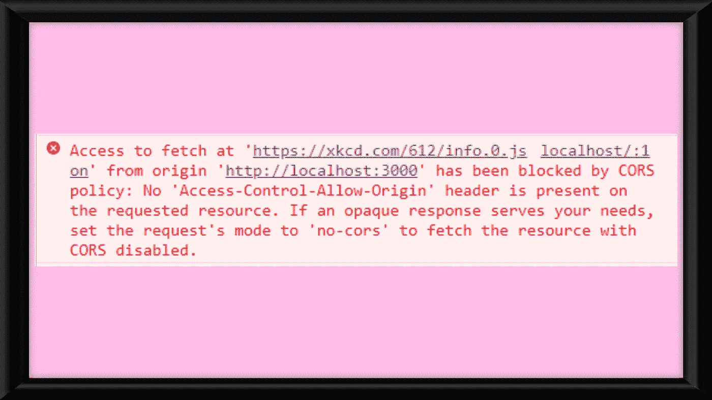
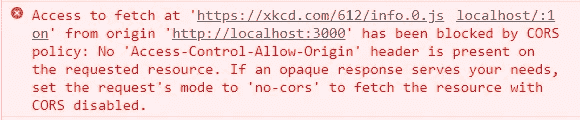
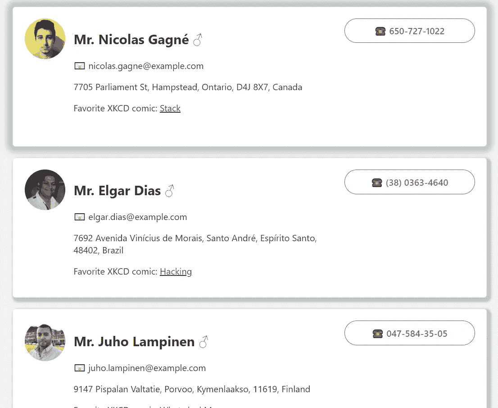

# 你需要一个更大的应用程序:我是如何修复访问控制允许来源标题错误的

> 原文：<https://javascript.plainenglish.io/youre-gonna-need-a-bigger-app-how-i-fixed-access-control-allow-origin-header-error-bb3c3e7c5c03?source=collection_archive---------9----------------------->



说你是我。您决定构建一个迷你项目来显示来自一些免费 API 的数据。只是为了伸展你的前端肌肉。

你找到了 [XKCD](https://xkcd.com/json.html) API。简洁的文档和两个端点。看起来很完美，对吧？您设置了 React 应用程序，创建了获取请求，并看到了以下内容:



Rude

呃，对不起，XKCD API，但你与邮差和浏览器工作得很好。这是什么？

经过一番搜索，我发现这是因为 XKCD API 有一个安全措施来防止跨站点请求伪造。

好吧，没关系。我完全赞成良好的安全性，但是我如何获得我的漫画数据呢？

嗯，我的搜索把我带到了这个[伟大的博客帖子](https://medium.com/@dtkatz/3-ways-to-fix-the-cors-error-and-how-access-control-allow-origin-works-d97d55946d9)，关于解决这个错误的方法。这篇文章介绍了几种不同的方法，并很好地解释了错误消息。在这篇文章中，我将回顾我是如何实现文章中的第三个选项的:构建自己的代理。

至此，我已经用 create-react-app 创建了我的应用程序，初始化了 git，并设置了我的远程存储库。因此，如果我想用 express 设置自己的代理，我希望该项目位于我的项目的根目录中。所以我使用下面的命令创建了一个新的“客户机”目录，将我的所有前端文件移动到该目录，并将所有这些更改通知 git。

```
$ mkdir client
$ git mv <all my frontend files> client
```

不要像我一样忘记在你的。gitignore 文件。

一旦你有了自己的前端目录，我们就可以设置我们的快速代理。

在我们的根目录中，我们可以运行以下命令来安装 express 和 request。

```
$ npm install express
$ npm install request
```

一旦安装了这些文件，就可以在代理项目的根目录下创建一个“index.js”文件。

这个文件的主要内容在第 6-9 行。这些行将标题应用于我们的响应。它也与我引用的文章中显示的代码基本相同。我刚刚在第 11 行和第 12 行创建了自己的随机漫画端点，并让它运行在端口 4000 上，因为我的 React 前端运行在 3000 上。

对于一点额外的内容，您可以进入“client/package.json”并添加

```
"proxy": "http://localhost:4000"
```

这样，您可以将获取请求写成

```
fetch('/comics/random')          
  .then(resp => resp.json())          
  .then(data => /* do stuff */)
```

结果就是你用 Postman/浏览器测试 API 时看到的那个漂亮的 JSON。完成所有设置后，您可以在根目录下运行“npm run start”来运行代理，打开第二个终端窗口，导航到客户端目录，然后像往常一样使用“npm start”运行 React 应用程序。然后你可以使用这些数据和[随机用户生成器](https://randomuser.me/)来创建卡片来显示所有的数据。



Good CSS practice too

我对这个迷你项目的回购可以在这里找到。

Google-Fu 能够知道你在搜索什么，什么资源会有帮助，这是一项有价值的技能，在其他开发者创建资源和编写内容时，这项技能会变得更好。

总而言之，我是如何解决我的访问控制允许起源头错误的呢？

在很多人的帮助下。

*更多内容看* [***说白了。报名参加我们的***](https://plainenglish.io/) **[***免费周报***](http://newsletter.plainenglish.io/) *。关注我们关于*[***Twitter***](https://twitter.com/inPlainEngHQ)*和*[***LinkedIn***](https://www.linkedin.com/company/inplainenglish/)*。加入我们的* [***社区***](https://discord.gg/GtDtUAvyhW) *。***