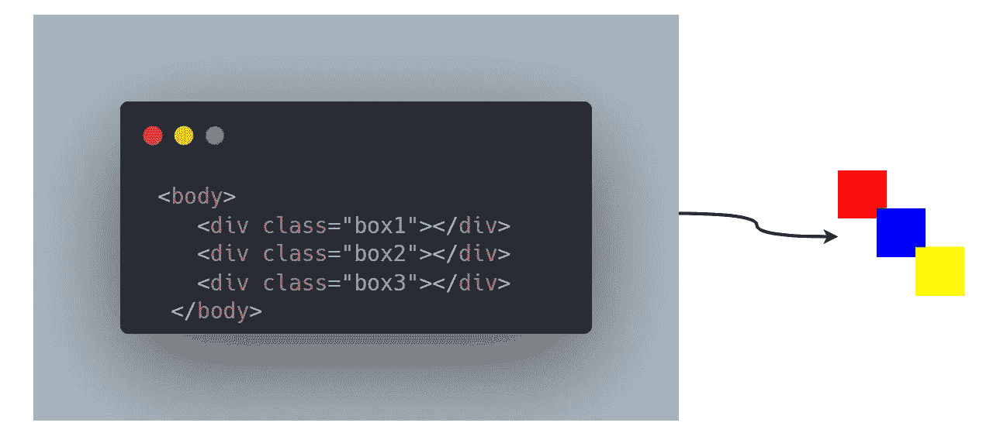
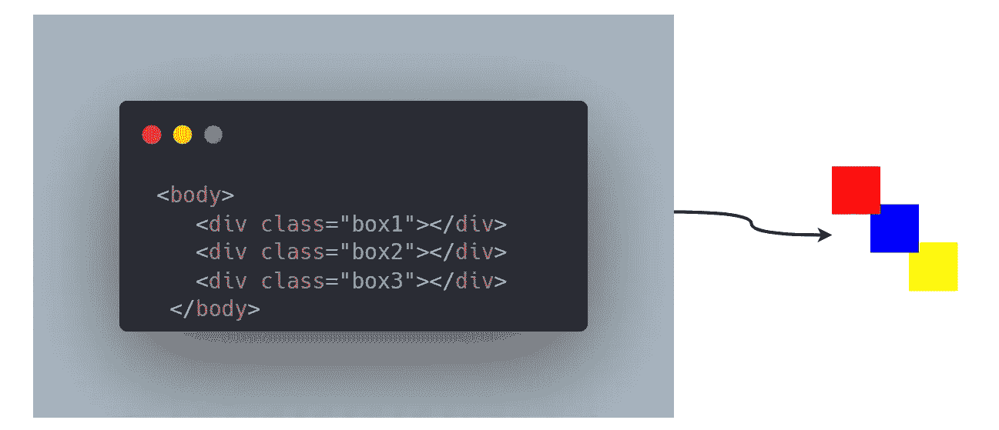
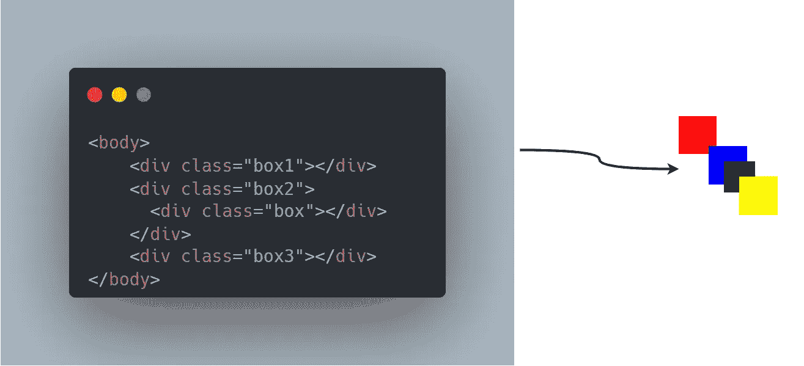
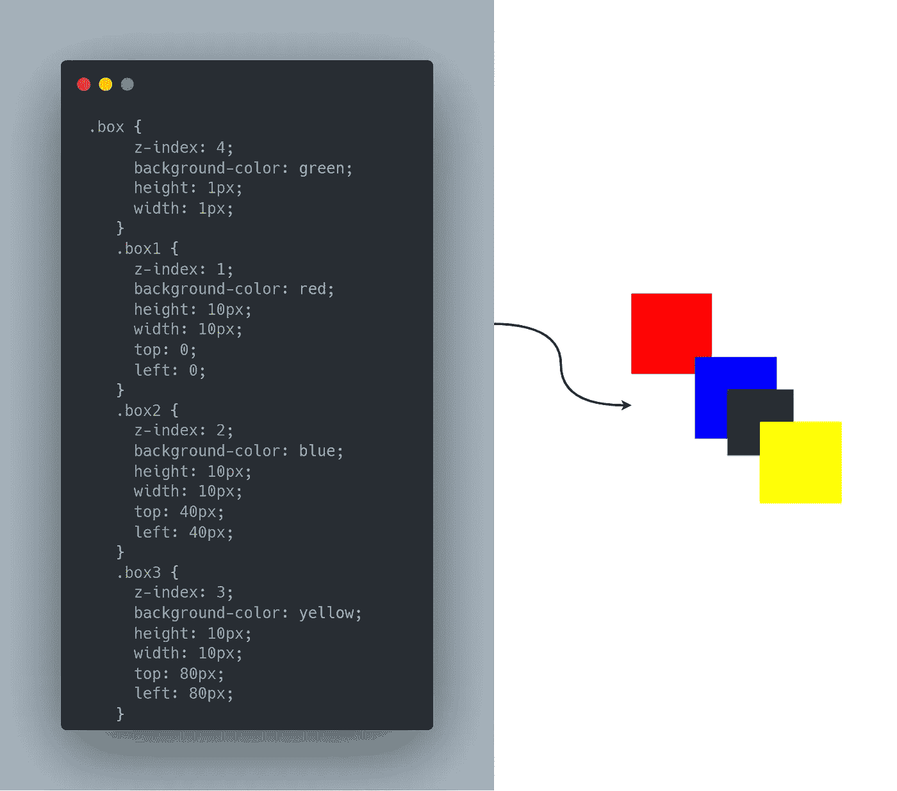

# CSS 中的 z 索引

> 原文：<https://javascript.plainenglish.io/z-index-in-css-6576cfdaa3ad?source=collection_archive---------12----------------------->

## 3 分钟解释 z 指数和堆叠指数

CSS 中的 z-index 属性用于控制文档中的不同层。简而言之，我们可以说一个元素的 *z 索引*值**越高，它将出现在那些具有**较低** *z 索引*值的元素之上。**

> 默认情况下，当我们处理一个 **HTML** 文档时，看起来较低的元素会自然地堆叠在元素之上。

***例如:***

**box1,box2 & box3 without Z-Index Values**

*   假设我们有三个不同颜色的**div****红色****蓝色**和**黄色**
*   如果我们把结果渲染出来， **box3** 堆叠在 **box2** 之上，后者堆叠在 **box1 之上。**

## Z 索引的行为方式

要了解堆栈上下文是如何工作的，您应该使用**位置来定位您的元素:绝对**或相对**或不是**自动**的 *z 索引*值。**

*   在上面的例子中，如果我们将**位置**设置为*绝对位置*并尝试将 **z-index: 1** 设置在*箱 1* 上， **z-index: 2** 设置在*箱 2* & **z-index: 3** 设置在*箱 3* 上，那么堆叠的顺序将完全颠倒。

**box1,box2 & box3 with Z-Index Values**

*   现在，看起来很简单，z-index 越高，元素堆叠得越高。但是堆叠比选择更高的数字要复杂一些。
*   假设我们在 **box2** 和 **box3** 之间添加了另一个小盒子，没有任何 ***z-index*** 值，新的 **box** ( *绿色*)堆叠在 **box2** 之上和 **box3** 之下。

> 在这个阶段，我们还没有在任何盒子上设置任何 z 索引值，您可以看到它们是如何自然堆叠的

*   现在，如果我们设置一个 **z-index: 1** 到 ***box1*** ， **z-index: 2** 到***box 2***&**z-index:3**到***box 3***&**z-index:4**到 ***box*** 。我们的绿色盒子还堆在**盒子 3** ( *黄色*)下面。较高的 *z-index* 值不会对绿色盒子产生任何影响的原因是父**盒子**(盒子 2)的 z-index 值仍然低于**盒子 3** (黄色)。

**Green box with higher z-index value but still stacks below box3**

*   更简单地说，z 索引只在它们的堆叠上下文中起作用&这就是为什么在这种情况下我们不能将我们的*蓝盒子*堆叠在*黄盒子*之上，因为父**蓝盒子**仍然位于**黄盒子**之下。

**注意:** Z-index 值也可以是负数，在复杂的 UI 组件中，当我们想要将元素放在它们的父元素后面时，使用负的 Z-index 值会非常方便。最常见的负 z 索引值需要在**中:**之前和**中:**元素之后。

 [## 4 对你不知道存在的成分作出反应

### 构建一个脱颖而出的 React 应用程序。

javascript.plainenglish.io](/4-react-components-you-didnt-know-existed-bbdfecd62178)  [## 2022 年，作为一名自学成才的开发者，你应该知道的四大技能

javascript.plainenglish.io](/top-4-skills-you-should-know-as-a-self-taught-developer-in-2022-58a2eb5fc26f)  [## CSS 视窗单元 3 分钟指南

### 前所未有地使用 CSS

javascript.plainenglish.io](/a-3-minute-guide-to-css-viewport-units-39b3dc019113) 

*更多内容请看*[***plain English . io***](https://plainenglish.io/)*。报名参加我们的* [***免费周报***](http://newsletter.plainenglish.io/) *。关注我们关于*[***Twitter***](https://twitter.com/inPlainEngHQ)*和*[***LinkedIn***](https://www.linkedin.com/company/inplainenglish/)*。查看我们的* [***社区不和谐***](https://discord.gg/GtDtUAvyhW) *加入我们的* [***人才集体***](https://inplainenglish.pallet.com/talent/welcome) *。*