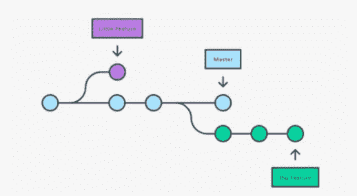

# 从零到英雄:全栈网络开发者路线图 2022

> 原文：<https://javascript.plainenglish.io/zero-to-hero-full-stack-web-developer-roadmap-2022-2cd9b7ab1a18?source=collection_archive---------3----------------------->

## 更好地理解全栈 web 开发以及它是否适合你

开发社区中有很多关于全栈 web 开发人员的讨论，主要是 JavaScript。有人说，2022 年将是全栈 web 开发人员的一年，现在是学习这项技能的时候了。但是什么是全栈 web 开发者，为什么这么受欢迎？在这篇博文中，我们将探讨这些问题以及更多。我们将讨论全栈 JavaScript 需要什么，以及为什么它是开发人员学习的重要技能。在这篇文章结束时，你会对全栈 web 开发有更好的理解，并且知道它是否适合你！

如果你是这个领域的新手，那么从事全栈式 web 开发似乎是一项艰巨的任务。有太多不同的东西需要理解和掌握，而不仅仅是编程！但是不要担心——作为一名未来的雇主或打算学习计算机科学的学生，这里有一些关于构成你的编码需求的每一部分的基本信息(从前端技能如 HTML5 和 CSS3 到后端包括 JavaScript)。

这篇文章将有助于那些初学编码的人，以及寻找如何在自己的领域变得更加熟练的路线图的有经验的开发人员。请根据您的需要随时修改本指南！

作为全栈开发人员，您需要掌握许多工具。此处的路线图将成为任何想要做出这一职业选择的人的绝佳学习途径！

2022 年你需要的基于 JavaScript 的网络发展路线图。

# 了解网络是如何工作的

要成为一名优秀的全栈 web 开发人员，首先理解 web 的机制、前端如何与后端通信以及数据交换如何工作是很重要的。

您应该了解 HTTP / HTTPS、服务器/客户端、DNS、浏览器、COOKIES 等基础知识。

# 计算机基础

对基本面有基本了解就好。主要你应该知道编程的目的，编码的基本原理，编译过程，软件生命周期，编译和运行时错误，脚本，变量，数组，字符串，函数如何工作，以及存储在内存中，计算机如何工作等。

# 要学习的基本语言

# 超文本标记语言

HTML，为在网络浏览器中显示的文档设计的超文本标记语言。它可以借助级联样式表和脚本语言等技术。它用于构建网页及其内容。

# 半铸钢ˌ钢性铸铁(Cast Semi-Steel)

级联样式表是向文档添加样式(如字体和颜色)的一种简单方法。它基本上描述了用 HTML 编写的文档的表示。

# Java Script 语言

JavaScript 是最流行的网页编程语言，它为网站增加了功能性部分。它也用于许多其他环境中。其中包括 Node.js，它提供了一个接口，允许程序员通过他们的服务器访问 MySQL 或 MongoDB 等数据库；Apache CouchDB 是一个 NoSQL 数据库，它通过基于动态模式生成算法的持久性管理器支持，将可伸缩矢量图形(SVG)文件汇集到文档中。

# 以打字打的文件

TypeScript 是一种由微软开发和维护的编程语言。它用可选的静态类型扩展了 JavaScript，使开发人员在更大的应用程序上工作变得更容易，并且对您的代码进行代码转换，以便您可以在任何浏览器或编辑器中使用类型检查！

# 结构

让我们看看可用的框架。从前端的角度来看，我们有 **Angular，React，**和 **Vue.js** 。你可以学习这些框架中的任何一个。我建议你可以从 React 开始，因为它很容易学习，而且现在很流行。接下来可以学习 Express 和 Node.js。

# 有角的

基于 JavaScript 的开源框架由谷歌和一个企业社区维护。它创建了一个单页应用程序，使用 HTML 作为模板语言将数据绑定操作结合在一起，大大减少了所需的编码，同时还允许您比其他库拥有更多的控制权。

# 反应

由脸书和其他公司维护的库 React 允许存储快速变化的数据。当在单页应用程序中构建用户界面时，这是一个最佳选择，这些应用程序需要可重用的 UI 组件，这意味着它们可以按需更改，而无需重新加载整个网页或应用程序。

# vue . j

它是一个轻量级的开源框架，用于构建单页面应用程序。它提供了快速简单的高性能开发，非常适合初学者或那些需要一些简单的东西来开始编码的人！

Node.js 是一个基于 Chrome 的 V8 引擎构建的平台，可用于需要网络和图形处理等底层编程能力的应用程序，而不会增加任何延迟或牺牲性能，这要归功于它使用了基于 JavaScript 承诺的事件发射器，而不是像大多数其他语言那样使用解释器块；这使得开发人员可以在单页面应用程序(每个请求只需要一个响应)、多页面(http 请求)和混合 web UIs(其中某些部分可能仍然驻留在服务器中)之间进行选择，从而可以更好地控制他们的应用程序架构。Express 是一个框架，用作 Node.js 的 web 应用程序。

# 数据库ˌ资料库

这些天对数据库的需求很大。公司想发展自己的。有 SQL 和 NoSQL 数据库。你可以选择其中任何一个。

SQL — **MySQL，SQLite，Postgres**

NoSQL — **MongoDB，卡珊德拉，阿帕奇风暴，斯芬克斯**

# 学习 Git/版本控制

Git 是一个流行的版本控制系统，它有可能比其他选项更有效。它有助于跟踪您的更改、备份代码、存储历史、无缝协作。

你可以在 [**GitHub**](https://github.com/) 上托管代码。免费使用。

# 创建项目

通过实际操作来学习 web 开发。总是创建项目，不管它很小，但是开始创建项目并在 GitHub 上托管它们。每周创建一个项目，找到一些流行的想法，用你的知识去执行它。我知道一开始很难，但是相信我，一旦你练习了，就会很容易。

# 结论

对全栈开发者的需求正在上升。一条成功的职业道路等待着那些全心投入学习软件工程的人，现在有比以往任何时候都更好的机会。所以不要多想，行动起来，开始学习。

【https://coderfact.com】最初发表于**。**

**更多内容看* [***说白了。报名参加我们的***](http://plainenglish.io/)***[***免费每周简讯***](http://newsletter.plainenglish.io/) *。在我们的* [***社区不和谐***](https://discord.gg/GtDtUAvyhW) *获得独家获取写作机会和建议。*****