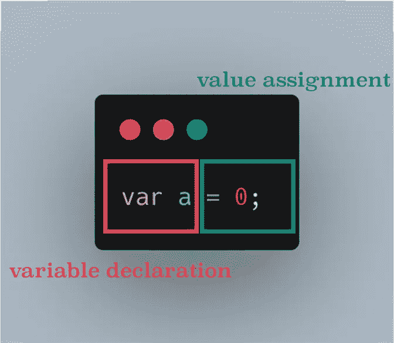

# 零到高级 JavaScript 开发人员

> 原文：<https://javascript.plainenglish.io/zero-to-senior-js-developer-concepts-part-1-hoisting-var-vs-let-d2195739db4a?source=collection_archive---------3----------------------->

## JavaScript 概念—第 1 部分:提升和比较 var 与 let 的介绍

variables declaration on code execution start

**您好！**

目前，我正处于寻找新工作的阶段，由于 JS 是我最有兴趣开发的语言，我认为将面试中最常被问及的问题收集在一个地方并详细阐述更复杂或有趣的问题会非常酷。让我们毫不犹豫地开始今天的话题。

# 提升

我很惭愧地承认这一点，尽管我是一名高级开发人员，但直到最近我还从未听说过这个词。这似乎是技术面试中经常被问到的问题。让我们从简单地翻译它开始，以防你的母语不是英语。

提升意味着像电梯一样拿起/举起某物。

当谈到 JS 起重它有很多相似之处。问题是吊的是什么。

# **我们在吊什么？**

正如每个好的概念解释一样，让我们从官方定义开始:

*“提升是一种 JavaScript 机制，在代码执行之前，变量和函数声明被移动到它们作用域的顶部。”*

这是一些线索，但首先，我们必须做一些区分。

## 变量声明与赋值

如果您有机会编写比 console . log(“hello world”)更多的内容，您可能会声明一个变量。

需要指出的是，在底层，我们执行两个操作:

*   变量声明，
*   赋值。

A proper way of looking into this simple statement

JS 解释器就是这么看的。首先是声明，然后是赋值。在执行任何代码之前，都会处理变量声明。换句话说，在任何计算或逻辑执行之前，JS 已经知道我们声明的变量的名字。

更简单地说，如果你曾经想知道为什么你能在编码之前在代码中使用函数名(从上到下阅读，当然，它们必须存在于代码中的某个地方)，那是因为提升，它发生在任何逻辑执行之前。

How interpreter sees variables declarations

正如你在上面的图片中看到的，我们能够避免 ReferenceError，因为变量被提升了。就这么简单。

当谈到提升时，记住函数作用域的变量是很重要的。上面的例子显示了全局范围内的提升，但是在函数范围内，它的工作方式非常相似。

## 函数声明

函数也会被提升，因此它们可以在代码中的声明之前使用。这里重要的是，如果你想提升你的函数，它需要用一个函数关键字来声明，而不是赋给一个变量。

看出区别了吗？当然，最好是先定义你的函数，然后再使用它们，这毕竟是一个好的编程实践，但是如果你得到一个 TypeError，这是在哪里寻找错误的线索。

## 声明的顺序

有点扭曲，但是变量赋值优先于函数声明，函数声明优先于变量声明。这实际上意味着，如果你声明并赋值一个变量，然后创建一个同名的函数，那么这个变量将是一个变量类型，而不是一个函数。

## **LET VS VAR**

let 和 var 的区别很简单，这是一个作用域规则。由 **var** 关键字声明的变量是作用于函数的**，所以我们可以在 for 循环中声明它们，并且仍然在 for 循环之外使用它们，但是在函数内部，它们被声明了。由 **let** 关键字声明的变量的作用域是**块**(它们被包含在第一个大括号中)，这意味着在那个例子中它们只在 for 循环中可用。**

这就是你需要知道的关于吊装的所有知识。如果你渴望更深入的解释，下面的 DigitalOcean 文章是一个很好的信息来源:

 [## 理解 JavaScript | DigitalOcean 中的提升

### 在本教程中，我们将研究 JavaScript 中著名的提升机制是如何发生的。在我们开始之前，让我们…

www.digitalocean.com](https://www.digitalocean.com/community/tutorials/understanding-hoisting-in-javascript) 

编码快乐！

*更多内容看* [***说白了。报名参加我们的***](https://plainenglish.io/) **[***免费周报***](http://newsletter.plainenglish.io/) *。关注我们关于*[***Twitter***](https://twitter.com/inPlainEngHQ)*和*[***LinkedIn***](https://www.linkedin.com/company/inplainenglish/)*。加入我们的* [***社区不和谐***](https://discord.gg/GtDtUAvyhW) *。***