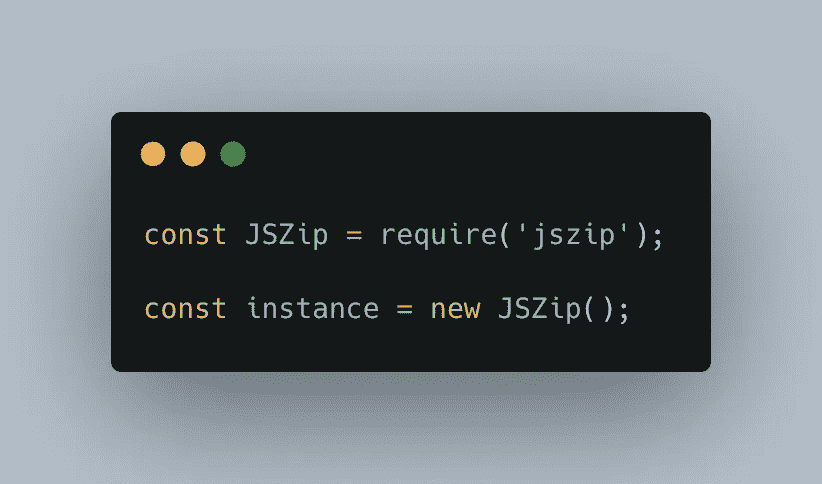

# 用 Node.js 压缩文件夹

> 原文：<https://javascript.plainenglish.io/zip-a-folder-with-node-js-5cd940c5c4fe?source=collection_archive---------2----------------------->

## 如何用 Node.js 将文件夹和文件压缩成 ZIP

Photo by Liliana Drew: [https://www.pexels.com/photo/man-wearing-windbreaker-jacket-8497715/](https://www.pexels.com/photo/man-wearing-windbreaker-jacket-8497715/)

我之前写了一篇关于用 Node.js 解压 zip 文件的文章，看起来很多人喜欢它！是时候解释怎么反其道而行之了！

 [## 如何用 Node.js 解压文件

### 在 FS 能够实现的所有特性中，解压缩不是其中之一。让我们看看如何使用 Node.js 来实现这一点

javascript.plainenglish.io](/unzip-a-file-with-nodejs-5f94b360f7df) 

Node.js(尤其是 FS)**没有提供压缩/解压缩文件的特性**。

这意味着我们必须使用图书馆。网上有很多这样的例子，但是有一个特别引起了我的注意，因为它非常容易使用:JSZip

 [## jszip

### 创建、读取和编辑。http://stuartk.com/jszip.最新版本:3.10.1，最新发布时间:a…

www.npmjs.com](https://www.npmjs.com/package/jszip) 

JSZip 与一个由**实例**组成的系统一起工作。通过实例化一个新对象，就好像创建了一个新的 **ZIP 文件**。所以我们从这个开始:

Instantiating the JSZip object

现在，一旦完成，我们将开始**添加内容**到我们的 Zip 文件。

JSZip 将一个**字符串作为输入**，这使得处理起来更加容易。然后，您可以使用 **FS 解析一个文件，并将其内容放入 ZIP 文件**。

为此，我们将调用带两个参数的方法`instance.file`:

*   **文件名** ( **强制**)
*   **内容** ( **可选**，如果不指定，就只创建一个**空文件**)

*你可以多次调用* `*instance.file*` *，* ***每次调用都会将已有的内容擦除到目标文件*** *。*

现在最后一步是**生成我们的 zip 文件并保存它**。

JSZip 有一个叫做`instance.generateAsync`的方法，它需要一个参数，那就是你想要使用的**类型的编码**。

尽管它可以采用许多不同的编码。我们将特别讨论两个:

*   **blob** :如果你在用浏览器工作的话，它是完美的。Blob 将允许你**轻松地将你的 zip 文件上传到服务器**或者**下载到本地**。
*   **uint8array** :当**与 Node.js** 一起工作时更合适。我们使用 uint8array 创建一个被 fs 接受的**格式，如果你想在你的文件系统中写你的 zip 文件。**

开始了。如果您使用您最喜欢的解压缩工具(或者上面链接的我的另一篇文章中描述的那段代码！)您将能够解压缩您新创建的 zip 文件，并找到一个内容为`Hello world!`的`myfile.txt`文件

## 创建文件夹

创建文件夹有两种方式**。**

**第一个基本上是调用`instance.folder("foldername")`，它将**在你的 zip 中创建一个新文件夹**。**

**第二种方法是在创建文件时添加路径:`instance.file("folder/file.txt", "content")`**

**文件夹将被自动创建**如果它不存在，没什么好担心的！****

## ****删除文件和文件夹****

****为了结束这篇文章，让我们快速讨论一下**删除文件或文件夹**。****

****要做到这一点，有一个常见的方法就是`instance.remove("myfileorfolder")`****

****与创建文件夹的方式相同，您可以使用**完整路径删除文件**。您也可以删除非空文件夹，而不必先清空它。****

****就是这样！您现在确切地知道了如何用 Node 创建 ZIP 文件。JS！****

****我希望这篇文章对你有用！如果是的话，不要犹豫鼓掌或跟随！:)****

**** [## 如何从终端打开 VSCode 中的文件或文件夹

### 适用于 Windows 和 Mac 的解决方案

blog.bitsrc.io](https://blog.bitsrc.io/open-a-file-or-folder-in-vscode-from-your-terminal-f159c4563e17)  [## 4 款 macOS 应用可提高您的工作效率

### 我离不开这些应用程序，它们节省了我很多时间，让我的生活变得更加轻松！

remy-villulles.medium.com](https://remy-villulles.medium.com/4-macos-apps-to-increase-your-productivity-90d8adfa454a)  [## 如果你喜欢 Spring Boot，你会喜欢这个 Node.js 框架

### 结合 Node.js 和 TypeScript 的优点来创建一个强大的框架。

javascript.plainenglish.io](/if-you-like-spring-boot-then-youll-love-this-nodejs-framework-4e5c81a034f3) 

*更多内容请看*[***plain English . io***](https://plainenglish.io/)*。报名参加我们的* [***免费周报***](http://newsletter.plainenglish.io/) *。关注我们关于*[***Twitter***](https://twitter.com/inPlainEngHQ)[***LinkedIn***](https://www.linkedin.com/company/inplainenglish/)*[***YouTube***](https://www.youtube.com/channel/UCtipWUghju290NWcn8jhyAw)*[***不和***](https://discord.gg/GtDtUAvyhW) *。*******